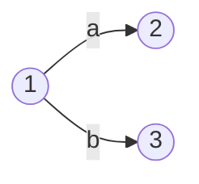

## 引论

### 程序设计语言的翻译机制

1. 汇编程序：源语言是某种 **汇编语言**，其目标语言是 **机器语言** 的 **翻译程序** 被称为汇编程序。汇编程序一般对源程序进行两遍扫描来完成翻译。第一遍进行 **存储分配**，构造出第二遍扫描时用的各种表格；第二遍 **用机器操作码代替源程序中的符号**

2. 编译程序：是将高级语言写的源程序翻译成目标语言（汇编语言、机器语言）的程序。这种翻译过程称为编译

3. 解释程序：将高级语言写的源程序作为输入数据，但并不产生目标程序，而是边解释边执行源程序本身的一种程序。解释程序主要优点是易于为用户提供调试功能，对源程序的语法分析及出错处理都很及时，修改调试也很方便，但是解释程序执行速度较慢，运行效率低。**跨平台** 无需额外操作

#### 典型的翻译机制

1. `C` 语言翻译机制：纯编译

   

   

2. `JAVA` 翻译机制：先编译后解释

   

   

3. `C#` 翻译机制：先编译再编译

   

   

从上述对源程序的处理过程可以看出现代高级程序设计语言编译程序的发展趋势：从“一次编译”非托管到“编译+解释”或“编译+编译”的二次托管。

### 编译程序概述

#### 编译程序流程

1. 词法分析
   1. 扫描源程序进行读符号，删除无用字符（如空格、注释等）
   2. 将一个个有独立意义的单词识别出来，并且转换成 **统一长度的内部编码**
   3. 建立有关表格（如名字特征表、常数表），进行词法检查以供语法和语义分析用

2. 语法分析
   1. 将词法分析后所有单词组成句子，根据不同高级语言不同语法规则来分析这些句子乃至程序是否正确

3. 语义分析和中间代码生成
   1. 根据语义分析语句的含义，可将源程序表示成一种内部形式（中间语言）或直接生成目标程序
   2. 中间代码的形式有很多种，包含：后缀表达式、三元式、四元式等

4. 代码优化
   1. 生成中间代码的目标是为了实现代码优化，以便生成更高质量的目标代码

5. 目标代码生成
   1. 目标代码生成就是将中间语言代码转换成机器语言程序或汇编语言程序，最后完成翻译

#### 编译程序的前端和后端

与源语言相关的部分被称为编译前端，包括 **词法分析、语法分析、语义分析及中间代码** 生成 3 个阶段；与目标语言相关的部分被称为编译后端，包括 **代码优化和目标代码生成** 2 个阶段。将编译程序划分为编译前端和编译后端，不仅有利于代码优化，而且对目标代码的生成和移植更有利

1. 可以给同一个编译前端配不同的编译后端，这样就能在不同的计算机上构造出同一语言的编译程序。例如，`Java`
2. 可以给不同的编译前端配同一编译后端，这样就可以在同一计算机上生成多种语言的编译程序。例如，被广泛使用的 `GCC`，其编译前端是多种程序设计语言的不同分析器。`GCC` 以这些语言的源程序文件作为输入，经过词法分析、语法分
   析和语义分析，产生一种抽象语法树（Abstract Syntax Tree：AST）形式的中间代码；`GCC` 的编译后端对 **AST** 形式的中间代码进行分析处理，最终产生目标代码

#### 编译程序的分遍

+ 一遍扫描编译程序：

  在编译程序的工作过程中，词法分析、语法分析、语义分析及中间代码生成、代码优化、目标代码生成这 5 个阶段的工作可以只对源程序进行一次扫描，也可以对源程序或等价源程序进行若干次扫描。对源程序或等价源程序进行相关的加工处理工作，称为遍（Pass)。

+ 多遍扫描编译程序：

  把源程序分为几遍来编译，每遍只完成编译程序中的一部分或几部分工作，称为多遍的编译程序

  优点：加工充分；出错处理细致；目标程序质量高
  缺点：编译时间长，开销大

### 编译程序的构造方法

#### 编写编译程序的一般方法

1. 机器语言和汇编语言直接编写

   优点：针对具体机器，充分发挥计算机系统功能；生成的程序效率高

   缺点：难读难写；易出错、难维护；生产效率低

2. 使用高级语言进行编写
   并非所有高级语言都适合编写编译程序。能够编写编译程序或其他系统软件的高级语言称为 **系统程序设计语言**。例如，`Pascal`、`C`、`C++`、`Java` 等

3. 编译程序的自动生成

   源语言的定义以及机器语言的描述输入到软件中，自动生成该语言编译程序

   词法分析程序：`Lex`、`Flex` 等

   语法分析程序：`Yacc`、`ANTLR` 等

#### 构造编译程序的开发技术

##### T 型图

一个编译程序通常会涉及 3 种语言：源语言、目标语言和书写语言。源语言和目标语言体现了编译程序的功能，书写语言描述了编译程序所需的 **运行环境**。三者之间的关系可用 T 型图来表示，左上角是源语言 S，右上角是目标语言 D，底部是书写语言 W。该 T 型图代表源语言 S 的编译程序，意思是“书写语言 W 编写的源语言 S 的编译程序，其目标语言是 D”，简记为 $C_W^{S\sim D}$

##### 自编译

如果一种高级语言与之相应的编译程序也能直接用 **该语言本身写出来**，具有这种性质的语言称为自编译语言。一般说来，自编译语言不但可以用来书写其自身的编译程序，而且也能用来书写其他语言的编译程序

##### 自展

自展技术是利用自编译技术，将一个功能较小的编译程序，一级一级扩充而变成一个功能较强的编译程序。自展过程，实际上就是用低级语言先实现一个简单的编译器，然后用这个编译器的语言再去编写一个更高级的编译器的过程。

##### 交叉编译

如果 A 机器上的编译程序能产生 B 机器语言的目标代码，那么这种程序被称为交叉编译程序。

1. 首先需要有一个可以在 A 机器上编译高级语言 L 的编译器①
2. 接下来使用 L 语言写一个能够产生 B 机器语言目标代码的编译程序②
3. 然后通过 L 语言的编译程序就可以生成在 A 机器上可以运行的产生 B 机器代码的编译程序③

##### 移植

移植技术是编译程序开发中一项十分重要的技术。移植就是把一台计算机上的软件移植到另一台计算机上去。移植方法有多种，下面简单地介绍两种典型的方法。

1. 综合几种型号的计算机硬件特性，抽象出一种通用的汇编语言。每种型号的计算机上配有一个简单的汇编程序，用来把通用的汇编语言书写的程序翻译成机器语言程序。采用这种方法抽象一种通用的汇编语言较为困难，因为这个通用的汇编语言既要便于书写编译程序，又要能够在各种不同型号的计算机上高效运行。

2. 利用交叉编译技术将一台计算机上由自编译语言编写的编译程序移植到另一台计算机上。假设在 A 机器上已有一个可运行的高级语言 L 的编译程序，只要我们编写一个用 L 书写的产生 B 机器语言的 L 的编译程序

   1. 首先需要有一个可以在 A 机器上编译高级语言 L 的编译器①
   2. 接下来使用 L 去写一个能够产生 B 机器语言目标代码的编译程序②
   3. 然后通过 L 语言的编译程序就可以生成在 A 机器上可以运行的产生 B 机器代码的编译程序③
   4. 最后使用编译程序③编译一遍②就可以得到能在 B 机器上运行的 B 机器代码的编译程序④

   

#### 编译技术的应用

1. 文本编辑器
2. 文本格式化工具
3. 文本检索工具
4. 文本处理与加密工具
5. 情感分析
6. 网页浏览器

## 形式语言的基本知识

> 乔姆斯基将语言形式地定义为由一个 **字母表** 的字母组成的一些串的集合。对于任意一个语言，有一个字母表，可以在字母表上按照一定的形成规则定义一个 **文法**，这个文法所产生的所有句子组成的集合就是这个文法所产生的语言。

### 字母表和符号串

#### 基本概念

+ 字母表（符号集）是符号的 **有穷非空集合**，通常记为$\Sigma, V$
+ 字母表中的元素称为 **符号**，符号是字母表中不能再分解的最小单位
+ 设$\Sigma$是一个字母表，$\forall x\in \Sigma^*$，则$x$称为$\Sigma$上的一个* *符号串**。符号串是字母表中符号的一个有穷序列
+ 符号串$s$的长度，记作$\lvert s \rvert$，指$s$中符号的个数
+ 符号串集合，如果集合$A$中的所有元素都是字母表$\Sigma$上的符号串，则称$A$为字母表$\Sigma$上定义的符号串集合。也可以称$A$为字母表$\Sigma$上定义的某种语言

#### 字母表基本运算

1. 字母表乘积（product）

   字母表 $\Sigma_1$ 和字母表 $\Sigma_2$ 相乘：
   $$
   \Sigma_1 \Sigma_2 = \left\{ab\mid a\in \Sigma_1, b\in \Sigma_2\right\}
   $$
   + 可以用笛卡尔积理解，例如$\{0,1\}\{a, b\}=\{0 a, 0 b, 1 a, 1 b\}$

2. 字母表幂运算（power）
   $$
   \left\{\begin{array}{l}
   \sum^0 =\{\varepsilon\} \\
   \sum^n =\sum^{n-1} \sum, {n} \geq 1
   \end{array}\right.
   $$

   + 字母表的$n$次幂，即长度为$n$的 **符号串** 构成的集合

3. 字母表正闭包（positive closure）
   $$
   \Sigma^{+}=\Sigma \cup \Sigma^2 \cup \Sigma^3 \cup \ldots
   $$

   + 实际上就是长度为正数的 **符号串** 构成的集合

4. 字母表克林闭包（Kleene closure）
   $$
   \Sigma^{*}=\Sigma ^0 +\Sigma^+=\Sigma ^0 \cup \Sigma \cup \Sigma^2 \cup \Sigma^3 \cup \ldots
   $$

   + 实际上就是任意长度的 **符号串** 构成的集合

#### 符号串基本运算

1. 符号串连接（concatenation)

   如果 $x$ 和 $y$ 是符号串，那么 $x$ 和 $y$ 的连接就是把 $y$ 附加到 $x$ 后面而形成的串，记作 $xy$

   + 值得注意的是：**空串**$\varepsilon$是连接运算的 **单位元**，所以$s\varepsilon = \varepsilon s = s$

2. 前缀、后缀和子串

   若 $x,y,z$ 都是 $\Sigma$ 上的符号串，那么 $x$ 被称为 $xy$ 的 **前缀**，$y$ 被称为 $xy$ 的 **后缀**，$y$ 被称为 $xyz$ 的 **子串**

   当 $x$ 是 $xy$ 的前缀，且 $x\neq xy$，则 $x$ 被称为 $xy$ 的真前缀

   当 $y$ 是 $xy$ 的后缀，且 $y\neq xy$，则 $y$ 被称为 $xy$ 的真后缀

   当 $y$ 是 $xyz$ 的子串，且 $y\neq xyz$，则 $y$ 被称为 $xyz$ 的真子串

   $\varepsilon$ 是任何串的（真）前缀，（真）后缀以及（真）子串

   符号串 $N$：

   前缀和后缀的数目：1+$\lvert N\rvert $，真前缀和后缀的数目：$\lvert N\rvert$，子串的数目：$1+\frac{\lvert N\rvert+{\lvert N\rvert}^2}{2}$，真子串的数目：$\frac{\lvert N\rvert+{\lvert N\rvert}^2}{2}$

3. 符号串幂运算
   $$
   \left\{\begin{array}{l}
   {s}^0 ={\varepsilon} \\
   {s}^n ={s}^{n-1} s, n \geq 1
   \end{array}\right.
   $$

   + 符号串$s$的$n$次幂，相当于将$n$个$s$连接起来

4. 符号串集合连接

   设 $L_1$ 定义在 $\Sigma_1$ 的符号串集合，$L_2$ 定义在 $\Sigma_2$ 的符号串集合：
   $$
   {L}_1 {L}_2 =\left\{{xy} \mid {x} \in {L}_1, {y} \in {L}_2\right\}
   $$

   + 同样的，也是类似于笛卡尔积的形式
   + $\Phi L = L \Phi  = \Phi$
   + $\left\{\varepsilon\right\}L  = L\left\{\varepsilon\right\} = L$

5. 符号串集合幂运算
   $$
   \left\{\begin{array}{l}
   {L}^0 =\left\{\varepsilon\right\} \\
   {L}^n ={L}^{n-1} L, n \geq 1
   \end{array}\right.
   $$

6. 符号串集合的正闭包
   $$
   L^{+}= L \cup L^2 \cup L^3 \cup \ldots
   $$

7. 符号串集合的闭包
   $$
   L^* = L^0 \cup L^{+}= L \cup L^2 \cup L^3 \cup \ldots
   $$

   + 两个闭包运算，都与字母表的闭包运算大抵相同
   + 由于$\Sigma$本身也可以视作符号串集合，因此将克林闭包$\Sigma^*$称为* *行集合**，表示字母表中的符号以任意顺序，任意个数，任意长度构成的符号串集合

### 语言和文法

> 句子是由本语言字母表上符号按照一定规则组成的符号串。
>
> + 枚举法，如果一个语言仅包含有限条句子，就可以采用枚举法来描述此语言把语言中每条句子都列举出来即可
> + 自动机识别法，在这种方法中，每种语言对应一种自动机（即某种算法）, 由它判定一个符号串是否在该语言中
> + 文法产生法，这种方法是为每种语言定义一组文法规则，从而产生该语言中的每条句子

#### 巴克斯-诺尔范式

巴科斯范式是描述语法规则一种表示方法，它是由巴科斯为了在 ALGOL60 报告中来描述 ALGOL 语言首先提出的。采用这种形式体系方式定义语法规则，可以用简洁的公式把各种语法规则严格而清晰描述出来。例如，在高级语言中大家所熟知的 **标识符** 这种语法成分，它用巴科斯范式可以描述为：

<标识符> `::=` <字母> | <标识符> <字母> | <标识符> <数字>

<字母> `::=` a|b|c|…|z

<数字> `::=` 0|1|2|…|9

不难发现，巴克斯范式使用的符号如下：

1. `::=`（或 $\to$），表示 **定义为**
2. `|`，表示多种不同的选择，不同选择称为 **候选式**
3. `< >`，表示语法实体，在比较明确的情况下，可省略

> 比如标识符的定义，就刻画出了其是以 **字母开始（递归定义，总会以字母开始）的** 一串字母和数字任意组合这种特点

产生式：产生式是 **只有一个候选式** 的文法规则，是一个 **非空符号串** 和另一个 **符号串** 的有序偶 $(\alpha,\beta)$，记为 $\alpha::=\beta$ 或 $\alpha\to \beta$。$\alpha$ 称为产生式的 **左部**，$\beta$ 称为产生式的 **右部**。表示 $\alpha$ 定义为 $\beta$。对于有相同左部的产生式，可以用 `|` 简单定义

字汇表：用于产生式左部和右部中所有符号形成集合为字汇表，记为 $V$

字汇表的分类：

1. 非终结符号

   出现在产生式左部，且能 **派生** 出符号或符号串的那些符号称为非终结符，也称语法实体或语法单位，它们的全体构成一个非终结符的集合，记为 $V_N$

2. 终结符号

   产生式中不属于 $V$ 的那些符号称为终结符，它们的全体组成终结符的集合，记为 $V_T$。终结符一般出现在规则的右部

+ 显然，$V = V_N \cup V_T \quad V_N \cap V_T = \Phi$

> 在上面标识符的定义中，
>
> $V_N$ = {<字母>, <数字>, <标识符>}
>
> $V_T$ = {a, b, c…z,0,1,2…9}

#### 文法

文法是规则的 **有穷集合**，形式定义为四元组 $G = (V_N, V_T,P,S)$，通常记为 $G[S]$

1. $V_N$ 是非终结符集合
2. $V_T$ 是终结符集合
3. $P$ 代表产生式集
4. $S\in V_N$ 是文法 $G$ 开始符号，也称识别符号，它至少要在一条产生式左部出现

栗子：
$$
G = (V_N, V_T, P, S)\\
V_N = \left\{A, B\right\}\\
V_T = \left\{c, d\right\}\\
P = \left\{A \to Bc, B \to d\right\}\\
S = A
$$

> 通常情况下，在对文法的描述时可以省略 $V_N$ 和 $V_T$，文法的开始符号也可以不需要“显式地”指定，仅需将开始符号写在 G 后的中括号中即可。
>
> 所以上述栗子可以简单描述为：$G[A]:A \to Bc, B \to d$

一些约定：

1. 终结符：$a,b,c...$，$0...9$
2. 非终结符：$A,B,C...$
3. 文法符号（终结符或非终结符）：$X,Y,Z$
4. 终结符号串（包括空串）：$u,v...z$
5. 文法符号串（包含空串）：$\alpha,\beta...$

#### 语言

##### 推导和规约

**直接推导和直接归约：** 文法 $G=(V_N,V_T,P,S)$ 有一条产生式 $\alpha\to \beta,\ \alpha\in (V_N\cup V_T)^+,\ \beta\in (V_N\cup V_T)^*$，假设存在符号串 $x,y\in (V_N\cup V_T)^*$，使得有符号串 $v$ 和 $w$ 满足 $v=x\alpha y$ 和 $w=x\beta y$，则称符号串 $v$ **直接推导**（重写）出符号串 $w$, 符号串 $w$ **直接归约** 到符号串 $v$，并把符号串 $w$ 叫作符号串 $v$ 的直接派生式，记为
$$
v \Rightarrow w
$$

+ 简而言之，就是用产生式的右部替换产生式的左部。特别的，如果$x = y = \varepsilon$，则对于文法$G$的任何规则都有$\alpha \Rightarrow \beta$

**推导和归约：** 假设 ${u}_0 \in\left({V}_{{N}} \cup {V}_{{T}}\right)^{+}, \ {u}_1, {u}_2, \cdots, {u}_{{n}}$ 都是 $\left({V}_{{N}} \cup {V}_{{T}}\right)^{*}$ 上定义的符号串，如果存在直接推导序列 ${v}={u}_0 \Rightarrow {u}_1 \Rightarrow {u}_2 \Rightarrow \cdots \Rightarrow {u}_{{n}}={w}({n} \geqslant 1)$，则称符号串 $v$ 经过 $n$ 步 **推导** 出符号串 $w$，串 $w$ 经过 $n$ 步 **归约** 到符号串 $v$，记为
$$
v \Rightarrow^n w
$$

+ 显然，当$n = 1 $时就是 **直接推导**
+ $\Rightarrow ^+$表示经过正数步推导，称为 **推导**
+ $\Rightarrow ^*$表示经过若干步推导（可以是 0 步），称为* *广义推导**
+ 推导的步数，直接数$\Rightarrow$的个数即可

> 栗子 1：$G[A]:A \to B,\ B \to c$
>
> 解：则称 $A$ 直接推导到 $B$，$d$ 归约到 $A$

##### 句型和句子

**句型：** 如果 $S \Rightarrow^* \alpha, \alpha \in\left(V_T \cup V_N\right)^*$, 则称 $\alpha$ 是 $G$ 的一个句型

+ 文法$G$所能产生的 **合法结果** 就是句型
+ 一个句型中既可以包含终结符$V_T$，又可以包含非终结符$V_N$，也可能是空串$\varepsilon$

**句子：** 如果 $S \Rightarrow^* w, w \in V_T^*$, 则称 $w$ 是 $G$ 的一个句子

+ 句子是 **只由终结符构成** 的 **句型**

##### 语言

**语言：** 由文法 $G$ 的开始符号 $S$ 推导出的 **所有句子构成的集合** 称为文法 $G$ 生成的 **语言**，记为 $L(G)$。即
$$
L(G)=\left\{w \mid S \Rightarrow^* w, w \in V_T^*\right\}
$$

+ 要使一个文法$G$能正确描述相应语言$L(G)$必须保证：
  + 由文法$G$产生的每个句子都在$L(G)$中
  + 在语言$L(G)$中的每个符号串都能由$G$产生

> 构造下列语言对应的文法
>
> 栗子 1：$L(G) = \left \{0^n1^n \lvert n\ge 0\right \}$
>
> 解：$G[S] = S \to 01,\ S\to 0S1$
>
> 栗子 2：$L(G) = \left \{0^n1^m \lvert n,m\ge 1\right \}$
>
> 解：$G[S] = S \to 0S,\ S \to S1,\ S\to 01$

**递归文法：** 像上述栗子中形如 $S\to 0S1$，这种借助于自己来定义自己的产生式，即在产生式左部和右部具有 **相同的非终结符** 的产生式称为 **递归规则**。如果一个文法中 **至少含有一个递归非终结符**，则将此文法称为 **递归文法**

+ 若有一个规则$U\to ...U...$则称 **直接递归**
+ 若有规则$U\to U...$，则称 **直接左递归**
+ 若有规则$U\to ...U$，则称 **直接右递归**
+ 若有推导式$U\to^+ ...U...$，则称 **间接递归**，间接递归同样也分为 **间接左递归和间接右递归**
+ 显然，直接递归是间接递归一种特殊情况
+ 非终结符$U$称 **递归非终结符**
+ 如果一个语言是无穷的，则描述该语言的文法必定是递归的。他在给 **无限的语言** 以 **有限的表示** 提供了一种可能的方法，但同时也会带来麻烦，比如文法的 **左递归性**

> 栗子：设有文法 $G$ 的规则 $P$ 为
>$$
>\begin{aligned}
>&{S}::={Q c} \mid {c} \\
>&{Q}::={R b} \mid {b} \\
>&{R}::={S a} \mid {a}
>\end{aligned}
>$$
> 在这 6 条产生式中, 无直接递归规则, 但有如下推导:
>$$
>{Q} \Rightarrow {R b} \Rightarrow {S a b} \Rightarrow {Q c a b}
>$$
> 所以 ${Q} \Rightarrow^+{Q c a b}$，因此是间接左递归

### 句型分析

#### 短语和句柄

设 $G[Z]$ 是一个文法，$w=x u y$ 是其中某个句型

**短语：** 若 ${Z} \Rightarrow{ }^* {xUy}, {U} \in {V}_{{N}}$ 且 ${U} \Rightarrow+{u}, {u} \in {V}^{+}$，则称 ${u}$ 是 **一个相对于非终结符号 ${U}$ ，句型 ${w}$ 的短语**

**简单短语：** 若 ${Z} \Rightarrow{ }^* {xUy}$ 且 ${U} \Rightarrow {u}$，则称 ${u}$ 是 **一个相对于非终结符号 $U$ ，句型 ${w}$ 的简单短语**

+ 不难发现，短语的概念是要 **处于某个句型** 以及相对于一个 **非终结符**，即 **推导** 该短语的 **非终结符** 以及该短语所在的 **句型**
+ 根据推导的次数判定是简单短语还是短语

**句柄：** 一个句型 **最左边** 的简单短语（最左简单短语）称为该句型的句柄（或柄短语），句柄最左边的符号称 **句柄的头**，句柄最右边的符号称 **句柄的尾**

> 栗子：设有文法 ${G}[{S}]=(\{{S}, {A}, {B}\},\{{a}, {b}\}, {P}, {S})$, 其中 ${P}$ 为
>$$
>\mathrm{S}::=\mathrm{AB} \quad{A}::=\mathrm{Aa}|\mathrm{bB} \quad{B}::=\mathrm{a}|{Sb}
>$$
> 解：根据句型推导过程有
>$$
>{S} \Rightarrow {AB} \Rightarrow {bBB} \Rightarrow {baB} \Rightarrow {baSb}
>$$
> 可见下式成立:
>$$
>{S} \Rightarrow * {baB} \text { 且 } {B} \Rightarrow {Sb}
>$$
> 则可称子串 Sb 是相对于 **非终结符** B，句型 baSb 的 **简单短语**

**最左（右）推导：** 在任何一步推导 $v\Rightarrow w$ 中，都是对符号串 $v$ 的最左（右）边的 **非终结符号** 进行替换，我们称之为最左（右）推导。我们把最左推导的逆过程称为 **最右归约**，把最右推导的逆过程称为 **最左归约**

**规范推导：最右推导叫作规范推导**，即在该过程的每步直接推导 $xUy\Rightarrow xuy$ 中，符号串 $y$ 只含有终结符号。如果推导 $v\Rightarrow^+ w$ 中 **每步直接推导** 是规范的，则称推导 $v\Rightarrow^+ w$ 为 **规范推导**。由规范推导所得的句型称为 **规范句型**。最左归约也称为 **规范归约**。

#### 语法树（CFG 的分析树）

设有文法 $G=(V_N,V_T,P,Z)$，满足下列条件的树即为一个语法树，语法树是推导的 **图形化表示**。换言之，给定一个推导 $S \Rightarrow a_1 \Rightarrow  a_2 \Rightarrow ... \Rightarrow  a_n$ 过程中得到的每一个句型 $a_i$，都可以构造出一个 **边缘** 为 $a_i$ 的语法树，其具体要求如下：

1. 树中每一个结点都有标记，且该标记是 $V_T\cup V_N$ 中某一符号
2. 树 **根结点** 是 **识别符号**（文法开始符号）
3. 若有一个结点至少有一个后继结点，则该结点标记必为 **非终结符**
4. **内部结点** 表示对一个产生式（规则）$\alpha \to \beta$ 的应用，该结点的标号是此产生式左部 $\alpha$。该结点的子结点的标号从左到右构成了产生式的右部 $\beta$
5. **叶结点** 的标号既可以是非终结符，也可以是终结符。**从左到右排列叶节点得到的符号串称为是这棵树的产出（yield)或边缘（frontier)**

以语法树的视角，我们可以重新定义短语：给定一个句型，其分析树中的 **每一棵子树的边缘** 称为该句型的一个 **短语**，以及简单短语：如果子树 **只有父子两代结点**，那么这棵子树的 **边缘** 称为该句型的一个 **直接短语**

> 看个栗子：
> $$
> {S} \Rightarrow {AB} \Rightarrow {bBB} \Rightarrow {baB} \Rightarrow {baSb}
> $$
> 
>
> 解：
>
> 从语法树可直观看出：ba 是句型 baSb 相对于 A 的短语，Sb 是句型 baSb 相对于 B 的简单短语，a 是句型 baSb 相对于 B 简单短语

### 文法分类

#### 文法的二义性

如果一个文法中 **某个句子对应两棵不同的语法树**，则称这个文法是二义的。也就是说，若一个文法中的某句子对应两个不同的最左推导或最右推导，则这个文法是二义的。已经证明，**不存在一种算法** 能在有限的步骤内确切地判定一个文法是否有二义性。若产生某语言的文法 **都是二义性文法**，则称该语言为 **二义性语言**，也称之为 **先天二义性**

解决二义性的办法：

1. 在语义上加些限制，或者加一些非语法形式的规定
2. 对原二义性文法加上一定的条件，将其改造成一个等价的无二义性文法

#### 文法的乔姆斯基分类

##### 0 型文法

0 型文法（Type-0 Grammar），又称为无限制文法/短语结构文法（Phrase Structure Grammar，PSG），由 0 型文法产生的语言称为 0 型语言/短语结构语言（Phrase Structure Language，PSL）

要求 $\forall \alpha \to \beta \in P$，其中 $\alpha $ 至少有一个非终结符，$P$ 为文法 $G$ 的产生式集合

##### 1 型文法

1 型文法（Type-1 Grammar），又称为上下文有关文法（Context-Sensitive Grammar，CSG），由 1 型文法产生的语言称为上下文有关语言

在 0 型文法的基础上，要求 $\lvert \alpha \rvert \le \lvert \beta \rvert$，其产生式的一般形式为 $u A w \to u \beta w$（大写字母约定为非终结符，小写希腊字母为终结符，小写字母为终结符号串）

+ 特别的，允许 1 型文法出现$S \to \varepsilon$，但这种情况要求$S$不能再出现在任何产生式右部

##### 2 型文法

2 型文法（Type-2 Grammar），又称为上下文无关文法（Context-Free Grammar，CFG），由 2 型文法产生的语言称为上下文无关语言

在 1 型文法的基础上，要求 $\forall \alpha \to \beta \in P, \ \alpha \in V_N$，其产生式的一般形式为 $A \to \beta$

##### 3 型文法

3 型文法（Type-2 Grammar），又称为正则文法（Regular Grammar，RG），由 3 型文法产生的语言称为正则语言。3 型文法可以分为 **右线性文法** 和 **左线性文法**

在 2 型文法的基础上，其要求产生式的右部可以为 **一个非终结符和终结符**，其一般形式如下

+ 右线性文法：$A\to bB$或$A\to b$
+ 左线性文法：$A\to Bb$或$A\to w$

**0 型文法** 和 **1 型文法** 在高级程序设计语言中很少使用，很多高级语言的语法结构都使用 **2 型文法** 来描述，而词法结构使用 **3 型文法** 来描述。最基本的是 **0 型文法**，可以将它理解为 **其他所有文法的基础**。后续的每个文法都是在前一个文法的基础上添加条件，所以就语言的表示的范围而言：$L_0 \supset L_1 \supset L_2 \supset L_3$

快速判断文法类型：

先观察文法所有产生式左部是否只有 1 个非终结符号

+ 是：查看文法所有产生式是否满足正则文法的要求
  + 是：3 型
  + 否：2 型
+ 否：查看文法所有产生式是否满足左部长度小于等于右部长度
  + 是：1 型
  + 否：0 型

| 文法类型 | 文法名称       | 自动名称       |
| -------- | -------------- | -------------- |
| 0        | 短语结构文法   | 图灵机         |
| 1        | 上下文有关文法 | 线型界限自动机 |
| 2        | 上下文无关文法 | 下推自动机     |
| 3        | 正规文法       | 有穷状态自动机 |

##### 压缩文法

对于 2 型文法和 3 型文法，满足以下两点限制可被称为 **压缩过文法**：

1. 在文法中不含有形如 $A \to A$ 的规则（去除部分二义性的情况）
2. 在文法中不包含多余规则
   1. 每一个非终结符 $A$ 必须在某句型中出现，否则为不可到达，应去除
   2. 每一个非终结符 $A$ 必须能推导出终结符号串 $t$，否则为不可终止，应去除

#### 文法的其他表示方法

##### 扩充巴科斯范式

在文法 **BNF** 表示中，使用下列 4 个元语言符号：`<,>,::=,|`。在扩充的 **BNF** 中，除了使用上述 4 个元符号外，还引入以下 6 个元语言符号使用，这 6 个符号是 `{,},[,],(,)`。和普通括号一样，这 6 个符号在文法中是 **两两成对** 出现

1. 花括号 `{}`

   1. $\left \{ \beta \right \}^m_n$ 表示符号串 $\beta$ 可重复出现 $[n,m]$ 次
   2. $\left \{ \beta \right \}_n$ 表示符号串 $\beta$ **不出现** 或至多出现 $n$ 次
   3. $\left \{ \beta \right \}^m$ 表示符号串 $\beta$ 至少重复 $m$ 次
   4. $\left \{ \beta \right \}$ 表示符号串 $\beta$ **不出现** 或 **出现任意多次**

   > 栗子：<标识符> ::= <字母> | <标识符>  <字母> |  <标识符>  <数字>
   >
   > 引入花括号，则可以表示为
   >
   > <标识符> ::= <字母> { <字母> | <数字> }

   采用花括号表示文法，除能方便表示重复次数外，还能 **消除文法中左递归**，这在采用自顶向下语法分析时将是十分有用的

2. 方括号 `[]`

   方括号用来表示 **可供选择的** 符号串，即 $[\beta] = \varepsilon$ 或者等价于 $\left \{ \beta \right \}^1_0$

   > 栗子：Z::= AB|AC|A
   >
   > 引入方括号，则可以表示为
   >
   > Z::= A [B|C]

3. 圆括号 `()`

   圆括号可以在规则中 **提取因子**，但是要注意不要把元语言符号圆括号和规则中出现的（和）**终结符** 相混

   > 栗子：Z::= AB|AC
   >
   > 引入圆括号，则可以表示为
   >
   > Z::= A(B|C)

##### 语法图

语法图表示法由以下三种符号组成

### 小结

本章是编译原理课程的理论基础，介绍了形式语言的基本概念和理论，主要内容如下：

1. 形式语言是指用一组数学符号和规则来描述的语言。任何一种语言，都是由该语言的字母表中的基本符号所组成的满足一定规则的符号串的集合。符号串的基本概念及有关运算（连接运算、幂运算和闭包运算等）是理解形式语言的前提
2. 文法是描述语言语法结构的规则，可以形式化地表示为一个四元组 $G=(V_N,V_T,P,S)$。语言是文法所产生的所有句子的集合。给定一个文法，可以通过推导从而确定它所产生的语言。给定一个语言，能确定其文法，但还没有形式化的方法，而且得到的文法可能不是唯一形式，但这些文法都是等价的。如果语言是无穷的，描述该语言的文法一定是递归的
3. 对于给定的句型，可以通过自顶向下推导和自底向上的归约对其进行分析，本章给出了在句型分析的过程中会涉及短语、简单短语和句柄的概念，语法树的构造过程，以及二义性文法的定义和消除方法
4. 乔姆斯基通过对文法产生式左部和右部给予了不同限制，将文法分成四种类型，分别对应四种不同的语言和自动机。
5. 文法除了 BNF 范式表示方法外，还可以使用诸如 EBNF 和语法图等其他表示方法
6. 在编写文法时，要注意有害规则和多余规则

## 词法分析

### 概述

#### 词法分析的任务

**词法分析器** 需要做的就是从左至右逐个字符地对源程序进行扫描，识别一个个单词符号，具体而言：

1. **消除无用字符**，对源程序文本进行处理，消除源程序文本中的注释、空格、换行符及其他一切对语法分析和代码生成无用的信息

2. **识别单词**，扫描源程序的一个个字符，按照语言的词法规则，识别出各类有独立意义的单词

3. 对识别出来的单词进行 **内部编码**。将长度不一、种类不同的单词用长度统一、格式规整、分类清晰的内部编码表示

4. 建立各种 **表格**（如名字特征表、常数表等）

编译程序实现词法分析时，可以进行单独一遍扫描，也可以和语法分析放在同一遍扫描中

#### 单词的分类与表示

通常在程序设计语言中，可以将单词分为以下几类

1. 关键字：如 begin, repeat, if,...
2. 界限符：逗号、分号、括号和空白
3. 运算符：+,-,*,/,...
4. 常数：各种类型的常数
5. 标识符一表示各种名字：如变量名、数组名和过程名

对于单词的表示，通常要先对其进行 **分类** 然后进行 **编码**。通常将单词编码分为两部分：**类别编码** 和 **单词自身编码**，并以一个二元组的形式给出。

单词的类别编码有两种方案：

1. 一类一种：根据单词的五大种类进行划分，为每一类分配一个类型码
2. 一字一种：即设计之初就定义下来，比如 `for` 就是 12 之类的

关键字、运算符、界限符等专用符号在语言设计之初其属性就不会再发生变化，因此其 **自身编码值** 可以直接固定。而对于标识符和常量这种单词的自身值编码同样也有两种方案：

1. 标识符单独为一种，自身的值表示成按照机器字节划分的内部码；常数按照类型分种，常数的值则表示为标准的 2 进制数形式
2. 引入符号表，将标识符和常量分别放入相应的表中，用表中的相对地址码作为单词的值

### 词法分析程序

词法分析程序分为手工编码实现方案和利用自动生成器两种，前者相对比较复杂、易出错但效率较高，生成的词法分析程序的代码量较少（GCC\LLVM)。后者可快速成型，代码量少，但较难控制细节，调优比较难（Lex\Flex\Jlex 等）

#### 状态转移图

转换图实际上是一个 **有限方向图**，图中结点代表状态，用 **圆圈** 表示。状态之间用 **有向边** 连接，有向边上标记某个符号，其含义是某一状态下，如果当前的输入符号是有向边上标记的符号，则转换到另一状态或留在原状态

该状态转换图表示在状态 1 下读 a 转到状态 2，若在状态 1 下读入字符 b，则转到状态 3

同样的，一个状态转换图可以用于识别一定的字符串，例如 C 语言表视符的转换图：

其中，S 为 **初态**，Z 为 **终态**。这个状态转换图识别（接受）标识符的过程：从初态 S 开始，若编译器扫描到了一个字母或下画线，则读入该字母或下画线，并转入状态 1；在状态 1 下，若编译器又扫描到了一个字母或下画线或数字，则仍然读进，并再次进入状态 1，重复这个过程，直到在状态 1 下发现编译器扫描到的符号不再是字母或下画线或数字时，进入状态 Z。状态 Z 是终态，它意味着到此已识别出一个 C 语言的标识符，识别过程 **宣告终止**。终态 Z 的右上角有一个 **星号**，这表示读进了一个不属于标识符的符号（如界限符、空格等），应把它退还给输入串，用于识别下一个单词

#### 左线性文法构造状态转移图

正规文法包含左线性文法和右线性文法。词法规则往往可以采用正规文法来构造，而状态转换图恰恰又可用于识别单词，因此它们之间实际存在“等价”关系。所以可以将正规文法转换为状态转换图

令文法 ${G}=\left({V}_{{N}}, {V}_{{T}}, {P}, {Z}\right)$ 是一个左线性文法, 并假设 $\left|{V}_{{N}}\right|={n}$， 则构造出的状态转换图共有 ${n}+1$ 个状态, 其对应的状态转换图构造步骤如下 (其中 $U, B \in V_N, a, c \in V_T$ )

1. 将每个 **非终结符号** 设置成一个对应的 **状态**, 文法的 **开始符号** $Z$ 所对应的状态为 **终止状态**
2. 在图中增加一个结点 ${S}$ 作为 **初始状态**，${S}$ 并非文法中的符号
3. 对于 ${G}$ 中形如 $U \rightarrow a$ 的规则，从初始状态 ${S}$ 向状态 $U$ 引一条箭弧，并标记为 $a$ 
4.  对于 ${G}$ 中形如 ${U} \rightarrow {Bc}$ 的规则，从状态 ${B}$ 向状态 ${U}$ 引一条箭弧，并标记为 ${c}$ 

栗子：设有左线性文法 $G=\left(V_N, V_T, P, Z\right), V_N=\{Z, A, B\}, V_T=\{0,1\}$，其中 $P$ :

$$
{Z} \rightarrow {A} 0|{~B} 1 \quad {~A} \rightarrow {Z} 1| 1 \quad {~B} \rightarrow {Z} 0 \mid 0
$$

则：

首先明确一点，左线性文法构造状态转移图是根据规则反向（自底向上）进行推理的

不难发现，首先从 $S$ 出发，利用右部只有终结符的规则 $B \to 0,\ A \to 1$ 得到状态 $A,\ B$，然后用 $Z \to A0|B1$ 获得 $A \to^0 Z,\ B \to^1 Z $。最后根据 $A \to Z1, \ B\to Z0$，构造剩下两条由 $Z$ 出发的路径

那么这个具体的用处是什么呢？答曰：识别某个字符串 $x$ 是否为该文法下的合法句子，如果其从初始状态 $S$ 出发，与 $x$ 余留部分中最左字符相匹配的原则，游历状态转换图，直到 $x$ 读入最后一个符号为止。如果这时恰好到达状态 $Z$(即文法的开始符号），则 x 是该文法所产生的句子（单词）之一，否则不是

比如识别字符串 $101001$，其路径如下

通过路径还可以还原其语法树：

可见，这颗树是向左生长的（左线性）。事实上，该文法最终生成的语言为 $\left\{ 01,10  \right \}^+$

#### 右线性文法构造状态转移图

令文法 ${G}=\left({V}_{{N}}, {V}_{{T}}, {P}, {Z}\right)$ 是一个右线性文法, 并假设 $\left|{V}_{{N}}\right|={n}$， 则构造出的状态转换图共有 ${n}+1$ 个状态, 其对应的状态转换图构造步骤如下 (其中 $U, B \in V_N, a, c \in V_T$ )

1. 将每个 **非终结符号** 设置成一个对应的 **状态**, 文法的 **开始符号** $Z$ 所对应的状态为 **终止状态**
2. 在图中增加一个结点 ${S}$ 作为 **初始状态**，${S}$ 并非文法中的符号
3. 对于 ${G}$ 中形如 $U \rightarrow a$ 的规则，从状态 $U$ 向终止状态 $Z$ 引一条箭弧，并标记为 $a$ 
4. 对于 ${G}$ 中形如 ${U} \rightarrow {cB}$ 的规则，从状态 ${U}$ 向状态 ${B}$ 引一条箭弧，并标记为 ${c}$ 

不难发现，右线性文法构造时，是顺序（自顶向下）推理的

栗子，设有右线性文法 ${G}[{S}]=\left({V}_{{N}}, {V}_{{T}}, {P}, {S}\right), {V}_{{N}}=\{{S}, {A}, {B}, {C}\}, {V}_{{T}}=\{0,1\}$, 其中 ${P}$ :
$$
{S} \rightarrow 1 {~A}|0 {~B} \quad {~A} \rightarrow 0 {C}| 0 \quad {~B} \rightarrow 1 {C}|1 \quad {C} \rightarrow 0 {~B}| 1 {~A}
$$
则

事实上，该文法最终生成的语言同为 $\left\{ 01,10  \right \}^+$，可称其与上文左线性文法为 **左右线性文法等价，不同状态转移图等价，正规文法和状态转移图等价**。换言之，状态转移图，等价左右线性文法是知一求二的关系

### 自动词法分析程序

#### 正规表达式

正规表达式是一种通过符号组成的式子来表达语言（句子集合）的方式。它简单、直观，与 **集合** 的表现形式更为相近，因此应用起来也更为方便

每一类程序设计语言都有它自己的 **字符集** $\Sigma$，语言中每一个单词可以是 $\Sigma$ 的单个有意义的字符（如运算符、分隔符等），也可以是 $\Sigma$ 上的字符按一定方式组成的有意义的字符串（如常数、保留字、标识符及关系运算符等）。如果我们把每类单词均视为一种“语言”，那么 **每一类单词都可用一个正规表达式** 来描述。正规表达式表示的“语言”叫作 **正规集**

**正则表达式和正规集**：

1. 定义 $\varepsilon$ 和 $\varnothing$ 是 $\Sigma$ 上的正规表达式，它们所表示的正规集分别为 $\{\varepsilon\}$ 和 $\varnothing$
2. 对于每一个 $a \in \Sigma$，$a$ 即为 $\Sigma$ 上的正规表达式，定义它表示的正规集为 $\{a\}$
3. 反之，如果 $\Sigma$ 上的某些集合 **不能用正规表达式表示**，则该集合不是正规集

**正规表达式和正规集的运算：**

如果 $e_1$ 和 $e_2$ 是 $\Sigma$ 上的正规表达式, 定义它们所表示的正规集分别为 $L\left(e_1\right)$ 和 $L\left(e_2\right)$， 则:

1. $e_1 \mid e_2$ 是正规表达式，$\mid$ 表示选择，其相应正规集为 $L\left(e_1 \mid e_2\right)=L\left(e_1\right) \cup L\left(e_2\right)$
2.  $e_1 \cdot e_2$ 是正规表达式，$\cdot$ 表示连接 其相应正规集为 $L\left(e_1 \cdot e_2\right)=L\left(e_1\right) L\left(e_2\right)$，通常 **省略** $\cdot$
3. $\left({e}_1\right)^*$ 是正规表达式，$*$ 表示克林闭包，其相应正规集为 ${L}\left(\left({e}_1\right)^*\right)=\left({L}\left({e}_1\right)\right)^*$ 
4. **有限次** 使用上述步骤定义的表达式才是 $\Sigma$ 上的正规表达式。仅由这些正规表达式所表示的符号串集合才是 $\Sigma$ 上的正规集
5. 这三个运算符的运算优先级为 $*,\ \cdot,\ \mid$
6. 除了这三个运算符之外，还可以使用 **圆括号** 改变运算顺序

> 栗子：$\Sigma = \{a,b\}$，求正规表达式对应的正规集
>$$
>\begin{aligned}
>&{L}\left({a}^*\right)=({L}({a}))^* =\{{a}\}^*=\{\varepsilon, {a}, {aa}, {aaa}, \cdots\} \\
>&{L}\left({ba}^*\right)={L}({b}) {L}\left({a}^*\right)=\{{b}, {ba}, {baa}, \cdots\} \\
>&{L}\left({a} \mid {ba}{ }^*\right)={L}({a}) \cup {L}\left({ba}{ }^*\right)=\{{a}, {b}, {ba}, {baa}, \cdots \\
>&{L}({aa}|{bb}| {ab} \mid {ba})={L}({aa}) \cup {L}({bb}) \cup {L}({ab}) \cup {L}({ba})=\{{aa}, {bb}, {ab}, {ba}\} \\
>&{L}\left({a}({a} \mid {b})^*\right)={L}({a})({L}({a}) \cup {L}({b}))^* =\{{a}\}\{{a}, {b}\}^* \\
>&{~L}\left(({a} \mid {b})^*({aa} \mid {bb})({a} \mid {b})^*\right)=\{{a}, {b}\}^*\{{aa}, {bb}\}\{{a}, {b}\}^* \\
>&{~L}\left(({a} \mid {b})({a} \mid {b})({a} \mid {b})({a} \mid {b})^*\right)={L}({a} \mid {b}) {L}({a} \mid {b}) {L}({a} \mid {b}) {L}\left(({a} \mid {b})^*\right)=\{{a}, {b}\}\{{a}, {b}\}\{{a}, {b}\}\{{a}, {b}\}^*
>\end{aligned}
>$$

**正规表达式的等价**：若两个正规式所对应的 **正规集** 相同，则认为两者等价

> 栗子： $e_1=b(a b)^* \quad e_2=(b a)^* b$
>$$
>\begin{aligned}
>&{L}\left({e}_1\right)={L}\left({b}({a b})^*\right)={L}({b})({L}({a b}))^*=\{{b}\}\{{a b}\}^*=\{{b}, {b a b}, {b a b a b}, \ldots\} \\
>&{L}\left({e}_2\right)={L}\left(({b a})^* {b}\right)=({L}({b a}))^* {L}({b})=\{{b a}\}^*\{{b}\}=\{{b}, {b a b}, { babab, }, \ldots\}
>\end{aligned}
>$$
> 所以 $e_1 = e_2$

**正规表达式的性质**：

1. 交换律：$e_1 \vert e_2 = e_2\vert e_1$
2. 加法结合律：$e_1 \vert (e_2\vert e_3) = (e_1 \vert e_2)\vert e_3$
3. 乘法结合律：$e_1 (e_2 e_3) = (e_1 e_2) e_3$
4. 分配律：$e_1  (e_2\vert e_3) = e_1e_2 \vert e_1e_3$
5. 空串连接：$\varepsilon e_1 = e_1 \varepsilon = e_1$
6. 空集合积：$\varnothing e_1= e_1 \varnothing  =\varnothing$
7. 循环：$(e^*)^* = e^*$
8. 循环：$(\varepsilon \vert e)^* = e^*$

#### 有穷自动机

如前所述，使用 **正规文法** 或 **正规表达式** 可以定义语言的词法结构。在 **手动编写方式** 中，我们将正规文法转换成状 **态转换图**，根据状态转换图可以较为方便地编写出词法分析程序。对于计算机而言，状态转换图的描述方式是不易理解的，也不适合用于 **自动生成词法分析程序**。因此需要引入状态转换图的 **形式化描述工具**——**有穷自动机**，从识别语言的角度出发，确定某种模型来判断一个符号串是否是给定语言的句子

有穷自动机（Finite Automata，FA）也被称为有穷状态自动机或有穷状态系统，它是一种数学模型，这种模型对应的系统 **具有有穷数目的内部状态**，系统的状态概括了对过去输入的处理情况。系统根据当前所处的状态和面临的输入就可以决定后续行为。每当系统处理完当前的输入，系统的内部状态也会发生改变。有穷自动机分为确定的有穷自动机（Deterministic Finite Automata，DFA）和非确定的有穷自动机（Non-Deterministic Finite Automata，NFA），下面分别给出它们的形式化定义。

##### 确定的有穷自动机

 一个确定的有穷自动机（DFA）由一个五元组 $M$ 定义, 即 ${M}=({K}, {V}_{{T}}, {M}, {S}, Z)$

+ ${K}$ 是状态有穷的非空集合，${K}$ 中每一个元素是一个状态

+ ${V}_{{T}}$ 是一个有穷输入字母表， ${V}_{{T}}$ 中的每一个元素称为输入字符
+ $M$ 是 $K \times V_T$ 到 $K$ 的单值映射 （函数），即 $M(q, a)= p, q, p \in K, a \in V_T$ ，它表示：当前状态为 ${q}$，输入字符为 ${a}$ 时, 将转到下一状态 ${p}$，${p}$ 是 ${q}$ 的一个后继状态。**由于映射是单值, 所以称确定的有穷自动机**
+ ${S}$ 为初始状态, 是唯一初态, ${S} \in {K}$
+ ${Z}$ 是终止状态集合，${Z}$ 是 ${K}$ 的子集

**状态转移图**：所以，我们可以通过这个五元组绘制出 **DFA** 的状态转移图。一个 **DFA** 可唯一表示一张确定的状态转换图。假定一 **DFA** 有 $m$ 个状态和 $n$ 个输入字符，则它的状态转换图含有 $m$ 个状态，每个结点最多有 $n$ 条箭弧和别的状态相连接，每条箭弧用 $V_T$ 中的一个输入字符标记，整个图含有唯一的初态和若干个终态。

**状态转移矩阵**：一个 **DFA** 还可以用一个状态转换矩阵来表示，矩阵的 **行表示状态**，**列表示输入字符**，矩阵元素表示映射 $M(q,a)=p$

**输入符号串**：定义如下：

1. ${M}({q}, \varepsilon)={q}, {q} \in {K}$，一个状态输入空符号串回到自身

2. $M(q, a t)=M(M(q, a), t)=M(p, t)=\cdots$, 其中 $a \in V_T, t \in V_T^*$ 

   当状态为 $q$，输入字符串为 $at$ 时，利用映射 ${M}({q}, {a})$ 得到状态 ${p}$，然后利用映射 ${M}({p}, {t})$，如此重复。如果对某一字符串 $x$，有 $M(S, x)=r$，而 $r \in Z$，则称字符串 $x$ 被 $(DFA)M$ **接受**

**接受集**：将可被接受的字符串全体称为自动机 $M$ 的 **接受集** 或 **所接受的语言**，记作 $L(M)$

> 栗子：(DFA) ${M}=(\{0,1,2,3\},\{{a}, {b}\}, {M}, 0,\{3\})$，其中 ${K}=\{0,1,2,3\}$，${V}_{{T}}=\{{a}, {b}\}$
>
> 对于输入字符串 $a b b$, 因为从初始状态 0 出发, 有
>$$
>\mathrm{M}(0, \mathrm{a})= 1 \quad \mathrm{M}(1, \mathrm{~b})= 2 \quad \mathrm{M}(2, \mathrm{~b})= 3
>$$
> 当输入完最后一个字符 ${b}$ 时, 到达了终止状态 3 , 所以字符串 $a b b$ 能被此 DFA 所接受 (识别)。
>
> 其状态转移图：
>
> 
>
> 其状态转移矩阵：
>
>|      | a    | b    |
>| ---- | ---- | ---- |
>| 0    | 1    | 2    |
>| 1    | 3    | 2    |
>| 2    | 1    | 3    |
>| 3    | 3    | 3    |
>
> 显然，该自动机所接受的语言 $L(M)$ 为 $\{a,b\}^+$ 且至少含有相继两个 $a$ 或 $b$

 

