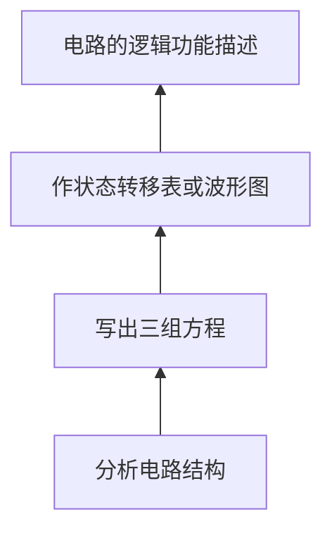
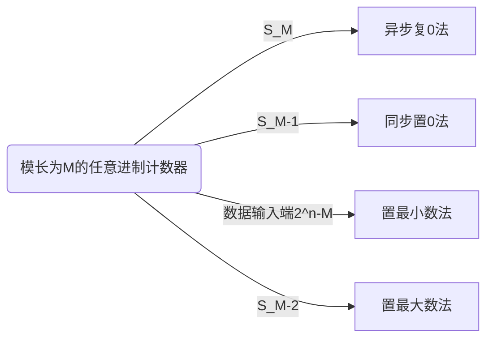

# 数字电路

## 时序逻辑电路

>在数字电路中，凡是任一时刻的稳定输出不仅决定于该时刻的输入，而且还和电路原来的状态有关者，都叫做时序逻辑电路，简称时序电路

+ 时序电路的特点：具有**记忆**功能
+ 时序电路的基本单元：触发器
+ 常用时序电路：寄存器，移位寄存器，计数器与序列信号发生器
+ 时序电路包括三个方程：
  1. 激励方程：$W = F(X, Q^n)$
  2. 输出方程：$H(X, Q^n)$
  3. 状态方程：$Q^{n+1} = G(W,Q^n)$

### 寄存器

>  在数字电路中，用来存放一组二进制数据或代码的电路称为寄存器。寄存器是计算机的主要部件之一，它用来暂时存放数据或指令。
>
>  寄存器是由具有存储功能的触发器组合起来构成的。**一个触发器可以存储1位二进制代码，存放n位二进制代码的寄存器，需用n个触发器来构成。**

#### 输入输出方式

1. 并行方式

   每一位数据对应一个输入端（或输出端）。在时钟脉冲作用下，各位同时输入（或输出）。

2. 串行方式

   只有一个输入端（或输出端）。在时钟脉冲作用下，各数码逐位输入（或输出）。

#### MSI寄存器 74175 

##### 工作原理

+ 74175是由四个D触发器构成的
+ 这里的 **C1** 是下降沿触发，但是由于 **CP** 过了一个非门，所以还是**上升沿触发**
+ **CR** 控制 **R** 端口，也就是异步置零

##### 逻辑功能

### 移位寄存器

>​    所谓“移位”，就是将寄存器所存各位 数据，在每个移位脉冲的作用下，向左或向右移动一位。

根据移位方向，常把它分成三种：

+ 左移寄存器
+ 右移寄存器
+ 双向移位寄存器

而根据移位数据的输入输出方式，又可以分成四种：

#### MSI移存器 74194

>四位串入、并入--串出、并出双向移存器

##### 工作原理

+ $D_{SR}$、$D_{SL}$右移和左移串行输入端口
+ $D_0D_1D_2D_3$并行输入端口
+ $M_1,M_0$：四功能切换端口

##### 逻辑功能

### 计数器

>记忆输入脉冲的个数；用于定时、分频、产生节拍脉冲及进行数字运算等等。

+ 按照工作方式划分：
  + 同步计数器
  + 异步计数器
+ 按照功能划分：
  + 加法计数器
  + 减法计数器
  + 可逆计数器
+ ​	按计数器的容量（模数）：
  + 二进制计数器
  + 十进制计数器

**分析步骤：**

### 同步计数器

#### 八进制同步加法计数器

1. 分析电路结构

2. 写出三组方程

$$
激励方程
\left\{
\begin{aligned}
J_3 &= K_3 =Q_1^nQ_2^n\\
J_2 &= K_2 =Q_1^n\\
J_1 &= K_1 =1
\end{aligned}
\right.
\\
各触发器的次态方程
\left\{
\begin{aligned}
\mathbf{Q}_{3}^{\mathrm{n}+1}&=\left[\left(\mathbf{Q}_{1}{ }^{\mathrm{n}} \mathbf{Q}_{2}{ }^{\mathrm{n}}\right) \oplus \mathbf{Q}_{3}{ }^{\mathrm{n}}\right] \cdot \mathbf{C P} \downarrow\\
\mathbf{Q}_{2}^{\mathrm{n}+1}&=\left[\mathbf{Q}_{1}^{\mathrm{n}} \oplus \mathbf{Q}_{2}^{\mathrm{n}}\right] \cdot \mathbf{C P} \downarrow\\
\mathbf{Q}_{1}^{\mathrm{n}+1}&=\left[\overline{\mathbf{Q}}_{1}^{\mathrm{n}}\right] \cdot \mathbf{C P} \downarrow
\end{aligned}
\right.
\\
电路的输出方程
Z = Q_1^nQ_2^nQ_3^n
$$

3. 状态转移表图，以及波形图

4. 逻辑功能：该电路是一个同步模8加法计数器电路

总结：其实$Q$充当了$TFF$的功能，$n$位二进制计数器需要$n$个$TFF$

#### 任意进制计数器

1. 分析电路

2. 三组方程

$$
激励方程
\left\{
\begin{aligned}
J_3 &=Q_1^nQ_2^n , K_3= 1\\
J_2 &= K_2 =Q_1^n\\
J_1 &= \overline {Q_3^n} ,K_1 =1
\end{aligned}
\right.
\\
各触发器的次态方程
\left\{
\begin{aligned}
&\mathbf{Q}_{1}^{\mathrm{n}+1}=\overline{\mathbf{Q}_{3}^{\mathrm{n}}} \cdot \overline{\mathbf{Q}_{1} ^{\mathrm{n}}} \cdot \mathbf{C P} \downarrow \\

&\mathbf{Q}_{2}^{\mathrm{n}+1}=\left(\mathbf{Q}_{2}^{\mathrm{n}} \overline{\mathbf{Q}_{1}^{\mathrm{n}}}+\overline{\mathbf{Q}_{2}^{\mathrm{n}}}
\mathbf{Q}_{1}^{\mathrm{n}}\right) \cdot \mathbf{C P} \downarrow \\

&\mathbf{Q}_{3}^{\mathrm{n}+1}=\overline{\mathbf{Q}_{3}^{\mathrm{n}}} \mathbf{Q}_{2}^{\mathrm{n}} \mathbf{Q}_{1}^{\mathrm{n}} \cdot \mathbf{C P} \downarrow
\end{aligned}
\right.
\\
电路的输出方程
Z = Q_1^nQ_2^nQ_3^n
$$

3. 状态图

+ 存在偏移状态
+ 偏离状态都能自动（经过一个或一个以上的CP脉冲）进入到有效状态中的计数器，称它们具有自启动性。
+ 十进制和任意进制计数器都要检查自启动性。

4. 逻辑功能：模长为5、具有自启动性的加法计数器

#### MSI二进制计数器

##### 74LS161:star2:

工作原理：

+ $\overline {CR}$：异步清零端口
+ $P,T$：工作模式控制端口
+ $\overline L_D$：同步置数控制端
+ $Q_{CC}$：进位端口

逻辑功能：

16进制计数器

异步级联扩展：

+ 以低位片的进位输出信号$Q_{cc}$作为高位片的时钟输入信号$CP$ 。

同步级联扩展：

+ 以低位片的进位$Q_{CC}$作为高位片的工作状态控制信号$P$和$T$。

##### 同步计数器的设计

基本思路：计数器从全“0”状态$S0$开始计数，计满$M$个状态后产生清“0”信号，使计数器恢复到初态$S0$。

1. 异步复0法（使用$\overline {CR}$）

> 若模长为M，则电路反馈状态为$S_M$，将$S_M$对应的二进制数中含“1”的端子引入与非门的输入端,与非门的输出端连到$\overline {CR}$端即可

+ M=6

状态转移表：

2. 同步置零法（使用$\overline {L_D}$）

> 若模长为M，则电路反馈状态为$S_{M-1}$，将$S_{M-1}$对应的二进制数中含“1”的端子引入与非门的输入端,与非门的输出端连到$\overline {L_D}$端，同时数据输入端送"0"

+ M = 6

状态转移表

3. 置最小数法

   >  利用$\overline {L_D}$端的置最小数法实现任意进制计数器，若实现模长为M，则预置的最小数为${2^n-M}$。将$Q_{cc}$取反送给$\overline {L_D}$即可。

+ M = 12

状态转移表

4. 置最大数法

> 利用$\overline {L_D}$端的置最大数法实现任意进制计数器，若实现模长为M，则反馈状态为$S_{M-2}$。将$S_{M-2}$对应的二进制数中为1的端子引入**与非门**的输入端，为0的端子**取反引入与非门**的输入端，与非门的输出端接*$\overline {L_D}$端*即可。

状态转移表

5. 总结：

+ 除了异步复0，其他用的都是$\overline {L_D}$

实现$M > 16$的任意进制计数器：

基本思路：必须将多片计数器级联

1. 整体置0或整体置数法：

> 基本思路：先将计数器级联组成模长大于*M*的计数器，计满M个状态后，采用清“0”或置数法实现M进制计数器。

> ### 异步直连不能使用整体置数法，因为$CP$信号只能传递到其中一个

使用整体**异步复0**实现M = 28

+ 这里是**同步级联**
  + CP  连接在一起
  + Qcc控制第二部分的PT

+ 与单74161类似，值得注意的是$\overline {CR}$需要连接在一起再连接$S_M$

使用整体**置0**实现M = 28

+ 这里是同步级联

2. 分解法：

> 基本思路：将M=M1×M2×…Mn，其中M1、M2、…Mn均不大于N，则用n片计数器分别组成M1、M2、…Mn进制的计数器，然后**异步级联**即可构成M进制计数器。

使用分解法实现M = 28，即构造四进制和七进制然后**异步级联**

##### 74LS163

同步清零

+ M = 6
+ 但是由于74LS163是同步置零，所以虽然连接的是$\overline {CR}$但是与74LS161的同步置0一样，选择用$S_{M-1}$

##### 74LS160

模长为10，74LS161为模长16

### 异步计数器

>特点：各触发器的CP脉冲不是同一个，以至状态翻转不在同一时刻发生。
>
>优点：同样性能的计数器，异步计数器**结构比同步计数器简单**。
>
>缺点：分析与设计比同步计数器复杂些。计数器**速度较慢**。

$M = 2^n$的异步二进制加法计数器的一般规律

1. 由$n$个T'FF构成
2. 计数脉冲CP送至第一级触发器的时钟CP1
3. 若T'FF是上升沿触发，则高位触发器的CP连低位触发器的$\bar Q$，否则连$Q$
4. 进位信号 $Z=Q_1 Q_2 Q_3 ...$

### 移存型计数器

>1. 属于**同步计数器**，存在反馈网络。
>2. 第一级触发器的激励由输入决定，其余触发器更新均符合$Q_i^{n+1}=Q_{i-1}^{n}$
>
>​    对于DFF：$D_i = Q_{i-1}$
>
>​    对于JKFF：$J_i=Q_{i-1}，K_i=\overline {Q_{i-1}}$
>
>3. 状态转移表符合**移存规律**
>4. 设计简单，**只要设计第一级触发器的激励**即可。

#### 环形计数器

工作原理

+ 环形计数器也时移存型计数器，所以也是同步计数器
+ 存在反馈网络：最后一位的输出$Q_4$，影响第一位的$D_1$，此为原码反馈

逻辑功能

1. 状态转移表：

+ 第0步，存在异步置零。即预置数需要指定，无自启动性。
+ $n$位触发器可以实现模$M=n$的环形计数器

状态转移图

#### 扭环形计数器

>环型计数器存在大量无效的循环圈，浪费了很多状态。

工作原理

+ 与环计数器的差别在于是反码反馈，即$D_1=\overline {Q_4}$
+ 环计数器的预置数为1000，扭环形计数器的预置数为0000

逻辑功能

1. 状态转移图

+ $n$位触发器可实现模$M=2n$的扭环形计数器 。 

#### 用MSI移存器构成环形或扭环形计数器

工作原理

+ [MSI移存器介绍](#MSI移存器 74194)
+ 将$Q_3$接入到右移输入器$D_{SR}$
+ 当$M_1$为0时，右移输入。当$M_1$为1时，并行输入，即置预置数0111。
+ 预置数结束后，$M_1$的状态置0
+ 如果设置成扭环计数器，将$Q_3$外接入一个非门

### 序列码发生器:star2:

>序列码：周期性重复出现的一串数码称为序列码。例：10110 10110 ……
>
>循环长度：一个周期内数码的个数称为序列长度。
>
>序列码电路：产生序列码的电路。
>
>+ 计数型序列码发生器
>+ 移存型序列码发生器 

基本结构

其中组合逻辑常用的芯片为[74151](./数字电路（上）.md#8选1数据选择器74151)

#### 设计

1. 先设计模值为序列长度的计数器

2. 再设计一组合电路，其输入为计数器各触发器的输出$Q_i$，输出为序列码$F$。

#### 用MSI实现

工作原理

+ 只需使用74161输入一个地址信号给74151
+ 将周期序列按照$D_0$~$D_7$的顺序填入

### 顺序脉冲发生器

>作用：在数字系统中，需要一种分配器产生节拍信号，这种节拍控制信号就是一种顺序脉冲：按时间顺序依次出现的一组高电平（低电平）的顺序信号。能够产生这种顺序脉冲的电路是称为顺序脉冲发生器。

工作原理

逻辑功能

1. 波形图

+ 不难发现，每有一个上升沿，出现一次对应的高电平

### 时序逻辑电路复习

1. MSI同步计数器

>v74161——4位二进制加法计数器。
>
>v74163——4位二进制加法计数器，CR：**同步**清0。 
>
>v74160——十进制8421BCD加法计数器，引脚功能与74161相同，只是**Qcc=1001**时为1

2. MSI移位寄存器

>v74194——四位**串入、并入—串出、并出**双向移位寄存器。
>
>v74195——四位右移移存器
>
>v74165——**串入、并出—串出**8位右移移存器

3. 级联扩展

>v74161、74163、74160可同步级联也可异步级联，级联后模长分别为：M=256，M=256，M=100。
>
>74194级联可实现8位双向移存器 

4. MSI实现任意进制计数器(M<N) 

>**反馈法**：异步清0法和同步置数法。
>
>+ 用LD端置全1（置最大数法）时，反馈状态对应编码中出现**0的端口需通过非门送入反馈门**。
>
>+ 任意进制计数器的进位信号/分频输出可以很方便的从反馈门输出端（CR,LD）直接引出。
>
>1. 异步复0法：反馈状态=$S_M$，只有此为送入$\overline {CR}$，其余都送入$\overline{LD}$
>2. 同步置0法：反馈状态=$S_{M-1}$
>3. 置最小数法：置数状态=$16-M$，将$Qcc$取反后送入$\overline{L_D}$
>4. 置最大数法：反馈状态=$S_{M-2}$

5. MSI实现任意进制计数器(M>N)

>1. 整体置数法
>
>   先将计数器级联组成模长大于*M*的计数器，计满M个状态后，采用清“0”或置数法实现M进制计数器。注意：异步级联不能采用置数法。
>
>2. 分解法
>
>   基本思路：将$M=M1×M_2×…M_n$，其中M1、M2、…Mn均不大于N，则用n片计数器分别组成M1、M2、…Mn进制的计数器，然后异步级联即可构成M进制计数器。

