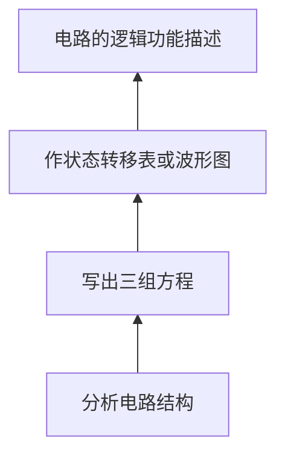
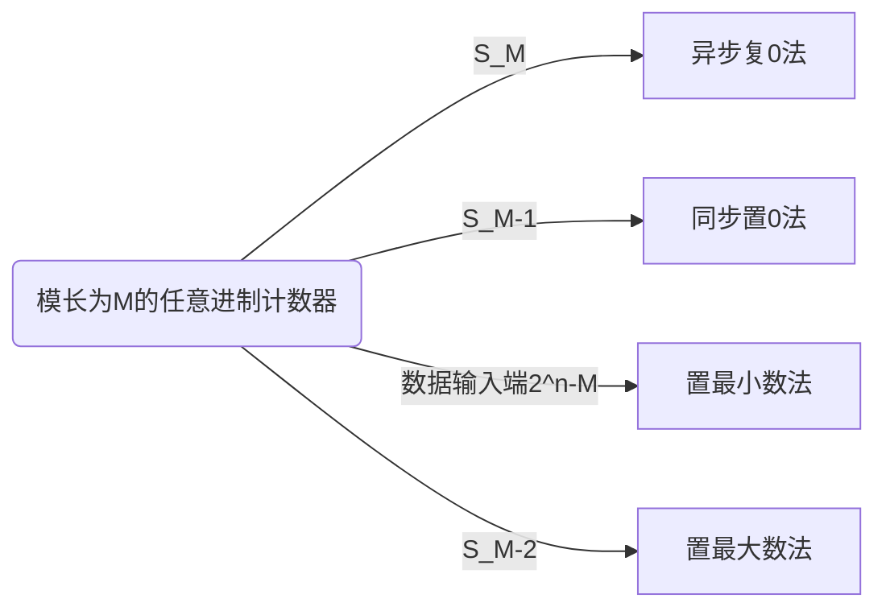
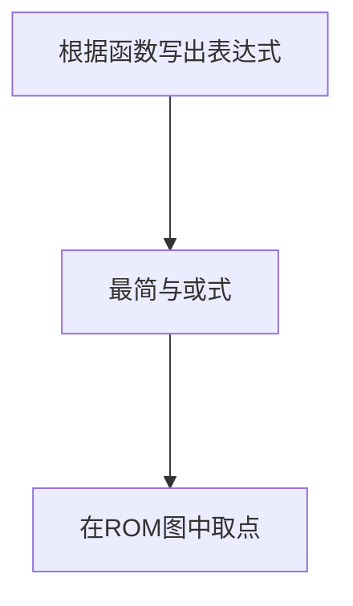

# 数字电路

[TOC]

## 时序逻辑电路

> 在数字电路中，凡是任一时刻的稳定输出不仅决定于该时刻的输入，而且还和电路原来的状态有关者，都叫做时序逻辑电路，简称时序电路

+ 时序电路的特点：具有 **记忆** 功能
+ 时序电路的基本单元：触发器
+ 常用时序电路：寄存器，移位寄存器，计数器与序列信号发生器
+ 时序电路包括三个方程：
  1. 激励方程：$W = F(X, Q^n)$
  2. 输出方程：$H(X, Q^n)$
  3. 状态方程：$Q^{n+1} = G(W,Q^n)$

### 寄存器

>  在数字电路中，用来存放一组二进制数据或代码的电路称为寄存器。寄存器是计算机的主要部件之一，它用来暂时存放数据或指令。
>
>  寄存器是由具有存储功能的触发器组合起来构成的。**一个触发器可以存储 1 位二进制代码，存放 n 位二进制代码的寄存器，需用 n 个触发器来构成。**

#### 输入输出方式

1. 并行方式

   每一位数据对应一个输入端（或输出端）。在时钟脉冲作用下，各位同时输入（或输出）。

2. 串行方式

   只有一个输入端（或输出端）。在时钟脉冲作用下，各数码逐位输入（或输出）。

 

#### MSI 寄存器 74175 

##### 工作原理

+ 74175 是由四个 D 触发器构成的
+ 这里的 **C1** 是下降沿触发，但是由于 **CP** 过了一个非门，所以还是 **上升沿触发**
+ **CR** 控制 **R** 端口，也就是异步置零

##### 逻辑功能

### 移位寄存器

>​    所谓“移位”，就是将寄存器所存各位 数据，在每个移位脉冲的作用下，向左或向右移动一位。

根据移位方向，常把它分成三种：

+ 左移寄存器
+ 右移寄存器
+ 双向移位寄存器

而根据移位数据的输入输出方式，又可以分成四种：

#### MSI 移存器 74194

> 四位串入、并入--串出、并出双向移存器

##### 工作原理

+ $D_{SR}$、$D_{SL}$右移和左移串行输入端口
+ $D_0D_1D_2D_3$并行输入端口
+ $M_1, M_0$：四功能切换端口

##### 逻辑功能

### 计数器

> 记忆输入脉冲的个数；用于定时、分频、产生节拍脉冲及进行数字运算等等。

+ 按照工作方式划分：
  + 同步计数器
  + 异步计数器
+ 按照功能划分：
  + 加法计数器
  + 减法计数器
  + 可逆计数器
+ ​	按计数器的容量（模数）：
  + 二进制计数器
  + 十进制计数器

**分析步骤：**

### 同步计数器

#### 八进制同步加法计数器

1. 分析电路结构

2. 写出三组方程

$$
激励方程
\left\{
\begin{aligned}
J_3 &= K_3 = Q_1^nQ_2^n\\
J_2 &= K_2 = Q_1^n\\
J_1 &= K_1 = 1
\end{aligned}
\right.
\\
各触发器的次态方程
\left\{
\begin{aligned}
\mathbf{Q}_{3}^{\mathrm{n}+1}&=\left [\left(\mathbf{Q}_{1}{ }^{\mathrm{n}} \mathbf{Q}_{2}{ }^{\mathrm{n}}\right) \oplus \mathbf{Q}_{3}{ }^{\mathrm{n}}\right] \cdot \mathbf{C P} \downarrow\\
\mathbf{Q}_{2}^{\mathrm{n}+1}&=\left [\mathbf{Q}_{1}^{\mathrm{n}} \oplus \mathbf{Q}_{2}^{\mathrm{n}}\right] \cdot \mathbf{C P} \downarrow\\
\mathbf{Q}_{1}^{\mathrm{n}+1}&=\left [\overline{\mathbf{Q}}_{1}^{\mathrm{n}}\right] \cdot \mathbf{C P} \downarrow
\end{aligned}
\right.
\\
电路的输出方程
Z = Q_1^nQ_2^nQ_3^n
$$

3. 状态转移表图，以及波形图

4. 逻辑功能：该电路是一个同步模 8 加法计数器电路

总结：其实 $Q$ 充当了 $TFF$ 的功能，$n$ 位二进制计数器需要 $n$ 个 $TFF$

#### 任意进制计数器

1. 分析电路

2. 三组方程

$$
激励方程
\left\{
\begin{aligned}
J_3 &= Q_1^nQ_2^n , K_3 = 1\\
J_2 &= K_2 = Q_1^n\\
J_1 &= \overline {Q_3^n} , K_1 = 1
\end{aligned}
\right.
\\
各触发器的次态方程
\left\{
\begin{aligned}
&\mathbf{Q}_{1}^{\mathrm{n}+1}=\overline{\mathbf{Q}_{3}^{\mathrm{n}}} \cdot \overline{\mathbf{Q}_{1} ^{\mathrm{n}}} \cdot \mathbf{C P} \downarrow \\

&\mathbf{Q}_{2}^{\mathrm{n}+1}=\left(\mathbf{Q}_{2}^{\mathrm{n}} \overline{\mathbf{Q}_{1}^{\mathrm{n}}}+\overline{\mathbf{Q}_{2}^{\mathrm{n}}}
\mathbf{Q}_{1}^{\mathrm{n}}\right) \cdot \mathbf{C P} \downarrow \\

&\mathbf{Q}_{3}^{\mathrm{n}+1}=\overline{\mathbf{Q}_{3}^{\mathrm{n}}} \mathbf{Q}_{2}^{\mathrm{n}} \mathbf{Q}_{1}^{\mathrm{n}} \cdot \mathbf{C P} \downarrow
\end{aligned}
\right.
\\
电路的输出方程
Z = Q_1^nQ_2^nQ_3^n
$$

3. 状态图

+ 存在偏移状态
+ 偏离状态都能自动（经过一个或一个以上的 CP 脉冲）进入到有效状态中的计数器，称它们具有自启动性。
+ 十进制和任意进制计数器都要检查自启动性。

4. 逻辑功能：模长为 5、具有自启动性的加法计数器

#### MSI 二进制计数器

##### 74LS161: star2:

工作原理：

+ $\overline {CR}$：异步清零端口
+ $P, T$：工作模式控制端口
+ $\overline L_D$：同步置数控制端
+ $Q_{CC}$：进位端口

逻辑功能：

16 进制计数器

异步级联扩展：

+ 以低位片的进位输出信号$Q_{cc}$作为高位片的时钟输入信号$CP$ 。

同步级联扩展：

+ 以低位片的进位$Q_{CC}$作为高位片的工作状态控制信号$P$和$T$。

##### 同步计数器的设计

基本思路：计数器从全“0”状态 $S0$ 开始计数，计满 $M$ 个状态后产生清“0”信号，使计数器恢复到初态 $S0$。

1. 异步复 0 法（使用 $\overline {CR}$）

> 若模长为 M，则电路反馈状态为 $S_M$，将 $S_M$ 对应的二进制数中含“1”的端子引入与非门的输入端, 与非门的输出端连到 $\overline {CR}$ 端即可

+ M = 6

状态转移表：

2. 同步置零法（使用 $\overline {L_D}$）

> 若模长为 M，则电路反馈状态为 $S_{M-1}$，将 $S_{M-1}$ 对应的二进制数中含“1”的端子引入与非门的输入端, 与非门的输出端连到 $\overline {L_D}$ 端，同时数据输入端送 "0"

+ M = 6

状态转移表

3. 置最小数法

   >  利用 $\overline {L_D}$ 端的置最小数法实现任意进制计数器，若实现模长为 M，则预置的最小数为 ${2^n-M}$。将 $Q_{cc}$ 取反送给 $\overline {L_D}$ 即可。

+ M = 12

状态转移表

4. 置最大数法

> 利用 $\overline {L_D}$ 端的置最大数法实现任意进制计数器，若实现模长为 M，则反馈状态为 $S_{M-2}$。将 $S_{M-2}$ 对应的二进制数中为 1 的端子引入 **与非门** 的输入端，为 0 的端子 **取反引入与非门** 的输入端，与非门的输出端接 *$\overline {L_D}$端* 即可。

状态转移表

5. 总结：

实现 $M > 16$ 的任意进制计数器：

基本思路：必须将多片计数器级联

1. 整体置 0 或整体置数法：

> 基本思路：先将计数器级联组成模长大于 *M* 的计数器，计满 M 个状态后，采用清“0”或置数法实现 M 进制计数器。

> ### 异步直连不能使用整体置数法，因为 $CP$ 信号只能传递到其中一个

使用整体 **异步复 0** 实现 M = 28

+ 这里是 **同步级联**
  + CP  连接在一起
  + Qcc 控制第二部分的 PT

+ 与单 74161 类似，值得注意的是$\overline {CR}$需要连接在一起再连接$S_M$

使用整体 **置 0** 实现 M = 28

+ 这里是同步级联

2. 分解法：

> 基本思路：将 M = M1 × M2 ×…Mn，其中 M1、M2、…Mn 均不大于 N，则用 n 片计数器分别组成 M1、M2、…Mn 进制的计数器，然后 **异步级联** 即可构成 M 进制计数器。

使用分解法实现 M = 28，即构造四进制和七进制然后 **异步级联**

##### 74LS163

同步清零

+ M = 6
+ 但是由于 74LS163 是同步置零，所以虽然连接的是$\overline {CR}$但是与 74LS161 的同步置 0 一样，选择用$S_{M-1}$

##### 74LS160

模长为 10，74LS161 为模长 16

### 异步计数器

> 特点：各触发器的 CP 脉冲不是同一个，以至状态翻转不在同一时刻发生。
>
> 优点：同样性能的计数器，异步计数器 **结构比同步计数器简单**。
>
> 缺点：分析与设计比同步计数器复杂些。计数器 **速度较慢**。

$M = 2^n$ 的异步二进制加法计数器的一般规律

1. 由 $n$ 个 T'FF 构成
2. 计数脉冲 CP 送至第一级触发器的时钟 CP1
3. 若 T'FF 是上升沿触发，则高位触发器的 CP 连低位触发器的 $\bar Q$，否则连 $Q$
4. 进位信号 $Z=Q_1 Q_2 Q_3 ...$

### 移存型计数器

> 1. 属于 **同步计数器**，存在反馈网络。
> 2. 第一级触发器的激励由输入决定，其余触发器更新均符合 $Q_i^{n+1}=Q_{i-1}^{n}$
>
>​    对于 DFF：$D_i = Q_{i-1}$
>
>​    对于 JKFF：$J_i=Q_{i-1}，K_i=\overline {Q_{i-1}}$
>
> 3. 状态转移表符合 **移存规律**
> 4. 设计简单，**只要设计第一级触发器的激励** 即可。

#### 环形计数器

工作原理

+ 环形计数器也时移存型计数器，所以也是同步计数器
+ 存在反馈网络：最后一位的输出$Q_4$，影响第一位的$D_1$，此为原码反馈

逻辑功能

1. 状态转移表：

+ 第 0 步，存在异步置零。即预置数需要指定，无自启动性。
+ $n$位触发器可以实现模$M = n$的环形计数器

状态转移图

#### 扭环形计数器

> 环型计数器存在大量无效的循环圈，浪费了很多状态。

工作原理

+ 与环计数器的差别在于是反码反馈，即$D_1 =\overline {Q_4}$
+ 环计数器的预置数为 1000，扭环形计数器的预置数为 0000

逻辑功能

1. 状态转移图

+ $n$位触发器可实现模$M = 2n$的扭环形计数器 。 

#### 用 MSI 移存器构成环形或扭环形计数器

工作原理

+ [MSI 移存器介绍](#MSI移存器 74194)
+ 将$Q_3$接入到右移输入器$D_{SR}$
+ 当$M_1$为 0 时，右移输入。当$M_1$为 1 时，并行输入，即置预置数 0111。
+ 预置数结束后，$M_1$的状态置 0
+ 如果设置成扭环计数器，将$Q_3$外接入一个非门

### 序列码发生器: star2:

> 序列码：周期性重复出现的一串数码称为序列码。例：10110 10110 ……
>
> 循环长度：一个周期内数码的个数称为序列长度。
>
> 序列码电路：产生序列码的电路。
>
>+ 计数型序列码发生器
>+ 移存型序列码发生器 

基本结构

其中组合逻辑常用的芯片为 [74151](./数字电路（上）.md#8选1数据选择器74151)

#### 设计

1. 先设计模值为序列长度的计数器

2. 再设计一组合电路，其输入为计数器各触发器的输出 $Q_i$，输出为序列码 $F$。

#### 用 MSI 实现

工作原理

+ 只需使用 74161 输入一个地址信号给 74151
+ 将周期序列按照$D_0$~$D_7$的顺序填入

### 顺序脉冲发生器

> 作用：在数字系统中，需要一种分配器产生节拍信号，这种节拍控制信号就是一种顺序脉冲：按时间顺序依次出现的一组高电平（低电平）的顺序信号。能够产生这种顺序脉冲的电路是称为顺序脉冲发生器。

工作原理

逻辑功能

1. 波形图

+ 不难发现，每有一个上升沿，出现一次对应的高电平

### 时序逻辑电路复习

1. MSI 同步计数器

> v74161——4 位二进制加法计数器。
>
> v74163——4 位二进制加法计数器，CR：**同步** 清 0。 
>
> v74160——十进制 8421BCD 加法计数器，引脚功能与 74161 相同，只是 **Qcc = 1001** 时为 1

2. MSI 移位寄存器

> v74194——四位 **串入、并入—串出、并出** 双向移位寄存器。
>
> v74195——四位右移移存器
>
> v74165——**串入、并出—串出** 8 位右移移存器

3. 级联扩展

> v74161、74163、74160 可同步级联也可异步级联，级联后模长分别为：M = 256，M = 256，M = 100。
>
> 74194 级联可实现 8 位双向移存器 

4. MSI 实现任意进制计数器(M < N) 

> **反馈法**：异步清 0 法和同步置数法。
>
>+ 用 LD 端置全 1（置最大数法）时，反馈状态对应编码中出现 **0 的端口需通过非门送入反馈门**。
>
>+ 任意进制计数器的进位信号/分频输出可以很方便的从反馈门输出端（CR, LD）直接引出。
>
> 1. 异步复 0 法：反馈状态 = $S_M$，只有此为送入 $\overline {CR}$，其余都送入 $\overline{LD}$
> 2. 同步置 0 法：反馈状态 = $S_{M-1}$
> 3. 置最小数法：置数状态 = $16-M$，将 $Qcc$ 取反后送入 $\overline{L_D}$
> 4. 置最大数法：反馈状态 = $S_{M-2}$

5. MSI 实现任意进制计数器(M > N)

> 1. 整体置数法
>
>   先将计数器级联组成模长大于 *M* 的计数器，计满 M 个状态后，采用清“0”或置数法实现 M 进制计数器。注意：异步级联不能采用置数法。
>
> 2. 分解法
>
>   基本思路：将 $M=M1×M_2×…M_n$，其中 M1、M2、…Mn 均不大于 N，则用 n 片计数器分别组成 M1、M2、…Mn 进制的计数器，然后异步级联即可构成 M 进制计数器。

## 可编程逻辑器件

数字电路芯片按照逻辑功能分类：

1. 通用型

   每个器件的逻辑规模小，功耗相对比 较大，用其构成的系统布线复杂，占用 PCB 板面积大。

2. 专用型

   把系统的全部或部分模块集成在一个芯片内，称为专用集成电路 ASIC。可以降低功耗、提高系统的可靠性、保密性及工作速度。 ASIC 又根据用户定制的要求不同，又可以分为全定制电路和半定制电路

### PLD 的基本结构

> 从 20 世纪 70 年代末开始，发展了一种称为可编程逻辑器件（PLD）的半定制芯片。

理论依据：在数字系统设计中，任何组合逻辑函数都能用“与–或”式表达，从而可用“与”门和“或”门实现，而任何时序电路都是由组合电路加上存储元件（FF）构成的，这就是 PLD 实现各种逻辑功能的理论依据。

总体结构：   

### PLD 的表示方法

1. 互补缓冲电路

   

2. 连接及断开

   

3. 与或门

   

4. 数据选择器

   

### PLD 的分类

LDPLD

| **分  类** | **与阵列** | **或阵列** | **输出电路** | **出现年代** | 优点                                            | 缺点                                        |
| ---------- | ---------- | ---------- | ------------ | ------------ | ----------------------------------------------- | ------------------------------------------- |
| **PROM**   | **固定**   | **可编程** | **固定**     | **70 年代初** |                                                 | 只能实现标准与或。  芯片面积大，利用率低 |
| **PLA**    | **可编程** | **可编程** | **固定**     | **70 年代中** | 与阵列、或阵列都可编程。  能实现最简与或式    | 价格较高                                    |
| **PAL**    | **可编程** | **固定**   | **固定**     | **70 年代末** | 采用编程器现场编程   速度高价格低             | 输出方式固定一次编程                        |
| **GAL**    | **可编程** | **固定**   | **可配置**   | **80 年代初** | 具有 PAL 的功能   采用逻辑宏单元使输出自行组态 |                                             |

#### 可编程只读存储器 PROM

FROM 简化后的 ROM 结构如图所示，它可以看作是由一个 **固定的与门阵列** 驱动一个 **可编程的或门阵列** 形成的器件。左边具有固定连接结构的就是 ROM 的与门阵列(即地址空间），与门阵列的输出(也是或门阵列的输入)称为 **字线$W$**。右边具有可编程连接结构的是或门阵列（即数据空间），或门阵列的输出称为 **位线$D$**。

ROM 的 **存储量(容量)** 通常以 $W*D$ 的形式来表示，比如图中的容量即为 $8*3$。

#### 容量扩展

1. 字扩展

   字扩展就是对 ROM 的字线进行扩展。但是由于 ROM 的芯片上没有字线的引脚，只有地址输入端的引脚，所以 ROM 的字扩展其实是对 ROM 的地址输入端进行扩展。常常利用外加译码器控制 ROM 芯片的片选输入信号来实现

2. 位扩展

   位扩展是对 ROM 的位线进行扩展。即增加 ROM 的输出位数。方法是把多个相同的输入地址端的 ROM 芯片地址并联在一起。把所有芯片的位线加起来作为扩展后的位线。

3. 实际应用
    在实际应用中，常常结合两种方式一起使用。比如要得到 $2048*8 $ 容量的芯片，就需要 $16$ 片 $256*4$ 的小 xi

  

### ROM 应用-实现组合逻辑: star:

## 模拟数字转换

> # 不考大题！！

### 基本概念

> 能够将模拟量转换为数字量的器件称为模数转换器，简称 A/D 转换器或 ADC。
>
> 能够将数字量转换为模拟量的器件称为数模转换器，简称 D/A 转换器或 DAC。

主要技术指标：

1. 精度：用 **分辨率、转换误差** 表示

2. 速度：用 **转换时间、转换速率** 表示

### 数模转换

> # 不要求精确计算

+ D/A 转换是将输入的二进制数字量转换成模拟量，以电压或电流的形式输出。

+ D/A 转换器实质上是一个译码器。其输出模拟电压$u_0$和输入数字量$D$之间成正比关系。

+ $U_{REF}$为参考电压。$u_0 = KDU_{REF}$

> ## D 的首位表示正负，1 负 0 正

计算：为了将数字量转换成模拟量，就必须将每一位代码按其“权”转换成相应的模拟量，然后再将代表各位的模拟量相加即可得到与数字量成正比的模拟量。（其实就是求 $D$ 的十进制表示）
$$
\begin{aligned}
{D} &={D}_{n-1} \cdot 2^{n-1}+{D}_{n-2} \cdot 2^{n-2}+\cdots+{D}_{1} \cdot 2^{1}+{D}_{0} \cdot 2^{0}=\sum_{i = 0}^{n-1} {D}_{i} 2^{i} \\
{u}_{0} &={K} {U}_{R E F} \\
&={K}\left [{D}_{n-1} \cdot 2^{n-1}+{D}_{n-2} \cdot 2^{n-2}+\cdots+{D}_{1} \cdot 2^{1}+{D}_{0} \cdot 2^{0}\right] \cdot {U}_{R E F} \\
&={K} {U}_{R E F} \sum_{i = 0}^{n-1} {D}_{i} 2^{i}
\end{aligned}
$$

#### 权电阻网络

+ 当$D_i$= 0 时，$S_i$接地；当$D_i$= 1 时，$S_i$接$U_{REF}$。 
+ 权电阻的大小与权值成反比。数字量的每一位控制产生的电流与该位对应的权值成正比。这样产生的电流总和与数字量成正比。

$$
I_{i}={\frac{U_{{R E F}}D_{i}}{2^{n-1-i}{R}}}={\frac{U_{{R E F}}\,2^{i}\, D_{i}}{2^{n-1}\,{R}}}\\
I_{\Sigma}=\sum_{i = 0}^{n-1}I_{i}={\frac{U_{R E F}}{2^{n-1}R}}\sum_{i = 0}^{n-1}2^{i}D_{i}\\
$$

$$
\begin{aligned}
{u}_{{o}}&=-{I}_{\Sigma} {R}_{{F}} \\
&=-\frac{{U}_{{R E F}} {R}_{{F}}}{2^{n-1}R} \sum_{i = 0}^{n-1} 2^{i} {D}_{i} \\
&={K} {U}_{{R E F}} \sum_{i = 0}^{n-1} 2^{i} {D}_{i}
\end{aligned}
$$

+ $K = -\frac{R_F}{2^{n-1}R}$

+ 当$R_f = R/2$时
  + 所有$D_i = 0$，则$u_0 = 0$
  + 所有$D_i = 1$，则$u_{o}=-{\frac{2^{n}-1}{2^{n}}}U_{R E F}$
  + 则此时$u_0 \in [0,-{\frac{2^{n}-1}{2^{n}}}U_{R E F}]$

+ 优点：结构简单，直观；

+ 缺点：阻值相差较大，很难做到每个电阻的高精度值。

#### 倒 T 型 R-2R 电阻网络 DAC

+  电阻译码网络中，电阻只有$R$和$2R$两种，并构成倒 T 型电阻网络。

+ 当$D_i = 1$时，相应的开关$S_i$接到求和点；当$D_i = 0$时，相应的开关$S_i$接地。
+ 但由于虚短，求和点和地相连，所以不论开关如何转向，电阻$2R$总是与地相连。这样，整个网络的等效输入电阻为$R$。

+ 参考电压$U_{REF}$供出的总电流为：$I_{R}={\frac{U_{R E F}}{R}}$

+ 求和点流入的各支路电流为：$I_{i}= D_{i}\,{\frac{I}{2^{n-i}}}= D_{i}\,{\frac{U_{R E F}}{2^{n}R}}2^{i}$
+ 总电流为$I_\sum = {\frac{U_{R E F}}{2^{n}R}}\sum_{i = 0}^{n-1}D_{i}2^{i}$

+ 输出的电压 $u_{o}=-{\frac{U_{R E F}}{2^{n}}}{\frac{R_{F}}{R}}\sum_{i = 0}^{n-1}D_{i}2^{i}= K D U_{R E F}$
+ $K = -\frac{R_F}{2^{n}R}$
+ 当$R_F = R$时，$u_0 = -\frac{U_{REF}}{2^{n}}D$

+  优点：电阻种类少，只有 R 和 2R，提高了制造精度。

#### D/A 主要技术指标

1. **分辨率**：表征 D/A 转换器对输入微小量变化的敏感程度

   1. 可用输入数字量的位数 $n$ 表示 D/A 转换器的分辨率

   2. 可用 D/A 转换器的最小输出电压与最大输出电压之比来表示分辨率。

   $$
   {\frac{\Delta u}{U_{\mathrm{max}}}}={\frac{K U_{R E F}}{K U_{R E F}\left(2^{n}-1\right)}}={\frac{1}{2^{n}-1}}
   $$

2. 转换精度：指输出模拟电压的实际值与理想值之间的误差。
3. 建立时间：从输入的数字量发生突变开始，到输出电压进入与稳定值相差± 0.5LSB（最低有效位）范围内所需要的时间

### 模数转换

  A/D 转换是将模拟信号转换为数字信号，转换过程通过 **采样、保持、量化和编码** 四个步骤完成。 

1. 采样和保持

   采样是将时间上连续变化的信号转换为时间上离散的信号。

   采样脉冲的频率要求：$f_s \ge 2f_{max}$

   模拟信号经采样后，得到一系列样值脉冲。采样脉冲宽度 $\tau$ 一般是很短暂的，在下一个采样脉冲到来之前，应暂时保持所取得的样值脉冲幅度，以便进行转换。因此，在取样电路之后须加保持电路。

   

   场效应管 VT 为 **采样门**，电容 *C* 为 **保持电容**，运算放大器为 **跟随器**，起 **缓冲隔离** 作用。

2. 量化和编码

   输入的模拟电压经过采样保持后，得到的是 **阶梯波**。而该阶梯波仍是一个可以连续取值的模拟量，但 $n$ 位数字量只能表示 $2^n$ 个数值。因此，用数字量来表示连续变化的模拟量时就有一个 **近似问题**。

   **量化** 是指将采样后的样值电平归化到与之接近的离散电平上，这个过程。用二进制数码来表示各个量化电平的过程称为 **编码**。取样保持后未量化的 $U_0$ 值与量化电平 $U_q$ 值通常是不相等的，其差值称为量化误差 $\varepsilon$，即 $\varepsilon=U_0-U_q$

**量化误差的方法：**

1. **舍尾量化**：$\Delta = U_a/2^n$，$n=3$ 时即为 $\frac {U_A}{8}$
2. **四舍五入量化**：$\Delta = 2U_A/(2^{n+1}-1)$，$n=3$ 时即为 $\frac {2U_A}{15}$

> ## 注意这里 n 最小可以 qu

#### 逐次逼近式 ADC

原理：首先将寄存器的数码值置零，然后从最高位开始赋值为 1，然后转化为模拟电压（注意先量化单位）进行比较。若偏大，则本位变 0，下一位变 1；若偏小，则本位保持 1，下一位变 1。

> ## 注意这里的时间为位数 $(n+1)T_{CP}$

#### 并行比较型 A/D 转换器

+ 根据编码器位数划分成不同长度状态区间
+ 例如：$u_I$＝ 4.2V，$U_{REF}$＝ 6V，则$u_I \in [\frac{9}{15}, \frac{11}{15}] U_{REF}$，编码器显示为 101。
+ 优点：转换速度很快，故又称高速 A/D 转换器。含有寄存器的 A/D 转换器兼有取样保持功能，所以它可以不用附加取样保持电路。
+ 缺点：电路复杂，对于一个$n$位二进制输出的并行比较型 A/D 转换器，需$2^{n -1}$个电压比较器和$2^{n -1}$个触发器，编码电路也随$n$的增大变得相当复杂。且转换精度还受分压网络和电压比较器灵敏度的限制。 

#### A/D 主要技术指标

1. **分辨率**：所能分辨的输入模拟量的最小值。

   1. 可用输入数字量的位数 $n$ 表示 A/D 转换器的分辨率

   2. 用输入的电压（电流）值表示 $R^{\prime}\approx{\frac{U_{R E F}}{2^{n}}}$

   3. 百分比表示 $R^{\prime}=\frac{\Delta u}{U_{\mathrm{Im}}}\approx\frac{\frac{U_{R E F}}{2^n}}{U_{R E F}}\approx\frac{1}{2^{n}}$

      > ## 注意 D/A 百分比表示为 $\frac {1}{2^n -1}$

2. 转换精度

3. 转换时间

4. 量化误差

   > # 注意 D/A 技术指标的主要参数为分辨率、转换精度和建立时间

### Verilog HDL
