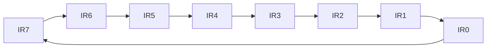
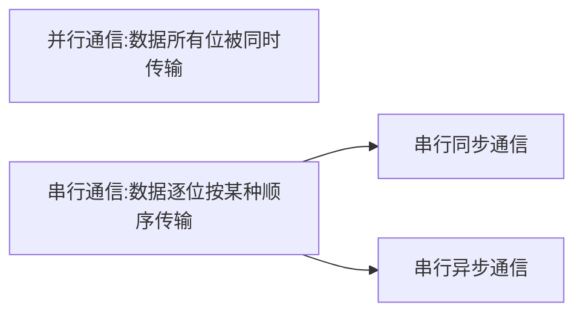

[TOC]
# 总线

## 基本概念

### 总线类型

按总线连接的对象和所处系统的层次分

-   芯片级总线：模块内芯片级互联，是该芯片与外围支撑芯片的连接总线。
-   系统总线：连接计算机内部各模块的主干线，连接芯片级总线、局部总线和外部总线。
-   局部总线：直接连接CPU和高速外设的传输通道。
-   外部总线：又称设备总线或输入输出总线，连接计算机与外设。

按允许信息传送的方向分：

-   单项传输
-   双向传输
    -   半双向：并发式的双向，在某一时刻，仍然是单向的
    -   全双向：允许同一时刻两个方向的数据同时传输，是真正的双向

按用法分：

-   专用总线：只连接一对物理部件

    优点：

    -   系统流量高，多个部件可用同时发送和接收信息，几乎不争用总线
    -   控制简单，不用指明源部件和目的部件
    -   系统可靠，任何总线失效只会影响这个总线连接的两个部件无法通信

    缺点：

    -   总线数目多
    -   难以小型化和集成电路化，成本高
    -   时间利用率低，模块化难以实现。

-   非专用总线：可以被多种功能或多个部件分时共享，但同一时间只能是一对物理部件通信

    优点：

    -   总线数目少，造价低
    -   总线接口标准化、模块性强，易于简化和统一接口的设计
    -   可扩充能力强
    -   易于采用多重总线提高总线的带宽和可靠性，使故障弱化

    缺点：

    -   系统流量小，经常出现总线争用，容易效率低下

### 总线结构

单总线：一条系统总线连接CPU、主存和 I/O设备。要求部件们高速运行，快速取得和放弃总线控制权

双总线：对比单总线，仅在CPU和主存之间增加了一组高速存储总线

三总线：对比双总线，增加 I/O总线

### 总线性能

主要从以下三个方面衡量：

1.  总线宽度

    同时传输的数据位数，一般不超过CPU的数据宽度

2.  总线频率

    每秒内能传输数的次数

3.  传输率

    每秒内能传输的字节数，用MB/s表示

#### 传输率计算

传输率和宽度、频率的关系为
$$
传输率=\frac{宽度(b)}{8} \times 频率(Hz)
$$

>   例题：
>
>   总线宽度为32b，频率为100MHz，求传输率
>
>   根据公式，$传输率=\frac{32b}{8}\times100MHz=400MB/s$

### 总线信息传送方式

一般有3种：串行传送、并行传送和分时传送。==**系统总线必须采用并行传送**==。

#### 串行传送

只有一条传输线，且采用脉冲传送。每次一位数据，通常第一次为有效最低位，最后一次是有效最高位。

成本低廉

#### 并行传送

传送的数据有多少位，就需要多少条传输线。

一般采用电位传送。

#### 分时传送

分时传送一般有两种概念。

1.  采用总线复用方式，某条传输线上既传送地址信息，有传送数据信息。

    为此必须划分时间片。

2.  共享总线的部件分时使用总线

## 总线标准

总线的实现方式各不相同，但遵守统一总线标准，部件之间就可以相互替换

### AT（ISA）总线

### PCI总线

## 通用外部总线标准

### 并行I/O标准接口IDE（EIDE）

### 并行I/O标准接口SCSI


### 通用串行总线USB

## 32位微型计算机总线结构

1.  北桥

    距离CPU更近，连接高速设备。

2.  南桥

    相对于北桥，距离CPU更远一点，连接低速设备

# 存储系统

## 概述

### 存储器体系结构

#### 访存局部性原理

程序对其存储空间的90%的访问局限于存储空间的10%区域内，而另外10%的访问则分布在存储空间的其余90%区域中。这一规律就是访存局部性原理，这一原理包含两个方面：

1.  时间局部性：一个存储项被访问，那么可能很快又会被访问。
2.  空间局部性：一个存储项被访问，那么相邻的存储项也可能很快被访问

#### 层次化存储系统

经典图

### 存储器分类

书P230

### 主要性能指标

#### 存储容量（Memory Capacity）

#### 存取时间（Access Time）

也称为存储器访问时间，指从启动一次存储器操作到完成该操作所用时间，用$T_A$表示。

如从发出读命令到将数据送入数据缓冲寄存器所用时间，或从发出写命令到将数据缓冲寄存器内容写入相应存储单元岁所用时间。

#### 存储周期（Memory Cycle）

也称为存取周期、访问周期、读写周期，指连续两次启动同一存储器进行存取操作所需的最小时间间隔，用$T_M$表示。

进行一次访问后，存储介质和有关控制电路都需要恢复时间，若是破坏性读出，还需要重写时间，因此通常 $T_M>T_A$。

$T_A$通常用来表示CPU发出命令后要等待多长时间才能获得数据。如果考虑计算机与访存有关的工作周期，则会涉及$T_M$。

#### 可靠性（Reliability）

平均故障间隔时间（Mean Time Between Failures，MTBF）衡量，表示两次故障之间的平均时间间隔。

#### 功耗与集成度

#### 性能性价比

#### 存取宽度

一次访存可以存取的数据位数或字节数

## 存储器组织

### 扩展技术

要会计算需要多少片小芯片来组成需要的存储容量

#### 存储容量扩展

子扩展、位扩展、字位扩展。详细见计算机组成原理。


#### 地址分配和片选

接上图


#### 计算

##### 例一

有若干片1K×8位的SRAM芯片，采用字扩展方法构成4KB存储器，问：
 (1) 需要多少片RAM芯片？
 (2) 该存储器需要多少地址位？
 (3) 画出该存储器与CPU连接的结构图，设CPU的接口信号有地址信号、数据信号、控制信号MREQ和R/W#。
 (4) 给出地址译码器的逻辑表达式。

解：

(1) 需要4K/1K = 4片SRAM芯片；

(2) 存储器容量4KB，需要12条地址线

(3) 译码器的输出信号逻辑表达式为


##### 例二

设有若干片256K×8位的SRAM芯片，问：
 (1) 采用字扩展方法构成2048KB的存储器需要多少片SRAM芯片？
 (2) 该存储器需要多少字节地址位？
 (3) 画出该存储器与CPU连接的结构图，设CPU的接口信号有地址信号、数据信号、控制信号MREQ#和R/W#。

解：

(1) 该存储器需要2048K/256K = 8片SRAM芯片；

(2) 需要21条地址线，因为221=2048K，其中高3位用于芯片选择，低18位作为每个存储器芯片的地址输入。

(3) 该存储器与CPU连接：


<figure>这里是图片题注</figure>

# 输入输出系统

## 概述

### 接口电路

CPU必须通过接口电路与外设进行信息交换。接口是CPU与外部设备交换信息的中转站


#### 功能

1.  数据缓冲功能：解决数据速率差异问题
2.  联络功能：向CPU系统提供外设状态，或者向外设提供CPU状态。
3.  寻址功能：有IO端口地址译码器，使系统能对指定的外设输入输出
4.  数据转换功能：具有数据“串→并”和“并→串”功能。
5.  中断管理功能：设置中断控制电路，允许或禁止接口电路提出中断请求，而且中断控制电路的控制功能应交给CPU。

一般**前三项功能**是接口电路都需要具备的。

#### 接口电路分类

按通用性：

-   专用接口
-   通用接口

可编程性：

-   可编程接口
-   不可编程接口

按与外设通信的数据传送方式：

-   并行I/O接口
-   串行I/O接口

### 输入输出端口

“端口”，就是输入输出接口电路中的一组寄存器。这些寄存器能与CPU交换信息，实现接口的各种功能。

按存放信息的物理意义分，有3类：数据端口、状态端口、控制端口

1.  数据端口（必有）：存放CPU向外设输出或外设输入的数据
2.  控制端口：存放控制信息——控制接口电路、外设的工作
3.  状态端口：存放状态信息——反映外设的状态

注：每个端口，系统都为它编了一个地址，系统只要给出某个地址，通过译码电路，就能找到相应的I/O接口电路中的端口寄存器。

#### 端口的编址方式

>   问题：系统给出的地址是内存单元地址还是I/O端口寄存器的地址？
>
>   解决方案：合理安排I/O端口寄存器的编址方式

端口编址方式有下面两种：

1.  统一编址方式：存储器映像方式

    把端口和存储单元等同看待，统一编址

    特点：凡访问存储单元的指令都可访问I/O端口，端口地址占用存储空间

2.  独立编址方式：I/O端口独立编址

    特点: I/O 端口不占用存储空间，CPU要有专用的 I/O 指令

在PC系列机中，I/O端口采用独立编址方式。**端口地址（I/O空间）没有分段的概念**。

### 输入输出指令

特别注意：

1.  I/O 指令只能在端口与AL、AX和EAX之间的信息交换

2.  交换信息时，若用DX间址，不能使用方括号，即不能写成：

    `IN AL , [DX]`

#### 直接寻址的I/O指令

当端口地址为8位（最多可以访问256个端口）时，可用直接寻址方式

```assembly
IN  AL,n      ; 端口地址为n的端口中取数→ AL
OUT n,AL      ; AL内容 →口地址为n的端口寄存器
IN  AX,n      ; (n) → AL；(n+1) → AH
OUT n,AX      ; AL → n端口；AH → n+1端口
```

>   例如
>
>   ```assembly
>   IN  AL,61H
>   OUT 61H,AL
>   ```
>
>   

#### DX间址的I/O指令

当端口地址 n为大于8位的二进制数时，用DX间址  

```assembly
IN  AL, DX       ;  [DX] → AL
OUT DX, AL       ;  AL → [DX]
IN  AX, DX       ;  [DX] → AL；[DX+1] → AH
OUT DX, AX       ;  AL → [DX]；AH → [DX+1]
```

>   例如：
>
>   ```assembly
>   MOV DX, 3F8H
>   IN  AL, DX     ; 从3F8H端口取数 → AL
>   ```
>
>   

## 微机系统与外设交换信息的方式

微机系统与 I/O 端口的信息交换有四种方式：

1.  无条件传送
2.  查询方式
3.  中断控制方式
4.  直接存储器访问（DMA）方式

采用何种方式与接口的硬件电路有直接关系。前三种都需要CPU的直接参与，而DMA不需要CPU直接参与。

### 无条件传送

不管外设的状态如何，直接执行I/O指令。这种方式比较容易造成数据丢失。

### 查询方式

CPU主动地了解外设状态，再进行信息交换


*==查询式输入的程序代码==*

```assembly
    SCAN:IN   AL,n1       ;读取外设信息，n1为状态端口地址
         TEST AL,80H      ;测试外设是否准备好
         JZ   SCAN        ;外设未准备好，继续测试
         IN   AL,n2       ;外设准备好，输入数据。n2为数据端口地址
```

*==查询式输出程序代码==*

```assembly
    TSCAN:MOV  DX,200H
          IN   AL,DX
          TEST AL,1
          JNZ  TSCAN
          MOV  DX,201H
          MOV  AL,某数
          OUT  DX,AL
```

### 中断控制方式

通过查询方式的程序代码发现，查询方式起始是不断地重复执行测试指令来判断外设是否准备好，显然这种方式利用率不高。而且这种方式工作不能保证系统能及时地对外设请求做出相应。于是就有了中断处理技术。

采用中断技术传送信息，当外设未准备好时，CPU可以执行与传送信息无关的其它指令；当外设准备好后，可向CPU发出中断请求，请求为之服务。若CPU响应请求，将暂停正在运行的程序，转入中断服务子程序，完成数据的传送。在中断服务结束后，将自动返回原来运行的程序继续执行。

中断控制方式将在[中断系统](#中断系统)中详细介绍。

### 直接存储器存取方式（DMA）

---


>   什么是DMA？
>
>   DMA（Direct Memory Access）是用硬件实现外设与内存之间直接进行数据交换，而不用通过CPU。这样数据传送速度的上限就取决于存储器的工作速度。
>
>   为实现DMA方式而设计的专用控制芯片称为DMA控制器（DMAC）

>   为什么要有DMA？
>
>   采用中断方式进行数据传送可以提高CPU的利用率，但是中断传送是由CPU通过程序来实现的，每次执行中断服务都需要保护断点、保护现场，服务完毕后需要恢复现场……CPU需要执行若干指令来完成上述工作。对于高速外设，例如高速磁盘驱动或高速数据采集系统，中断方式往往不能满足要求。

工作过程：书P264

# 可编程定时器/计数器8254

>   根据课程安排，在此先介绍8254。在[中断系统](#中断系统)一章中，有个十分重要的例子会用到8254。定时器/计数器8254——书P389

计算机系统经常需要定时信号或对外部信号计数，比如动态存储器的定时刷新。一般定时操作可用软件或硬件两种方式实现。

-   软件方法：通过执行延时程序，不需要硬件，但CPU执行延时程序将增加时间开销，降低CPU效率，且往往不够精确。
-   硬件方法：采用可编程定时器/计数器器件，其具备定时和计数功能。

常用的可编程定时器/计数器有8253和8254等。8254是8253的兼容增强型，凡是8253的场景都可以用8254替换。

本章主要介绍8254

## 概述

### 8254内部结构

8254**内部集成了3个16位的计数器,** 每个计数器有6种工作方式，计数初值可设定为二进制或BCD码。最高工作频率10MHz。


数据总线缓冲器：用于接收CPU送来的数据（控制字），向CPU提供计数器数据等。总之是与CPU数据交换的地方

读写控制模块：选择芯片内部的控制寄存器和计数器，在读写命令的控制下对选中的端口进行读写操作。

控制寄存器：寄存CPU对其初始化编程时写入的控制字，以决定计数器的工作方式。并设置读出命令。

计数器：每个计数器对外有3条线

-   GATE：控制信号
-   CLK：计数脉冲输入
-   OUT：计数器输出

#### 计数器内部结构


初始化编程时：计数器的初值被送往<u>初值寄存器</u>，再被送往<u>减1计数器</u>。

当GATE信号有效（=1）时：每个CLK下降沿使计数器减1，当计数值减到0时(或某个值，这由工作方式确定), OUT有输出。

在递减过程中的某一刻，收到锁存信号时：<u>减1计数器</u>的值被送往<u>计数值锁存器</u>，用以读出。不妨碍减1计数器继续递减。

计数初值的计算公式如下：
$$
计数初值=\frac{f_{CLK}}{f_{OUT}}
$$
其中$f_{CLK}$,$f_{OUT}$分别是脉冲信号和输出信号的**频率**。假如脉冲周期为1，输出周期为3，则计数初值=$\frac{1}{1/3}=3$

### 内部寄存器/计数器口地址

*==在$\overline{CS}=0$前提下==*

| A1   | A0   | 选中       |
| ---- | ---- | ---------- |
| 0    | 0    | 0#计数器   |
| 0    | 1    | 1#计数器   |
| 1    | 0    | 2#计数器   |
| 1    | 1    | 控制寄存器 |


## 工作方式

每个计数器都有6种工作方式，且均在CLK下降沿计数一次

主要区别：

-   输出波形不同
-   启动计数器的方式不同。有两种启动方式：软件启动、硬件启动
    -   软件启动：GATE=1，初值写入后，开始计数
    -   硬件启动：初值写入后，不计数，当GATE从0→1后开始计数。
-   计数过程中门控信号GATE对计数操作的影响不同。

### 方式0：计数结束OUT引脚输出正跃变信号


特点：GATE=1时，正常计数，GATE=0时，停止计数，GATE恢复1时，继续计数。

### 方式1：(可重触发)硬件启动的单脉冲发生器


特点：

-   硬件启动（由外部门控信号启动计数)
-   初值写入后不立刻计数。当GATE从0→1后，下一个CLK，OUT从1→0。之后每个CLK下降沿计数值减1。计数值减到0时, OUT从0→1。
    输出负脉冲的宽度=N×TCLK
-   计数过程中, GATE再次从0→1，初值自动重装，即从初值开始重新计数。从而使OUT输出的负脉冲加宽（即有可重触发的性能)。

### 方式2：分频器(脉冲发生器)


特点：

-   软件启动
-   每当计数器减到0时，OUT1→0，下一CLK初值重装
-   输出波形为周期型波形，输出负脉冲宽度为一个T~CLK~，周期=N×T~CLK~

### 方式3：方波发生器

**==计数器每次递减2，而非1==**

计数初值为偶数和奇数时，表现不同。

计数初值为偶数时


计数初值为奇数时


特点：

-   软件启动，减2计数，能自动重装初值。
-   初值=偶数时，计数值减到0时自动初值重装，输出1：1方波
-   初值=奇数时
    -   装入及重装的初值均为写入的值-1
    -   输出正脉冲期间，减到-2时才重装初值，输出的正脉冲宽度=T~CLK~×(初值+1)/2
    -   输出负脉冲期间，减到0时重装初值，输出的负脉冲宽度=T~CLK~×(初值-1)/2

### 方式4：软件触发的单脉冲发生器


特点：

-   软件启动
-   减1计数，减到0输出一个负脉冲（1个T~CLK~宽度）

### 方式5：硬件触发的单脉冲发生器


特点：

-   硬件启动
-   减1计数，减到0输出一个负脉冲（1个T~CLK~宽度）

### 6种工作方式比较


## 控制字与编程

### 控制字/状态字

控制字有两个，一个用来设置计数器的工作方式，称为<u>方式控制字</u>；一个用来设置读出命令，称为<u>读出控制字</u>。这两个控制字公用一个控制口地址，由标识位区分。

#### 方式控制字


作用：选择一个计数器，确定工作方式，并规定初值的写入顺序和计数初值的数值

| D7   | D6   | 选中                                |
| ---- | ---- | ----------------------------------- |
| 0    | 0    | 0#计数器                            |
| 0    | 1    | 1#计数器                            |
| 1    | 0    | 2#计数器                            |
| 1    | 1    | 标志该命令是[读出命令](#读出控制字) |

| D5   | D4   | 选择                                                         |
| ---- | ---- | ------------------------------------------------------------ |
| 0    | 0    | 标志该命令为[锁存命令](#锁存命令)                            |
| 0    | 1    | 初值写入时，只写低8位，高8位自动补0；<br />计数值读出时，只能读低8位 |
| 1    | 0    | 初值写入时，只写高8位，低8位自动补0；<br />计数值读出时，只能读高8位 |
| 1    | 1    | 初值写入/计数值读出的顺序为先低8位，后高8位                  |

| D3   | D2   | D1   | 工作方式 |
| ---- | ---- | ---- | -------- |
| 0    | 0    | 0    | 0        |
| 0    | 0    | 1    | 1        |
| x    | 1    | 0    | 2        |
| x    | 1    | 1    | 3        |
| 1    | 0    | 0    | 4        |
| 1    | 0    | 1    | 5        |

| D0   | 初值数制 |
| ---- | -------- |
| 0    | 二进制   |
| 1    | BCD码    |

无论哪个数值，为了节约位数，计数器中0都代表最大的那个数，比如D0=0（二进制下），0就代表65536D；D0=1（BCD下），0代表10000D

##### 锁存命令

当D7D6≠11，D5D4=00时，为锁存命令

D7D6为锁存对象

#### 读出控制字


读出控制是多通道的锁存命令，一条命令可以锁存3个计数器的计数值、计数器状态。

#### 状态字


### 编程

#### 初始化编程

初始化步骤：

1.  向控制寄存器写入方式控制字
    目的：选择一个计数器,并确定其工作方式和计数值（计数初值）的读/写顺序。
2.  向选择的计数器写入计数初值。
    注意:如果方式控制字D0=0,则初值应是二进制,否则初值应是BCD码数。

>   例:设8254的口地址为40H ~ 43H，要求2#计数器工作在方式3，计数初值=4000,写出2#的初始化程序段。
>
>   ```assembly
>   ;解法1：二进制数
>   MOV AL,10110110B        ;控制字
>   OUT 43H,AL      ;送往控制口
>   MOV AX,4000     ;设置初值
>   OUT 42H,AL      ;将初值低8位送往计数器
>   MOV AL,AH		;将初值高8位送往计数器
>   OUT 42H,AL      
>   ```
>
>   ```assembly
>   ;解法2：BCD数
>   MOV AL,10110111B        ;控制字
>   OUT 43H,AL      ;送往控制口
>   MOV AL,0		;将初值低8位送往计数器
>   OUT 42H,AL      
>   MOV AL,40H		;将初值高8位送往计数器
>   OUT 42H,AL      
>   ```
>
>   ```assembly
>   ;解法3：BCD数(利用D5D4=10时低8位自动补0特性)
>   MOV AL,10100111B        ;控制字
>   OUT 43H,AL      ;送往控制口     
>   MOV AL,40H		;将初值高8位送往计数器
>   OUT 42H,AL  
>   ```

一些说明：

-   选择初值数制：
    当初值≤9999时，选二进制或BCD都行
    当初值＞9999时，选二进制
-   自己要注意BCD数的表示：例如1234D=（1234H）~BCD~

#### 读取当前计数值

读操作有几种形式，当初始化编程规定读写方式为先低8位后高8位：

-   在计数过程中，先向8254控制寄存器写入一个D7D6=计数器编号，D5D4=00的控制字，锁存相应计数器的当前值，然后再对相应的计数器端口进行两次读操作，依次读出计数器的低8位和高8位。
-   在计数过程中，向8254控制寄存器写入读出命令，分三种情况：
    -   如果读出命令仅锁存相应计数器的状态信息，则对相应计数器端口进行一次读操作,即可读出信息
    -   如果读出命令仅锁存相应计数器的计数值，则对相应计数器端口进行两次读操作，依次读出计数值的低8位和高8位
    -   如果读出命令同时锁存计数器的计数值和状态信息，则要对相应计数器端口执行三次读操作，第一次读出的是状态信息，第二次读出的是当前计数值的低8位，第三次读出的是当前计数值的高8位

>   例:设8254的口地址为40H~43H，请写出程序段，读取2#计数器的当前计数值。
>
>   ```assembly
>   MOV AL,10000100B        ;计数器2号的锁存命令
>   OUT 43H,AL              ;写入控制字寄存器
>   IN AL,42H               ;读低8位
>   MOV CL,AL               ;存于CL中
>   IN AL,42H               ;读高8位
>   MOV CH,AL               ;存于CH中
>   ```

# 中断系统

## 基本概念

### 中断流程示意


### 中断描述

CPU暂停执行现行程序，转而处理随机事件，处理完毕后再返回被中断的程序——这一全过程称为中断。

### 中断源与中断分类

中断源：能够引发CPU中断的信息源

-   外部中断源（硬件中断源）

    -   I/O设备：如键盘、显示器、打印机
    -   数据通道：如磁带、磁盘
    -   时钟：如8254的0#计数器，此引发的中断
    -   故障源：如掉电、存贮器奇偶校验错

-   内部中断源（软件中断源）

    内部中断又可分为软件中断和异常：

    -   执行INT软件中断指令：如执行指令INT 21H
    -   CPU指令执行产生的异常：如被0除、单步执行

### 具有中断请求功能的输入接口示意图


### 中断系统的含义

为实现中断而采取的硬件和软件的集合

### 中断系统应具备的基本功能

1.  对于硬件中断，接口电路应具备‘屏蔽’和‘开放’的功能，这种功能由程序员通过软件去控制
2.  能实现中断判优（中断排队），当有多个中断源提出请求时，应能优先响应高级别的中断源
3.  能够实现中断嵌套，即高级别的中断源能够中断低级别的中断服务程序
4.  响应中断后，能自动转入中断处理，处理完毕能自动返回断点

## 80X86的中断指令

|              | 指令                                                         | 功能                                                         |
| ------------ | ------------------------------------------------------------ | ------------------------------------------------------------ |
| 开中断指令   | `STI`                                                        | 使F寄存器中I标志置1，CPU处于开中断状态                       |
| 关中断指令   | `CLI`                                                        | 使F寄存器中I标志置0，CPU处于关中断状态                       |
| 软件中断指令 | `INT n`<br />n为中断类型码，0～255之间有定义的单字节无符号整数<br />因此没有二义性 | 无条件转向n型中断服务子程序                                  |
| 中断返回指令 | `IRET`                                                       | 依次从栈顶弹出6个元素→ IP、CS、F<br />如果栈顶是INT  n 的断口地址，<br />则执行IRET后，返回断点；否则不能 |

`INT n` 指令的执行过程

1.   F寄存器→栈(保存INT n 之前的F状态)

      使F中的T标志置0——禁止单步操作

      I标志置0——CPU处于关中断状态

2.  断口地址→栈

    先：断口基地址(CS) →栈
    后：断口偏移地址(IP)→栈

3.  CPU从4n～4n+3单元取出n型服务程序入口地址→ IP:CS,从而转入n型中断服务程序。

## 中断向量、中断向量表

### 中断向量

每个中断都指定了一个类型码，也称中断号，每一种中断对应有一个中断服务程序

中断向量是**实模式**下**中断服务子程序的入口地址**，它由两部分组成:

1.  服务程序所在代码段的段基址    2 个字节
2.  服务程序入口的偏移地址        2 个字节

### 中断向量表

中断类型码通过一个地址指针表与中断服务程序的入口地址相联系：

1.  实模式下： 该表称为中断向量表
2.  保护模式下：该表称为中断描述符表

中断向量表的设置

CPU规定：在实模式下，中断向量表需设置在系统的RAM最低端的1K单元（00000H ～ 003FFH）


### 中断向量的地址


>   如：“21H”型中断向量：存放在84H ～ 87H单元中
>
>   9CH型中断向量存放270H ～ 273H单元中

简单阐述一下，中断向量的内容其实就是一个地址，它指向了n型中断服务子程序（比如`INT 21H`就是软中断至21H型服务程序）。所有的中断向量构成中断向量表，中断向量表存放于RAM的最低端的1K单元。每个中断向量占用4字节，低字放n型服务程序的偏移地址，高字放n型服务程序的段基址。因为是放在最低的1K单元，所以计算n型中断向量的地址也很好计算，就是`4n+0~4n+3`这4个字节。

### 中断向量的引导作用——CPU响应软件中断的过程


### 中断向量表的初始化

由BIOS设计的中断服务程序（如INT 16H , INT 10H…）其中断向量在加电时由BIOS负责写入中断向量表

由DOS设计的中断服务程序（如 INT 21H）其中断向量是在启动DOS时，由DOS负责写入中断向量表

用户程序开发的中断服务程序，由用户程序写入其中断向量

#### 向中断向量表中写入中断向量

因为中断向量一共就256个，所以要自定义中断向量只能修改原有的。

##### 直接覆盖原始中断向量

```assembly
	CLI							;屏蔽中断，防止在本段程序中去执行其它指令
	PUSH	DS					;保护DS内容
	MOV		AX, 0000H			;开始修改原始的中断向量
	MOV		DS, AX
	MOV		BX, 4*n				;n是要修改的n型向量
	MOV		AX, OFFSET SERVICE	;SERVICE是用户自己的中断服务
	MOV		[BX], AX			
	MOV		AX, SEG SERVICE
	MOV		[BX+2], AX
	POP 	DS					;恢复DS
	STI							;恢复中断
```

##### 利用DOS专门读/写中断向量的子功能

先来介绍一下读/写中断向量的子功能，即`INT 21H`的35H子功能和25H子功能。

*复习一下，要调用DOS子功能，需要`MOV AH,子功能号`*

*==DOS INT 21H 子功能==*

| 子功能号 | 功能            | 入口参数                                                     | 出口参数          |
| -------- | --------------- | ------------------------------------------------------------ | ----------------- |
| 35H      | 读出n型中断向量 | AL=中断类型码                                                | ES:BX=n型中断向量 |
| 25H      | 写入n型中断向量 | DS=中断服务程序所在代码段的段基址<br />DX=中断服务程序入口的偏移地址<br />AL=中断类型码 | 无                |

>   例：把用户程序中以“TIMER”命名的中断服务子程序的入口地址 →4 ×1CH ～ 4 ×1CH+3单元
>
>   ```assembly
>   ;数据段
>   OLD1C DD   ?                           ;原1C中断服务子功能
>   ;代码段
>   MOV  AH , 35H						;调用35H子功能,读出原1CH中断向量
>   MOV  AL , 1CH
>   INT  21H
>   MOV  WORD  PTR  OLD1C , BX			;将原1CH中断向量保存至OLD1C
>   MOV  WORD  PTR   OLD1C+2 , ES
>   PUSH DS								; 保护DS
>   MOV  AX,CS							;设置入口参数
>   MOV  DS,AX
>   MOV  DX,OFFSET TIMER
>   MOV  AH,25H
>   MOV  AL,1CH
>   INT  21H
>   POP  DS								; 恢复DS
>   ```
>
>   

## 系统中断的分类


### CPU中断

CPU中断是指：CPU执行某些操作而引发的中断，这类中断使用了0、1、3、4、6、7中断号。

-   除法错中断—— 0型中断
-   单步中断—— 1型中断
-   断点中断—— 3型中断
-   溢出中断—— 4型中断  

### 软件中断

执行有定义的`INT n`指令而引发的中断，称为软件中断，简称为软中断

软件中断使用05H,10H～FFH中的若干个中断号。又分为：

#### BIOS中断

BIOS中断，占用了05H、10H～1FH中断号，用户程序执行相关的软中断指令可以调用相应的中断服务程序

1.  INT 05H  屏幕打印
2.  INT 10H  屏幕显示   I/O
3.  INT 11H  设备配置检测
4.  INT 12H  测试内存容量
5.  INT 13H  磁盘I/O
6.  INT 14H  串行通信 I/O
7.  INT 15H  BIOS扩展功能
8.  INT 16H  键盘I/O
9.  INT 17H  打印机I/O
10.  INT 18H  启动PC机ROM BASIC(AT机)无
11.  INT 19H  重新装入引导程序
12.  INT 1AH  实时时钟管理

中断号1DH,1EH,1FH,41H,46H也被BIOS占用了。但是，与这些中断号对应的并不是中断服务程序。

#### DOS中断

DOS中断，又分为<u>DOS专用中断</u>，<u>DOS保留中断</u>，<u>用户可调用的DOS中断</u>以及<u>保留给用户开发的中断</u>。

##### DOS专用中断

1.  22H型中断
2.  3H型中断
3.  H型中断
4.  8H～3FH型中断

##### 用户可调用的DOS中断 

1.  20H型中断
2.  21H型中断
3.  25H型中断
4.  26H型中断
5.  27H型中断

## 8259A中断控制器

外部硬件中断是不可预测的，若有多个中断请求，就需要一个中断控制系统（中断控制器）来负责处理这些请求。


*NMI:None Masked Interruption, INTR:Interruption*


### 8259A的内部结构


1.  中断请求寄存器**（IRR，Interruption Request Register）**：寄存引脚 IR0～IR7 的中断请求信号，IRRi 位置 1，表明 IRi 引脚上有了中断请求信号。

2.  中断屏蔽寄存器**（IMR）**：寄存程序员写入的中断屏蔽字，屏蔽字某位=1（即IMRi = 1），则与该位对应的中断请求信号（IRRi位）就不能送到中断优先权电路。

    >   例1：
    >
    >   ```assembly
    >   MOV  AL , 11111100B 
    >   OUT  屏蔽寄存器口地址，AL	; 屏蔽IRR7 ～IRR2的请求开放IRR1和IRR0
    >   ```
    >
    >   例2：
    >
    >   ```assembly
    >   IN    AL,屏蔽寄存器口地址
    >   AND   AL,11110111B
    >   OUT   屏蔽寄存器口地址，AL   ;开放IRR3的请求，对其它位的请求不改变屏蔽/开放的状态
    >   ```
    >
    >   

3.  优先权电路（排队电路）：

   1.  一是比较同时送达优先权电路的中断请求，哪一个级别最高；
   2.  比较CPU正服务的中断源和刚进入优先权电路的中断源，哪一个级别更高。

   通过判优“选中”其中级别最高的中断源，然后通过控制电路，从INT端向CPU提中断请求。对于PC机而言，0-7优先级依次降低

4.  中断控制电路：

    1.  寄存一组初始化命令字和操作命令字，通过译码产生内部控制信号
    2.  当优先电路选中一个中断源时，向CPU提出中断请求（INT）
    3.  通过$\overline{INTA}$接收CPU送来的中断响应信号，中断响应信号是2个连续的负脉冲。

5.  中断服务寄存器（**ISR**）：8位寄存器，ISRi位与IRRi位一一对应，记录CPU正为之服务的是哪一个中断源

    >   例如：
    >
    >   通过判优电路IRR0位的请求被选中，8259A向CPU发中断请求，通过INTA收到第一个中断响应信号后，ISR0位置1，IRR0位置0
    >
    >   ISR0**位置1，表明CPU正在准备(或正在)执行IR0的服务程序**
    >
    >   反之，如果**ISR0位由1 →0，表明IR0的中断服务程序执行完了**
    >
    >   所以ISR的每一位都是响应中断源的中断服务标志位

6.  数据总线缓冲器

    1.  完成与CPU数据线配接
    2.  接收初始化命令字，操作命令字
    3.  当收到第二个中断响应脉冲时，通过他们向CPU送出被选中的中断源的中断类型码n

    在这之后CPU从 4n+0～4n+3 单元取出n型中断向量， 从而转入n型服务程序。

7.  读写控制模块：接收片选信号$\overline{CS}$、端口选择信号A0 和读写控制信号$\overline{RD},\overline{WR}$

    一片8259A在系统中占用两个口地址,用末位地址线A0选择端口,其它地址线通过译码产生8259A的片选信号。

8.  级联/缓冲比较器：一片8259A可以管理8级中断，二片8259A“级连”可管理15级中断，级连/缓冲比较器是为完成多片8259A级连设置的模块。

### 8259A的管脚


### 8259A的中断过程—CPU响应硬件中断的过程

1.  首先由中断请求寄存器寄存加到引脚IR0～IR7上的中断请求
2.  在中断屏蔽寄存器的管理下，没有被屏蔽的中断请求被送到优先权电路判优
3.  经过优先权电路的判别，选中当前级别最高的中断源，然后从引脚 INT 向CPU发出中断请求信号
4.  CPU满足一定条件后，向8259A发出中断响应信号（2个负脉冲）
5.  8259A从引脚 INTA 收到第1个中断响应信号之后，立即使中断服务寄存器中与被选中的中断源对应的那一位置1，同时把中断请求寄存器中的相应位清0
6.  从引脚 INTA 收到第2个中断响应信号后，8259A把选中的中断源类型码n,通过数据线送往CPU
7.  在实模式下，CPU从4×n～4×n+3单元取出该中断源的中断向量→IP、CS，从而引导CPU执行该中断源的中断服务程序

### 8259A的中断管理方式

可以通过8259A初始化时写入<u>初始化命令字</u>和<u>操作命令字</u>来设置选择相应的工作方式。

#### 中断触发方式（中断请求引入方式）

-   边沿触发：$IR_i$上升沿表示中断请求

-   电平触发：$IR_i$高电平表示中断请求

#### 中断屏蔽方式

-   常规屏蔽方式

    IMR屏蔽字决定了允许或禁止某位$IR_i$所对应的中断：IMRi=1 禁止， IMRi=0 允许

-   特殊屏蔽方式

    -   提供了允许较低优先级的中断能够得到响应的特殊手段
    -   假定当前正在处理IR6，先进入特殊屏蔽方式，然后设置IM6=1。这时，除IR6外的所有中断请求均能得到响应
    -   特殊屏蔽方式中只能用`SEOI`命令结束中断

    

#### 中断优先级管理方式

##### 完全嵌套方式（固定优先级方式）

-   所有中断请求IRi的中断优先级固定不变
-   在当前中断源的中断服务子程序完成之前，<u>同级</u>或<u>更低级</u>的中断请求会被屏蔽。
-   加电后8259A的默认方式，默认优先级顺序从高到低为IR0～IR7

##### 特殊全嵌套方式

基本与完全嵌套方式相同，有一点不同是在处理某一级中断是，如果有同级的中断请求，也会进行响应，即具有同级中断请求的特殊全嵌套（而完全嵌套只能高级全嵌套）。

特殊全嵌套一般用在8259A的级联系统中。在多片级联的情况下，从片的更高级中断请求理应被识别。而从片的更高级中断请求在主片看来都是同级的。因此，**通常在主片中运用特殊全嵌套方式，而从片中运用完全嵌套方式**。

##### 优先级循环方式

-   中断源轮流处于最高优先级，即自动中断优先级循环
-   某中断请求IRi被处理后，其优先级别自动降为最低，原来比它低一级的中断上升为最高级

*==8259A自动循环优先权==*


*箭头表示优先权顶替方向，例如IR0中断被服务完毕后，IR1的中断优先级就被提到最高*

#### 中断结束方式

当某一IRi中断被服务时，ISR中的相应位ISRi=1。当服务结束后，则必须清零该ISRi位。使ISRi=0是通过向8259A发出中断结束命令（`EOI`命令）实现的。

三种EOI命令：

1.  自动EOI（AEOI）——（自动EOI方式）
2.  非指定EOI（NSEOI）——（常规EOI方式）
3.  指定EOI（SEOI）——（特殊EOI方式）所有中断请求IRi的中断优先级固定不变

##### AEOI（自动结束）

在第2个 INTA 结束时，由8259A使ISRi自动复位。

由于本指令是在响应中断后、执行IRi服务之前，提前使ISRi清零。因此在执行IRi服务期间，只要CPU处于开中断状态，新的请求都将中断当前服务，有可能出现低级或同级中断源中断高级中断源的情况。故AEOI不能用于中断嵌套方式。

##### EOI（非自动结束）

###### 常规EOI

用于普通全嵌套方式。由CPU发出正常EOI命令，该EOI命令使ISRi=1的位中优先级最高的那一位复位。

###### 特殊EOI

用于特殊屏蔽方式。由CPU发出一条SEOI命令，该EOI命令中指出了所要复位的ISR的位号

#### 系统总线连接方式

#### 查询方式

### 8259A初始化

对8259A的编程有两类命令字：

-   初始化命令字：ICW~1~、ICW~2~、ICW~3~、ICW~4~
-   操作命令字：OCW~1~、OCW~2~、OCW~3~

向8259A写入ICW的过程称为**初始化编程**

向8259A写入OCW的过程称为**操作方式编程**

#### 初始化命令字

初始化命令字ICW（Initialization Command Word）通常是系统开机时，由初始化程序填写，且在整个系统工作过程中保持不变。==初始化命令字必须按顺序填写==。但并不要求4个命令字全都要预置。

##### ICW~1~芯片控制


>   已知8259A的偶地址为20H，设置ICW1
>
>   ```assembly
>   MOV AL,13H
>   OUT 20H,AL
>   ```
>
>   

##### ICW~2~设置中断类型码

8259A中IR~0~端对应的中断类型码为中断类型码的基址，它是可以被8整除的正整数。ICW~2~用户可以设定前5位，后3位不用设置，由中断属于哪一级自动确定。前5位+后3位=最终的中断类型码


例如：

```assembly
MOV AL,08H
OUT 21H,AL
```

08H=00001000B，对应的中断类型码范围为08H~0FH。如果现在响应的中断为<u>IR4</u>，那么当8259A收到CPU送来的第二个$\overline{INTA}$信号后，送出的中断类型码就是<u>00001100=0CH</u>

##### ICW~3~识别主片/从片

ICW~3~命令在级联时（即ICW~1~中D1=0）才需要设置。下面分别是主片和从片的格式。


从图得知，一个主片最多连8个从片。主片上哪一位连从片了就置1，否则置0。从片高5位不用设置（置0），低3位设置连接到主片哪一位。

>   某主片IR3、IR7端上连接从片，设主片端口地址为20H、21H；从片1端口地址为A0H、A1H；从片2端口地址为80H、81H。
>
>   ```assembly
>   MOV AL,88H	;主片，88H=10001000B
>   OUT 21H,AL
>   MOV AL,03H	;从片1，
>   OUT 0A1H,AL
>   MOV AL,07H	;从片2
>   OUT 81H,AL
>   ```
>
>   

##### ICW~4~方式控制


##### 8259A初始化编程流程图


#### 操作命令字

由CPU向8259A送三个字节的操作命令字OCW， 用以规定8259A的工作方式，包括但不限于：

1.  中断屏蔽
2.  结束中断
3.  优先权旋转
4.  中断状态

操作命令字是在应用程序中设置的，设置时，顺序上没有严格的要求

##### OCW~1~中断屏蔽

命令字中的M7～M0对应IMR的各位。Mi=1表示该中断被屏蔽，Mi=0表示该中断开放。


##### OCW~2~中断结束


R、SL、EOI的不同组合决定了8259A的几种工作方式。

L2～L0 这几位确定当SL=1时指定的特殊结束或特殊循环时的中断优先级。**最常用的常规EOI命令字为20H**


##### OCW~3~特殊屏蔽方式与查询方式


>   8259A编程举例：
>
>   按以下要求初始化8259A：
>
>   1.  端口地址为20H和21H；
>   2.  中断为上升沿触发；单片8259A；不写ICW4；
>   3.  与IR0-IR3对应的中断向量码为08H-0BH；
>   4.  IR4-IR7不使用。
>
>   [-] 根据要求，各初始化参数及工作参数如下：
>
>   >   ICW1 = 00010010 = 12H
>   >
>   >   ICW2 = 08H
>   >
>   >   OCW1 = 11110000 = 0F0H   
>
>   [+] 初始化程序如下：
>
>   >   ```assembly
>   >   INIT8259A：
>   >   MOV	DX，20H	；A0=0，写ICW1
>   >   MOV	AL，12H	；上升沿触发，单片，不写ICW4
>   >   OUT	DX，AL
>   >   MOV	DX，21H	；A0=1，写ICW2，OCW1
>   >   MOV	AL，08H	；ICW2
>   >   OUT	DX，AL
>   >   MOV	AL，0F0H	；OCW1：屏蔽IR4-IR7
>   >   OUT	DX，AL
>   >   ```
>   >
>   >   
>
>   

### 286以上微机的8259A中断管理方式

系统加电后由BIOS对8259A初始化编程，设定中断管理方式：

1.  系统8259A，中断触发方式为边沿触发
2.  中断屏蔽方式采用常规屏蔽方式，即应用时，向8259A中断屏蔽寄存器写入适当屏蔽字即可屏蔽/开放某一级中断
3.  中断源为固定优先级，即IR0中断请求级别最高，IR7中断请求级别最低
4.  采用常规中断结束方式，即在中断服务子程序结束之前向8259送中断结束命令

对8259A编程分二步进行：

1.  对8259A进行初始化编程

    ——系统加电后，由BIOS完成

2.  对8259A进行应用编程

    ——编写中断程序时完成，有2项内容：

    1.  需要时，向8259A中断屏蔽寄存器写入**屏蔽字**
    2.  每一个硬件中断服务程序结束前必须向8259A送**中断结束命令字**，通知8259A本次中断结束，否则8259A不能响应同一中断源的下次中断。

8259A收到中断结束命令后，把ISR中的置1位清0！

## PC/AT可屏蔽中断

### 概述

**硬件中断的级别：==DMA请求 > 非屏蔽中断 > 可屏蔽中断==**

CPU响应可屏蔽中断的条件：

1.  INTR引脚有中断请求，NMI引脚没有中断请求，系统没有DMA请求
2.  CPU当前指令执行完毕
3.  CPU处于开中断状态，即标志寄存器的中断允许标志置1

CPU响应非屏蔽中断的条件

1.  NMI引脚有中断请求，系统没有DMA请求
2.  CPU当前指令执行完毕

### 可屏蔽中断的硬件结构


PC/AT使用2片8259A级连，管理15级中断

中断源与中断类型

| **主8259** | **中断源**  | **中断类型** | **从8259** | **中断源**   | **中断类型** |
| ---------- | ----------- | ------------ | ---------- | ------------ | ------------ |
| **IR0**    | **日时钟**  | 08H          | **IR0**    | **实时时钟** | 70H          |
| **IR1**    | **键盘**    | 09H          | **IR1**    | **用户中断** | 71H改向0AH   |
| **IR2**    | **从8259**  |              | **IR2**    | **保留**     | 72H          |
| **IR3**    | **辅串口**  | 0BH          | **IR3**    | **保留**     | 73H          |
| **IR4**    | **主串口**  | 0CH          | **IR4**    | **保留**     | 74H          |
| **IR5**    | **并行口2** | 0DH          | **IR5**    | **协处理器** | 75H          |
| **IR6**    | **软盘**    | 0EH          | **IR6**    | **硬盘**     | 76H          |
| **IR7**    | **并行口1** | 0FH          | **IR7**    | **保留**     | 77H          |

<span id='interruptlevel'>硬件可屏蔽中断的中断级别</span>：中断级别从0-7依次降低


系统分配的8259A端口地址

|            | **中断屏蔽寄存器**  **口地址** | **接收中断结束命令的寄存器**  **口地址** |
| ---------- | ------------------------------ | ---------------------------------------- |
| **主8259** | **21H**                        | **20H**                                  |
| **从8259** | **A1H**                        | **A0H**                                  |

中断结束命令

1.  命令字 = 20H
2.  接入主8259A的IR0~IR7的中断源，其服务程序结束要向主8259A送中断结束命令字

>   ```assembly
>   SERVICE PROC
>   	;保护现场
>   	;...
>   	MOV AL,20H
>   	OUT 20H,AL
>   	;恢复现场
>   	IRET
>   SERVICE ENDP
>   ```

3.   接入从8259的中断源，其服务程序结束应分别向主、从8259各送一个中断结束命令字

>   ```assembly
>   SERVICE PROC
>   	;保护现场
>   	;...
>   	MOV AL,20H
>   	OUT 20H,AL
>   	OUT 0A0H,AL
>   	;恢复现场
>   	IRET
>   SERVICE ENDP
>   ```

### 硬件中断与软件中断的区别

1.  中断引发的方式不同
2.  CPU获取中断类型码的方式不同
3.  CPU响应的条件不同
4.  中断处理程序的结束方式不同

### 硬件可屏蔽中断例

#### 日时钟中断

##### 中断源

系统8254的0#计数器，每55ms有一次中断请求

##### 中断类型

8型

##### 日时钟中断的处理流程

CPU转入8型中断后，完成下列工作：

1.  开中断，保护现场（DS…压栈）
2.  40H →DS，对“日时钟计数器”加1
3.  ~~测算软驱马达关闭时间~~
4.  执行`INT 1CH`
5.  向主8259送中断结束命令
6.  恢复现场，`IRET`

>   ###### 日时钟计数器
>
>   BIOS系统规定：40H:6CH～40H:6FH这4个单元（共32位）为日时钟计数器，每55ms加1次，计数到:001800B0H，为24小时，其计数值供系统软件使用。
>
>   系统启动时CPU执行BIOS中的一段程序，读取CMOS实时时钟电路的时间值→计数值→40:6CH～40:6FH作为日时钟计数器的计数初值
>
>   ###### 关于1CH服务程序
>
>   8#服务程序，每隔55ms在DS=40H的前提下，调用一次1CH服务程序，之后又返回8型！
>
>   所以1CH中断是日时钟的外扩中断，用户可开发新的1CH中断（完成每55ms一次的定时操作）取代原来的中断服务子程序

由上可知，日时钟触发的是08H型中断，在处理这个08H型中断过程中，还会去执行一次1CH型中断（初始时1CH型中断不作任何工作，相当于空函数体）。因此开发日时钟中断服务时，既可以选择直接开发08H型中断，也可以选择开发1CH型中断。但是一般都选择去开发1CH型中断服务，因为08H型中断内还包括了系统的其它工作，比如对“日时钟计数器”加1、向主8259送中断结束命令等，当程序员重写时，需要记得把这些操作也加上；而1CH型相当于一个08H型中断服务会附带执行的函数，除了保护必要的现场，以及返回，其它代码几乎都用于处理客制化需求，开发简单。

#### 用户中断

##### 中断源

系统总线插槽B4端引入的用户设计的硬件中断请求信号

##### 用户中断请求的途径


只有从8259A的IMR1置0，主8259A的IMR2置0，其中断请求方能送到CPU！[图见上](#interruptlevel)

##### 实现用户中断必须对主、从8259应用编程,保证中断申请由8259中断控制器提向CPU

```assembly
IN		AL ,	0A1H
AND		AL ,	11111101B
OUT		0A1H,	AL		;开放用户中断
IN		AL ,	21H
AND		AL ,	11111011B
OUT		21H ,	AL		;开放从8259中断 

```

##### 用户的中断类型

CPU响应用户中断后自动转向71H型服务程序

BIOS为“71H型”设计的服务程序如下：


##### 用户定义的中断服务程序的两个设计方法

方法一：

定义用户中断服务程序为“71H型”

中断程序的准备工作：置换71H型中断向量，即把用户中断的中断向量→4×71H ～ 4×71 H+3单元

用户中断服务程序结束时，服务程序结束前要向主、从8259A各送一中断结束命令

方法二：

定义用户中断服务程序为“0AH型”

中断程序的准备工作：置换0AH型中断向量，即把用户中断的中断向量→4×0AH ～ 4×0AH+3单元

用户中断服务程序结束时，服务程序结束前只向主8259A送结束命令

>   为什么0AH只需要向主8259A发送结束就行了呢？
>
>   因为以往主8259A不接从片，用户中断直接接0A上，所以现在有从片了，直接告诉主片0A上处理完毕就行。

## 实模式下的定时中断程序设计

### 定时中断程序的设计方法

#### 定时中断源的选择

##### 系统8254的0#计数器


每55ms（约1/18秒）发起一次中断信号

##### 外扩8254


#### 确定中断服务程序的类型

中断类型由定时中断源接入8259A的引脚IRi有关

1.  如果中断源是外扩定时器，由从8259A的IR1引脚引入，则服务程序应定义为`0AH`或`71H`型

2.  如果中断源是系统8254的0#计数器，并且定时周期是55ms的整数倍，则定义用户服务程序为1CH型，取代系统的1CH型服务程序

3.  如果中断源是系统8254的0＃计数器，但定时周期≠55ms的整数倍，则应重新对8254 0＃计数器进行初始化

    

#### 置换中断向量

服务程序的类型确定之后，应置换相应的中断向量（[使用INT21H的25H和35H子功能](#利用DOS专门读/写中断向量的子功能)）

#### 开放8259A中断

其实就是修正屏蔽位，一般先`IN`读取，然后`AND`修正，最后再`OUT`回去。

通常日时钟都是不会屏蔽的，所以可以默认未屏蔽。

#### 避免DOS重入

简单粗暴守则：<font color=#f00;>**<u>不要在中断服务程序中使用</u>**`INT 21H`</font>


#### 中断服务程序的执行时间必须远小于定时中断的时间间隔

这不必多说，如果不是远小于的话要么来不及服务完，下一个中断请求又来了；要么其它服务无法执行，一天到晚在处理这个周期请求。（这多不合适

#### 中断结束向8259A发中断结束命令

### 定时中断程序结构

#### 结构一：初始化后等待中断


#### 结构二：伪中断，实查询


#### 代码示例

```assembly
;每1s在屏幕打印“HELLO!”
.486
DATA SEGMENT USE16
    MESG   DB 'HELLO!',0DH,0AH,'$'
    OLD1C  DD ?
    ICOUNT DB 18
    COUNT  DB 10
DATA ENDS

CODE SEGMENT USE16
            ASSUME CS:CODE,DS:DATA
    START:  
            MOV    AX,DATA
            MOV    DS,AX
            CLI
            CALL   READ1C
            CALL   WRITE1C
            STI
    SCAN:   
            CMP    COUNT,0
            JNZ    SCAN
            CLI
            CALL   RESET
            STI
            MOV    AH,4CH
            INT    21H
    ;SHOW MESG
SHOW8 PROC
            MOV    CX,8
            MOV    BL,MESG
            MOV    DL,31H
    AGA:    
            ROL    BL,1
            JC     OUTPUT
            MOV    DL,30H
    OUTPUT: 
            MOV    AH,02H
            INT    21H
            LOOP   AGA
            RET
SHOW8 ENDP
    ;DEFINE SERVICE
SERVICE PROC
            PUSHA
            PUSH   DS
            MOV    AX,DATA
            MOV    DS,AX
            DEC    ICOUNT
            JNZ    EXIT
            MOV    ICOUNT,18
            DEC    COUNT
            MOV    AH,9
            LEA    DX,MESG
            INT    21H
    EXIT:   
            POP    DS
            POPA
            IRET
SERVICE ENDP
    ;RESET 1CH
RESET PROC
            MOV    DX,WORD PTR OLD1C
            MOV    DS,WORD PTR OLD1C+2
            MOV    AX,251CH
            INT    21H
            RET
RESET ENDP
    ;SET MASK
I8259A PROC
            IN     AL,21H
            AND    AL,11111110B
            OUT    21H,AL
            RET
I8259A ENDP
    ;WRITE 1C
WRITE1C PROC
            PUSH   DS
            MOV    AX,CODE
            MOV    DS,AX
            MOV    DX,OFFSET SERVICE
            MOV    AX,251CH
            INT    21H
            POP    DS
            RET
WRITE1C ENDP
    ;READ 1C
READ1C PROC
            MOV    AX,351CH
            INT    21H
            MOV    WORD PTR OLD1C,BX
            MOV    WORD PTR OLD1C+2,ES
            RET
READ1C ENDP
CODE ENDS
    END START
```

# 微机系统串行通信

## 串行通信基础

### 通信方式

计算机通信方式分类如下：




1.  串行异步通信：指一帧字符用起始位和停止位来完成收发同步

    

2.  串行同步通信：靠同步字符来完成收发双方同步

    

数据传输速度：并行通信 > 串行同步通信 > 串行异步通信

### 串行数据传输方式

串行数据通信系统模型


*<span id='MODEM'>MODEM</span>是调制解调器，负责模拟信号与数字信号之间的转换。*

数据的传输方式：

1.  单工方式：数据只允许固定方向传输

    

2.  半双工方式：传输方向不定，但任意时刻只能是单向。

    

3.  全双工方式：数据在任意时刻允许双向传输

    

### 串行异步通信协议

通信协议都是数据收发双方事先约定好的，不然无法正确地解读信息。

#### 一帧数据格式

**下面默认逻辑0信号代表低电平，逻辑1信号代表高电平。**


1.  起始位：1位，低电平
2.  数据位：5~8位，高低电平不定
3.  奇偶校验位：0~1位，高低电平取决于校验方式。
    1.  奇校验：数据位与奇偶位中“1”的个数为奇数
    2.  偶校验：数据位与奇偶位中“1”的个数为偶数
4.  停止位：1、1.5、2位，高电平

没有数据传输（处于空闲）时，电路上都是高电平，与停止位相同。从高电平到低电平的跃变即表示数据传输的开始。

由于每一帧数据传输之间的时间间隔是随意的，因此称为串行异步通信。

#### 通信速率（传输速率）

严格来说，<u>数据信号速率</u>和<u>数据通信速率</u>是不同的概念。

数据信号速率$R$：单位时间传送信号的个数，单位为“波特”，即$1/s$。因此数据信号速率又称为“波特率”或“信号速率”。

数据通信速率$N_{bd}$：单位时间传送二进制比特的个数，单位为$bit/s$或$b/s$或$bps$。又称为“比特率”或“通信速率”。

多状态信号传输数据，两者计算公式为
$$
R=N_{bd}\log_2M,M为信号状态数
$$
当采用二进制信号传输数据时（信号状态为2个，0或1），数据信号速率和数据通信速率在数值上相等

#### 信号的调制与解调

数据通信传输的是数字信号，要求传送线频带很宽；长距离传送时常利用电话线传送，而电话线带宽为300~3000Hz，因此，若直接传输数字信号，信号就要发生畸变。因此，需用调制器将数字信号转换成模拟信号；传输到接收端后再用解调器将其转换成数字信号。


>   调制：
>
>   用一个信号控制另一个信号的某个参数随之变化的过程叫做调制
>
>   这两个信号分别叫调制信号和被调信号
>
>   被调信号只作为传输过程中信息的载体，也叫载波
>
>   解调：
>
>   将已经调制的信号恢复成原来的数字信号的过程

#### 串行通信接口标准-RS232C标准

>   Q：要进行串行通信，还要解决一个问题：计算机与[MODEM](#MODEM)怎样连接？
>
>   A：通过串行接口电路连接计算机与MODEM。这个接口其机械特性、电气特性、功能特性都要遵循一定的规范，也就是要有一个标准。目前计算机通信使用最普遍的是RS-232C标准。RS-232C标准规定了信号的电平标准和控制信号的定义。
>
>   

##### 控制信号定义(机械特性)

PC系列机有两个串行口：即COM1和COM2，使用9针和25针两种连接器，符合RS-232C接口标准。


| 9针连接器端子号 | 25针连接器端子号 |       名称       | 方向 | 功能                                  |
| :-------------: | :--------------: | :--------------: | :--: | ------------------------------------- |
|        3        |        2         |       TXD        | 输出 | 发送数据（Transmit Data）             |
|        2        |        3         |       RXD        | 输入 | 接收数据（Receive Date）              |
|        7        |        4         | $\overline{RTS}$ | 输出 | 请求发送（Request To Send）           |
|        8        |        5         | $\overline{CTS}$ | 输入 | 允许发送（Clear To Send）             |
|        6        |        6         | $\overline{DSR}$ | 输入 | 数据设备准备好（Data Set Ready）      |
|        5        |        7         |       GND        |      | 信号地（Signal Ground）               |
|        4        |        20        | $\overline{DTR}$ | 输出 | 数据终端准备好（Data Terminal Ready） |

##### 信号电平标准（电气特性）

RS-232C标准采用**==负逻辑==**，规定：

1.  逻辑“1”信号，电平在 –3V ~ -15V之间
2.  逻辑“0”信号，电平在 +3V ~ +15V之间

因此，使用RS-232C与微机接口时，需要将计算机使用的TTL电平（0 ~ 5V）与RS-232C电平进行转换


通常采用MC1488（TTL转RS-232C）和MC1489（RS-232C转TTL）电平转换器


## 可编程串行异步通信接口芯片8250

1.  能实现数据串-并变换，实现全双工异步通信
2.  支持异步通信协议，数据格式、通信速率等由初始化编程设定
3.  内部有MODEM控制器，可直接和MODEM相连
4.  内部有中断机制，CPU可用查询、中断方式与之交换信息

PC机有[2个串行口](#可屏蔽中断的硬件结构)：主串口3FXH、辅串口2FXH。高档微机中，8250的功能被一些多功能芯片取代。

### 内部结构


A0A1A2是选择内部寄存器的三根地址线，但图中有10个寄存器，[怎么选的过来呢？](#内部寄存器)

#### 串行数据发送与接受过程


##### 发送过程

CPU执行OUT指令，将待发送的数据→发送保持寄存器暂存，当发送移位寄存器空闲时自动装入，后者在发送器时钟控制下将并行数据添加起始位、校验位、停止位，一位一位发出。


##### 接受过程

在接收器时钟控制下，接收移位寄存器一位一位地接收串行数据，自动的去掉起始位、校验位、停止位，并转换成并行数据→接收缓冲寄存器暂存，在接收过程中对一帧数据自动进行校验。


### 内部寄存器

从使用角度分为3类：


因为存在地址合并使用现象，所以内部结构中三根地址线就足以选择图中一共7个地址。

#### 发送保持寄存器（3F8H/2F8H）

保存CPU送来的数据，并转移至发送移位寄存器

注意：只有在发送保持寄存器空闲时，CPU才能写入下一个数据

#### 接收缓冲寄存器（3F8H/2F8H）

将接收到的数据去掉起始位、校验位和停止位，转换成并行数据，转换后的并行数据存入接收缓冲寄存器，等待CPU接收。

注意：只有当一帧数据接收完之后，CPU才能用`IN`指令读接收缓冲寄存器。

#### 通信线状态寄存器（3FDH/2FDH）


-   D0：接收数据准备好（接收数据缓冲寄存器满）标志位。1 表示满。CPU接收数据时一定要查询。
-   D1：溢出错标志位。1 表示接收数据缓冲寄存器中的数据未取走，8250又接收到新的输入数据，造成前一位数据被破坏。
-   D2：奇偶校验错标志位。1 表示接收到的数据有奇偶校验错误。
-   D3：接收格式错标志位。1 表示接收数据没有正确的停止位。
-   D4：线路间断标志位。 1 表示长时间收到“0”信号，即终止信号。
-   D5：发送保持寄存器空闲标志位。1 表示数据已经从发送保持寄存器送至发送移位寄存器，发送保持寄存器空闲，CPU可以写入数据。
    当新数据送入发送保持寄存器后，D5置0。
-   D6：发送移位寄存器空闲标志位。1 表示一帧数据已发送完毕。
    当下一个数据从发送保持寄存器送入发送移位寄存器时，置0。

D0和D5是串行接口最基本的标志位，它们决定了CPU能不能读写8250!

-   当D0==1时，才能读数据。
-   当D5\==1或D6\==1时，才能写数据。

说明：寄存器各位置1时，如果相应的[中断允许位](#中断允许寄存器（3F9H/2F9H）)也为1，则：

-   D0=1，产生接收中断
-   D5=1，产生发送中断
-   D1~D4=1，产生“字符错”中断

执行下列操作后，寄存器中的相应位执行：

| 数据操作                      | 通信线状态寄存器各位变化 |
| ----------------------------- | ------------------------ |
| 数据→发送保持寄存器           | D5=0                     |
| 通信线状态寄存器→AL           | D1~D4=0                  |
| 接收缓冲寄存器→AL             | D0=0                     |
| 发送保持寄存器内容→移位寄存器 | D6=0                     |


>   主串口查询方式发送数据程序示例
>
>   ```assembly
>   SCANT: 
>   MOV DX,3FDH
>   IN AL,DX
>   TEST AL,20H ;0010 0000B
>   JZ SCANT	;D5=1
>   MOV DX,3F8H
>   MOV AL,'A'
>   OUT DX,AL
>   ```
>
>   辅串口查询方式接收数据程序示例
>
>   ```assembly
>   SCANR: 
>   MOV DX,2FDH
>   IN AL,DX
>   TEST AL,1EH ;0001 1110B
>   JNZ ERROR	;if D1|D2|D3|D4=1 ERROR
>   TEST AL,01H	;0000 0001B
>   JZ SCANR	;D0=1
>   MOV DX,2F8H
>   IN AL,DX
>   ```
>
>   

#### 中断允许寄存器（3F9H/2F9H）

8250有四级中断：

1.  接收线路状态中断（接收数据错OE,PE,FE,BI置1产生中断）
2.  接收缓存寄存器满
3.  发送缓冲寄存器空
4.  MODEM状态中断（MODEM应答联络信号状态变化产生中断）

四个中断优先级**从1至4由高到低**。

当上述4种中断出现至少一个时，8250输出INTRPT信号。


中断允许寄存器一共8位，但D4\~D7恒为0，D0\~D3表示四级中断是否被允许：

-   D0=1，允许接收到一顿数据后，内部提出“接收中断请求”。
-   D1=1，允许发送保持寄存器空时，内部提出“发送中断请求”。
-   D2=1，允许接收出错时，内部提出“接收数据错中断请求”。
-   D3=1，允许MODEM状态改变时，内部提出“MODEM中断请求”。

#### 中断识别寄存器（3FAH/2FAH）


由于8250仅能向CPU发出一个总的中断请求信号，为了识别是哪一个中断源引起的中断，应当在转入中断服务程序之后，读取中断识别寄存器的内容进行判断，然后再转入相应的处理程序。*8250有四种中断，所以需要2位识别码*

*==编程示例==*

```assembly
MOV DX,3FAH
IN  AL, DX
CMP AL,0
JZ	;MODEM中断
CMP AL, 2
JZ 	;发送中断
CMP AL, 4
JZ  ;接收中断
CMP AL, 6
JZ  ;字符错中断
```

#### MODEM控制寄存器（3FCH/2FCH）


-   D0位=1，使引脚$\overline{DTR}$=0，从而使RS-232C引脚$\overline{DTR}$为0。
-   D1位=1，使引脚$\overline{RTS}$=0，从而使RS-232C引脚$\overline{RTS}$为0。
-   D2位=1，使引脚$\overline{OUT_1}$=0，系统机上没有使用。
-   D3位=1，使引脚$\overline{OUT_2}$=0，8250能送出中断请求。
-   D4位通常置0，设置8250工作在正常收/发方式；若D4位置1，则8250工作在内部自环方式，即发送移位寄存器的输出在芯片内部被回送到接收移位寄存器的输入。
    利用这个特点，可以编写程序测试8250的工作是否正常，而不需任何附加装置。

##### D0，D1表明8250是否做好收发准备

D0、D1位直接控制RS232C的$\overline{DTR}$和$\overline{RTS}$引脚，向外部表明8250是否做好了收/发的准备。


##### D2随意，D3决定8250能否发出中断请求

引脚OUT1，OUT2外接器件由硬件决定。
现状：OUT1空，在PC机中OUT1引脚没有使用，因此初始化时D2=0/1皆可。
OUT2接线如下（以主串口为例）：


##### 与8259A用中断方式交换信息

1.  中断允许寄存器相应位按需置1。
2.  MODEM控制寄存器D3=1，即$\overline{OUT_2}$=0，允许8250发出中断请求。
3.  8259A相应中断屏蔽位开放（主8259AIR3，IR4）
4.  CPU处于开中断状态（`STI`）

1、2项都是8250需要完成的操作，第3项是8259A需要完成的操作，第4项是CPU需要完成的操作。

##### 8250自发自收


8250的自发自收有两种形式：内环与外环

内环：自动将发送移位寄存器和接收移位寄存器短接，自动完成数据的转移。

外环：人为将RS-232C接口芯片端子2和端子3用线连接起来，属正常通信。

#### 除数寄存器（高8位3F9H/2F9H、低8位3F8H/2F8H）

功能：存放初始化时编程时写入的分频系数


8250内部的波特率发生器是软件控制的可编程的分频器。公式如下：
$$
\frac{f_{OSC}}{分频系数}=16\times 通信速率
\\
分频系数=\frac{1.8432MHZ}{16\times通信速率}
$$
如果接收器时钟和发送器时钟相同，只需把8250芯片的引脚9（RCLK）和引脚15（$\overline{BAUD\ OUT}$）相连即可。
16被称为：波特率因子，可选1、16、64。

除数寄存器存放分频系数，由高8位和低8位两个寄存器组成，分两次写入8250波特率与分频系数（除数锁存器中的值）的关系：

*==<span id="badd table">波特率与分频系数对应表</span>==*

| 波特率 | 除数高8位 | 除数低8位 |
| ------ | --------- | --------- |
| 50     | 09H       | 00H       |
| 75     | 06H       | 00H       |
| 110    | 04H       | 17H       |
| 150    | 03H       | 00H       |
| 300    | 01H       | 80H       |
| 600    | 00H       | C0H       |
| 1200   | 00H       | 60H       |
| 1800   | 00H       | 40H       |
| 2000   | 00H       | 3AH       |
| 2400   | 00H       | 30H       |
| 3600   | 00H       | 20H       |
| 4800   | 00H       | 18H       |
| 7200   | 00H       | 10H       |
| 9600   | 00H       | 0CH       |

#### 通信线控制寄存器（3FBH/2FBH）

该寄存器主要用于指定串行异步通信的数据格式


寻址位什么滴干活？

[前面](#内部寄存器)提到，8250中存在地址公用。具体共用的有：


D=0	表明后继写入合用端口的数据写入非除数寄存器

D=1	表明后继写入合用端口的数据写入除数寄存器。

>   程序示例
>
>   ```assembly
>   ;N写入除数寄存器高8位
>   EG:
>   MOV DX,3FBH
>   MOV AL,80H	;1000 0000B
>   OUT DX,AL
>   MOV DX,3F9H
>   MOV AL,N
>   OUT DX,AL
>   ```
>
>   ```assembly
>   ;N写入发送保持寄存器
>   EG:
>   MOV DX,3FBH
>   MOV AL,7FH	;0111 1111B
>   OUT DX,AL
>   MOV DX,3F8H
>   MOV AL,N
>   OUT DX,AL
>   ```
>
>   

#### MODEM状态寄存器（3FEH/2FEH）

该寄存器反映8250与通信设备（如MODEM）之间联络信号的当前状态以及这些信号的变化情况。

D7~D4记录了4个输入引脚的状态电平：

D7=1表示输入引脚$\overline{RLSD}$=0，MODEM收到来自电话线的载波信号。

D6=1表示输入引脚$\overline{RI}$=0，MODEM收到振铃信号。

D5=1表示输入引脚$\overline{DSR}$=0，MODEM做好了发送准备，请8250准备接收。

D4=1表示输入引脚$\overline{CTS}$=0，MODEM做好了接收准备，8250可以发送数据。

D3~D0记录了上一次读取该寄存器后，上述引脚是否发生过电平变化:

D3=1表示输入引脚$\overline{RLSD}$有电平变化。

D2=1表示输入引脚$\overline{RI}$有电平变化。

D1=1表示输入引脚$\overline{DSR}$有电平变化。

D0=1表示输入引脚$\overline{CTS}$有电平变化。

### 8250初始化编程

8250的初始化编程有两种方式：对8250直接编程，或者使用BIOS通信软件（`INT 14H`）

#### 直接对8250端口编程

初始化步骤：

1.  设置寻址位：设置[通信线路控制寄存器](#通信线控制寄存器（3FBH/2FBH）)`80H`，使寻址位D7=1
2.  确定波特率：设置[除数寄存器](#除数寄存器（高8位3F9H/2F9H、低8位3F8H/2F8H）)
3.  确定数据格式：设置[通信线路控制寄存器](#通信线控制寄存器（3FBH/2FBH）)，D7=0；规定一帧数据的格式
4.  若使用中断方式：设置[中断允许寄存器](#中断允许寄存器（3F9H/2F9H）)相应位（置1）
5.  设置[MODEM控制寄存器](#MODEM控制寄存器（3FCH/2FCH）)：
    1.  中断方式：D3=1，允许8250送出中断请求信号
    2.  查询方式：D3=0
    3.  内环自检：D4=1
    4.  正常通信：D4=0

>   编写子程序，对PC系列机主串口进行初始化，要求：通信速率=1200波特，一帧数据包括：8个数据位，1个停止位，无校验，采用查询方式、完成内环自检。
>
>   分析：
>
>   1.  速率=1200，分频系数=1.8432M/(16*1200) = 0060H（也可[查表](#badd table)得到）
>   2.  一帧数据结构命令字：00000011B = 03H
>   3.  中断允许命令字 = 0
>   4.  MODEM控制字00010000H = 10H 
>
>   ```assembly
>   I8250	PROC
>   	; 置寻址位=1
>    	MOV	DX ,	3FBH
>       MOV	AL ,	80H
>       OUT	DX ,	AL
>   
>   	;置分频系数=0060H
>       ;高8位
>       MOV	DX ,	3F9H
>       MOV	AL ,	0
>       OUT	DX ,	AL
>       ;低8位
>       MOV	DX ,	3F8H
>       MOV	AL ,	60H
>       OUT	DX ,	AL
>       
>       ;定义一帧数据格式
>   	MOV	DX ,	3FBH
>       MOV	AL ,	03H
>       OUT	DX ,	AL
>   
>   	;置中断允许寄存器
>       MOV	DX ,	3F9H
>       MOV	AL ,	0
>       OUT	DX ,	AL
>   
>   	;置MODEM控制寄存器
>       MOV	DX ,	3FCH
>       MOV	 AL ,	10H
>       OUT	DX ,	AL
>   
>    	RET
>   I8250  	ENDP
>   
>   ```
>
>   

>   要求以 9600 bps 进行异步串行通信，每个字符 7 位，2个停止位，奇校验，允许所有中断。
>   假设端口地址为： 0011, 1111, 1 A2 A1 A0
>
>   分析：由端口地址，可以确定是3F开头的主串口
>
>   ```assembly
>   MOV	DX,3FBH		    ;置除数锁存器（分频系数）
>   MOV	AL,80H
>   OUT	DX,AL		    ; 通讯线路控制寄存器最高位置“1”
>   
>   MOV	DX,3F8H			; 除数低位送入 除数锁存器 LSB （低`8位）
>   MOV	AL,0CH
>   OUT	DX,AL		    
>   MOV	DX,3F9H			; 除数高位送入 除数锁存器 MSB （高`8位）
>   MOV	AL,0		    
>   OUT	DX,AL
>   
>   MOV	DX,3FBH		    ; 置通信线路控制寄存器（数据格式） 
>   MOV	AL,00001110B    ; 7 个字符位，2个停止位，奇校验
>   OUT	DX,AL
>   
>   MOV	DX,3F9H		    ; 置中断允许寄存器
>   MOV	AL,0FH		    ; 允许所有中断
>   OUT	DX,AL
>   
>   MOV	DX,3FCH		    ; 置MODEM控制器
>   MOV	AL,0BH		    ; 使 OUT2、DTR、RTS 有效
>   OUT	DX,AL
>   ```
>
>   

#### BIOS通信软件

BIOS通过`INT 14H`向用户提供了4个中断子程序，分别完成：串口初始化编程、发送数据、接收数据、测试通信线状态。

| 功能号 | 功能           | 入口参数 （串口号0主串口，1辅串口）   | 出口参数                                                     |
| ------ | -------------- | ------------------------------------- | ------------------------------------------------------------ |
| AH=0   | 串口初始化     | AL =  初始化参数  DX =  串口号（0/1） | AH = 通信线状态  AL =  MODEM状态                             |
| AH=1   | 发送一帧数据   | AL = 欲发送字符  DX =  串口号（0/1）  | AH = 通信线状态  (AH)7 =1表示传送失败                        |
| AH=2   | 接收一帧数据   | DX =  串口号（0/1）                   | AH = 通信线状态  <br /> (AH)7=1表示传送失败(AH)4~1接收数据的错误标志<br />  AL = 接收到的数据 |
| AH=3   | 测试通信线状态 | DX =  串口号（0/1）                   | AH = 通信线状态  AL =  MODEM状态                             |


##### 0号子功能执行流程

1.  截取AL7~AL5查表，取出相应的波特率除数给除数寄存器
2.  截取AL4~AL0给通信线控制寄存器
3.  中断允许寄存器设为0（禁止所有中断）
4.  取通信线状态寄存器内容给AH
5.  取MODEM状态寄存器内容给AL
6.  执行`IRET`返回。

调用0号子功能初始化串行口注意事项：

-   通信波特率只有8种选择
-   奇偶校验只有3种选择
-   禁止所有中断，只能用查询方式发送和接收数据

如果在0号子功能初始化之后，再对中断允许寄存器和MODEM控制寄存器写入相应的命令字，仍然能使其工作在中断方式。


## 串行通信的外部环境

}外部环境：就是串口连接器RS-232C引脚的连线方式

}连线方式与串口的通信方式有关

}连线方式与编程时使用的编程手段（对端口直接操作，或调用BIOS通信软件）有关

### 短距离（无MODEM）点—点全双工通信


### 短距离（无MODEM）点—点单工通信


### 外环自发自收


## 串行通信程序设计举例

设计考虑：

-   题型：单端自发自收，点—点通信（全双工、单工）
-   CPU与串口交换信息的方式：查询？中断？
-   编程手段：对端口直接编程？调用BIOS通信软件
-   根据题目要求组织相应的外部环境

1.   对端口直接操作发送和接收数据
     1.   程序中查询联络线，可以按“有联络线”方式接线
     2.   程序中不查询联络线，可以按“无联络线”方式接线

2.   BIOS通信软件是一个全双工的通信软件，发送和接收之前都要使用联络线与对端“握手”，只有联络畅通，才能发送或接收数据！

3.   当8250设置为内环自检方式的时候，只能采用查询方式，而且只能采用对端口直接操作的编程手段，完成数据的发送和接收

>   例：A、B两机利用主串口，查询方式，进行单工通信，A机发送电文“HELLO”至B机。试为A机编写发送程序。要求：波特率=2400，奇校验，停止位1位，数据位7位,采用查询方式。
>
>   ```assembly
>   .486
>   DATA SEGMENT  USE16
>         BUF  DB  'HELLO'      ;发送的信息
>         LEN  EQU $ - BUF      ;信息长度
>   DATA ENDS
>   CODE SEGMENT USE16
>               ASSUME CS:CODE , DS:DATA
>         BEG:  
>               MOV    AX ,	DATA
>               MOV    DS ,	AX
>               CALL   I8250
>               LEA    BX,BUF
>               MOV    CX,LENS
>         SCAN: 
>               MOV    DX,3FDH
>               IN     AL,DX
>               TEST   AL,20H
>               JZ     SCAN                   ;反复检查是否可以发送消息
>               MOV    DX,3F8H
>               MOV    AL,[BX]
>               OUT    DX,AL
>               INC    BX
>               LOOP   SCAN                   ;按字符发送消息
>         NEXT: 
>               MOV    DX,3FDH
>               IN     AL,DX
>               TEST   AL,40H
>               JZ     NEXT                   ;反复检查是否发送完毕
>   
>               MOV    AH,4CH
>               INT    21H
>   
>   I8250 PROC                                ;初始化8250
>         ;寻址位置1
>               MOV    DX,3FBH
>               MOV    AL,80H
>               OUT    DX,AL
>         ;除数寄存器高8位
>               MOV    DX,3F9H
>               MOV    AL,0
>               OUT    DX,AL
>         ;除数寄存器低8位
>               MOV    DX,3F8H
>               MOV    AL,30H
>               OUT    DX,AL
>         ;定义一帧数据格式,顺便寻址置0
>               MOV    DX,3FBH
>               MOV    AL,00001010B
>               OUT    DX,AL
>         ;中断允许寄存器置0
>               MOV    DX,3F9H
>               MOV    AL,0
>               OUT    DX,AL
>         ;MODEM控制寄存器:查询方式,正常通信
>               MOV    DX,3FCH
>               MOV    AL,0
>               OUT    DX,AL
>   
>               RET
>   I8250 ENDP
>   CODE ENDS
>   	END	BEG
>   ```
>
>   

>   例：对主串口进行外环自动测试,将下列测试电文10行，经主串口发出，通过外环短路线接收，显示在屏幕上，测试电文如下：
>
>   THE QUICK BROWN FOX JUMPS OVER LAZY DOG
>
>   设计思路：
>
>   在一条报路上，长时间的循环发送这条电文，接收方统计在一定时间内的差错率即可知道该报路的通信质量
>
>   电文必须逐个字符发送，为了简化程序设计，发送字符和接收字符均采用查询方式，发送前，先读取通信线状态寄存器，查询发送保持寄存器空否？接收前先读取通信线状态寄存器，查询一帧数据收完否？
>
>   本例采用两种方法编程:
>
>   1.  直接访问8250端口寄存器，程序运行前RS-232C连接器按图9.12(a)接线，没有使用联络线。
>   2.  调用BIOS通信软件，程序运行前需按图9.12(b)接线，准备好自发自收的外部环境
>
>   ```assembly
>   	;方式一:查询方式直接访问8250端口
>         .486
>   DATA SEGMENT
>         TEXT  DB  'THE QUICK BROWN FOX JUMPS OVER LAZY DOG'
>               DB  0DH,0AH                                        ;换行、回车
>         LLL   EQU $-TEXT
>         ERROR DB  'COM1 BAD !',0DH,0AH,'$'
>   DATA ENDS
>   
>   CODE SEGMENT
>                 ASSUME CS:CODE,DS:DATA
>         BEG:    MOV    AX , DATA
>                 MOV    DS , AX
>                 CALL   I8250                 ; 主串口初始化
>                 MOV    CH , 10               ; 10行送CH
>         AGAIN:  MOV    CL , LLL              ; 电文长度送CL
>                 MOV    BX , OFFSET TEXT
>         TSCAN:  MOV    DX , 3FDH
>                 IN     AL , DX
>                 TEST   AL , 20H              ; 发送保持寄存器空 ?
>                 JZ     TSCAN                 ; 否
>                 MOV    AL , [BX]             ; 取字符
>         SEND:   MOV    DX , 3F8H
>                 OUT    DX , AL               ; 送主串口数据寄存器
>                 MOV    SI , 0
>         RSCAN:  MOV    DX , 3FDH
>                 IN     AL , DX
>                 TEST   AL , 01H              ; 一帧数据收完否 ?
>                 JNZ    REVEICE               ; 收完转
>                 DEC    SI
>                 JNZ    RSCAN                 ; 延时
>                 JMP    DISPERR               ; 超时,转出错处理
>         REVEICE:MOV    DX , 3F8H
>                 IN     AL , DX               ; 读数据寄存器
>                 AND    AL , 7FH              ;接收到的数据最高位置0,符合ASCII码规则
>         DISP:   MOV    AH,2
>                 MOV    DL,AL
>                 INT    21H                   ; 屏幕显示接收到的字符
>                 INC    BX
>                 DEC    CL                    ; 行内计数,行内待发送字符数减一
>                 JNZ    TSCAN
>                 DEC    CH                    ; 行计数,待发送行数减一
>                 JNZ    AGAIN
>                 JMP    RETURN
>         DISPERR:MOV    AH,9
>                 MOV    DX,OFFSET ERROR
>                 INT    21H                   ; 显示出错信息
>         RETURN: MOV    AH,4CH
>                 INT    21H                   ; 返回 DOS
>         ;----------------------------------
>   I8250 PROC                                 ; 主串口初始化子程序
>                 MOV    DX , 3FBH
>                 MOV    AL , 80H
>                 OUT    DX , AL               ; 寻址位置1
>                 MOV    DX , 3F9H
>                 MOV    AL , 00H
>                 OUT    DX , AL               ; 写除数高8位
>                 MOV    DX , 3F8H
>                 MOV    AL , 60H
>                 OUT    DX , AL               ; 写除数低8位
>                 MOV    DX , 3FBH
>                 MOV    AL , 03H
>                 OUT    DX , AL               ; 无校验传送,8位数据
>                 MOV    DX , 3F9H
>                 MOV    AL , 00H
>                 OUT    DX , AL               ; 禁止8250内部中断
>                 MOV    DX , 3FCH
>                 MOV    AL , 0
>                 OUT    DX , AL               ; 8250收发方式,禁止中断
>                 RET
>   I8250 ENDP
>   CODE ENDS
>         END	BEG
>   
>   ```
>
>   ```assembly
>   	;方式二：利用BIOS子功能完成发送与jie'hso
>   	.486
>   DATA SEGMENT
>         TEXT  DB  'THE QUICK BROWN FOX JUMPS OVER LAZY DOG'
>               DB  0DH , 0AH
>         LLL   EQU $-TEXT
>         ERROR DB  'COM1 BAD !',0DH,0AH,'$'
>   DATA ENDS
>   
>   CODE SEGMENT
>                 ASSUME CS:CODE,DS:DATA
>         BEG:    MOV    AX , DATA
>                 MOV    DS , AX
>                 CALL   I8250                  ; 主串口初始化
>                 MOV    CH , 10                ; 10行送CH
>         AGAIN:  MOV    CL , LLL               ; 电文长度送CL
>                 MOV    BX , OFFSET TEXT
>         SEND:   MOV    AL , [BX]              ; 取数据
>                 MOV    AH , 1
>                 MOV    DX , 0
>                 INT    14H                    ; 发送数据
>                 TEST   AH , 80H               ; 发送成功否 ?
>                 JNZ    DISPERR                ; 失败,转出错处理
>         RECEIVE:MOV    AH , 2
>                 MOV    DX , 0
>                 INT    14H                    ; 接收一个数据
>                 TEST   AH , 80H               ; 接收成功否 ?
>                 JNZ    DISPERR                ; 失败,转出错处理
>                 AND    AL , 7FH               ;将接收到数据最高位置0,符合ASCII
>         DISP:   MOV    AH , 2
>                 MOV    DL , AL
>                 INT    21H                    ; 送屏幕显示
>                 INC    BX
>                 DEC    CL                     ; 行内计数,行内待发送字符数减一
>                 JNZ    SEND
>                 DEC    CH                     ; 行计数,待发送行数减一
>                 JNZ    AGAIN
>                 JMP    RETURN
>         DISPERR:MOV    AH , 9
>                 MOV    DX , OFFSET ERROR
>                 INT    21H                    ; 显示出错信息
>         RETURN: MOV    AH , 4CH
>                 INT    21H                    ; 返回 DOS
>         ;---------------------------------
>   I8250 PROC                                  ;使用BIOS的0号子功能初始化
>                 MOV    AX , 0083H             ; 波特率1200,无校验, 8位数据
>                 MOV    DX , 0                 ; 主串口
>                 INT    14H
>                 RET
>   I8250 ENDP
>   CODE ENDS
>             	END	BEG
>   
>   ```
>

# 并行I/O接口

## 8255A

### 内部结构


-   A组控制A组端口和C组端口的上半部分，B组控制B组端口和C组端口的下半部分。

### 外部引脚

8255A为双列直插式，有40个引脚

-   24根端口数据线
    -   PA7-PA0 A口
    -   PB7-PB0 B口
    -   PC7-PC0 C口
-   8根系统数据线——接CPU数据总线D7-D0
-   2根电源线：+5V，地线
-   6根输入控制线
    -   RESET：复位信号。当RESET=1时，8255A内部复位，所有内部寄存器清零；A、B、C三个端口自动变输入口
    -   $\overline{CS}$：片选信号，=0时，该芯片被选中。
    -   $\overline{RD}$：来自CPU的I/O读命令
    -   $\overline{WR}$：来自CPU的I/O写命令
    -   A1、A0通常接CPU的地址总线A1、A0

### 8255A的端口地址与读写操作

#### 端口地址

| A1   | A0   | 选中                 |
| ---- | ---- | -------------------- |
| 0    | 0    | A口                  |
| 0    | 1    | B口                  |
| 1    | 0    | C口                  |
| 1    | 1    | 控口（控制口寄存器） |


#### 对端口的读写操作


因为**==对控制寄存器不能进行读操作==**，所以读操作有3个，而写操作有4个。

### 工作方式

*==8255A的三种工作方式==*

| 方式编号 | 工作方式       | 适用端口 |
| :------: | -------------- | -------- |
|    0     | 基本型输入输出 | A,B,C    |
|    1     | 选通型输入输出 | A,B      |
|    2     | 双向传输       | A        |

方式编号从0开始是为了便于记忆[控制字](#控制字)中的方式选择

#### 基本型输入/输出

基本型输入（以B口为例）：IN 端口地址，将端口内容送往CPU。

基本型输出（以A口为例）：OUT 端口地址，将来自CPU的数据送往端口。

工作在基本型输入输出时，8255A和外设之间没有联络信号，相当于无条件传送方式。

#### 选通型输入输出  

##### 选通型输入

以A口为例：

端口和外设之间有两类信号线:

- 数据线PA┐~PA。
- 联络线IBF~A~、$\overline{STB_A}$
    -   IBF ( Input Buffer Full):输入缓冲器满——状态线;
    -   STB (Strobe):输入选通信号。


当外设把数据放在端口线上时必须伴随一个选通信号。端口收到数据后，通过IBF状态告知CPU可读。
IBF=1，通知外设输入缓冲器已满，请不要再送数据;
只有在IBF-0时，外设才能写入数据。


##### 选通型输入

以B口为例：

当B口定义为选通型输出时，端口和外设之间也有两类信号线:

-   数据线PB7~PB0，
-   联络线$\overline{OBF_B}$、$\overline{ACK_B}$

OBF(Output Buffer Full):输出缓冲器满——状态线;
ACK(Acknowledge):确认应答。


CPU对B口执行`OUT`指令，把一个数送至8255A
OBFB为如图所示下降信号，通知外设输出缓冲器已满（即数据线上信息可用了) ;
外设取走数据之后，ACK为下降信号，通知CPU端口数据已取走，可再送一个数。

### 控制字

8255A有两个控制字：<u>方式选择控制字</u>和<u>C口按位置0/置1控制字</u>。

控制字一定要洗入控制口才有效！（听上去是废话，主要注意的是<u>C口按位置0/置1控制字</u>是改变C口数据的，不要直接将数据写入C口！）

#### 方式选择控制字


注意：

A口工作在方式1、方式2，B口工作在方式1时，D3、DO只能定义部分PC线的输入/输出。（因为有些PC线充当联络线）

A口工作在方式2时，D4不起作用。

C口上下部分可以选择不同输入输出，都是方式0

#### C口按位置0/置1控制字


注意：C口按位置0/1控制字必须写入控制口，写入C口无效!

### 初始化步骤

1.  设置<u>方式选择控制字</u>
    目的：选择某一口的工作方式
2.  根据需要设置<u>C口按位置0/置1控制字</u>
    目的：禁止/允许某一口提出中断请求

>   例:要求置A口为方式0输出，B口为方式0输入，PC7\~PC4为输出，PC3\~PC0为输入。
>
>   方式选择控制字=1000 0011=83H
>
>   ```assembly
>   MOV AL,83H
>   OUT 控口地址,AL
>   ```
>
>   

