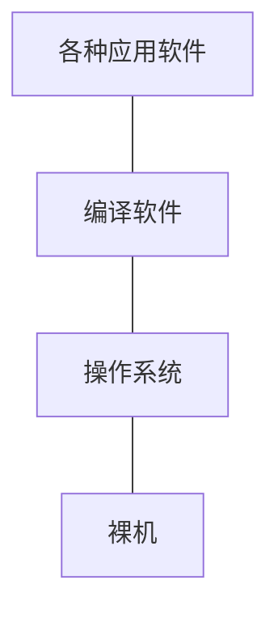
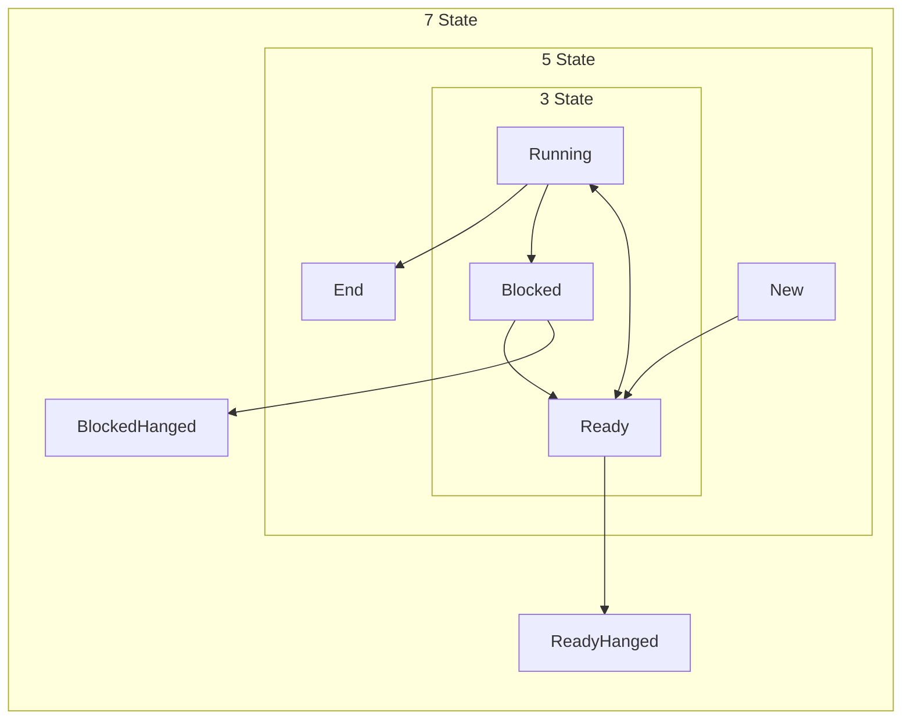

[TOC]


# 操作系统绪论

## 基本概述

### 地位与作用

操作系统是硬件基础上的第一层软件



设计和构建操作系统的基本目标

1.  方便性
2.  有效性
3.  可扩充性
4.  开放性

### 定义


### 功能

有效管理资源的几个工作环节

1.  记录资源使用状况

2.  合理的分配资源

    分配策略有：

    1.  静态分配策略：在资源使用前（甚至在系统运行前）确定好资源的分配。简单易实现，但效率不高，不能按系统运行的实际需求分配资源
    2.  动态分配策略：在程序运行过程中，根据实际需求实施动态分配。高效，但更复杂，且会导致[死锁](#死锁)

3.  回收资源

    利于资源共享

主要功能如下，每个功能有对应的模块

#### 处理器管理

完成对基于处理器运行的进程和线程的管理及调度运行，具体包括进程的创建和控制、进程的同步和互斥、进程间的通信、进程死锁的解决、线程控制和管理 等。

#### 存储管理

重点是内存管理。其功能主要包括4个方面：

1.  分配存储空间
2.  内存空间的共享
3.  地址转换和存储保护
4.  存储扩充

#### I/O设备管理

#### 文件管理

#### 网络管理

#### 用户接口


### 特性

并发性和共享性是现代操作系统中最基本的特性，也是最重要的特性。并发和共享是导致不确定性的根本原因。

#### 并发性

**并发**$\neq$**并行**。并发属于分时共享。并行是指即使在微观上也是多个程序同时运行。

-   宏观上：同时执行
-   微观上：任何时刻只执行一个程序。当前程序执行极短时间后，迅速切换到另一个程序，实现宏观上的同时执行

并发好处：CPU处理速度比I/O设备快得多。所以并发性使得CPU和I/O设备可以同时执行，提高资源利用率。

并发坏处：多个程序并发执行会导致被彼此频繁中断，进程同步、存储保护等问题。

#### 共享性

共享性指计算机系统中的资源可被多个并发执行的程序共同使用。

共享形式分为**顺序性共享**和**竞争性共享**。

-   顺序性共享：轮流使用资源
-   竞争性共享：竞争式使用资源，彼此互斥。

#### 不确定性

不确定性，也对应着异步性、随机性。

系统运行会有许多随机事件，需要操作系统用设置好的处理程序对其进行处理

#### 虚拟性

虚拟性是指在物理上没有提供，但在逻辑上具备的功能。

### 性能评价指标

#### 系统效率

#### 可靠性与安全性

#### 可维护性

#### 易用性

#### 可扩充性

#### 开放性

## 形成与发展

### 硬件发展

早期计算机不支持操作系统，也不需要操作系统。主要原因是性能低下，资源有限。

而后硬件发展，各种设备加入到计算机系统，此时需要也有能力运行操作系统。

### 执行系统阶段

硬件技术在通道引入和中断技术方面获得极大进展

**通道**指一种专用的处理部件，能控制多台外设工作，负责外围设备和内存之间的信息传输。可以与CPU并行工作。

**中断**指当主机接收到信号，或系统中发生随机事件时，会停止当前工作，转而去处理其他事件。处理完成后，再返回断点继续工作。

借助通道和终端，系统的输入输出工作可以在主机的控制下完成：用户的输入输出请求必须通过系统去执行。系统中原本的监督程序功能被扩大，常驻内存，被称为执行系统。

### 多道程序系统阶段

多道程序设计技术主要为了支持系统的并发功能，提高资源利用率、系统吞吐率。

以CPU运行时间资源为例：

资源利用率：CPU实际运行时间$\Large\div$若干任务从开始运行到全部运行结束总用时

系统吞吐率：在一定的时间内能完成的任务数

多道程序负面效应：延长用户响应时间

多道程序设计出现不久后，出现分时系统。多道程序和分时系统的出现标志着现代操作系统的形成。

### 网络操作系统和分布式操作系统等

## 操作系统的结构设计

### 整体式结构

### 层次式结构

全序：各层之间单向依赖，层中各模块也保持独立。

版序：各层之间单向依赖，层内允许互相调用和通信。

### 虚拟机结构

### 客户机/服务器结构

客户机/服务器（Client/Server，C/S）是一种网络概念。

### 微内核结构


# 处理器管理

## 进程

### 定义

具有独立功能的程序关于某个数据集合上的一次运行活动

### 进程的类型和特性

#### 类型

系统进程

用户进程

#### 特性

1.  结构
2.  共享
3.  动态
4.  独立
5.  制约
6.  并发

#### 进程与程序的区别

1.  

### 进程的状态和状态转换

#### 状态

##### 运行态（Running）

##### 就绪态（Ready）

##### 等待态（Blocked）

#### 转换



### 进程控制块

进程控制块（Process Control Block，PCB）是系统为了管理进程设置的一种非常复杂的数据结构，记录了进程几乎所有的特征和参数，是**系统感知进程存在的唯一标识**。PCB 与进程一一对应。

操作系统对所有的 PCB 进行统一管理。**进程没有权限来管理和访问自己的 PCB ，只能由操作系统来管理**。操作系统一般会将所有的 PCB 集中存放在内存的核心段，构成 **PCB表**。**PCB表的长度**代表系统能够并发执行的进程数量，其**上限**称为**系统最大并发度**。

进程控制块PCB包含的内容有以下几个方面：

#### 进程描述信息

进程描述信息中**最重要**的是**进程标识符（PID，Process ID）**。进程标识符在系统中是唯一的，可以用非负整数表示。

进程描述信息还包含**进程名**，它一般基于进程所涉及的程序的可执行文件名。因为进程和程序可能不一一对应，多个进程调用同一个程序时就会重名，所以**进程名在系统中不唯一**。

系统要掌握进程是由哪个用户创建的，还需要获取**用户标识符（UID，User ID）**。

#### 进程控制信息

进程控制信息包含进程状态、进程优先级、代码执行入口地址、程序的外存地址、运行统计信息（如CPU执行时间、占用的内存空间）、进程间的同步和通信信息、等待原因、进程队列指针和消息队列指针等。

#### 进程拥有资源和使用情况

主要包括进程逻辑上虚拟地址空间的使用现状、占用的相关外围设备和使用的数据文件列表等。

#### 进程的CPU进场信息

主要包括进程占用过CPU后CPU寄存器内的值，还有指向赋予该进程的[段表]()、[页表]()的指针。

### 进程上下文

进程上下文（Process Context）由进程自身和所处的运行环境构成。按信息分布分为两部分。

#### 处理器部分信息

又称**寄存器级上下文**，是指当一个进程占用CPU并运行后处理器寄存器现场信息，包含PSW、栈指针、通用寄存器值等。

#### 内存部分信息

可分成以下两部分

1.  系统级上下文。处于内存的核心地址空间。

    静态部分：PCB和资源表格

    动态部分：核心栈（核心过程的栈结构，不同进程在调用相同核心过程时有不同核心栈）

2.  用户级上下文。处于进程的用户地址空间，包括用户程序的代码、数据、栈等。是进程在内存中的主体部分。

#### 上下文切换

多进程并发运行涉及进程的上下文切换（简称进程切换），进程切换包含以下几个步骤：

1.  保存被中断进程的处理器现场信息
2.  修改被中断进程的进程控制块的有关信息，如进程状态等
3.  把被中断进程的进程控制块加入有关队列
4.  选择下一个占有处理器运行的进程，修改其PCB
5.  根据被选中进程，设置操作系统用到的地址转换和存储保护信息
6.  恢复处理器现场，使进程顺利占用 CPU 并运行

### 进程切换与处理器状态切换

根据程序对系统资源和机器指令的使用权限（**操作权限**），将处理器设置为不同的执行模式，又称为**处理器状态**；处于不同处理器状态的CPU允许执行的指令集不一样。

操作系统常将处理器状态划分为**管态**和**目态**。

管态：什么都能执行。又称特权态或系统态。

目态：CPU只允许执行非特权指令。又称普通态或用户态。

从**管态到目态**可以通过<u>设置程序状态字</u>实现；而从**目态到管态**的转换途径是**中断**（因为目态下不能执行<u>设置程序状态字寄存器</u>这样的特权指令）。

处理器状态切换可以在进程执行过程中完成。

## 进程控制

### 进程控制原语

**原语**是指在**管态**下执行的、具有原子性的（不可被打断）、能实现特定系统功能的程序段。

实现原语不被中断：设置中断屏蔽位。

### 进程的创建

以下是Linux的一个创建实例（不是纯正的C语言）。进程并发，输出顺序不定，但一定会有三个输出。

```
#include <stdio.h>
main(){
	int pl,p2,i;
	while((pl=fork( ))==-l);/*创建子进程P1，若为-1表示创建失败，则循环创建直至成功*/
	if (pl==O)	// 返回0表示在子进程中
		for(i=0;i=10;i++)
			printf("daughter %d\n",i);
	else{	// 返回>0表示在父进程中，PID保存的是子进程的ID值
		while((p2=fork( ))==-1);/*创建子进程P2*/
		if(p2==0)
			for(i=0;i=10;i++)
				printf("son %d\n",i);
		else
			for(i=0;i=10;i++)
				printf("parent %d\n",j);
	}
}
```

#### 创建原因

1.  用户提交作业
2.  创建子程序
3.  登陆系统

#### 创建步骤

1.  PCB表中加一项，从PCB池中取一个空白PCB
2.  为新进程分配地址空间，传递环境变量，构造共享地址空间
3.  为新进程分配资源
4.  查找辅存，找到进程的程序代码及数据，并装到用户级上下文的正文区
5.  初始化进程控制块，分配进程标识符、初始化PSW
6.  将进程加入就绪队列
7.  通知操作系统的记账程序、性能监控程序等进行工作。

### 阻塞与唤醒

阻塞：

1.  阻塞原语在进程期待某事件发生，但没有发生时，或所需资源尚不具备时，被该**进程调用来阻塞自己**。
2.  阻塞进程时，先中断处理器，保存该进程的CPU现场信息到PSW
3.  将被阻塞进程置“阻塞”状态后，插入等待队列中
4.  进程调度程序选择新的就绪进程投入运行


唤醒：

1.  系统唤醒进程：系统进程统一控制事件的发生并将事件发生的消息通知等待进程，使得该进程进入就绪队列
2.  事件发生唤醒进程：事件发生进程和被唤醒进程之间是合作关系，唤醒原语既可**被系统进程调用**，也可**被事件发生进程调用**


### 进程的撤销

导致进程被撤销、被终止的情况：

1.  进程已完成所要求的功能而正常终止
2.  由于某种错误导致非正常终止
3.  祖先进程要求撤消某个子孙进程

撤销步骤：

1.  根据进程标识号，从相应队列中找到它的PCB
2.  将该进程拥有的资源归还给父进程或操作系统
3.  若该进程拥有子进程，先撤销子孙进程，以防脱离控制
4.  撤销进程出队，将它的PCB归还到PCB池


### 进程的挂起与激活

**与进程的阻塞、唤醒类似，挂起原语可以由进程自己或由其他进程调用；而激活原语只能由其他进程调用**。

挂起过程：

1.  检查要被挂起进程的状态，若处于就绪态就修改为挂起就绪态，若处于阻塞态，则修改为挂起阻塞态
2.  被挂起进程PCB的非常驻部分交换到磁盘对换区

激活过程：

1.  将进程PCB非常驻部分调进内存，修改状态，挂起等待态改为等待态，挂起就绪态改为就绪态

## 处理器调度

### 调度层次

#### 低级调度

低级调度又称**进程调度**，主要涉及的资源是处理器资源。低级调度按照策略，选择就绪队列中的**进程**（或是多线程系统中的**线程**）调度到处理器上运行。

低级调度是操作系统的处理器调度中最核心的部分，也是执行最频繁的部分。低级调度策略的优劣直接影响整个系统的运行性能。

低级调度使进程在就绪、运行、等待三态之间切换。

#### 中级调度

中级调度又称**平衡负载调度**，主要涉及进程控制中的**挂起和激活**操作，注意涉及的资源是内存资源。

#### 高级调度

高级调度主要设计进程从无到有的**新建**、**从新建到就绪**、**从运行到终止**和**资源回收**这几个阶段。

### 处理器调度原则

1.  

### 处理器调度算法

#### 目标

1.  吞吐率高
2.  尽可能保持忙碌
3.  响应时间和周转时间尽可能短
4.  提高IO设备的资源利用率
5.  服务公平、合理

#### 设计理念

1.  根据特定操作系统设计特定算法
2.  注意系统资源的均衡使用
3.  确保提交的任务在限定时间内完成
4.  尽量缩短任务的平均周转时间

#### 衡量算法性能指标

##### 平均周转时间

假设有$n$个任务，任务$i$（$n,i$下面继续沿用）进入系统的时间点为$S_i$，执行完毕的时间点为$E_i$，则任务$i$周转时间$T_i$为：
$$
T_i=E_i-S_i
$$
这批任务的平均周转时间$T$为
$$
T=\frac{1}{n}\sum_{i=1}^n T_i
$$

##### 平均带权周转时间

在平均周转时间的基础上，加入了CPU实际处理时间参数。

任务$i$的CPU实际处理时间为$r_i$，则任务$i$带权周转时间$T_i$为：
$$
W_i=\frac{T_i}{r_i}
$$
这批任务的平均带权周转时间$W$为
$$
W=\frac{1}{n}\sum_{i=1}^n \frac{T_i}{r_i}=\frac{1}{n}\sum_{i=1}^n (1+\frac{s_i}{r_i})
$$

#### 典型调度算法

##### FCFS（First Come First Serve）先到先服务

按照任务到达系统的时间决定执行顺序。

**优点**：容易实现，较为公平、公平。

**缺点**：大计算量的任务会显著延长小任务等待时间，从效率（平均周转时间）上说不够优秀。

##### SJF（Shortest Job First）最短作业优先 

算法依据唯一参数就是该进程需要CPU执行的时间。

**优点**：从**平均周转时间**来看，**SJF是最优**秀的。

**缺点**：大计算量任务可能迟迟得不到执行。

##### SRTF（Shortest Rest Time First）最短剩余时间优先 

最短作业优先的一个变形方法，是一种**抢占式**的调度算法。当一个任务到达后，其所需要的CPU执行时间**短于**当前在执行的任务剩余时间，那么新任务可以抢占CPU，先执行这个新的任务。

##### HRRN（Highest Response Ratio Next）最高响应比优先

考量FCFS和SJF，FCFS未考虑到任务的体量，导致效率不高；SJF仅仅考虑了小任务，对大任务的处理欠妥，不够公平。最高响应比优先算法能考虑到上述问题。首先给出**响应比$H_i$**公式：
$$
H_i=\frac{T_i}{r_i}=\frac{r_i+w_i}{r_i}=1+\frac{w_i}{r_i}
\\
其中w_i是任务等待的时间
$$
先到的任务如果处理时间较大，可能暂时处于等待，但随着等待时间的增大，其响应比也会增大，得到可能不算太晚的执行机会。

等待时间相同或相近，则处理时间较短的任务响应比相对更大，会优先得到执行。

**优点**：一方面考虑到平均周转时间，一方面兼顾公平、合理、避免任务等待时间过长

##### HPF（Highest Priority First）最高优先级优先

按照任务优先级确定执行次序。优先级的确定有两种典型方案：

1.  静态优先级：在任务执行前就被确定，且不会改变。

2.  动态优先级：由系统根据预设的优先级、任务的CPU执行时间和等待时间等多种因素动态计算获得，可随着任务的执行动态调节。

    动态的考虑因素更全面、灵活，兼顾系统全局性能和用户个体需求。

### 单道环境下的调度

**单道环境工作原理**：内存中只允许存放一个任务（也就是要执行的任务），它独享CPU资源。只有当它运行结束时，下一个任务才能进入内存（所以被执行的任务不会被打断）。

>   例题
>
>   | 任务/算法 | 进入时间 | （估计）运行时间 | 开始时间 | 结束时间 | （平均）周转时间 | （平均）带权周转时间 |
>   | --------- | -------- | ---------------- | -------- | -------- | ---------------- | -------------------- |
>   | 1         | 8:00     | 120              |          |          |                  |                      |
>   | 2         | 8:50     | 50               |          |          |                  |                      |
>   | 3         | 9:00     | 10               |          |          |                  |                      |
>   | 4         | 9:50     | 20               |          |          |                  |                      |
>   | FCFS      |          |                  | 8:00     | 10:00    | 120              | 1                    |
>   |           |          |                  | 10:00    | 10:50    | 120              | 2.4                  |
>   |           |          |                  | 10:50    | 11:00    | 120              | 12                   |
>   |           |          |                  | 11:00    | 11:20    | 90               | 4.5                  |
>   |           |          |                  |          |          | 112.5            | 4.975                |
>   | SJF       |          |                  | 8:00     | 10:00    | 120              | 1                    |
>   |           |          |                  | 10:30    | 11:20    | 150              | 3                    |
>   |           |          |                  | 10:00    | 10:10    | 70               | 7                    |
>   |           |          |                  | 10:10    | 10:30    | 40               | 2                    |
>   |           |          |                  |          |          | 95               | 3.25                 |
>   | HRRN      |          |                  | 8:00     | 10:00    | 120              | 1                    |
>   |           |          |                  | 10:10    | 11:00    | 130              | 2.6                  |
>   |           |          |                  | 10:00    | 10:10    | 70               | 7                    |
>   |           |          |                  | 11:00    | 11:20    | 70               | 3.5                  |
>   |           |          |                  |          |          | 97.5             | 3.525                |
>
>   

### 多道环境下的调度

**多道环境工作原理**：允许多个任务进入内存（n道就允许最多n个任务同时存在于内存中）

1.  高级调度层面：按照某种调度算法，选择进入内存的任务。**一旦被选入内存，在被执行完毕前就不会退出内存（占据一道）**。
2.  低级调度层面：按照某种调度算法，在多道（内存）中选择任务执行。在**道内（内存中）的任务之间可以相互抢占CPU**，即当前任务还未执行完毕，但另有符合调度算法条件的任务在道内，则转而去执行符合调度算法条件的任务。

>   例题
>
>   双道，高级调度：SJF非抢占，低级调度：SRTF抢占
>
>   | 任务 | 到达时间 | 估计运行时间 | 开始时间 | 结束时间 | （平均）周转时间 | （平均）带权周转时间 |
>   | ---- | -------- | ------------ | -------- | -------- | ---------------- | -------------------- |
>   | 1    | 10:00    | 30           | 10:00    | 11:05    | 65               | 2.167                |
>   | 2    | 10:05    | 20           | 10:05    | 10:25    | 20               | 1                    |
>   | 3    | 10:10    | 5            | 10:25    | 10:30    | 20               | 4                    |
>   | 4    | 10:20    | 10           | 10:30    | 10:40    | 20               | 2                    |
>   |      |          |              |          |          | 125              | 9.167                |
>
>   

### 低级调度的方式与算法

实现[低级调度](#低级调度)的程序称为进程调度程序或线程调度程序。低级调度主要完成以下工作：

1.  记录系统中所有进程的执行情况，将进程状态等信息记录在各自的PCB中。根据进程的状态和需求，将它们的PCB排入相应队列。
2.  决定哪个进程使用处理器
3.  决定进程占用处理器多长时间
4.  把处理器分配给进程
5.  收回处理器

#### 低级调度方式

##### 抢占式

比正在运行的进程优先级更高的进程就绪时，可强行剥夺正在运行进程的CPU，提供给具有更高优先级的进程使用，或是当运行进程时间片用完后被剥夺。

##### 非抢占式

某一进程被调度运行后，除非由于它自身的原因不能运行，否则一直运行下去。

#### 低级调度算法

前面介绍的FCFS、SJF、SRTF、HRRN、HPF都是调度算法，还有以下几个代表性算法

##### 时间片轮转调度算法

就绪队列中的每个进程轮流地运行一个时间片。时间片结束时，强迫当前进程让出处理器，等候下一轮调度。

算法可防止很少使用外围设备的进程过长占用处理器，使要使用外围设备的进程有机会去启动外围设备。

轮转法调度是一种剥夺式调度，进程切换开销较大，开销与时间片的大小有关。时间片取值太小，多数进程不能在一个时间片内运行完毕，切换频繁，开销增大；时间片取值太大，随就绪队列里进程数目增加，轮转一次的总时间增大，对每个进程的响应速度放慢了。

时间片大小的确定要从进程个数、切换开销、系统效率和响应时间等方面综合考虑。

##### 性能保证调度算法

对每个任务做出明确的性能保证，然后去实现它。在一个有*n*个进程运行的系统中，保证每个进程获得CPU处理能力的1/*n*。跟踪各个进程自创建以来已经使用了多少CPU时间，根据各个进程应获得的CPU时间，计算实际获得的CPU时间和应获得的CPU时间之比，优先调度比率最低的进程。

###### 彩票调度算法

彩票调度算法是性能保证调度算法的一种具体实现方式。

为每个进程发放一定数量的彩票，调度程序随机选择一张彩票，持有该彩票的进程获得系统资源。如果某些进程需要更多的机会，可被给予更多彩票，增加其中奖机会。算法反应迅速，合作进程还可交换彩票。

## 进程联系

### 顺序进程与顺序环境

顺序程序：指令或语句是顺序的，执行也是顺序的

顺序环境：

1.  程序的指令或语句序列是顺序的
2.  在计算机系统中只有一个程序在运行
3.  一个程序独占系统中所有资源
4.  一个程序执行不受外界影响

顺序特征：

1.  顺序性执行
2.  封闭独占资源
3.  确定可再现性

### 并发环境和并发进程

并发特征：

1.   程序结果的不可再现性
1.  程序的执行呈现间断性
1.  系统中各类资源共享
1.  独立性和制约性
1.  程序和计算不再对应

### 相交进程与无关进程

进程间的关系体现为两种制约

**直接式制约**：两个具有合作关系的进程

**间接式制约**：两个没有合作关系的进程竞争资源

**相交进程**：并发进程在逻辑上有某种联系

**无关进程**：逻辑上无任何联系的并发进程

注意：

-   **<u>直接作用</u>只发生在相交进程之间**
-   **<u>间接作用</u>可以发生在相交进程或无关进程之间**

### 进程同步与进程互斥

直接式制约也称为直接作用、**进程同步**；间接式制约也称为间接作用、**进程互斥**

#### 进程同步

根据一定的时序关系合作完成一项任务

-   并发进程因直接制约而互相等待，彼此相互发送消息进行合作，使得各进程按一定的速度执行
-   进程间的相互联系是**有意识的安排的**，直接作用只发生在相交进程间

#### 进程互斥

各进程竞争使用**临界资源**

**临界资源**：一次只允许一个进程使用的系统资源

-   进程间通过中介发生联系，是无意识安排的
-   可发生在相交进程间，也可发生在无关进程间

## 临界区管理

### 临界区及其使用原则

#### 临界区

进程中**涉及临界资源的程序段**为**临界区**

多个进程的临界区为相关临界区 

#### 使用原则

-   有空让进
-   无空等待
-   多中择一
-   有限等待

### 临界区管理软件方法

#### Dekker算法

<pre>
var inside: array[1..2] of Boolean; 
inside[1]=false; inside[2]=false;
turn: integer; turn=1 or 2;
<table style="margin:0;padding:0;">
    <td>
        <pre>
// 进程1
process P1	
begin
	inside[1]=true;
    while inside[2] do if turn=2 then
    	begin
        	inside[1]=false;
            while turn=2 do begin end;
            inside[1]=true;
        end
    临界区;
    turn = 2；
    inside[1] = false;
end;
    <td>
     	<pre><br/>
// 进程2
process P2
begin
	inside[2]:=true;
    while inside[1] do if turn=1 then
    	begin
        	inside[2]=false;
            while turn=1 do begin end;
            inside[2]=true;
        end
    临界区;
    turn = 1；
    inside[2] = false;
end;
		</pre>
	</td>

### 临界区管理硬件方法

#### TS指令

TS（Test-and-Set，测试并建立）指令定义如下：

```
y=TS(x)
输入x和输出y都是布尔类型。
输出y与x输入时一致，但x会被置为false
e.g.
(1)输入x为false，输出y为false，x本身置为false
(2)输入x为true，输出y为true，x本身置为false
```

下面是硬件利用TS来实现临界区的控制：

```
s代表临界资源状态，由TS指令控制
s : boolean;	s = true;
process Pi        /* i = 1,2,…,n */
     Pi : boolean;
begin
	repeat Pi = TS(s)  until  pi;
    	临界区;
    s = true；
end; 
```

s为true表示临界资源可用。当进程使用临界资源时，s设为false表示不可用，其他进程由于`repeat`在外空转等待。进程使用完毕后再将s设为true，供其他进程使用。

#### 数据交换指令

交换指令将交换两个 字的内容

公共变量lock决定临界区是否上锁

每个进程的私有变量key用于与lock交换

```
void SWAP(int *a, int *b){
	int temp; 
	temp = *a;
	*a = *b;
	*b = temp;
}

key = true;
do {
	SWAP(&lock,key); 
}while(key);
临界区
lock = false;

```

#### 开关中断指令

进入临界区前执行“  关中断” 指令

离开临界区后，执行“  开中断” 指令

控制进程互斥进入临界区

### 软硬件方法的优缺点

1.  软硬件方法都采用了忙等待方式
2.  软件方法实现复杂，需要编程技巧
3.  硬件指令方法代码简洁有效
4.  硬件中断屏蔽方法代价较高

## 信号量与P/V操作

为了有效、高效地处理进程的同步与互斥，聪明的荷兰人，图灵奖获得者，Edsger Wybe Dijkstra 提出了信号量（Semaphore）和P/V（Problem/Verhogen）操作机制。

### 信号量

信号量是个很简单的结构体，里面有一个整型信号量值（以下简称s值）和一个指向进程等待队列的指针

```
Struct semaphore{
	int value;			// 信号量值
	pointer_PCB queue;	// 队列指针
}
```

s 值必须设置且只能设置一次初值，**初值是非负整数**。**只有 P/V 操作能操作信号量**。

### P/V操作

**每个进程试图使用临界区时，都要先执行 P 操作，使用完毕后，再执行 V 操作。P/V操作一定是成对的**

#### P 操作

1.  先将 s 值做减 1 操作
2.  若 s 值＜0，系统将执行P操作的进程加入 s.queue 指向的等待队列
3.  若 s 值 ≥ 0，无事发生，进程正常运行。

```
P(s){
	s.value -= 1;
	if(s.value<0){
		将进程置为等待态，并将其加入s.queue指向的等待队列
	}
}
```

#### V 操作

1.  先将 s 值做加 1 操作
2.  若 s 值 ≤ 0，系统从 s.queue 指向的等待队列中唤醒某个进程。
3.  若 s 值＞0，无事发生。

```
V(s){
	s.value += 1;
	if(s.value<=0){
		从 s.queue 指向的等待队列中唤醒某个进程，使其进入就绪队列
	}
}
```

### 运用信号量和P/V解决问题

#### 进程互斥

把 s 值比作停车场空位，其有一个上限（初值）。车辆对停车场的使用就是一个个进程里的临界区，停车场的车位就是它们的临界资源。

停车场有空位时，车辆才可以停进来。停车场里的车随时都能开走。

当有一辆车想进场停车时，先进行 P 操作，尝试一下，s 值 - 1。若 s 值 ≥ 0，说明这辆车停进来之后，仍有余位/刚好停满，则允许车辆进入。若 s 值 < 0，说明停车场已经停满，并且说不定还有其他车辆也在等着进场。所以这辆车要去等待队列里等着。此时，**s 值的绝对值就是等待队列里的进程数**。

当一辆车在停车场里停够了，离开停车场，执行 V 操作，s 值 + 1。若 s 值＞0，说明这辆车走后，停车场空位至少为1，说明原本s 值为0，无车辆等待。若 s 值 <= 0，说明这辆车走之前，等待队列不为空，则需要通知等待队列里的某辆车让它活动起来。

#### 进程同步

>   经典的生产者和消费者问题：
>
>   现有生产者，消费者以及一个缓冲区。生产者每次向缓冲区投入1单位产品；消费者每次从缓冲区取1单位产品；缓冲区上限为1单位，有产品时生产者放不进，无产品时消费者拿不走。

<pre>
	empty:semaphore;	empty.value=1;
	full:semaphore;		full.value=0;
<table style="margin:0;padding:0;">
    <td>
        <pre>
process Productor
	begin
		P(empty)
		Buffer operation
		V(full)
	end
    <td>
     	<pre><br/>
process Customer
	begin
		P(full)
		Buffer operation
		V(empty)
	end
		</pre>
	</td>

### P/V的使用规律

-   解决**进程互斥**：针对同一信号量的P/V操作存在于**同一进程**。
-   解决**进程同步**：针对同一信号量的P/V操作存在于**不同进程**。

### 经典进程同步问题

#### 多进程、多消费者共享多缓冲区

问题描述：

多生产者向多个缓冲区内写入数据，多消费者从多缓冲区取出数据。为避免重写/读，所以所有生产者和消费者之间都需要互斥。

伪代码如下

<div>
<pre>
var B:array[0...k-1] of item;
in,out:int;
in=0;out=0;
empty,full,lock:semaphore;
empty.value=k;
full.value=0;
lock.value=1;
cobegin	
</pre>
<table>
    <td>
        <pre>
process Productors
	begin
		L1:生产产品;
		<strong>P(empty);
		P(lock);</strong>
		放置产品;
		V(lock);
		V(full);
		Goto L1;
	end
		</pre>
    <td>
     	<pre>
process Customers
	begin
		<strong>L2:P(full);
		P(lock);</strong>
		取走产品;
		V(lock);
		V(empty);
		Goto L2;
	end
		</pre>
	</td>
</table>
    <pre>
coend
    </pre>
</div>


根据P/V的使用规律，同步P要在互斥P之前。如果反过来，在下面两种场景下会出现[死锁](#死锁)。

1.  场景1：缓冲区已经写满。此时再有生产者写入时，先占据lock，然后被列入等待队列，需要等消费者来取数据；但此时消费者想取数据时，lock已经被占据，无法取数据，被列入等待队列。因此进程死锁。
2.  场景2：缓冲区为空。此时有消费者来取数据，先占据lock，然后被列入等待队列，需要等生产者来送数据；但此时生产者想写数据时，lock已经被占据，无法写数据，被列入等待队列。因此进程死锁。

#### 苹果——桔子问题

问题描述：

桌上有一个盘子，爸爸只会往盘子里放苹果，妈妈只会往盘子里放桔子。儿子只取/吃桔子，女儿只取/吃苹果。

<pre>
plate,apple,orange:semaphore;
plate.value=1;
apple.value=0;
orange.value=0;
</pre>
<table>
    <tr>
    	<td>
        	<pre>
process father
begin
	L1:P(plate);
	放苹果;
	V(apple);
	goto L1;
end
        	</pre>
        </td>
        <td>
        	<pre>
process mother
begin
	L1:P(plate);
	放桔子;
	V(orange);
	goto L1;
end
        	</pre>
        </td>
    </tr>
    <tr>
    	<td>
        	<pre>
process son
begin
	L1:P(orange);
	吃桔子;
	V(plate);
	goto L1;
end
        	</pre>
        </td>
        <td>
        	<pre>
process daughter
begin
	L1:P(apple);
	吃苹果;
	V(plate);
	goto L1;
end
        	</pre>
        </td>
    </tr>
</table>
### 经典进程互斥问题

#### 哲学家就餐问题

问题描述：

若干哲学家围坐在圆桌旁，两两之间放一根筷子。哲学家们各自不定时就餐，且需要获得左右的筷子才能就餐。

>   原问题是哲学家之间放叉子，这里做了本土化改良。

先来看看一般的P/V操作：

```
// 假设有n位哲学家和n根筷子，定义信号量数组stick[i]（i=0,1,..n-1）。i号哲学家左手边筷子是stick[i]，右手边筷子是stick[(i+1) mod n]
var stick[i]:aray[0...n] of semaphore;
stick[i]=1;
cobegin
	process Pi
		begin
			while(true)
                begin
                	P(stick[i]);
                	P(stick[(i+1) mod n]);
                	就餐;
					V(stick[i]);
                	V(stick[(i+1) mod n]);
                end
		end
coend
```

一般情况下，这样似乎没什么问题。一个哲学家要吃饭，就得等相邻哲学家吃完释放筷子才行。

但是，如果n位哲学家同时要吃饭呢？

那么很有可能，根据哲学家们的代码，他们同时拿起了左手筷子（这时是没有哲学家阻塞的，因为每个人的左手筷子都可用），然后尝试拿右手筷子。问题就在这了，每个人的右手筷子都是右边哲学家的左手筷子（刚刚被拿起来了！），大家都缺右手筷子，没人能吃饭从而放下自己的左筷子给其他人当右筷子用，所以没有哲学家能吃饭。哲学家们就这样被[死锁](#死锁)了。

怎么解决呢？有这么几个办法：

1.  规定，最多只有n-1位哲学家能同时请求吃饭（拿起左手筷子）。这样至少有一位哲学家是能吃饭的，从而把筷子释放出来给别人用。
2.  按哲学家的编号限定取叉子的规则。比如，奇数号哲学家先拿左手筷子，偶数号哲学家先拿右手筷子。
3.  改变规则，要求哲学家要么同时拿起左右两支筷子，要么一支也不拿。（防止P(stick[i]) 和 P(stick[(i+1) mod n])之间中断）
4.  设定优先级，当同时需要使用同一支筷子时，优先级低的让优先级高的使用，自己阻塞。优先级高的使用完了再唤醒优先级低的哲学家。*——这个办法对比上面几个似乎有些不公平。*

####  读者与写者问题

问题描述：

若干写者和读者共享一个文件。文件可以被若干读者同时阅读。只要有一个读者在读或者有其它写者在写，写者就不能写文件。即**读者之间不互斥，但读者和写者，写者和写者之间是互斥的**。

<div>
<pre>
int rc = 0;
semaphore r,w;
r.value=w.value=1;
cobegin	
</pre>
<table>
    <td>
        <pre>
process Readers
	begin
		P(r);
		rc=rc+1;
		if(rc==1) 
			P(w);
		v(r);
		Reading file;
		P(r);
		rc=rc-1;
		if(rc==0)
			V(w);
		V(r);
	end
		</pre>
    <td>
     	<pre>
process Writers
	begin
		P(w);
		Write file;
		V(w);
	end
		</pre>
	</td>
</table>
    <pre>
coend
    </pre>
</div>

这里写者没什么要讲的，主要来分析一下读者代码。

这里利用一个读者计数器 rc 来统计当前在读的读者数量。如果至少有一个读者那么就要把写者锁住；如果没有读者了就把写者解锁。乍一看读者的两套P/V(r)操作似乎有些多余，毕竟读者之间不是不互斥的吗？但要注意，读者们都要修改一个变量rc，众所周知不能允许多个读者同时修改 rc。所以一个读者修改 rc，其它读者就要等一等。

## 进程通信

### 进程通信的概念与类型

#### 通信分类

1.  低级通信。代表是**[信号通信](#低级通信——信号通信)**，主要传递简单信号。比如信号量控制。
2.  高级通信。支持大批量数据传送，传送的是各种有实际意义的数据。

#### 通信方式

1.  主从式通信

    进程分为主进程和从进程，**主从进程地位不对等**。主进程自由使用从进程的资源，从进程的允许受主进程约束。

2.  会话式通信

    例如用户进程和服务进程之间的通信。用户进程在得到服务进程的许可后，可以调用服务进程提供的服务。这种一来一往的通信就是会话式通信。

3.  基于消息队列、邮箱、共享缓冲区的通信

    在发送进程和接收进程之间设置消息队列、邮箱、共享缓冲区等中介，利用中介来传递信息。**进程间地位平等**。

上述通信方式可总结为**直接通信**和**间接通信**：

1.  直接通信：发送方直接把信息发送给接收方。发送时，发送方需要知道接收方的地址或标识。如果是广播式通信就不必知道了。
2.  间接通信：收发方借助各自进程以外的中介来通信。对于发送方和接收方需要知道如何找到中介，而不需要知道接收方/发送方的地址或标识。

#### 数据格式

1.  字节格式：以字节为单位发送数据。接收方不保留各次发送之间的分界。
2.  报文格式：每次发送数据是以报文为单位，报文之间有明显分界；报文可以是定长或不定长的；报文通信可以是可靠的或不可靠的。

#### 同步方式

1.  阻塞操作：指操作方要等待操作结束
2.  不阻塞操作：指操作提交后立即返回

### 低级通信——信号通信

#### 机制原理

-   每个信号都对应正整数常量，即信号编号
-   进程之间传送事先约定的信息的类型，用于通知进程发生了某异常事件
-   进程通过信号机制来检查是否有信号。若有，中断正在执行的程序，转向对应的处理程序；结束后返回到断点继续执行，这是一种软中断

#### 信号收发

-   发送信号，发送信号的程序用系统调用kill( )实现
-   预置信号处理，接收信号的程序用signal( )来实现对处理方式的调用
-   接收信号的进程按事先规定完成对事件的处理

#### 信号机制与中断机制异同

信号机制类似中断机制，所以也叫**软中断**。

相似点：

1.  有相同的异步通信方式。检测到信号或中断请求时，都会暂停正在执行的程序，转而执行处理程序，处理完再回断点运行。
2.  信号和中断都可以被屏蔽。

不同点：

1.  大部分系统中，信号没有优先级，信号是平等的；而中断有优先级。
2.  信号处理程序一般在目态中运行，而中断处理程序一般在管态下运行
3.  信号响应延迟较大，而中断响应延迟较小

#### 信号通信实例

```
/*发送信号。参数意义如下：
pid>0，向进程pid发送信号；
pid=0，向同组所有进程发送信号；
pid=-1，向所有与发送进程有相同效用户标识符的进程发送信号
*/
int kill(pid,sig)

/*接收信号后处理。参数意义如下：
function=1，屏蔽信号，不做处理；
function=0，收到sig信号后终止自己；
else，function值作为信号处理程序指针
*/
signal(sig,function)
```

<center>Linux软中断信号含义表</center>

| **值** | **名   字** | **说     明**                                      |
| ------ | ----------- | -------------------------------------------------- |
| **01** | **SIGHUP**  | **挂起**                                           |
| **02** | **SIGINT**  | **中断，当用户从键盘按\^c键或\^break键时**         |
| **03** | **SIGQUIT** | **退出，当用户从键盘按quit键时**                   |
| **04** | **SIGILL**  | **非法指令**                                       |
| **05** | **SIGTRAP** | **跟踪陷阱，启动进程，跟踪代码的执行**             |
| **06** | **SIGIOT**  | **IOT指令**                                        |
| **07** | **SIGEMT**  | **EMT指令**                                        |
| **08** | **SIGFPE**  | **浮点运算溢出**                                   |
| **09** | **SIGKILL** | **杀死、终止进程**                                 |
| **10** | **SIGBUS**  | **总线错误**                                       |
| **11** | **SIGSEGV** | **段违例，进程试图去访问其虚地址空间以外的位置**   |
| **12** | **SIGSYS**  | **系统调用中参数错，如系统调用号非法**             |
| **13** | **SIGPIPE** | **向某个非读管道中写入数据**                       |
| **14** | **SIGALRM** | **闹钟。当某进程希望在某时间后接收信号时发此信号** |
| **15** | **SIGTERM** | **软件终止**                                       |
| **16** | **SIGUSR1** | **用户自定义信号1**                                |
| **17** | **SIGUSR2** | **用户自定义信号2**                                |
| **18** | **SIGCLD**  | **某个子进程死**                                   |
| **19** | **SIGPWR**  | **电源故障**                                       |


>   创建两个子进程，父进程捕捉键盘上来的按下^c键的中断信号
>
>   捕捉到中断信号后，父进程用系统调用kill( )向两个子进程发出信号，子进程捕捉到信号后分别输出下列信息后终止：   Child process1 is killed by parent!
>
>   Child process2 is killed by parent!
>
>   父进程等两个子进程终止后，输出如下的信息后终止：                 
>
>   Parent process is killed!
>
>   ```c
>   /*一个例子*/
>   #include <stdio.h>
>   #include <signal.h>
>   #include <unistd.h>
>   void waiting( ),stop( );
>   int wait_mark;
>   void main( ){
>       int p1,p2,stdout;
>       signal(SIGINT,SIG_IGN);       /*防止control-C 键盘中断*/
>       while((p1=fork( ))==-1);           /*创建子进程p1*/
>       if (p1>0){
>           // 父进程
>           while((p2=fork( ))==-1);            /*创建子进程p2*/
>           if(p2>0){
>               // 父进程
>               wait_mark=1;
>               signal(SIGINT,stop);                 /*接收到^c信号，转stop*/
>               waiting( );
>               kill(p1,16);                                  /*向p1发软中断信号16*/
>               kill(p2,17);                                  /*向p2发软中断信号17*/
>               wait(0);                                      /*同步*/
>               wait(0);
>               printf("Parent process is killed!\n");
>               exit(0);
>           }else{
>               // p2进程
>               wait_mark=1;
>               signal(17,stop);   /*接收到软中断信号17，转stop*/
>               waiting( );
>               printf("Child process 2 is killed by parent!\n");
>               exit(0);
>           }
>       }
>       else{
>           // p1进程
>           wait_mark=1;
>           signal(16,stop);	        /*接收到软中断信号16，转stop*/
>           waiting( );
>           printf("Child process 1 is killed by parent!\n");
>           exit(0);
>       }   
>   }
>   
>   void waiting( ){
>       while(wait_mark!=0);
>   }
>   
>   void stop( ){
>       wait_mark=0;
>   }
>   ```
>
>   

### 高级通信——共享存储

#### 机制原理

-   共享存储区是系统中通信速度最高的一种通信机制
-   进程通过对共享存储区中数据的读、写来进行通信


```
/* 创建、获得一个共享存储区。
系统调用格式：shmid=shmget(key,size,flag)
key是共享存储区的名字
size是其大小（以字节计）
flag是用户设置的标志
*/
shmget()

/* 共享存储区附接，将共享存储区附接进程虚拟地址空间
系统调用格式：  virtaddr=shmat(shmid,addr,flag)
shmid是共享存储区的标识符
addr是用户给定，将共享存储区附接到进程的虚地址空间
flag规定读、写权限，值为0时，表示可读、可写
返回值是共享存储区所附接到的进程虚地址viraddr
*/
shmat()


/*把共享存储区从进程虚地址空间断开
系统调用格式：shmdt(addr)
addr是要断开连接的虚地址，即由shmat()所返回的虚地址
调用成功，返回0值，调用不成功，返回-1
*/
shmdt()

/*共享存储区的控制，对其状态进行读取和修改
系统调用格式：shmctl(shmid,cmd,buf)
buf是用户缓冲区地址， cmd是操作命令：
用于查询共享存储区的情况，如长度、连接进程数、共享区的创建者标识符等
用于设置或改变共享存储区的属性，如共享存储区的许可权、连接进程计数等；
共享存储区的加锁和解锁，删除共享存储区标识符等。
*/
shmctl( )
```

#### 例子

>   进程利用fork()创建两个子进程server和client进行通信。
>
>   client端建立或打开一个key为75的共享区，client填入9到0，client每发送一次数据后显示“(client)sent”。
>
>   server端建立或打开一个key为75的共享区，等待其他进程发来的消息，server每接收到一次数据后显示“(server)received”。
>
>   ```c
>   #include <sys/types.h>
>   #include <sys/shm.h>
>   #include <sys/ipc.h>
>   #define  SHMKEY  75
>   int  shmid,i;   
>   int  *addr;
>   void main( )
>   {
>      while ((i=fork( ))==-1);
>      if (!i) 
>          server( );
>      system(“ipcs  -m”);
>      while ((i=fork( ))= =-1);
>      if (!i) 
>          client( );
>      wait(0);
>      wait(0);
>   }
>   
>   void  server( ){
>       int x;
>   	shmid=shmget(SHMKEY,1024,0777|IPC_CREAT); /*创建共享存储区*/
>   	addr=shmat(shmid,0,0);                   /*获取首地址*/
>   	do{
>      		*addr=-1;
>        	while (*addr==-1);
>        	x=*addr
>        	printf("(server) received\n");
>   	}while (*addr);
>   	shmctl(shmid,IPC_RMID,0);              /*撤消共享存储区，归还资源*/
>   	exit(0);
>   }
>   
>   void  client( ){  
>       int i;
>   	shmid=shmget(SHMKEY,1024,0777 |IPC_CREAT);  /*打开共享存储区*/
>   	addr=shmat(shmid,0,0);                      /*获得共享存储区首地址*/
>   	for (i=9;i>=0;i--){  
>           while (*addr!=-1);
>        	printf("(client) sent\n");
>        	*addr=i;
>    	}
>   	exit(0);
>   }
>   
>   ```
>
>   

### 高级通信——消息通信

#### 机制原理

-   消息是一个格式化的可变长信息单元
-   消息通信机制允许由进程给其他进程发送消息
-   进程收到多个消息时，可排成消息队列
-   消息队列有消息队列描述符方便用户和系统访问


### 高级通信——管道通信

#### 机制原理

-   管道是连接写进程和读进程的、并允许以生产者-消费者方式进行通信的共享文件，称为pipe文件
-   由写进程从管道的写入端将数据写入管道，而读进程则从管道的读出端读出数据


#### 管道类型

-   有名管道：在文件系统中长期存在的、具有路径名的文件，用系统调用mknod( )建立，其他进程可以利用路径名来访问该文件，与访问其他文件相似。
-   无名管道：利用pipe( )建立起来临时的无名文件，用该系统调用返回的文件描述符来标识该文件，只有调用pipe( )的进程及其子孙进程才能识别此文件描述符并利用该管道进行通信。

## 进程死锁

### 死锁概念

**死锁**：系统中多个进程**无限期地等待**永远不会满足的条件，处于停滞状态，称为进程死锁

申请同类资源或多类资源都有可能导致死锁。例子如下：

>   申请同类资源：
>
>   内存总量为2单位。A，B两个进程最终各需2单位内存来完成任务。
>
>   若按顺序执行，则相安无事。若并发执行，先给A、B各分配了1单位内存。此时A，B已经把内存占满，都无法继续执行，且都在等对方执行完毕释放内存，造成死锁。
>
>   ------
>
>   申请多类资源：
>
>   资源M，资源N各只有1单位。
>
>   <table>
>      <td>
>          <pre>
>          process A
>          begin
>          	P(M);
>          	P(N);
>          	running A;
>          	V(M);
>          	V(N);
>          end
>          </pre>
>      </td>
>      <td>
>          <pre>
>          process B
>          begin
>          	P(N);
>          	P(M);
>          	running B;
>          	V(N);
>          	V(M);
>          end
>          </pre>
>      </td>
>   </table>
>
>   如上代码所示，进程A、B并发执行很可能造成A等B释放N，B等A释放M的死锁局面。
>

### 发生死锁必要条件

产生死锁的4个==必要条件==（不是充要条件）

1.  互斥使用（资源独占）：资源每次只能给一个进程使用
2.  不可强占（不可剥夺）：资源申请者不能强行从占有者手中夺取资源，只能由占有者自愿释放
3.  请求且保持（部分分配，占有申请）：进程在申请新资源的同时保持对原有资源的占有
4.  循环等待：存在进程等待队列 {P1 , P2 , … , Pn}，P1等待P2所占资源，P2等待P3所占资源，…，Pn等待P1所占资源，形成环路

### 进程死锁的预防机制（静态分配策略）

针对产生死锁的4个必要条件中的3个（互斥使用是并发的基础，不可改变），破坏产生条件，从而避免死锁。

1.  破坏“不可剥夺”

    在进程得不到所需资源进入等待态时，释放它已占有的资源。

2.  破坏“请求且保持”

    要求进程在运行前一次性申请所有需要的资源，系统在能满足其所有需求的情况下一次性全都分配给进程。

3.  破坏“循环等待”

    给系统中所有资源编号。要求所有进程在申请资源时，按编号从小到大的次序申请所需资源。违反者不予分配。

进程的预防机制从理论上可以避免死锁，但会造成效率降低。

### 进程死锁的避免机制（动态分配策略）

死锁避免机制是指在系统运行前不做硬性规定，在运行过程中对进程的每一次资源申请进行动态检查，若符合安全状态（不会导致死锁的状态），则予以分配，否则不予分配。

银行家算法是避免机制的典型算法（该算法也是由提出信号量与P/V操作机制的*Edsger Wybe Dijkstra*提出的），其核心思想如下：

以单种资源为例

1.  进程申请的资源不能超过系统资源最大持有量。
2.  记系统中当前能分配的资源量为$R$，并发运行的进程数（包含正申请资源的进程）为$n$，对应的进程需要的资源总量为$E_i$，当前占用资源量为$C_i$，剩余需要的资源量为$A_i$，$E_i=C_i+A_i$
3.  若能找到一组这样的进程序列$P_1,P_2,..,P_n$，使得$R\geq A_1,R+C_1\geq A_2,R+C_1+C_2\geq A_3,...,R+\sum_{k=1}^{i}C_k\geq A_{i+1}(0<i<n)$，则为申请资源的进程分配资源后是安全状态，满足资源申请；若找不到这样的序列，则说明为该进程分配资源会陷入不安全状态，遂拒绝资源申请。

简单来说，系统就是银行，资源就是钱，进程的资源申请就是向系统借贷，进程需要的资源总量就是本次借贷额度（额度当然不能超过银行的最大库存，即资源总量；但可以超过银行当前的流动资金，因为银行可以收贷回收流动资金）。当银行实际放贷未达到额度时，进程不会还贷；当实际放贷达到额度后，进程会在某个时候还贷，或许不是立刻，但肯定不是无期限地等待。于是银行可以利用进程还贷后回流的资金对其它进程放贷，使得资金不断流转，最终使每个进程都得偿所愿。
每当有进程申请资源时，系统就会假设将其加入贷方。如果在一开始，或者某次资金回流后，银行的流动资金无法满足任何一个进程的需求（剩余需要的资源量）则这个系统就无法进行资金流转，即死锁。那么系统判定这个进程的加入会造成不安全状态，拒绝借贷（资源申请）。

做题流程及格式

1、根据题目条件，列出各进程表格

|      | MAX（需要的最大资源） | Allocation（已经为进程分配的资源） | Need（MAX-Allocation,还需要的资源） |
| ---- | --------------------- | ---------------------------------- | ----------------------------------- |
| p1   |                       |                                    |                                     |
| p2   |                       |                                    |                                     |
| p3   |                       |                                    |                                     |

2、按银行家算法，找到（或找不到）一条安全序列。第一行Work是起始可分配资源，Work+Allocation代表程序在投入资源且可以运行完毕后，你拥有的可分配资源。

|      | Work（可分配资源） | Allocation（已经为进程分配的资源） | Work+Allocation | Finish:boolean |
| ---- | ------------------ | ---------------------------------- | --------------- | -------------- |
| p1   |                    |                                    |                 |                |
| p2   |                    |                                    |                 |                |
| p3   |                    |                                    |                 |                |

### 做题公式

$$
假设系统中总可分配资源量为M，现有n个进程抢占系统资源，它们的最大需求量都为x。
\\
则为避免死锁，它们之间的关系应为
\\
n*(x-1)≤M-1
$$


### 进程死锁检测与解决

机制原理

-   允许死锁发生
-   系统不断监视进展情况，判断死锁是否发生
-   一旦死锁发生则采取专门的措施，解除死锁并以最小的代价恢复运行

检测时机

定时检测、进程等待时、资源利用率下降时等

检测手段

进程-资源分配图 

#### 死锁检测


检测模型

-   方框表示资源类。比如R1框就代表R1类资源
-   黑圆点表示资源实例。圆点个数表示该类资源的总数
-   圆圈中加进程名表示进程
-   资源实例指向进程的一条有向边来表示**分配边**
-   进程指向资源类的一条有向边来表示**申请边**

检测“进程-资源分配图”是否可完全简化

1.  ①找一个只有分配边的非孤立进程结点，去掉分配边将其变为孤立结点；若找不到则转③
2.  ②将资源分配给一个等待资源的进程，将某进程的申请边变为分配边，转①
3.  ③图中有进程不是孤立结点，则此图不可完全简化，满足死锁的充分条件，系统为死锁状态

#### 死锁解除

##### 资源剥夺法

从其他进程那里剥夺足够数量的资源给死锁进程，以解除死锁状态

##### 撤销进程法

-   撤消全部死锁进程，恢复到正常状态，简单但代价太大
-   按照某种顺序逐个撤消死锁进程，直到有足够的资源供其他未被撤消的进程使用，以消除死锁状态

### 死锁原因

-   系统资源不足
-   进程运行推进的顺序不合适
-   资源分配不当

**解决原则**

-   单独使用死锁预防、避免、检测与解除并不能全面解决操作系统中遇到的所有死锁问题
-   可将系统中的进程、资源分为若干类，对每一类进程、资源使用最适合它的办法解决死锁

# 存储管理

本章重点关注内存。一般来说，许多操作系统再系统运行时会把内存分为系统区和用户区两个部分，这两个部分互不干扰。

## 基本概述

### 存储管理目标及任务

1.  实现内存空间的分配和回收。
2.  地址转换（地址重定位、地址映射），实现逻辑地址到物理地址的自动转换。代码的逻辑起始地址都是0
3.  实现多个进程间的信息共享与通信。
4.  实现多个进程隔离和信息保护。
5.  实现内存和辅存空间的协同使用。

将进程的相关程序和数据调入内存时，有两种方式：

1.  静态分配

    在编译生成可执行程序的过程中实现物理地址的分配，每一行指令的地址为装载到内存中的物理地址。

2.  动态分配

    在程序调入内存执行的时候，动态地给相关指令、数据分配存储空间并指定物理地址。

### 连续存储区管理方案

用户区仅允许一个进程存在，此时这个进程占据系统中全部资源，因此资源利用率低下。

在多用户任务的情况下，装入程序负责将其中一个任务的程序、数据装入用户区；在任务执行完毕后，再将另一个任务的程序、数据装入用户区。

系统利用**栅栏寄存器**用以隔离操作系统区和用户区的**界线地址**。在装载过程中，一种方式是将操作系统区置于内存的低地址区域，用户区置于高地址区域。此时用户进程将**界限地址**作为起始地址，将程序中的逻辑地址转换为物理地址；另一种方式是反过来，用户区在低地址，操作系统区在高地址。此时逻辑地址和物理地址都是从0开始编址，所以无需地址转换。

### 分区存储的管理方案

将用户区进一步划分为多个区域，每个区域称为一个分区，以支持多道程序的并发执行。

**每个分区只存放一个进程，一个进程也只能存放在一个分区内。**

#### 固定分区存储管理方案

用户区空间被预先划分成若干个连续的分区，每个分区可以是相同大小的，也可以有大有小。但不管怎样，**分区大小**被划分后就**固定不变**了。

进程利用下限寄存器提供的分区下限地址将逻辑地址转换为绝对地址（即物理地址）；上限寄存器提供分区上限地址，主要用于防止进程在访问内存单元时发生地址越界。一旦进程尝试访问其所在分区外的内存单元，系统会立刻发生越界中断，并拒绝该进程的非法操作。

如果设置所有分区都同样大小，那么容易造成有的进程需求过大，没有分区能满足；或是对于部分进程，内存有较多闲置。所以一般采用**不等长的固定内存分区**，即所有分区有大有小，满足不同进程的需求，减少内存资源的浪费。

不等长的固定分区方案依赖一张内存分配表来实现内存的存储和分配。

1.  分区号：唯一标识某一个用户分区
2.  起始地址：标识该分区从内存的哪一个单元开始
3.  长度：该分区的容量大小
4.  状态：标识该分区是否以及分配给某个进程，或是处于空闲状态
5.  进程号，唯一标识某一个占用该分区的进程

当然，即使是不等长的固定分区，内存的利用率仍然不高，浪费仍然存在，也不够灵活，特别是进程要动态申请更多空间时，系统难以（无法）满足。

#### 可变分区存储管理方案

与固定分区存储管理方案不同的是，内存没有被预先划分，而是当进程装入内存时，根据实际需求和内存空间的使用情况来决定是否分配和如何分配内存空间给进程。

可变分区存储管理方案需要两张内存资源管理表

1.  空闲区表：记录内存中处于空闲状态区域的起始地址和长度
2.  已分配区表：记录内存中以及分配给进程区域的起始地址和长度，并指出占用的进程

内存资源回收时则要注意与上下空闲区的合并问题。

对内存多次的分配和回收会产生大大小小不连续的空闲块，它们可能无法独自容纳一个程序，但是合起来可以满足内存的需求。

解决这种内存碎片的典型方案是通过采用**紧凑技术**将内存中存储的内容进行合理的移动、整合，将多个不连续的空闲区合并成一个连续的大容量空闲区。

### 存储覆盖与交换技术

**引入原因**：多道环境下扩充内存，解决在较小的存储空间中运行较大、较多进程时的矛盾。进程的程序和数据主要放在外存，需要执行的部分放在内存，内外存之间进行信息交换。

#### 覆盖技术

-   进程若干程序段、数据段等共享同一存储空间
-   要求模块之间有明确调用结构，并向系统指明


#### 交换技术

-   多个进程分时共享内存储空间
-   进程在内、外存之间动态调度
-   需要在辅存设置一个盘交换区

### 分配与释放算法

#### 分配算法

##### 首次适应算法（First Fit）

该算法的特点是优先利用内存低地址部分的空闲分区，从而保留了内存高地址部分的大空闲区。但由于低地址部分不断被划分，致使低地址端留下许多难以利用的小闲区。而每次查找又都是从低地址部分开始，这无疑增加查找可用空闲区的开销。

##### 循环首次适应算法（Next Fit）

又称下次适应算法，它是首次适应算法的变形。该算法在进程分配内存空间时不再每次从未分配区表（或空闲区链）开始位置查找，而是从上次找到的空闲区的空闲区开始查找，直到找到第一个能满足其大小要求的空闲区为止。然后，再按照作业大小,从该分区中划出一块内存空间分配给请求者，余下的空闲区仍然留在未分配区表（或空闲区链）中。

##### 最佳适应算法（Best Fit）

最佳适应算法的特点是若存在与作业大小致的空闲区，则它必然被选中；若不存在与作业大小一致的空闲区，则只划分比作业稍大的空闲区，从而保留了大的空闲区。但空闲区般不可能正好和作业申请的内存空间大小一样，因此分成两部分时，往往使剩下的空闲区非常小。从而再存储器中留下许多难以利用的小空闲区。

##### 最坏适应算法（Worst Fit）

最坏适应算法要求空闲区按容量大小递减的次序排列，进行内存分配时，先检查未分配区表（或空困区)中的第一个空闲区。若第一个空闲区小于作业所要求的大小，则分配失败；否则从该空闲区中划出与作业大小相等的一块内存分配给请求者，余下的空闲区仍然留在未分配区表(或空闲区链）中。

### 存储保护技术


## 分页存储管理机制

既然分区管理容易产生碎片，于是就有分页这种碎片化管理的机制。

### 逻辑页面与物理页框

#### 逻辑页面

进程的逻辑地址按固定大小分为若干等大的**页面**，不足一页的补足一页，并编**页号**。每一页的大小称为**页长（块长）**

比如，某逻辑地址由32位组成，前20位表示页号，后12位表示页内地址。那么就意味着逻辑地址最多有2^20^个页面，每一页大小为2^12^B=4KB

#### 物理页框

内存被分为许多个大小相同**物理页框（也叫做物理块）**，每个物理页框都有自己的编号。**物理页框的大小与页长一致**。物理页框通常只有4、8、16KB。

与固定分区管理机制最大的差别在于，不仅内存分块，进程本身也要分块（这两个块是一样大的）。进程按块装入内存，但进程逻辑上相邻的块，在实际装入时在内存中不一定连续。那么从逻辑块号到物理块号的映射就需要一系列表格来管理。

### 分页存储的管理表格

分页存储管理机制涉及3张管理表格：页表、请求表和存储页面表。

#### 页表

系统为每个进程创建一个唯一的页表。**页表被存放在内存中。**

页表主要提供了逻辑页号和物理页号之间的映射关系。解决逻辑页装入哪个物理块。


#### 请求表

请求表就是管理页表的表，即页表们的索引表。因为页表也存在内存中，所以需要知道页表的起始位置和长度才能获取页表。请求表示例如下：

| 进程号 | 请求页面数（块数） | 页表起始地址 | 页表长度 | 状态   |
| ------ | ------------------ | ------------ | -------- | ------ |
| 1      | 20                 | 1024         | 20       | 已分配 |
| 2      | 34                 | 1044         | 34       | 已分配 |
|        |                    |              |          |        |

*进程的请求页面数与页表长度仅是参考，实际并不一定一样*

#### 存储页面表

指示内存中的各个页框是否已经被分配，以及当前系统中空闲页框的总数。

存储页面表有两种典型的构成方式：位示图和空闲页面链表。下面介绍位示图机制。


位示图：在内存中划分一块固定存储区域，每个比特代表一个页框。如果已被分配，则对应比特位置1，否则置0。（反过来也行）

## 分段存储管理机制

### 逻辑分段与内存划分

#### 逻辑分段

分段存储管理机制由可变分区管理进一步演化而来。也是采用连续存储形式。

程序按照逻辑关系分为若干段（比如程序段、数据段等等），每个段都有**段名**和**段号**。段号从0开始编号，段内也从0开始连续编址。

逻辑地址与分区存储管理类似，其若干高位表示逻辑段号，若干低位表示段内地址。

#### 内存划分

当程序被调入内存时，按照程序中逻辑段的划分，动态地为各程序段分配**连续的**内存存储区域，这些存储区域称为**物理段**。

物理段具有以下特征：

1.  物理段都是连续内存区域，因此可以由起始地址和长度确定。
2.  物理段长度等于程序内划分的逻辑段大小，因此长度不定。
3.  物理段内部连续，但段与段间不一定连续，各段可以离散存放。

### 分段存储的管理表格

分段存储管理机制也需要一系列管理表格，最关键的就是**段表**。


-   段表与进程一一对应，给出逻辑段与物理段之间的关系
-   段表放在**内存**，属于进程的现场信息
-   段表在进程装入内存时，根据内存分配情况建立

段表由逻辑段号、长度和（物理）起始地址构成。如下图所示：


例：段号为0的逻辑段在内存中的起始地址是58，共占用20字节内存空间。

系统中还需要设置段表控制寄存器，其包含**段表始址寄存器**和**段表长度寄存器**。

-   段表始址寄存器：用于保存正在运行进程的段表的始址
-   段表长度寄存器：用于保存正在运行进程的段表的长度

### 分段存储的地址转换

地址转换流程图如下：


与分页存储管理方案类似，段表也是存放在内存中，系统每一次访问数据都要访问两次内存。因此，也可以通过设置相联存储器和采用快表技术来提示性能。但事实上，一般情况下段表表项的数量会比页表项少，占用的缓存空间也较少，这就降低了快表中的未命中率。

### 分页与分段存储比较

分页存储

-   优点
    1.  解决了内存碎片问题
    2.  便于管理
-   缺点
    1.  不易实现共享
    2.  不便于动态链接

分段存储

-   优点

    1.  便于动态申请内存
    2.  便于共享
    3.  段表长度较短
    4.  便于动态链接

-   缺点

    1.  产生碎片
    2.  不易扩展


### 段页式存储管理方案

结合页式段式优点，克服二者的缺点。按逻辑关系划分用户程序为若干逻辑段，再按分页存储管理机制划分和分配内存


## 虚拟存储管理机制

### 程序访问局部性原理

时间局部性

某条指令被执行或某个数据结构被访问，则近期该指令可能再次执行，该数据结构可能再次被访问

空间局部性

若某个存储单元被访问，则其附近的存储单元也可能被访问，一段时间内访问可能集中在一定范围内

同微机原理与接口技术

### 虚拟存储器基本原理

#### 虚拟存储空间

虚拟存储器是由操作系统提供的假想存储器，它不是实际内存，而是系统对物理内存的逻辑扩充。

程序、数据、堆栈可以超过内存的大小，系统把当前使用的部分保留在内存，而把其它部分保存在辅存上，需要时在内存和辅存之间动态交换。

虚拟存储空间受限于系统地址结构、内存大小及可用的辅存容量。

#### 虚拟存储系统


### 分页式虚拟存储管理

基本原理：

进程运行前，不装入全部页面，而是装入一个或数个页面。

根据进程运行的需要，动态装入其它页面。

内存空间已满，又需要装入新页面时，则淘汰内存部分页面，装入新的页面。

关键问题

1.  系统如何获知进程当前所需页面不在内存中
2.  发现缺页时，如何把所缺页面调入内存
3.  需要淘汰页面时，根据什么策略选择淘汰页面

为解决问题，需要对页表进行扩充。由原来的页号+页框号扩充为下图所示结构


-   页号和页框号——其作用与分页存储管理相同
-   中断位——指示页面是否在内存中，若不在内存，则产生缺页中断
-   访问位——记录该页是否被访问或者访问次数
-   修改位——指示页面在调入内存后是否被修改过
-   辅存地址——指出该页在辅存上的地址

### 典型的页面置换算法

在将逻辑页面调入内存时，常采用以下两种典型的调入策略。

1.  请页式调入，即需要哪一页，才从辅存中调入某一页的数据。

    这种方式不会调入不需要访问的页面，但会导致多次启动辅存带来较大的开销和较长的调入时间。

2.  预调式调入，即预先调入一批页面，以避免多次启动辅存带来的开销。

    但这也意味着调入的页面并不总会被访问到，因此若能准确地预测未来需要哪些页面，就能显著提高页面的命中率，从而提升性能（就和Cache缓存一样）。

同样，在内存已满，需要淘汰页面时，也有两种策略。

1.  需要一个空闲的页面就清除一个页面
2.  成批清除逻辑页面

*这里的清除实际上并不是在物理层面上将每个存储单元清空，而是仅将页框标记为空*

在清除时，需要考虑该页面在将来是否会被再次访问或修改。否则频繁的换进换出会导致“**颠簸**”现象。

用**缺页中断率**来衡量页面置换算法的好坏，其计算公式如下：
$$
R=\frac{F}{S+F}
\\
F是页面访问失败的次数（即页面不在内存中）
\\
S是页面访问成功的次数
$$
缺页中断率就是访问失败次数与总访问次数的比值。显然，这个值越小越好。

下面介绍几种典型的页面置换算法

#### 理想页面置换算法（OPT）

OPT 的基本思想是每当要淘汰一个页面时，淘汰的页面时以后不再访问或距离下次访问时间最长的页面，最大限度避免页面“颠簸”现象。下面用一个示例来演示OPT算法，假设访问的页面序列如表头所示。

| OPT      | 4    | 3    | 2    | 1    | 4    | 3    | 5    | 4    | 3    | 2    | 1    | 5    |
| -------- | ---- | ---- | ---- | ---- | ---- | ---- | ---- | ---- | ---- | ---- | ---- | ---- |
| 页框1    | 4    |      |      |      |      |      |      |      |      | 2    |      |      |
| 页框2    |      | 3    |      |      |      |      |      |      |      |      | 1    |      |
| 页框3    |      |      | 2    | 1    |      |      | 5    |      |      |      |      |      |
| 是否命中 | x    | x    | x    | x    | √    | √    | ×    | √    | √    | ×    | ×    | √    |

缺页共 7 次，中断率为 7/12

理想页面置换算法可作为衡量各种实用页面置换算法的标准

#### 先进先出置换算法（FIFO）

顾名思义，就是先调入的页面优先被淘汰。

| FIFO     | 4    | 3    | 2    | 1    | 4    | 3    | 5    | 4    | 3    | 2    | 1    | 5    |
| -------- | ---- | ---- | ---- | ---- | ---- | ---- | ---- | ---- | ---- | ---- | ---- | ---- |
| 页框1    | 4    |      |      | 1    |      |      | 5    |      |      |      |      |      |
| 页框2    |      | 3    |      |      | 4    |      |      |      |      | 2    |      |      |
| 页框3    |      |      | 2    |      |      | 3    |      |      |      |      | 1    |      |
| 是否命中 | x    | x    | x    | x    | ×    | ×    | ×    | √    | √    | ×    | ×    | √    |

缺页 9 次

优点：

直观、实现简单

缺点：

与进程实际运行的规律不相适应，性能较差，可能出现分配页框数增加、缺页次数反而增加的异常现象

#### 最近最少用页面置换算法（LRU）

基本思想是最近较久未被访问的页面优先被淘汰。

可以用一个“队列”来描述LRU：

1.  设置一个队列，存放当前在主存中的页号
2.  页面访问后，需要从队列中把该页调整到队列尾
3.  队列尾总指向最近访问的页，队列头就是最近最少用的页面
4.  缺页中断时，总淘汰队列头所指示的页面

| FIFO     | 4    | 3    | 2    | 1    | 4    | 3    | 5    | 4    | 3    | 2    | 1    | 5    |
| -------- | ---- | ---- | ---- | ---- | ---- | ---- | ---- | ---- | ---- | ---- | ---- | ---- |
| 页框1    | 4    |      |      | 1    |      |      | 5    |      |      | 2    |      |      |
| 页框2    |      | 3    |      |      | 4    |      |      |      |      |      | 1    |      |
| 页框3    |      |      | 2    |      |      | 3    |      |      |      |      |      | 5    |
| 是否命中 | x    | x    | x    | x    | ×    | ×    | ×    | √    | √    | ×    | ×    | ×    |

缺页共 10 次

#### 时钟页面置换算法（Clock）

时钟页面置换算法（Clock）本质上是 LRU 的具体实现方案


1.  一个页面首次装入主存，“访问位”置1
2.  主存中的任何页面被访问时，“访问位”置1
3.  淘汰页面时，从指针当前指向的页面开始扫描循环队列
4.  遇到的“访问位”是1的页面的“访问位”清0，跳过这个页面
5.  把所遇到的“访问位”是0的页面置换掉，指针推进一步
6.  如果遇到的所有页面的“访问位”为1，指针就会绕整个循环队列一圈
7.  把碰到的所有页面的“访问位”清0
8.  指针回到起始位置，并淘汰掉这一页，指针推进一步

### 分段式虚拟存储管理

分段式虚拟存储系统把所有分段的副本都存放在辅助存储器中

进程被调度投入运行时，把当前需要的一段或几段装入主存

在执行过程中访问到不在主存的段时再动态装入

