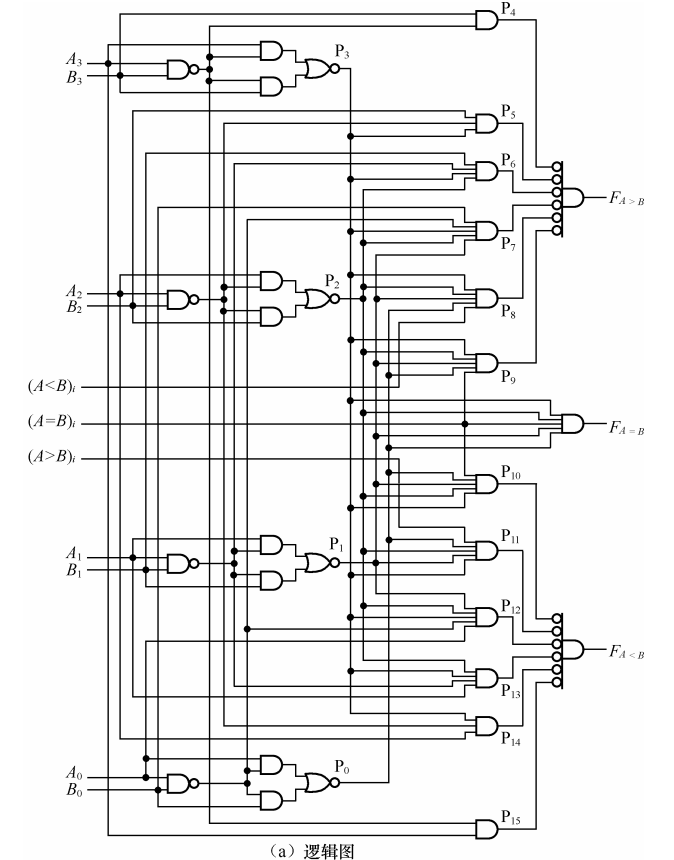

# 数字电路

## 导航

[常见电路逻辑功能](#常用功能)

# 数制

### 十进制转N进制(N=2,8,16)

**整数部分**

对十进制数不断除 N 取余，直至商为0，最后余数逆序输出

**小数部分**

对小数部分不断乘 N 取整（取整数部分），直至积为0或精度达到要求，最后整数正序输出

### N进制转十进制

**整数部分**

按照位权从N^0^开始，依次叠加

**小数部分**

按照位权从N^-1^开始，依次叠加

### 二进制转八/十六进制

以小数点为起点，向左和右以3位数为一组划分(十六进制为4位数)，一组代表一个八进制/十六进制数

### 八/十六进制转二进制

参照 二进制转八/十六进制，进行逆过程

### 八进制与十六进制通过二进制相互转化

# 码制

*不谈码位的码制都是耍流氓。——沃兹基朔德*

### 自然二进制码

可以看作固定位数的二进制数

### 格雷码（Gray Code）

格雷码是一个统称。**任意两个相邻数的代码中只有一位对应的码元不同**，则称这种编码为格雷码。循环码就是其中一个典型

#### 循环码

在循环码中，不仅相 邻的两个代码只有 1 位码元不同，而且首尾两个代码也是如此

可以通过反射特性快速写出循环码（虚线为对称轴，0以2^n^增长阶梯排列）

通常把两个代码中取值不同的码元的位数称为两个代码的间距，把两个相邻代码中只有一位对应码元取值不同的特点称为单位间距特性。 格雷码和循环码都具有单位间距特性，因此，它们都是**单位间距码**。

### BCD码/二-十进制码

对十进制的每一位数，用4位二进制数表示0~9来替代。4位二进制数表示10个数字有所富余，所以构成 BCD 码的方案可以有多种。

**1.有权码** 

代码中的每一位都有固定权值的代码称为有权码或恒权码。有权码的名称通常用 4 个码位的位权来命名。表 1.3.2 中的 8421BCD、5421BCD、2421BCD 都是有权码。

**2.无权码**

代码中的各位没有固定权值

**余 3 BCD 码由 8421BCD 码加 3 得到**，其主要特点是 0 和 9、1 和 8、2 和 7、3 和 6、4 和 5 的代码互为反码，具有这种特点的代码称为自补码（Self Complementing Code）

一个多位的十进制数可以用多个 BCD 代码表示，表示时代码之间应有间隔。

（123)~10~＝(0001 0010 0011)~8421BCD~

#### 8421BCD 码的加减法运算

我的评价是：不如用十进制作为中间数进行转换捏

# 逻辑代数基础

## 基本逻辑：与、或、非

**与**
$$
与运算：全 1 出 1 ，否则出 0\\F=A \cdot B=AB
$$
**或**
$$
或运算：有 1 出 1 ，否则出 0\\
F=A+B
$$
**非**
$$
非运算：取反\\F=\overline A
$$

## 复合逻辑运算

## 逻辑运算公式

### 基本公式

### 常用公式

$$
\begin{align}
\begin{split}
合并相邻项：
&AB+A \overline{B}=A &\Longleftarrow& AB+A \overline{B}=A(B+\overline B)=A\\
消项：
&A+AB=A &\Longleftarrow& A+AB=A(1+B)=A\\
消去互补因子：
&\textcolor{red}{A+\overline AB=A+B} &\Longleftarrow& A+\overline AB=\overline{\overline A\cdot\overline{\overline AB}}=\overline{\overline A\cdot(A+\overline B)}=\overline{\overline A\cdot A+\overline A\cdot\overline B}=A+B\\
多余项（生成项）：
&\textcolor{red}{AB+\overline AC+BC=AB+\overline AC} &\Longleftarrow &\quad AB+\overline AC+BC\\
&&&=(A+C)\cdot B+\overline AC\\
&&&=(A+\overline AC)\cdot B+\overline AC\\
&&&=AB+\overline AC\cdot B+\overline AC\\
&&&=AB+\overline AC\\
推广：
&AB+\overline AC+BCDE...=AB+\overline AC\\

\end{split}
\end{align}
$$

## 逻辑函数的基本规则

### 代入

把一个逻辑等式中的某一变量用另一个逻辑函数替代，等式仍成立。例如
$$
\overline{A+B}=\overline A\cdot \overline B\\
令B=B+C\\
则\overline{A+B+C}=\overline A\cdot \overline{B+C}=\overline A\cdot\overline B\cdot\overline C
$$

### 反演

反演规则用于求$F$的反函数$\overline F$

$$
例1\\
若F=\overline A\cdot\overline B+C\cdot D\\
则\overline F=(A+B)\cdot (\overline C + \overline D)\\
eg2.\\
若F=\overline A+\overline{\overline{B+C}\cdot D}\\
则\overline F=A\cdot\overline{\overline{\overline{B}\cdot\overline{C}}+\overline{D}}
$$

### 对偶

用于求$F$的对偶式数$F'$

$$
\begin{align}
\begin{split}
eg.&  \\
if &\quad F=\overline AB+\overline{A(C+0)}\\
then &\quad F'=(\overline A+B)\cdot\overline{A+C\cdot 1}\\
\end{split}
\end{align}
$$

## 逻辑函数的表达式

### 标准表达式

#### 最小项

#### （1）最小项的概念

是一种特殊的乘积项（与项），在该乘积项中逻辑函数的所有变量都要以原变量或反变量的形式**恰好出现一次**。

#### （2）最小项的数量

$Y=F(\underbrace{A,B,C,...}_\text{n个变量})有2^n个最小项$

#### （3）最小项的编号/写法

以$F(A,B,C)$为例

*可以假设默认变量值为1来帮助记编号*

#### （4）最小项的性质

**1.对任何一个最小项，只有一组变量的取值组合，使它的值为1。反之，对任何一组取值，只有一个最小项对应的值为1**。

2.**全部最小项之和恒为1**。

3.**任意两个最小项乘积为0**.

4.**任一最小项与另一最小项的非之积恒等于该最小项** 。

#### （5）最小项的求解

##### 1.配全项法

1.  拆：将原始拆成若干个“多项式”
2.  补：将缺少的变量用$(X+\overline X)$补上
3.  展开并合并同类项

##### 2.真值表法

列真值表，取结果为1的变量组合，用或`+`连接。组合对应的变量同编号方法（1代表原变量，0代表反变量）

## 逻辑函数的化简

与逻辑函数的标准化不同，化简首先要求项数少，其次每要求每项的变量数也要少

### 最简与或式标准

（1）所含与项最少				——门最少

（2）各与项中的变量数最少——门的输入端最少

### 公式法

参考[逻辑运算公式](#formal)

（1）合并相邻项

（2）消项

（3）消去互补因子

（4）拆项

（5）添项

（6）卡诺图

### 卡诺图法

卡诺图是用于化简逻辑函数的一种表示方式。

1.整理原式，化为与或式。

2.将逻辑函数中的变量分组-画表（三变量为\[1]\[2]，四变量为\[2]\[2]），出现的最小项往表里填1，没有的不填或填0。

3.画圈：用尽可能大的圈囊括表中所有逻辑相邻的1，圈中元素只能有2^n^个（即1、2、4、8、16……）

4.写出结果：有几个圈，就有几个与项，结果即为最简与或式。

*注意：*

1.  卡诺图的书写顺序是00-01-11-10，而非正常的二进制数排序。
2.  圈中“1”的数目只能是2^n^个，通常4个的话呈条状或正方形
3.  “1”可以被反复利用（A+A=A）
4.  首先考虑圈数最少，其次考虑圈尽可能大
5.  圈法不唯一

4.  

### 无关项

一、约束项：变量取值受到约束而不会出现，例如8421BCD的后几位非法码

二、任意项：变量取值对逻辑函数的结果没有影响。

无关项的值可0可1，因此可以利用这一点来**化简逻辑函数**：在采用卡诺图化简时，可以用$\Phi$来指代无关项，其本身无需被圈起来，但是可以用来凑1的较大圈

# 组合逻辑电路SSI

## 电路分析

### 分析步骤

1.  从输入到输出逐级**推导输出函数**表达式
2.  利用代数法或卡诺图法对表达式进行**化简**
3.  **列出真值表**
4.  **功能分析**，电路设计评估

### 常用功能

-   半加器：输入分别为加数、加数、低位进位，输出 `和` 与 `进位`
-   半减器：输入分别为被减数、减数、低位借位，输出 `差` 与 `借位`
-   一位全加器：半加器串联后得全加器，输出结果 与 最高位进位
-   判断素数：假设输入表示二进制数，根据所代表的十进制数是否为素数，有区别地输出
-   不一致电路：根据所有输入信号是否一致进行有区别的输出
-   四个二选一：74157

## 电路设计

设计是分析的一个逆过程，由逻辑功能来设计电路

### 设计步骤

1.  根据给定逻辑功能，**列出真值表**
2.  写出逻辑表达式，并根据所选器件，将原表达式化简成相应形式的**最简表达式**
3.  **画出逻辑图**

# 中规模集成组合逻辑电路MSI

## 编码器

### 74148——转二进制码

编码器用于将一组高低电平（若干个高低平信号中只有一个有效）转化为二进制码。便于传输。

**148即8-3线，用于将8个高低电平转化为3位二进制数**

注意：此处的输入输出都是反的，0代表有效。

按照下标从高到低，依次向右排列，若有字母，则字母有序向右排列。A-Z对应高低下标。

#### ⭐输入与输出的对应关系：$\overline{Y_i}=\overline{m_i}$

在使能情况下，输入端的 0 在哪一位，就当作是哪一位的下标，再把下标用二进制数表示，就是输出。

此公式也同样运用于

### 74147——转为BCD8421

**用于将一组高低电平转换为BCD8421码**

注意：同148一样，输入输出都是反向有效，即0有效；但这张表输入不是按照下标从大到小排列，输出是看输入的 0 在哪个下标下，就把哪个下标用二进制数表示后取反！

## 译码器（数据分配器）

译码器实现编码器编码的逆过程，将二进制编码转化为一组高低电平。

### 二进制译码器

#### 74139（2-4 线译码器）

#### 74138（3-8 线译码器）

只有当 $E_1、\overline{E}_{2A}、\overline{E}_{2B}$ 全部使能时才正常工作。

#### 74154（4-16 线译码器）

用两片 2-4 线译码器扩展成一个 3-8 线译码器

用两片 3-8 线译码器扩展成一个 4-16 线译码器

#### 二进制译码器实现逻辑函数

步骤：

1.  将逻辑函数 $F$ 化成最小项表达式（标准与或式），并用最小项 $m_i$ 来表示。
2.  在最小项和式上取非非，即 $\overline {\overline {F}}$ ，化简非非式，凑成用 $\overline{m_i}$ 表示的式子。
3.  由重要公式 $\overline{Y_i}=\overline{m_i}$ ，将 $\overline{m_i}$ 替换为 $\overline{Y_i}$ 。
4.  画出电路图。

>   例题3.2.12：
>
>   
>
>   
>
>   $F_1=\sum m(1,5,7)$ 使用的是与非门
>
>   $F_2=\sum m(0,2,4,5,6,7)$ ，即 $\overline F_2=\sum m(1,3)$ ，故使用的是与门

### 二—十进制译码器

输入端 A~3~A~2~A~1~A~0~ 是按 8421BCD 编码的地址输入，Y~0~\~Y~9~ 是译码输出端，低电平有效。当 A3～A0 输入 8421BCD 非法码时，Y~0~\~Y~9~  输出全为无效电平。

### 显示译码器

将电路连上灯管，使运算结果用十进制显示出来。

（1）半导体数码管(了解一下)

（2）BCD-七段显示译码器 7447（有效输出电平为低电平，需与共阳极结构的数码管相连接）和 7448（有效输出电平为高电平，需与共阴极结构的数码管相连接）(会用)

#### BCD-七段显示译码器 7448 (会用)

高电平有效，低电平无效。

LT（Lamp  Test）为灯光测试输入：$\overline{LT}=0 $  时，输出全亮

BI/RBO  （Blanking Input／Ripple Blanking Out）为熄灭输入/串行灭零输出：这是一个双功能的输入/输出端。
作为输入端时，称熄灭输入控制端。只要 $\overline{BI}=0$ ，无论$\overline{LT}、\overline{RBI}$ 如何，输出全0，所有灯光熄灭。
作为输出端时，称串行灭零输出端。若 $\overline{RBI}=0$ ，则熄灭前后补位多余的0 。

RBI （Ripple Blanking Input）为串行灭零输入：$\overline{RBI}=0$ 时，将前后多余的0熄灭。

## 数据选择器

数据选择器是一种数据开关，它将多个通道的数据经过选择，传送一路数据到公共数据 通道上去，与上节提到的译码器（数据分配器）的功能正好相反。数据选择器又名多路复用器（Multiplexers，简写 MUX）

常用的数据选择器集成芯片有四选一数据选择器（74153）和八选一数据选择器（74151）

**74153和74151都是正常的高电平有效，同样的输入下标从高到低排列，输入组成的二进制数是 $i$，对应的就是输出数据 $D_i$**

### 74153——四选一

### 74151——八选一

### 级联扩展

用一片双四选一数据选择器 74153 构成一个八选一数据选择器。

### 数据选择器实现组合逻辑电路

#### ⭐数据选择器输出 $$Y=\sum_{i=0}^{2^n-1}{D_im_i}$$ 

任意一个组合逻辑函数可以写成最小项形式$F=\sum m_i$，适当地规定 $D_i $的值，便可以使 $Y=F$，将 $Y=\sum_{i=0}^{2^n-1}{D_im_i}$ 用卡诺图表示。

步骤：

1.  将逻辑函数 $F$ 化成最小项表达式（标准与或式），并用最小项 $m_i$ 来表示。
2.  将重要公式$Y=\sum_{i=0}^{2^n-1}{D_im_i}$与$F=\sum m_i$进行匹配，F中有的项 D~i~ 置1，没有的项置0
3.  填写卡诺图。

>   例题 3.2.3 
>
>   用数据选择器实现三变量函数$F(A,B,C)=AB+A\overline{C}$
>
>   解：$F(A,B,C)=AB+A\overline{C}=m_4+m_6+m_7$
>
>   
>
>   注意要按顺序对应最高位，否则结果会不一样。虽然同样正确，但不推荐反向对位！
>
>   

### 降维

用处：输入变量数多于芯片可用变量数

本质是用多出来的变量代替固定的数据端。把原本接数据D的，现在接到多出来的变量上。

1、代数法

2、卡诺图法

以S~i~为例 ，降维前（左图）0号位，1号位：$0·C_{i-1} + 1·C_{i-1}=C_{i-1}$，故降维后（右图）为C~i-1~

降维前（左图）2号位，3号位：

$0·C_{i-1} + 1·\overline C_{i-1}=\overline C_{i-1}$，故降维后（右图）为$\overline C_{i-1}$

## 数据比较器（7485）

7485是一位比较器。它对 A~3~～A~0~、B~3~～B~0~ 两个 4 位二进制数进行比较，比较结果是 F~A>B~、F~A=B~、F~A<B~ ，(A>B)~i~、(A=B)~i~、(A<B)~i~ 是三个级联输入端

从高位到低位依次比较，若当前输入全部相等，则看级联输入。

## 全加器

### 1、串行进位全加器

### 2、超前进位的 4 位全加器 74283

鉴于串行进位全加器位数越多计算越慢，所以有超前进位的全加器：通过数学公式，根据输入数据先计算各位的进位情况，然后各全加器同时计算出最后答案。

### 全加器的应用举例—四舍五入

>   例题 4.2.2
>
>   已知BCD码(A~3~A~2~A~1~A~0~ . a~3~a~2~a~1~a~0~)~8421~，用中规模器件和部分门电路设计一个电路实现四舍五入
>
>   分析：小数部分大于4，整数部分加一。特殊情况，即整数为9且需要5入时（(1010)~2~是非法码），需要加6修正。
>
>   

# 竞争与冒险

## 竞争

（1）同一信号经过不同路径到达输出端有先后

（2）多个信号同时变化，由于变化速度不一致，到达输出端有先后

## 冒险

由于竞争的存在，电路出现非预期信号。 

### 分类

1.  按短暂尖峰冒险
    -   1型冒险
    -   0型冒险
2.  按产生原因
    -   逻辑冒险：对应竞争（1）
    -   功能冒险：对应竞争（2）

### 消除方法

（1）增加多余项

（2）加滤波电容

（3）加取样脉冲

# 触发器

Filp-Flop，简称FF，又称双稳态触发器。

触发器时构成时许逻辑电路的基本单元电路。是一种具有**记忆功能**，能储存1位二进制信息的逻辑电路。

## 概述

输出只能是10或01，其余是非法状态

### 触发器特点

1.  两种不同的稳定状态（看Q）：0 or 1 
2.  记忆功能，无需持续输入
3.  翻转功能，可改变稳定状态

### 触发器分类

## 基本SR触发器（S~D~R~D~FF）

### 一、由与非门组成的基本SR触发器

#### 1.电路结构及逻辑符号

#### ⭐2.工作原理及逻辑功能

**低电平有效**

 

#### 3.逻辑功能的表示方法

现态：当前状态 Q^n^

次态：下一状态 Q^n+1^

##### (1)状态转移表

##### (4)状态激励表

##### (5)状态转移图

##### ⭐(6)波形图

工作波形图又称为时序图，是描述触发器的输出状态岁时间和输入信号变化的规律的图形。

注意/小技巧：

1.  非法状态Q和$\overline Q$输出都为1
2.  非法状态后若跟保持信号，则画阴影矩形
3.  $\overline S_D$和$\overline R_D$异号时，Q看$\overline R_D$

### 二、由或非门组成的基本SR触发器

#### 1.电路及符号

#### 2.工作原理

**高电平有效**

#### 3.转移表和次态方程

### 三、钟控电位触发器

实际工作中，触发器要求按照一定的节拍工作。为此，需要增加一个时钟控制端CP

CP（即Clock Pulse）是一串周期和脉宽一定的矩形脉冲

具有时钟脉冲控制的触发器称为钟控触发器。

钟控触发器属于**同步触发器**，而基本SR触发器属于**异步触发器**。

#### 1.电路结构与钟控原理

#### 2.逻辑功能

因为加了两个与非，所以**高电平有效**

CP=0时，触发器保持状态不变

CP=1时，将**输入S和R信号取反**，送入基本SR触发器

##### (1)次态方程

##### (2)功能表

##### (3)激励表

##### (4)波形图

可以看到，CP优先级高于S和R，所以Q和$\overline Q$也是按照CP的节奏来的

## D触发器

### 钟控D触发器

#### 电路结构

#### 逻辑符号

相当于简化SR触发器（功能也简化了），让SR始终异号，实现置0和置1两个功能

#### 功能表

#### 激励表

空翻

在电平触发器中，整个CP=1段都允许状态发生变化，所以在CP=1段可能会发生多次状态变化，称为空翻。这是我们不想要的，就像不想要竞争和冒险一样。

边沿触发器

为尽量避免空翻，故发明边沿触发。边沿触发时间短，不易发生空翻。其标识是CP端有箭头

### 维阻DFF

#### 逻辑符号

可以看到CP带箭头，代表是**上边沿触发**

#### 功能表

#### 注意

维阻的$\overline S_D$和$\overline R_D$优先级大于CP，一般用于初始化，只有当$\overline S_D=\overline R_D=1$时，才会听从CP和D指挥

这里的CP触发是上升沿触发，非上升沿包括下降和稳态。只有上升沿才会允许D操控。

## JKFF触发器

#### 逻辑图

J，K可以分别看成S，R

#### 逻辑符号

与维阻DFF相比，CP端多了一个圈（取反），意味着**负边沿触发**。

#### ⭐次态方程

$Q^{n+1}=[J\overline{Q^n}+\overline KQ^n]CP\downarrow$

#### 功能表

#### 激励表

#### 注意

和前面的维阻DFF区分，这里JK虽然可以看成SR，但是因为没有取反，所以$\overline R_D=1$时，Q看J，而不是K

## TFF触发器

只有**翻转**和**保持**功能

## T'FF触发器

在TFF基础上，始终令T=1。只要有效时钟到来，就进行翻转。

## ⭐总结

| 触发器     | SR触发器                                                     | D触发器                                                      | JK触发器                                                     | T触发器                                                      | T'触发器                                             |
| ---------- | ------------------------------------------------------------ | ------------------------------------------------------------ | ------------------------------------------------------------ | ------------------------------------------------------------ | ---------------------------------------------------- |
| 功能表     |  |  | 在$\overline S=\overline R=1$时  |  | 只有CP端， 无数据端。 每当CP有效就翻转一次 |
| 函数表达式 | $\begin{cases}Q^{n+1}=S+\overline RQ^n\\RS=0(约束条件) \end{cases}$ | $Q^{n+1}=D$                                                  | $Q^{n+1}=J\overline{Q^n}+\overline KQ^n$                     | $Q^{n+1}=T\oplus Q^n$                                        | $Q^{n+1}=\overline{Q^n}$                             |
|            |                                                              |                                                              |                                                              |                                                              |                                                      |

  单纯的SR触发器没有CP，属于异步控制；后面四种触发器都有CP

# 时序逻辑电路

特点：具有记忆功能

基本单元：触发器

常用时序电路：寄存器、移位寄存器、计数器、序列信号发生器

$$
\begin{cases}
W=F(X,Q'')&激励方程
\\
Z=H(X,Q'')&输出方程
\\
Q^{n+1}=G(W,Q^n)&状态方程
\end{cases}
$$

## 寄存器

一个触发器存一位数据。

输入输出方式

并行

串行

### MSI寄存器74175

内部电路

#### 功能表

#### 逻辑符号

## 移位寄存器

根据移位方向，分为三种：左移、右移、双向移位

根据移位数据的输入—输入方式，又可将它分为四种

### 四位串入并出右移移位寄存器

### 四位串入并出左移移位寄存器

### MSI移存器74194

四位串入、并入—串出、并出双向移存器

#### 逻辑符号及功能表

由于有左右移位功能，所以输入端和输出端的数据位顺序没有按照

#### 扩展为8位

#### 实际应用0-节日彩灯

用74LS194做节日彩灯

## 计数器

### 作用

记忆输入脉冲的个数；用于定时、分频、产生节拍脉冲以及进行数字运算等等

### 分类

按工作方式：同步计数器和异步计数器

[^同步与异步]: 同步内部触发器靠同一个CP控制，异步则不靠同一个CP控制

按功能：加法计数器、减法计数器和可逆计数器

按计数器的计数容量（或称**模数，用M表示**）：二进制、十进制、任意进制

### ⭐同步计数器的分析

分析步骤

1.  分析电路结构
2.  写出三组方程
    -   激励方程
    -   次态方程
    -   输出方程
3.  作**状态转移表**，**状态转移图**或**波形图**（按要求来）
4.  电路的逻辑功能描述

#### 加法计数器

三组方程
$$
激励方程
\begin{cases}
J_1=K_1=1
\\
J_2=K_2=Q_1^n
\\
J_3=K3=Q_1^nQ_2^n
\end{cases}
\\
次态方程Q^{n+1}=[J\overline{Q^n}+\overline KQ^n]CP\downarrow
\\
各触发器次态方程：将次态方程代入激励方程
\\
输出方程Z=Q_1^nQ_2^nQ_3^n
$$
作**状态转移表**，**状态转移图**或**波形图**

状态转移表主要根据次态方程得到，S是现在，N是次态

这是考试需要写的表

状态转移图

顶部圈里的Q3Q2Q1必画！表示次序

X表示输入，Z是输出

波形图

功能描述

#### 减法计数器

#### 任意进制计数器

三组方程

卡诺图法

### *同步计数器的设计*

### ⭐同步计数器的MSI器件

#### 74161

##### 逻辑符号

Qcc是进位端口

##### 功能表

##### 级联扩展

###### 1、异步级联

低位Qcc要接非门！

###### 2、同步级联

##### 应用2：实现M<16进制计数器

M<16

###### 1、异步复0法

基本思路：计满M个状态后产生清零信号，用到$\overline {CR}$

例1，M=6

计数到(0110)~2~时，清零

设计电路

波形图

状态转移表

0110状态存在时间极短，要**跳过**

###### 2、同步置0法

基本思路：在M-1状态时，$\overline{L}_D$置0，在下一个CP到来时使用直接输出0。

例2，同例1

###### 3、置最小数法

基本思路

预置数为S~16-M~

例3，M=12

预置数为S~16-M~=S4

###### 4、置最大数法

基本思路

预置数S~M-2~

例4，同例3

特别注意的是，置最大数法的跳转条件判断是最严格的，一定要M-2才跳

###### 总结

1.  异步复0：S~M~
2.  同步置0：S~M-1~
3.  置最小数：S~16-M~
4.  置最大数：S~M-2~

##### 应用3：实现M>16进制计数器

前提：必须多片级联

###### 1、整体清零法 或 整体置数法

异步级联不能采用置数法

原因就在于低位161置零后，由于Qcc不变，导致高位161无法置零

###### 2、分解法

 

 

#### 74163

与161的区别在于，161的$\overline{CR}$是异步清零，而**163的$\overline{CR}$是同步清零，需要消耗一个CP上升沿**

#### 74160

与161的区别在于，160的**模长为10**，而不是16

### 异步计数器的分析

特点：各触发器CP脉冲不是同一个，以至于状态翻转不在同一时刻发生

优点：结构较同步计数器简单

缺点：分析与设计比同步计数器复杂，速度较慢

分析步骤与[同步计数器的分析](#⭐同步计数器的分析)一致

注意：由于不是同步计数，所以次态方程里的上升沿下降沿要格外注意！  

上升沿和下降沿可相互转化，利于计算 

### 移存型计数器

#### 特点

1.  属于**同步计数器**，存在反馈网络
2.  第一级触发器的激励由输入决定，其余触发器更新均符合$Q_i^{n+1}=Q_{i-1}^n$
    -   $D_i=Q_{i-1}$
    -   $J_i=Q_{i-1},K_i=\overline Q_{i-1}$
3.  状态转移表符合移存规律
4.  设计简单，只要设计第一级触发器的激励即可

分析

同同步计数器

### ⭐环形计数器

特殊的移存型计数器

右下角凹行标记表示预置信号置为0

#### 特点

1.  同步计数器
2.  存在**原码反馈**，$D_1= {Q_4^n}$

#### 结论

n位触发器可以实现M=n的环形计数器

#### 检查自启动性（无法自启动）

### 扭环形计数器

右下角凹行标记表示预置信号置为0

#### 特点

1.  同步
2.  反码反馈，$D_1=\overline {Q_4^n}$

#### 结论

n位触发器可以实现M=2n的扭环形计数器

### 用MSI移存器构成环形计数器

M=4

右边M1的凸信号任务就是将预置数1110写入计数器

扭环形计数器就是Q3到D~SR~加个非门，M=8

## ⭐序列码发生器

序列码：周期性重复出现的一串数码

循环长度：一个周期内数码的个数

序列码电路：产生序列码的电路

结构类型：计数型序列码发生器(161)、移存型序列码发生器(194)

### 计数型序列码发生器

#### 结构图

#### 设计步骤

1.  先设计M=序列长度的计数器
2.  再设计组合电路，其输入为计数器的输出，输出为序列码F

例题

方法一：用触发器自建计数器

##### 方法二：用161实现

161低三位接151选择器输入端，151数据端依次接序列码

### 顺序脉冲发生器

### 本章例题

本题注意：151输入端接的是161的高三位！

分析题目，画真值表

根据真值表，画卡诺图，并**降维**

 根据降维后的卡诺图，连接电路

思考题

## 时序电路练习

三方程步骤略，做出状态转移表

# 可编程逻辑器件PLD

## PLD的分类

按逻辑功能分

1.  通用型：器件逻辑规模小，功耗相对大，其构成的系统布线复杂，占用PCB板面积大

2.  专用型：把系统的全部或部分集成在一个芯片内，称为专用集成电路ASIC。可以降低功耗、提高系统的可靠性、保密性及工作速度

    全定制电路和半定制电路

### 按集成度分类

#### PROM

缺点

只能实现标准与或式

芯片面积大

利用率低，不经济

#### PLA

缺点：价格高

#### PAL

#### GAL

## 可编程只读存储器PROM

ROM的存储量（容量）通常以**字线×位线**表示，上图所示存储量为8*3=24

### 应用/做题步骤

## PLA

## 通用阵列逻辑GAL

往年考题

# A/D和D/A变换

### 概念及其应用

### 主要技术指标

1.  精度：分辨率、转换误差
2.  速度：转换时间、转换速率

## 数模转换（D/A）

D/A转换器一般由参考电压源、数码寄存器、电子模拟开关、译码网络和求和放大电路组成。

### 权电阻网络

#### 优缺点

### 倒T型R-2R电阻网络DAC

### D/A转换器技术指标

#### 分辨率

#### 转换精度

#### 建立时间

## 模数转换（A/D）

基本原理

四个步骤：**采样**、**保持**、**量化**、**编码**

### 采样和保持

**采样频率是信号中最大频率的两倍以上**

### 量化和编码

量化方法

1.  舍尾法
2.  四舍五入法

#### 舍尾法

#### 四舍五入法

#### 逐次逼近ADC

### 技术指标

#### 分辨率

#### 转换精度

#### 转换时间

## 做题

