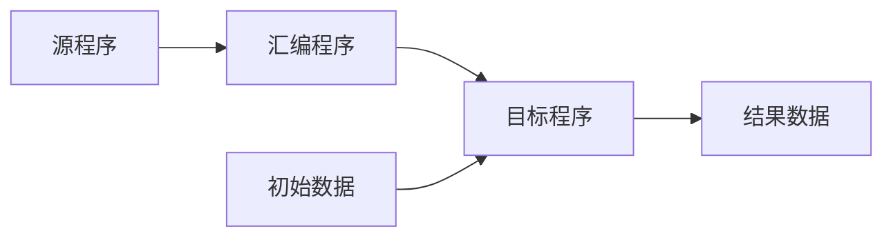
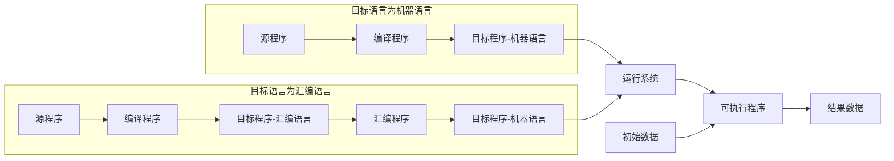
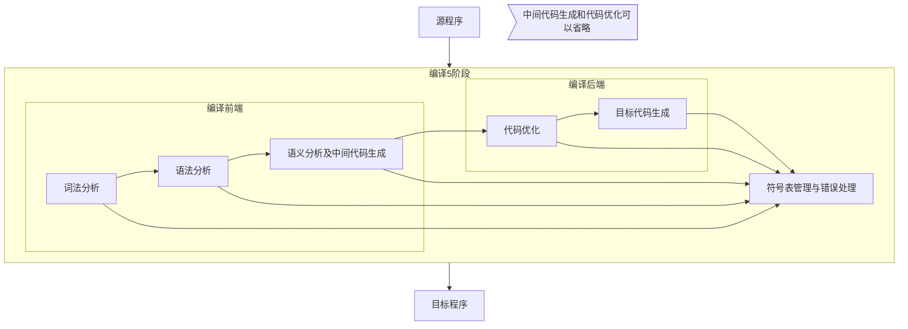
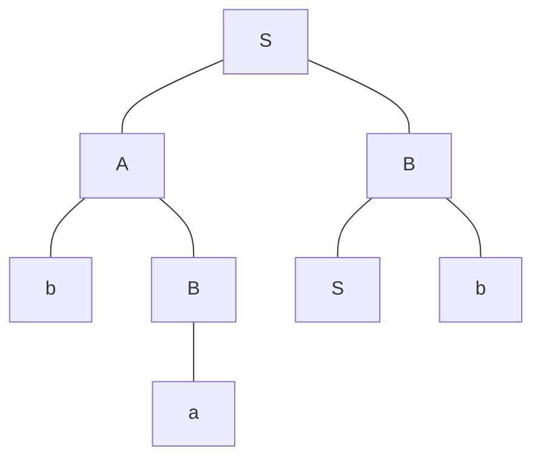
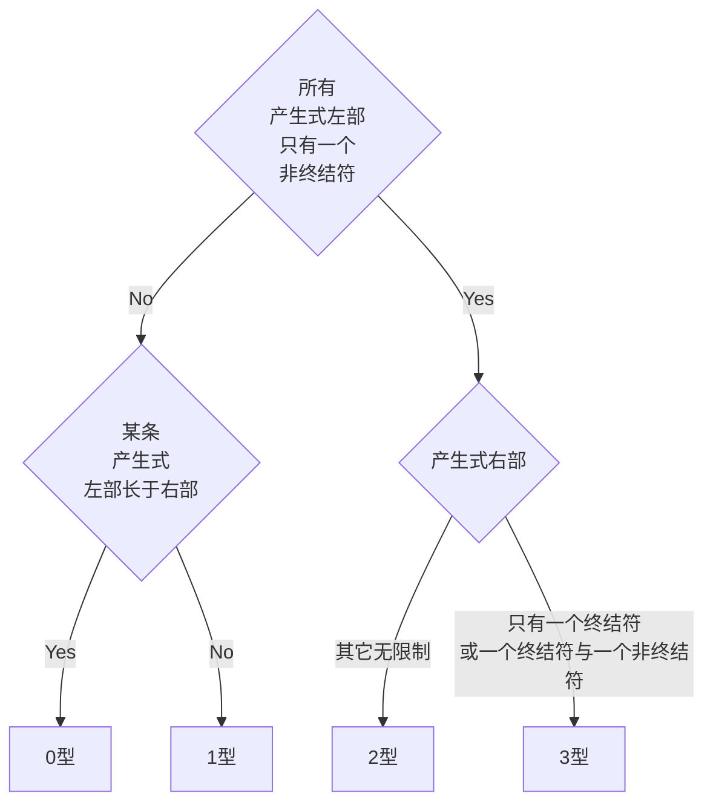
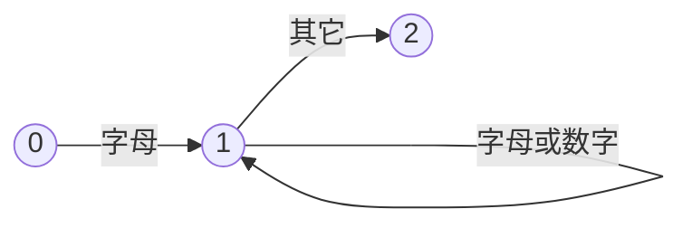

[TOC]

# 引论

## 程序设计语言的翻译机制

用汇编语言或高级语言编写的程序翻译成机器语言才能被计算机识别。完成这一过程的程序称为**翻译程序**。

翻译程序有**汇编程序**、**编译程序**和**解释程序**。

汇编程序和编译程序的翻译机制称为**编译机制**

解释程序的翻译机制称为**解释机制**

源语言：编写源程序的语言

目标语言：编写目标程序的语言

### 汇编程序

| 源语言   | 目标语言 |
| -------- | -------- |
| 汇编语言 | 机器语言 |

汇编程序一般对源程序进行两遍扫描。第一遍进行存储分配，构造各种表格给第二遍扫描使用。第二遍用机器操作码代替源程序中的符号。

### 编译程序

编译程序也叫编译器

| 源语言   | 目标语言           |
| -------- | ------------------ |
| 高级语言 | 汇编语言或低级语言 |

高级语言编写的源程序在机器上的执行过程可分为两个阶段

1.  编译阶段：将源程序翻译成等价的目标程序
2.  运行阶段：执行目标程序，获得结果

现代编译器只负责**编译阶段**，**运行阶段**由**操作系统**完成。目标程序加上运行系统（如服务子程序、动态分配程序、装配程序等）输出结果。

### 解释程序

边解释边执行源程序本身，下一条语句的执行依赖于上一条语句的执行结果，最终输出数据。

解释程序适合于会话型语言。

-   优点：易于为用户提供调试功能，对源程序的语法分析和出错处理处理很及时
-   缺点：执行速度慢，运行效率低

## 编译程序概述

### 词法分析

主要任务：**识别有独立意义的单词**。

进行词法分析的程序叫**词法分析器**或词法扫描器，根据词法规则识别出**最小的语法单位**，即**单词（Token）**，如关键字、标识符、运算符。

识别出单词后，转换为长度统一、格式规范的**内部编码**。内部编码由两部分：一、**类别编码**，区别单词种类；二、**单词的值**，即单词本身的编码。

### 语法分析

主要任务：根据语法规则，从单词流中**识别语法成分**，如（表达式、说明、语句、过程和函数）并检查语法成分是否符合语法结构。

通常将语法分析的结果表示为**语法树**。

进行语法分析的程序被称为**语法分析器**

### 语义分析及中间代码生成

语义：语言的各种语法成分的具体含义。

主要任务：根据语法规则，**分析**已经识别出来的**语法成分的含义**。与语法分析密切相关。通常语法分析器在分析语法成分的同时会进行语义分析，这种方式被称为语法制导翻译。

在语义分析时，语法分析器会进行相应检查。

**语义分析是整个编译程序中最有实质意义的翻译任务**，语法成分经过语义分析被翻译成**中间代码**。

>   中间代码主要是为了便于代码优化和目标代码的移植。目前常见的中间语言形式有三元式、四元式、逆波兰表示等。
>
>   中间代码至少应有两个性质：容易产生和容易翻译成目标语言。例如 Java 字节码、MSIL

### 代码优化

主要任务：**对中间代码进行等价的加工处理**。

[^优化]: 优化的是中间代码

**空间复杂度**和**时间复杂度**是衡量目标代码质量的两大指标。

### 目标代码生成

主要任务：把经过优化的中间代码变成目标代码（机器语言或汇编语言）

### 编译前端和编译后端

词法分析、语法分析、语义分析及中间代码生成，这些与源语言相关的部分被称为**编译前端**

代码优化、目标代码生成，这些与目标语言相关的部分被称为**编译后端**

编译分前后端不仅利于代码优化，还有利于目标代码的生成和移植。

-   可以给同一个编译前端配不同的编译后端，利于代码移植。比如Java就有Java中间码
-   也可以给不同的编译前端配同一个编译后端，源代码兼容性更好。比如GCC。GCC的编译前端是多种语言的不同分析器，经过前端编译生成**抽象语法树（AST，Abstract Syntax Tree）**形式的中间代码；GCC的编译后端以此生成目标代码

由于整个编译过程中会存在各种问题，所以**编译的各个阶段**都涉及**符号表管理**和**错误处理**。

### 符号表管理

符号表管理也被称为表格管理。主要功能：按照编译需求，生成不同用途的符号表（常数表、名字特征表、循环层次表等等），并提供合适的方式查询、修改、维护表格。完成造表并对表格增删改查的程序叫**符号表管理程序**

### 错误处理

主要功能：发现错误、错误局部化（将错误的影响限制在尽可能小的范围内）、续编译（发现错误后还能继续完成剩余部分的分析处理）

不同阶段的不同错误：

1.  词法分析：拼写错误
2.  语法分析：语法错误
3.  语义分析：类型不匹配、参数不匹配

## 编译程序的分遍

编译程序的5个阶段对源程序或等价源程序的扫描次数不定，一次或多次都有可能。

对源程序或等价源程序进行相关的加工处理工作，称为**遍（Pass）**

编译程序有单遍（扫描一次即生成目标代码），也有多遍（每遍只完成编译程序的一部分或几部分工作）

决定编译程序分遍数目的因素：

-   计算机存储容量大小
-   编译程序功能的强弱
-   源语言的繁简
-   目标程序的优化程度
-   设计和实现编译程序时所用的工具的先进性
-   参加人员的数量和素质

## 编译程序的构造方法

### 一般方法

1.  用机器语言编写编译程序
2.  用汇编语言编写编译程序
3.  用系统程序设计语言编写

### 编译程序的开发技术

#### T型图

#### 自编译程序

一种高级语言的编译程序也能直接用该语言写出来。利用自编译语言开发自身或其他语言的编译程序

#### 自展技术

#### 交叉编译技术

A机器上的编译程序可以产生B机器语言的机器代码，那么这种程序被称为交叉编译程序

>   为什么需要交叉编译？
>
>   -   目的平台上不允许或不能安装我们所需要的编译器
>   -   目的平台上的资源匮乏，无法运行我们所需要的编译器
>   -   目的平台还没有建立

#### 移植技术

移植技术就是把一台计算机上的软件移植到另一台计算机上。有两种典型方法：

1.  抽象出一种通用语言。在每个计算机上配有编译器，将这种通用语言编译成机器语言。但这种方法难以实现。
2.  利用交叉编译技术。

# 形式语言的基本知识

## 字母表和符号串

1.  **字母表**：符号的有限非空集合，通常记为$\Sigma$。字母表中的元素称为**符号**，符号是字母表中不能再分解的最小单位。

2.  **符号串**：字母表中的符号组成的任何有穷序列，定义如下：

    -   $\varepsilon$是$\Sigma$上的符号串，称为“**空符号串**”，它不包含$\Sigma$上的任何符号
    -   $\Sigma$中的每个符号都是$\Sigma$上的符号串
    -   若$x$，$y$都是$\Sigma$上的符号，则$x$和$y$的**连接**$xy$也是$\Sigma$上的符号串。**符号串的连接**就是简单的拼接，和符号串集合的连接要区别开。

    通常用小写字母表示符号串，符号串$x$包含的符号个数记为$|x|$，显然$|\varepsilon|=0$

3.  **头、尾、子串**：在符号串$xyz$中（$x,y,z$都有可能是空字符串），$x$叫头/前缀，$z$叫尾/后缀，$y$叫子串。当$x,y,z\neq xyz$时，x，y，z分别叫真头（真前缀）、真尾（真后缀）、真子串。

    $\varepsilon$是任意符号串的头、尾、子串。

    对于长度为$N$的符号串，其头、尾各有$N+1$个，真头、真尾各有$N$个，子串有$N(N+1)/2+1$个，真子串有$N(N+1)/2$个。

4.  **符号串的幂运算**：$x$自身进行 n 次连接运算得到符号串$x^n,即n个x$。任何符号串的0次幂都是$\varepsilon$

5.  **符号串集合**：若集合A中的所有元素都是字母表$\Sigma$上的符号串，则称A为字母表$\Sigma$上定义的符号串集合。通常用大写字母来表示符号串集合。

    显然$\Sigma$本身也是字母表$\Sigma$上的符号串集合。

    符号串集合也被称为字母表上的**语言**。

    符号串集合可以是无穷集合。

    一些集合的运算（交并补差）对符号串集合也适用，同时还有其他一些特殊运算（**连接**和**闭包**）

6.  **符号串集合的连接**：

    $$假设L_1,L_2是分别定义在\Sigma_1和\Sigma_2上的符号串集合，则L_1和L_2的连接有如下定义：\\L_1L2=\{xy|x\in L_1,y\in L2\}$$

    >   举个例子：
    >
    >   $$\begin{align}&记A=\{a,b\},B=\{cc,cd\}，则\\&AB=\{acc,acd,bcc,bcd\}\\&A^2=\{aa,ab,ba,bb\}\\&A^3=\{aaa,aab,aba,abb,baa,bab,bba,bbb\}\end{align}$$

    需要注意的是：

    $\Phi A=A\Phi=\Phi(\Phi是空集)\\对于有一个\varepsilon元素的集合\{\varepsilon\},\{\varepsilon\} A=A\{\varepsilon\}=A$

    在此基础上，可以定义符号串集合的幂运算：

    $(A)^0=\{\varepsilon\},(A)^n=(A)^{n-1}A(n\geq 1)$

7.  **符号串集合的闭包**：

    $$\begin{align*} & L的闭包记为L^*，定义如下：\\ &(1)L^0={\varepsilon} \\ &(2)对于n\geq1,L^n=LL^{n-1} \\ &(3)L^*=\cup L^n,n\in \{0,1,2,...\} \\ &L的正闭包记为L^+,L^+=\cup L^n,n\in \{1,2,...\} \\ &显然，L^*=L^+\cup \{\varepsilon\}\end{align*}$$

    >   举个例子：
    >
    >   $$\begin{align*}
    >   & 记符号串集合A=\{a,b\}
    >   \\
    >   & A^0=\{\varepsilon\},A^1=\{a,b\},A^2=\{aa,ab,ba,bb\},\cdots,
    >   \\
    >   & A^*=\{\varepsilon,a,b,aa,ab,ba,bb,\cdots\}
    >   \end{align*}$$

8.  **行集合**：因为$\Sigma$本身也是字母表$\Sigma$上的符号集合，因此将闭包$\Sigma^*$称为行集合，表示字母表$\Sigma$中的符号以任意次序、任意个数和任意长度组成的符号集合（包括空符号串$\varepsilon$。显然，$\Sigma$上定义的任何符号串集合$L$及其闭包$L^*$都是行集合$\Sigma^*$的子集。

    

## 用文法产生法描述语言 BNF

通常有三种方法描述一种语言。

1.  枚举法：适用于语言仅包含几个句子的情况
2.  自动机：每种语言对应一种自动机（某种算法），由它判定一个符号串是否属于该语言。
3.  文法产生法：为每种语言定义一组文法规则，从而产生该语言的每个句子。

### 巴克斯-诺尔范式

巴克斯-诺尔范式（Backus-Naur Form,BNF）采用形式化方式定义语言的造词和造句规则，最早用于描述ALGOL语言的文法规则。

#### 描述文法规则

BNF引入`::=`（读作“定义为”，简写为“→”）来描述文法规则：

`|`符号表示“或” ，表示候选项；

以`< >`符号表示语法实体（语法单位）。

`<符号>::=<符号串表达式>`

>   `<英文语句>::=<主语><谓语><宾语>`
>
>   `<标识符>∷=<字母>|<标识符><字母>|<标识符><数字>`
>
>   `<字母>::=a|b|...|z|A|...|Z`
>
>   `<数字>::=0|1|...|9`
>
>   这样便刻画出了〈标识符〉是以字母开始的一串字母和数字任意组合这种特点

#### 产生式

产生式是只有一个候选式的文法规则，是一个非空符号串 和另一个符号串的有序偶`（α, β）`，记为 `α∷= β` 或 `α→β`。

α 称为产生式的**左部**，β 是产生式的**右部**。α→β 表示左部 α 定义为右部 β。

#### 字汇表

产生式左部和右部中所有符号形成集合为**字汇表**，记为$V$

出现在产生式左部，且能派生出符号或符号串的那些符号称为**非终结符**，也称**语法实体**或**语法单位**，它们的全体构成一个非终结符的集合， 记为$V_N$

产生式中不属于$V_N$的那些符号称为**终结符**，它们的全体组成终结符的集合，记为$V_T$ 。终结符一般出现在规则的右部。

显然，$V = V_N∪V_T,V_N∩V_T = \Phi,\alpha\in(V_N\cup V_T)^+,\beta\in(V_N∩V_T)^*,V_N\cup V_T\cup\{\varepsilon\}称为文法符号集合$

#### 文法

文法是规则的有穷集合，形式定义为四元组形式：
$$
G=(V_N,V_T,P,S)
$$
其中$P$是产生式（规则）的集合，$S\in V_N$是文法$G$产生句子的开始符号（也称为文法的识别符号，至少要在一条产生式左部出现）。

文法$G$通常记为$G［S］$

>   $$
>   G = (V_N, V_T, P, S)
>   \\
>   V_N = {A, B}
>   \\
>   V_T = {c, d}
>   \\
>   P = {A → Bc, B → d}
>   \\
>   S = A
>   \\
>   通常情况下，在对文法的描述时可以省略V_N和V_T，\\
>   文法的开始符号也可以不需要“显式地”指定，\\
>   仅需将开始符号写在G后的中括号中即可。\\
>   上述文法可以描述为：\\
>   G[A]: A → Bc，B → d
>   $$

### 通过文法产生语言的方式

#### 推导与归约

$$
\begin{align*}
&文法G = (V_N, V_T, P, S)有一条产生式\alpha\to\beta,\alpha\in(V_N\cup V_T)^+,\beta\in(V_N\cup V_T)^*,\\
&假设存在符号串x, y\in(V_N\cup V_T)^*,使得有符号串v和w满足v= xαy和w = xβy，\\
&则称符号串v直接推导出符号串w，符号串w直接归约到符号串v，并把符号串w叫做符号串v的直接派生式，记为：\\
&v \Rightarrow w\\
&显然，如果x = y = ε，对于文法G的任何规则α → β，一定有α \Rightarrow β，\\
&一次直接推导其实就是用产生式右部去替换左部的过程。 一个产生式就是一个直接推导。
\end{align*}
$$

$$
\begin{align*}
& 文法G[<Identifier>]:\\
& <标识符>::=<字母>|<下划线>|<标识符><字母>|<标识符><下划线>|<标识符><数字>\\
& <字母>::=A|\cdots|z\\
& <下划线>::=\_\\
& <数字>::=0|\cdots|9\\
& \\
& 则^"推导^"就是形如：\\
& <标识符>\Rightarrow<字母>\\
& <标识符>\Rightarrow<字母>\Rightarrow A\\
& <标识符>\Rightarrow<标识符><数字>\Rightarrow<字母><数字>\Rightarrow A<数字>\Rightarrow A4\\
& \\
& 概括为：v\Rightarrow\cdots\Rightarrow w\\
& 符号串v推导出符号串w，符号串w归约到符号串v\\
& 从v到w有几个^"\Rightarrow^"就代表长度为几，例如<标识符>\Rightarrow<字母>\Rightarrow A的推导长度为2\\
& 推导长度=1称为直接推导/归约,记为v\Rightarrow w\\
& 推导长度\geq1称为推导/归约,记为v\Rightarrow ^+w\\
& 推导长度\geq0称为广义推导/归约,记为v\Rightarrow ^*w\\
\end{align*}
$$

#### 句型和句子

设$G[S]$是文法，符号串$x\in(V_N\cup V_T)^*$是由$S$**广义推广**而来，则$x$是文法$G[S]$的一个**句型**。

如果$x$仅由终结符构成，则$x$是文法$G[S]$的一个**句子**。

#### 语言

由文法所产生的所有句子的集合称为**语言**，记为$L(G[S])或L(G)$

显然$L(G)=\{x|S\Rightarrow^*x,x\in V_T^*\},L(G)\subseteq V_T^*$

>   构造如下语言的相应文法
>
>   $L(G)=\{0^m1^n|m,n\geq1\}$
>
>   法一：$G[S]:S\to AB,A\to 0A|0,B\to 1B|1$
>
>   法二：$G[S]:S\to 0S,S\to S1,S\to 01$

#### 文法等价

像上面例子这样两个形式不同，但是描述语言相同的文法，称它们是**等价**的。

#### 递归规则

左部和右部具有相同的非终结符的规则称为**递归规则**

##### 直接递归文法

直接递归文法：$U\to \cdots U\cdots$

直接左递归文法：$U\to U\cdots$

直接右递归文法：$U\to \cdots U$

##### 间接递归文法

间接递归文法：$U\Rightarrow^+ \cdots U\cdots$

间接左递归文法：$U\Rightarrow^+  U\cdots$

间接右递归文法：$U\Rightarrow^+ \cdots U$

显然，**直接递归是间接递归的一种特殊情况**

**如果一个语言是无穷集合，则描述该语言的文法一定是递归的。**

## 句型的分析

句型分析是指判断输入的符号串是否为某一文法的句型（句子）。

分析算法可分为两大类：[自顶向下分析](#自顶向下分析)和[自底向上分析](#自底向上分析)

利用语法树可以快速的求出**短语、简单短语、句柄**。这里先罗列一下短语、简单短语、句柄、语法树的定义

### 短语、简单短语

$& 文法G[Z]有句型w=xuy。\\
&若有Z\Rightarrow^*xUy,U\in V_N且U\Rightarrow^+,u\in V^+\\
& 则称u是一个相对于非终结符号U、句型w的短语。\\
& 若Z\Rightarrow^*xUy且U\Rightarrow u,\\
&则称u是一个相对于非终结符号U、句型w的短语。$

### 句柄

一个句型的**最左简单短语**称为该句型的**句柄**，句柄最左边的符号称为**句柄的头**，句柄的最右边符号称为**句柄的尾**。

### 语法树

对文法$G = (V_N, V_T, P, S)$，语法树需要满足以下条件：

1.  树中每一结点都有标记，且该标记是$V_N\cup V_T\cup\{\varepsilon\}$中的某一符号。
2.  树根标记是开始符号
3.  某个结点若有后继结点，则该结点的标记一定为非终结符号。
4.  若一个标记为$U$的结点有标记依次为$X_1,X_2,\cdots,X_n$的直接后继结点，则$U::=X_1X_2\cdots X_n$必须是$G$的一条规则。

接下来是语法树的构造：
$$
\begin{align*}
& e.g.2.22\\
& G[S]=(\{S,A,B\},\{a,b\},P,S),其中P为\\
& S\to AB,A\to Aa|bB,B\to a|Sb\\
& 有推导序列S\Rightarrow AB\Rightarrow bBB \Rightarrow baB \Rightarrow baSb
\end{align*}
$$
句型$baSb$的语法树如图所示：

每进行一次推导（从形式上看挺像展开）时，语法树就对应地生长（注意满足语法树条件）。比如中间$AB\Rightarrow bBB$就将$A$标记生长为$b和B$。

确定短语、简单短语、句柄：

1.  **子树末端结点**形成的符号串是**相对于子树根**的**短语**。
2.  **简单子树（高度为2）末端结点**形成的符号串是**相对于子树根**的**简单短语**。
3.  **最左简单子树的末端结点**形成的符号串是**句柄**。

### 最左（右）推导（归约）

最左（右边）推导：在**每一步推导**（$v\Rightarrow w$）中，都是对符号串$v$的最左（右）边的非终结符进行替换

**最左推导**的逆过程称为**最右归约**；**最右推导**的逆过程称为**最左归约**。

文法中的每个**句子**都必定有最左推导和最右推导，但是句型就不一定了。

### 规范推导（归约）和规范句型

**最右推导**叫做**规范推导**，由规范推导所得的句型叫做**规范句型**。相应的，**最左归约**称之为**规范归约**。

### 文法的二义性

如果一个文法中的某个**句子**可以对应两个**不同的语法树**，则称这个文法是二义的。

-   注意：这里强调是不同的语法树，而不是不同的推导序列。因为不同的推导序列可能是同一颗语法树。

>   文法$G[E]:E::=E+E|E*E|(E)|i$
>
>   句子$i+i*i$有两种不同的最右推导：
>
>   1.  $E \Rightarrow E+E \Rightarrow E+E*E \Rightarrow E+E*i \Rightarrow E+i*i \Rightarrow i+i*i$
>   2.  $E \Rightarrow E*E \Rightarrow E*i \Rightarrow E+E*i \Rightarrow E+i*i \Rightarrow i+i*i$
>
>   这两种推导对应的语法树是不同的，所以文法$G[E]$是二义的

解决二义性的方法：

1.  在语义上加以限制，或者加一些非语法形式的规定。

2.  将原二义性文法改造成等价的无二义性文法。例如将上述的文法$G[E]$改为：$G'[E]:\\E::=T|E+T\\T::=F|T*F\\F::=(E)|i$

    则$G'[E]$存在唯一的推导过程：$E\Rightarrow E+T\Rightarrow T+T \Rightarrow F+T \Rightarrow i+T \Rightarrow i+T*F\Rightarrow i+F*F \Rightarrow i+i*F \Rightarrow i+i*i$

已经证明：**不存在一种算法能在有限的步骤内确切地判定一个文法是否具有二义性**。

### 语言的二义性

若产生该语言的文法**全都是**二义性文法，称该语言为二义性语言。

至少有一个非二义文法产生该语言称此语言为非二义性语言。

对于由二义性文法描述的语言，有时可以找到等价的无二义性文法描述它，如上例文法G[E]和G’[E]，因此，我们只说文法二义性，而不说语言的二义性。

## 文法和语言的分类

### 文法的乔姆斯基分类

Chomsky将文法分为 0型、1型、2型、3型四类，通常称之为乔姆斯基体系。

| 类型 | 产生式限制条件                                               | 其他说明                                                     |
| ---- | ------------------------------------------------------------ | ------------------------------------------------------------ |
| 0型  | $\alpha\to\beta,\alpha\in(V_N\cup V_T)^+,\beta\in(V_N\cup V_T)^*$ | 对产生式的左右部基本没有限制，$\beta$可以为$\varepsilon$     |
| 1型  | $\alpha A\beta\to\alpha\omega\beta,\alpha,\beta\in(V_N\cup V_T)^*,A\in V_N,\omega\in (V_N\cup V_T)^+$ | 产生式右部不能出现$\epsilon$； $|\alpha A\beta|\leq|\alpha \omega\beta|$ 通常条件可放宽为允许$S\to\epsilon$， 这时$S$不能再出现在任何产生式右部。 |
| 2型  | $A\to \omega,A\in V_N,\omega\in(V_N\cup V_T)^*$              | 产生式左部一定是一个非终结符，右部无限制                     |
| 3型  | $a\in V_T\cup \{\varepsilon\},b\in V_T$ 左线性文法：$A\to a或A\to Bb,A,B\in V_N$ 右线性文法：$A\to a或A\to bB,A,B\in V_N$ | 产生式左部一定是一个非终结符， 右部是一个终结符或空符，或一个终结符与一个非终结符的组合 |

大部分程序设计语言的文法近似于2型文法

3型文法也称为正规文法或正则文法（RG，Regular Grammar），这是因为凡是能用3型文法产生的语言一定能够用正规表达式描述。

#### 快速判断方法

### 文法与自动机

| 文法类型 | 文法名称       | 自动机名称     |
| -------- | -------------- | -------------- |
| 0        | 短语结构文法   | 图灵机         |
| 1        | 上下文有关文法 | 线性界限自动机 |
| 2        | 上下文无关文法 | 下推自动机     |
| 3        | 正规文法       | 有穷状态自动机 |

### 文法实用性限制：压缩过文法

对于2型和3型文法，从实用角度添加两条限制，称为**压缩过文法**：

1.  文法中不含类似于`A::=A`这样的规则，出现则删除
2.  不包含如下多余的规则：
    -   每一个非终结符$A$（文法开始符号$S$除外）必须在任一规则右侧中出现，否则是不可到达的。
    -   非终结符$A$必须能够推出终结符串

若非终结符$A$不能满足上述两个限制条件，则包含$A$的所有规则都是多余的，全部删除。

## 文法的其它表示方法

### 扩充的BNF（巴克斯诺尔范式）

在原BNF表示中，除了 $<,>,::=,|$ 这四个元语言符号外，引入3组（6个）元语言符号使用：$\{\},[],()$

#### 花括号`{}`

1.  $\{t\}^n_m$重复出现 **[m,n]** 次
2.  $\{t\}^n$至多出现 **n** 次，或不出现
3.  $\{t\}_m$至少出现 **m** 次
4.  $\{t\}$出现任意次，可以不出现

#### 中括号`[]`

中括号表示可上可不上的符号串，即$[t]=\varepsilon|t$

>   $BNF中，A::=i|io\\扩充BNF中，A::=i[o]$

#### 圆括号`()`

利用圆括号可以提取公因子。但注意区分元语言符号和终结符

>   $Z::=AB|AC$ 等价于 $Z::=A(B|C)$
>
>   $A::=BYX|BYC|BD$等价于 $A::=B(YX|YC|D)$ 等价于 $A::=B((Y(X|C))|D)$

### 语法图

# 词法分析

## 词法分析概述

### 词法分析任务

1.  消除无用字符
2.  识别单词
3.  对识别出来的进行内部编码
4.  建立各种表格

编译程序实现词法分析有两种方案：

1.  将词法分析单独放在一遍扫描中完成。词法分析生成的单词流存放在一个中间文件上，将这个中间文件作为下一步语法分析的输入。
2.  将词法分析和语法分析放在同一遍扫描中完成。通常将词法分析设计成一个子程序，供语法分析出现调用。

词法分析出现完成“字符流”到“单词流"的等价转换。

### 单词的分类与表示

通常分为以下几类：

1.  **关键字（基本字）**：起标识作用，例如C语言的for，void等。若其不能作为变量名或其它用途，则称之为**保留字**
2.  **界限符（分界符）**：包括逗号、分号和各种括号。
3.  **运算符**：算术运算符、逻辑运算符、关系运算符等
4.  **标识符**：表示各种名字，比如变量名、函数名等。
5.  **常数**：数字、符号串等。

编译程序通常会对单词进行分类和编码。通常，单词内部编码分为**类别编码**和**单词自身编码**。

类别编码通常用整数表示。普通的两种编码原则如下：

1.  一类一种：按照单词的分类编码。
2.  一字一种：对单词分别编码。

单词自身编码也被称为单词的属性值。对于关键字、界限符、运算符这种固定的单词可以固定编码，像标识符这种就可以采用其在名字特征表中的相对地址码作为属性值。

## 手动编写词法分析程序

### 单词的描述——正规文法与状态转换图

为简化问题，这里介绍有穷自动机的非形式化表示——状态转换图。

#### 状态转换图

状态转换图实际上是一个有限方向图，图中圆圈节点代表**状态**。状态之间用箭头连接，箭头上的标记表示当前状态下可能出现的输入字符。
$$
<标识符>∷=<字母>|<标识符><字母>|<标识符><数字>
$$

*2状态是终止状态，应当用双圆圈表示，这里画不出来。*

**假设文法$G$的$|V_N|=n$，则左右线性文法构造出的状态转换图共有$n+1$个状态。**

#### 左线性文法构造状态转换图

设有左线性文法$G=(V_N,V_T,P,Z),其中U,B\in V_N,a,c\in V_T$

1.  将每个**非终结符**设置成一个**状态**，**开始符号是终止状态**。
2.  **添加一个结点$S$作为初始状态**（$S$不是文法中的符号）
3.  对形如$U\to a$的规则，从$S$向状态$U$画箭头，标记为$a$
4.  对形如$U\to Bc$的规则，从$B$向状态$U$画箭头，标记为$c$

识别是否为该文法句子：

从S出发，将待识别字符串x从左到右依次游历状态图。若此时刚好到达开始符号，则x是该文法的句子。

>   栗子：设有左线性文法 $G=\left(V_N, V_T, P, Z\right), V_N=\{Z, A, B\}, V_T=\{0,1\}$，其中 $P$ :
>   $$
>   \mathrm{Z} \rightarrow \mathrm{A} 0|\mathrm{~B} 1 \quad \mathrm{~A} \rightarrow \mathrm{Z} 1| 1 \quad \mathrm{~B} \rightarrow \mathrm{Z} 0 \mid 0
>   $$
>   则：
>
>   

#### 右线性文法构造状态转换图

设有右线性文法$G=(V_N,V_T,P,S),其中U,B\in V_N,a,c\in V_T$

1.  将每个**非终结符**设置成一个**状态**，**开始符号是起始状态**。
2.  **添加一个结点$Z$作为终止状态**（$Z$不是文法中的符号）
3.  对形如$U\to a$的规则，从$U$向状态$Z$画箭头，标记为$a$
4.  对形如$U\to cB$的规则，从$U$向状态$B$画箭头，标记为$c$

识别是否为该文法句子：

从S出发，将待识别字符串x从左到右依次游历状态图。若此时刚好到达开始符号，则x是该文法的句子。

>   栗子，设有右线性文法 ${G}[{S}]=\left({V}_{{N}}, {V}_{{T}}, {P}, {S}\right), {V}_{{N}}=\{{S}, {A}, {B}, {C}\}, {V}_{{T}}=\{0,1\}$, 其中 ${P}$ :
>   $$
>   \mathrm{S} \rightarrow 1 \mathrm{~A}|0 \mathrm{~B} \quad \mathrm{~A} \rightarrow 0 \mathrm{C}| 0 \quad \mathrm{~B} \rightarrow 1 \mathrm{C}|1 \quad \mathrm{C} \rightarrow 0 \mathrm{~B}| 1 \mathrm{~A}
>   $$
>   则
>
>   
>
>   

值得说道的是，每一个左线性文法都必然会有一个右线性文法与之等价。这一点可以从同一幅状态图分别由左线性文法和右线性文法表示得到论证。

## 自动生成词法分析程序的原理

用来表示字母表$S$上字符串集合 $S*$ 某些子集，经过运算符  |、•、 * 、( ) 组合成一个有意义的集合运算式，称为**正规表达式**。正规表达式的值（运算结果）称为**正规集**。

所谓正规表达式，就是来描述某一类单词的表达式。

### 正规表达式和正规集

#### 定义

1.  $\varepsilon 和	\varnothing 是\Sigma  上的正规表达式，它们所表示的正规集分别是\{\varepsilon\}和\varnothing$
2.  $\forall a\in\Sigma,a是\Sigma 上的一个正规表达式，它所表示的正规集是\{a\}$
3.  $现有e_1,e_2\in\Sigma,它们的正规集分别为L(e_1),L(e_2),则：$
    1.  $e_1|e_2是正规表达式，正规集为L(e_1|e_2)=L(e_1)\cup L(e_2)$
    2.  $e_1\cdot e_2是正规表达式，正规集为L(e_1\cdot e_2)=L(e_1)L(e_2)，通常\cdot可省$
    3.  $(e_1)^*是正规表达式，正规集为L((e_1)^*)=(L(e_1))^*$

有限次使用上述步骤定义的表达式才是$\Sigma$上的正规表达式。

运算符优先级：$^* > \cdot > |$

>   例子
>
>   给出字母表$\Sigma=\{a,b\}$
>
>   $L(a|ba^*)=L(a)\cup L(ba^*)=\{a,b,ba,baa,...\}$
>
>   $L((a|b)(a|b)^*)=L(a|b)(L(a|b))^*=\{a,b\}\{a,b\}^*$
>
>   

**S上的某些集合若不能用正规式表示，则该集合不是正规集**

>    $\Sigma=\{a,b\}, L(G)=\{a^nb^n|n>0\}$就不是正规集，因为它不能用正规式表示。（但可以用上下文无关文法Z::=aZb | ab |ε产生）

#### 正规表达式等价/性质

若两个正规式所对应的正规集相同，则认为两者等价

|                                                   |               |
| ------------------------------------------------- | ------------- |
| $e_1 |e_2 ＝e_2 |e_1$                             | 交换律        |
| $e_1 |(e_2 |e_3 ) = (e_1 |e_2 ) |e_3$             | 结合律+       |
| $e_1 (e_2 e_3 ) = (e_1 e_2 )e_3 $                 | 结合律$\cdot$ |
| $e_1 (e_2 |e_3 ) = e_1 e_2 |e_1 e_3$              | 分配律        |
| $\varepsilon e_1 = e_1 \varepsilon= e_1 $         | 与空串联结    |
| $\varnothing e_1 = e_1 \varnothing = \varnothing$ | 与空集积      |
| $(e^* )^* = e^*$                                  | 循环1         |
| $(\varepsilon|e)^*=e^*$                           | 循环2         |

### 单词识别——有穷自动机

上面是手工画状态图来识别单词，接下来介绍自动生成词法分析的程序——有穷自动机。

有穷自动机发为两类，**确定的有穷自动机**和**不确定的有穷自动机**

#### 确定的有穷自动机

确定的有穷自动机（DFA，Deterministic Finite Automata）M是一个五元组，定义如下：

$M=(K,V_T,M,S,Z)$

$K$是状态的有穷非空集合，其中每个元素都是一个状态。

$V_T$是一个有穷输入**字母表**，$V_T$中断每一个元素称为输入符。

$M$是$K\times V_T$到$K$的**单值映射**（或函数），即$M(q,a)=p(q,p\in K,a\in V_T)$。
它表示：当前状态为$q$，输入字符$a$时，将转入下一状态$p$，$p$是$q$的一个后继状态。由于映射是单值，所以称为确定的有穷自动机。

$S$为初始状态，且唯一，$S\in K$

$Z$是终止状态集，$Z\subseteq K$

>   //TODO
>
>   

#### 非确定的有穷自动机

非确定的有穷自动机（NFA，Non-Deterministic Finite Automata）M是一个五元Augmented Steam：

$M=(K,V_T,M,S,Z)$

$K$是状态的有穷非空集合，其中每个元素都是一个状态。

$V_T$是一个有穷输入**字母表**，$V_T$中断每一个元素称为输入符。

$M$是$K\times V_T$到$K$的**子集上的映射**（或函数），即$\{K\times V_T\rightarrow 2^K\},2^K是幂集，是K的所有子集所组成的集合$。即$M(q,a)=\{p_1,p_2,...,p_n\}\in 2^K,q\in K,a\in V_T$。
它表示：当前状态为$q$，输入字符$a$时，将产生一个状态集$\{p_1,p_2,...,p_n\}(可能是空集)$。由于映射不是一个确定的值，所以称为非确定的有穷自动机。

$S$是初始状态集，$S\subseteq K$

$Z$是终止状态集，$Z\subseteq K$

>   // TODO

#### 非确定到确定的转化

**定理**：对于字母表$V_T$上任一$(NFA)M$，其接受语言为$L(M)$， 必存在$V_T$上与$M$等价的$(DFA)M'$，使得$L(M')＝L(M)$

因此，**对于任一个$(NFA)M$，我们总能构造出与其等价的$(DFA)M$**

转化核心原理：

如上所述，$(DFA)M$返回的是一个确定的状态，$(NFA)M$返回的是状态的集合。所以我们就将$(NFA)M$返回的状态集$\{K_1,K_2,...,K_n\}$定义为一个确定的状态，记为$[K]$，只要$\{K_1,K_2,...,K_n\},即[K]$中包含终止状态集$\{Z\}$中的某个元素（状态），则$[K]$就是终止状态。

##### 穷举法

穷举法就是将$(NFA)M$的映射关系全部列举出来，常以表格形式列举。虽说是全部穷举，但是M没定义的就不用写了。

>   设 (NFA) M = ( {A, B}, {a, b}, M, {A}, {B} )，其中M定义如下：
>   M (A, a) = {A, B} 
>   M (A, b) = {B} 
>   M (B, a) = ø 
>   M (B, b) = {A, B} 。
>
>   请构造相应确定有穷自动机(DFA) M’
>
>   | (NFA) M | a      | b     |
>   | ------- | ------ | ----- |
>   | {A}     | {A,B}  | {B}   |
>   | {B}     | $\phi$ | {A,B} |
>   | {A,B}   | {A,B}  | {A,B} |
>
>   | 将状态视为集合   | a      | b     |
>   | ----- | ------ | ----- |
>   | [A] | [A,B] | [B] |
>   | [B] | $\phi$ | [A,B] |
>   | [A,B] | [A,B] | [A,B] |
>
>   | 重新命名方便书写 | a      | b    |
>   | ---------------- | ------ | ---- |
>   | 0                | 2      | 1    |
>   | 1                | $\phi$ | 2    |
>   | 2                | 2      | 2    |
>
>   

##### 子集法

考虑到M定义时会有一些映射值为$\phi$的映射，这是我们画状态图不需要的，所以删繁就简，有了子集法。

子集法从开始状态（集）出发，扩展出可能的状态（集），再从这些状态（集）出发，以此类推。直至没有新的未被扩展过的状态（集）

*子集法感觉用树来画更好些，但课堂上仍然用表格表示*

>   (NFA)M如下定义
>   | (NFA)M | 0      | 1      |
>   | ------ | ------ | ------ |
>   | {A}    | $\phi$ | {B}    |
>   | {B}    | {A,C}  | {C}    |
>   | {A,B}  | $\phi$ | {D}    |
>   | {A, C} | $\phi$ | {B, D} |
>   | {B,D}  | {A, C} | {C}    |
>
>|子集法扩展|0| 1|
>   | ------ | ------ | ------ |
>|{A}| ø| {B}|
>|{B}| {A, C}| {C}|
>|{A, C} |ø| {B, D}|
>|{C}| ø| {D}|
>|{B,D} |{A, C} |{C}|
>|{D} |ø |ø|
>
>|重命名|0 |1|
>   | ------ | ------ | ------ |
>|A |ø |B|
>|B |E |C|
>|C |ø |D|
>|E |ø |F|
>|F |E |C|
>|D |ø |ø|
>
>
>

### 正规表达式、正规文法和有穷自动机的等价性

**定理3.1**  对于字母表$V_T$上任一$(NFA)M$，其接受语言为$L(M)$，必存在$V_T$上与$M$等价的$(DFA)M'$，使得$L(M')=L(M)$。

**定理3.2**  若$G$为一个已知正规文法，它产生语言$L(G)$，那么一定存在一个有穷自动机$(FA)M$，它所接受的语言$L(M)$与$L(G)$相同，即$L(M)=L(G)$。

**定理3.3**  已知一个有穷自动机$(FA)M$，所接受的语言为$L(M)$，那么一定存在一个正规文法$G$，使得$G$所产生的语言$L(G)$和$L(M)$相同，即$L(G)=L(M)$。

**定理3.4**  对于每一个左线性文法$GL$，都存在一个右线性文法$GR$，有$L(GR)=L(GL)$。

**定理3.5**  对于每一个右线性文法$GR$，都存在一个左线性文法$GL$，有$L(GL)=L(GR)$。

**定理3.6**  $L$是正规集$\Leftrightarrow$存在一个有穷自动机(FA)M，使得$L=L(M)$
								$\Leftrightarrow$存在一个正规文法$G$，使得$L(M)=L(G)$
​								$\Leftrightarrow$存在一个正规表达式$e$，使得$L(e)=L(G)$

>   正规文法和有穷自动机之间的等价转换本质上就是由正规文法画出状态转换图（状态转换图形式化之后很容易变成等价的有穷自动机），以及由状态转换图逆向地写出对应的左线性文法和右线性文法（这也可以实现左线线性文法之间的等价转换）。
>
>   NFA 转换成DFA 本质上就是把每一个状态集合看成一个状态。
>
>   根据正规文法写出正规表达式，以及将正规表达式转换成有穷自动机，这是自动生成词法分析程序的重要流程。

#### 由状态转换图逆向地写出正规文法

这里的由状态转换图逆向地写出正规文法描述的是特殊情况，比如**有多个终止状态**，**初始状态有引入箭头**

当然，首先要解决的是从一个正常的状态转换图写出左线性和右线性文法。其实根据[3.2.1](#单词的描述——正规文法与状态转换图)中左/右线性文法到状态转换图的方法就可以逆向退出左/右线性文法了，这里作一个总结。

##### 从状态图到左线性文法

起始状态S到非起始状态U，标记为a：$U::=a$

非起始状态U到非起始状态V，标记为b：$V::=Ub$

##### 从状态图到右线性文法

非终止状态U到非终止状态V，标记为a：$U::=aV$

非终止状态U到终止状态Z，标记为b：$U::=b$

##### 有多个终止状态

等价转换为

选定一个终止状态为真·终止状态，其它终止状态向此真·终止状态引入$\varepsilon$箭头，接着按照正常方法写出文法，然后再改写为正规文法

**改写为**

##### 初始状态有引入箭头

增加一个状态，使其用空符号串指向任意非终止状态

等价转化

**改写**为

#### 由正规文法/状态转换图写出正规表达式

以右线性文法为例，假设有右文法：
$$
S::=aS|aB
\\
B::=bC
\\
C::=aC|a
$$
用`+`代替`|`，用`=`代替`::=`，则得到这样一个方程组
$$
S=aS+aB
\\
B=bC
\\
C=aC+a
$$
解出这个方程组，就能得到$S$的正规表达式。通常从只有一个非终结符的式子开始，即形如$X=aX+b$的式子。这种式子的解为$X=a^*b$，下代入证之：
$$
左式X=a^*b，右式aX+b=aa^*b+b
\\
右式提取公因式得(aa^*+\varepsilon )b
\\
由于aa^*+\varepsilon=a^*
\\
故X=aX+b成立，X=a^*b是X=aX+b的解
$$
之后就层层代入求解，最终得到$S$。

左线性同理，形如$X=Xa+b$的式子的解为$X=ba^*$

总结

$X::=aX|b$等价于 $a^*b$

$X::=Xa|b$等价于 $ba^*$

复杂一些的，就根据上面两个基础的层层展开

#### 正规表达式到转换系统

这里引入**状态转换系统**。借助状态转换系统，实现从正规表达式到状态转换系统到DFA（NFA）的转化

状态转换系统：有唯一的起始状态和唯一的终止状态，且起始状态只有出，终止状态只有入。箭头上可以有$\varepsilon$

<u>状态转换系统</u>与<u>有穷自动机状态转换图</u>区别如下：

1.  <u>有穷自动机状态转换图</u>初始状态和终止状态不唯一
2.  <u>有穷自动机状态转换图</u>箭头上没有空符号串$\varepsilon$
3.  <u>有穷自动机状态转换图</u>初始状态可以有引入，终止状态可以有引出

正规表达式与状态转换系统对应关系如下

| 正规表达式    | 转换系统                                                     |
| ------------- | ------------------------------------------------------------ |
| $\phi$        |  |
| $\varepsilon$ |  |
| $a_i$         |  |
| 正规表达式$e$ |  |
| $e_1|e_2$     |  |
| $e_1e_2$      |  |
| $e^*$         |  |

>   
>
>   
>
>   

#### 状态转换系统到DFA（子集法）

首先介绍状态子集$I$的$\varepsilon-闭包$和子集$I_a$。它们是采用子集法构造DFA的重要理论基础。

##### 状态子集$I$的$\varepsilon-闭包$

假定$I$是状态转换图中状态集$K$的一个子集，定义状态子集$I$的$\varepsilon-闭包,\varepsilon-CLOSURE(I)$如下：

1.  若$S_i\in I$，则$S_i\in \varepsilon-CLOSURE(I)$
2.  若$S_i\in I$，且从$S_i$出发经过一条或多条相邻的$\varepsilon$箭弧能到达K中的任一状态$S_j$，则$S_j\in \varepsilon-CLOSURE(I)$。

##### 子集$I_a$

若$I$是状态转换图中状态集$K$的一个子集，$a\in \Sigma$，定义$I_a=\varepsilon-CLOSURE(J)$，其中，$J$是所有可从子集$I$中任一状态出发，经过一条$a$箭弧（**跳过$a$箭弧前面的$\varepsilon$箭弧**）而到达的状态的全体。

事实上，根据子集$I_a$的定义，我们可以直接从$I$找到$I_a$，只需略微修改子集$I_a$的定义即可：

若$I$是状态转换图中状态集$K$的一个子集，$a\in \Sigma$，定义子集$I_a$为从子集$I$中任一状态出发，经过一条$a$箭弧（**跳过$a$箭弧前面和后面的$\varepsilon$箭弧**）而到达的状态的全体。

>   如下一个状态转化系统
>
>   
>
>   假设$I=\{S\}$，则$\varepsilon-CLOSURE(I)=\{S,3,1\}$
>
>   假设$I=\{S,3,1\}$，则$I_a=\{3,1,5\}$
>
>   

下面介绍从状态转换系统到DFA的详细步骤

1.  构造一张表，它有$|\Sigma|+1$列（$|\Sigma|$表示正规表达式或状态转换系统中不包含$\varepsilon$的字符个数），第一列为状态子集$I$，然后对每个字符$a\in \Sigma$依次单独设一列$I_a$。
2.  表中第一行第一列的状态子集$I$为$\varepsilon-CLOSURE(S)$，$S$为初始状态。
3.  依次以每一行第一列中的$I$为子集，对每个字符$a\in\Sigma$依次求得$I_a$填入子集$I$行的$I_a$列。如果求得的$I_a$不同于表中第一列任何子集$I$，将其加入下一行的第一列，作为新的待求$I_a$的子集$I$。
4.  针对表格第一列中新填入的每个状态子集$I$，重复步骤3，直到对每个$I$及$a\in\Sigma$均已求得$I_a$，并且没有新的状态子集加入第一列时终止。这个重复的过程一定是有限的，因为状态子集的个数不超过$2^K,K为状态数$。
5.  上述过程终止后，含有原初始状态S的状态子集成为新的唯一初始状态，含有原终止状态Z的若干状态子集成为新的终止状态的集合。接下来对每个状态子集重命名，就得到了DFA的状态转换矩阵M。

>   例：已知正规表达式$0(0|1)^*1$的状态转换系统如图所示
>
>   
>
>   构造状态子集转换表
>
>   | $I$     | $I_0$   | $I_1$   |
>   | ------- | ------- | ------- |
>   | {S}     | {1,2,3} | $\phi$  |
>   | {1,2,3} | {2,3}   | {2,3,Z} |
>   | {2,3}   | {2,3}   | {2,3,Z} |
>   | {2,3,Z} | {2,3}   | {2,3,Z} |
>
>   重命名表格，得到状态转换矩阵
>
>   | K    | 0    | 1      |
>   | ---- | ---- | ------ |
>   | 0    | 1    | $\phi$ |
>   | 1    | 2    | 3      |
>   | 2    | 2    | 3      |
>   | 3    | 2    | 3      |
>
>   正规表达式$0(1|1)^*1$对应的状态转换图
>
>   

#### DFA化简（最小化）

(DFA)M的化简（也叫最小化）是指找一个状态数比M少的(DFA)M'，使得L(M)=L(M')。

首先，理解**等价**和**可区分**。

对于一个(DFA)M中的两个不同的状态$S_1,S_2$，如果从状态$S_1$和$S_2$出发都能扫描符号串w而终止于终态，则称这个两个状态是**等价**的；否则，称它们是**可区分的**。

**终态和非终态是可区分的**。因为终态可以读符号$\varepsilon$回到终态，而非终态读入符号$\varepsilon$不能回到终态。

DFA化简方法的基本思想：把(DFA)M的状态集划分为一些不相交子集。使得任何不同的两个子集的状态是可区分的。而同子集中的任何两个状态是等价的。 随着子集数量的增多。新产生的子集可能会影响当前子集中状态的等价关系。最后，从每个子集选出一个状态以代表该子集同时消去该子集中的其他等价状态。

>   对[上个例子](#e314)尝试化简
>
>   
>
>   1.  首先分为终态集{3}和非终态集{0,1,2}
>   2.  考察{0,1,2}对符号1的处理结果：状态0不能处理1，状态2、3对1到达状态3。故将{0,1,2}划分为{0}和{1,2}
>   3.  考察{1,2}对符号0的处理结果：均到达状态2。因此状态1和状态2等价，不必再往下划分。
>   4.  重命名状态。将状态1作为{1,2}的代表，原状态3重命名为2。化简后的状态转换矩阵和化简后的状态转换图如下所示。
>
>   | K    | 0    | 1      |
>   | ---- | ---- | ------ |
>   | 0    | 1    | $\phi$ |
>   | 1    | 1    | 2      |
>   | 2    | 1    | 2      |
>
>   
>
>   

>   一个更复杂一些的化简：
>
>   有一个M如图所示，假设状态0，1，2，3是非终止状态，4，5是终止状态
>
>   | K    | a    | b      |
>   | ---- | ---- | ------ |
>   | 0    | 3    | $\phi$ |
>   | 1    | 1    | 4      |
>   | 2    | 1    | 5      |
>   | 3    | 2    | 0      |
>   | 4    | 0    | 2      |
>   | 5    | 0    | 3      |
>
>   1.  老规矩，按是否终止，划分为{0，1，2，3}和{4，5}
>   2.  考察{4，5}对b的处理。由表可知各到达2，3，但是注意，这时2，3还尚未确定它们是否等价，所以不能就此判断4，5不等价。
>   3.  转而考察{0，1，2，3}对b的处理。由表可知先划分出{0}。然后再看状态3对b处理为到达0，所以也划分出{3}子集。至于{1，2}是否可以划分则取决于{4，5}是否可以划分。
>   4.  此时考察{4，5}，虽然{1，2}是否划分尚不知道，但现在知道{3}与{1，2}已经被划分开了。所以4和5可区分。
>   5.  再回过来考察{1，2}，由步骤4知4，5可区分，所以1，2也可区分
>   6.  得出结论，该M任意两个状态可区分。
>
>   

从这个例子可以看出，DFA的化简不是简单的看当前对输入字符的处理是否为同一个状态，而是根据确定的是否可区分状态进行判定，来回动态调整。经过多次考察后，收敛于某个状态。

# 语法分析

语法分析方法可分为两大类：**自顶向下**和**自底向上**。

自顶向下的核心在于从文法开始符号构建出一个推导序列，使得推导出的句子等于输入串

自底向上的核心在于从输入串出发找到一个归约序列，且序列的最终归约为文法的开始符号

## 自顶向下的语法分析

从开始符号不断尝试各种产生式，若能构造出结果，则句子属于该文法；否则不属于。

在构造过程中，可能会出现”回溯“和”左递归“问题。这时构造效率会下降甚至无法构造，因此需要消除文法的回溯和左递归。

### 消除文法的回溯和左递归

#### 解决回溯

>   问题引入
>
>   当我们尝试构造时，选择的产生式路线可能发现不对，这时就要回溯到上一个可选择的地方。一旦回溯的可选择的路线很多，那么要找到正确的构造路线就相对较难。

##### FIRST集限制

对文法做如下限制：
$$
U::=a_1|a_2|...,a_i,...|a_n,U\in V_N,a_i\in V^+
\\
FIRST(a_i)\cap FIRST(a_j)=\phi(i\neq j)
\\
这里FIRST(a_i)是指从a_i可能推出的所有终结符号串的首符号集合。
$$

>   例题
>
>   已知文法如下：
>   $$
>   A::=BCc|gDB
>   \\
>   B::=\varepsilon|bCDE
>   \\
>   C::=DaB|ca
>   \\
>   D::=\varepsilon|dD
>   \\
>   E::=gAf|c
>   $$
>   则A-E各自的FIRST集是？
>
>   [-] 答案如下：
>
>   >   FIRST(A)={a,b,c,d,g}
>   >   FIRST(B)={$\varepsilon$,b}
>   >   FIRST(C)={a,c,d}
>   >   FIRST(D)={$\varepsilon$,d}
>   >   FIRST(E)={c,g}

##### 提取左公因子

那如果文法不满足这个限制，比如若干候选项的首字符相同时，可以采用**提取左公因子法**改写文法。

将形如$U::=ab_1|ab_2|...|ab_n|\gamma(\gamma不以a开头，且可有可无)$的式子改写为
$$
U::=aU'|\gamma
\\
U'::=b_1|b_2|...|b_n
$$
使得FIRST集互不相交。

>   例题
>
>   有文法如下：
>
>   S::=ad|AE
>
>   A::=aS|bA
>
>   FIRST(ad)={a}，FIRST(AE)=FIRST(aS)$\cup$FIRST(bA)={a,b}
>
>   两者存在交集，因此改写如下：
>   $$
>   \begin{align}
>   &将A代入S && S::=ad|aSE|bAE 
>   \\
>   &提取左公因子 && S::=a(d|SE)|bAE
>   \\
>   &进一步改写为 && S::aS'|bAE\ \ \ \ S'::=d|SE
>   \\
>   &改写完毕后完整的文法为 && S::aS'|bAE
>   \\
>   & && S'::=d|SE
>   \\
>   & && A::=aS|bA
>   \end{align}
>   $$

#### 解决左递归

##### 方法一：重复表示法

该方法用扩充的BNF改写文法。

例如文法
$$
A::=A\alpha|\beta,(\alpha非空,\beta不以 A开头)
\\
可改写为
\\
A::=\beta\{\alpha\}
$$
再比如
$$
E::=E+T|T
\\
可改写为
\\
E::=T\{+T\}
$$

##### 方法二：改写法

改写法用于改写直接左递归
$$
A::=A\alpha|\beta
\\
可改为
\\
A::=\beta A'
\\
A'=\alpha A'|\varepsilon
$$
通法：
$$
\ce{
A::=Aa1|Aa2|\cdots|Aa_n|b1|b2|\cdots|b_n
\\
可改为
\\
A::=A(a1|a2|\cdots|a_n)|b1|b2|\cdots|b_n
}
\\
用改写法消除左递归得
\\
\ce{
A::=(b1|b2|\cdots|b_n)A'
\\
A'::=(a1|a2|\cdots|a3)A'|\varepsilon
}
$$
要消除间接左递归，可以先将间接左递归变成直接左递归，再消除直接左递归。

>   例题
>
>   消除下面文法的左递归
>
>   $A::=aB|Bb\\B::=Ac|d$
>
>   解题：
>
>   将A产生式代入B产生式，得
>
>   $B::=Bbc|aBc|d$
>
>   改写：
>
>   $B::=(aBc|d)B'\\B'::=bcB'|\varepsilon$
>
>   

消除文法递归的一般算法要求：文法不含如$A\Rightarrow^+A$的推导，也不存在$A::=\varepsilon$这样的规则。消除步骤如下：

1.  整理非终结符的产生式为$\ce{U1,U2,...,U_n}$
2.  按 $i$ 从小到大的顺序，消除$U_i$的直接左递归，将$U_i$代入$U_{i+1}（如果有的话）$ 
3.  消除多余规则

为什么要求不允许有$A::=\varepsilon$，并且文法不含如$A\Rightarrow^+A$的推导，是因为这套算法只代入一次，无法处理一个产生式右部有多个上步遗留的非终结符。例如：

$A\rightarrow B b|\varepsilon \\ B \rightarrow AAb|a$，以及像 $A\rightarrow B|a \\ B\rightarrow C|b \\ C\rightarrow A|c$ 这样的文法

### LL(1)分析法

LL(1)分析法是一种自顶向下，不带回溯的语法分析方法。LL的意思是，从左（left）到右扫描输入串，并建立它的最左推导（Left Most Derivations）。数字1表示向前看1个符号来决定选择同一个非终结符号的不同候选式。如果向前查看K个符号才能确定候选式，这种语法分析方法称为LL(K)分析法。LL(1)需要有一张分析表（提供文法信息）和一个分析栈（辅助分析程序分析输入串），在一个总控程序的控制下实现。

下面先假设我们已经有一张正确的、完整的分析表，看看总控程序是怎么借助分析栈和分析表来实现对输出串的分析。随后，再来了解如何从文法构造出分析表。

>   名词解释
>
>   LL(1)分析程序/分析器：按LL(1)分析法执行语法分析任务的程序
>
>   分析表：一个矩阵/二维数组，它概括了文法的全部信息。
>
>   分析栈：一个栈，在分析器分析时会用到。
>
>   输入串：待分析的符号串。在下面的例子中以界限符#结尾。输入串有一个指针，用于指向当前分析的符号。

#### 总控程序的逻辑结构和工作过程

虽然还不知道分析表是怎么构造的，但可以先来认识一下分析表的结构。分析表的每一行与文法的一个非终结符号A相联系，分析表的每一列与文法的一个终结符号或界限符#相关联。分析表元素$M[A,a](a\in V_T\cup\{\#\})$指示了当前推导所用的产生式，或指出了输入串的语法错误。

总控程序的分析步骤如下：

1.  初始化：将#以及文法的开始符号$S$依次置于分析栈的底部, 输入串的指针指向首个符号。

2.  反复执行此步骤，直至分析出错误或分析成功结束。

    记$X_m$为分析栈栈顶符号,$a_i$为输入串指针所指向的符号.

    1.  若$X_m\in V_N$,则查询分析表中$X_m$所在行与$a_i$所在列所确定的分析表元素$M[X_m,a_i]$. 若$M[X_m,a_i]$是个产生式, 则将$X_m$从分析栈出栈, 然后将产生式右部按**==逆序==**入栈；
        若$M[X_m,a_i]$不是个产生式, 那么说明出错。
    1.  若$X_m=a_i\neq \#$, 则表明栈顶元素与当前分析的输入串符号匹配, 将$X_m$从分析栈出栈, 然后输入串指针向前推进一位.
    1.  若$X_m=a_i=\#$, 则表明输入串已经完全得到匹配, 此时可宣告分析成功.

>   例子: 利用LL(1)分析法分析 **i+i*i** 是文法 G[E]所定义的句子.
>
>   | 文法G[E]                          |
>   | --------------------------------- |
>   | $E\rightarrow TE'$                |
>   | $E'\rightarrow +TE'|\varepsilon$  |
>   | $T\rightarrow FT'$                |
>   | $T'\rightarrow ^*FT'|\varepsilon$ |
>   | $F\rightarrow (E)|i$              |
>
>   建立文法G[E]的分析表
>
>   *==文法G[E]的分析表==*
>
>   |      | i                  | +                           | $^*$                  | (                  | )                           | #                           |
>   | ---- | ------------------ | --------------------------- | --------------------- | ------------------ | --------------------------- | --------------------------- |
>   | E    | $E\rightarrow TE'$ |                             |                       | $E\rightarrow TE'$ |                             |                             |
>   | E'   |                    | $E'\rightarrow +TE'$        |                       |                    | $E'\rightarrow \varepsilon$ | $E'\rightarrow \varepsilon$ |
>   | T    | $T\rightarrow FT'$ |                             |                       | $T\rightarrow FT'$ |                             |                             |
>   | T'   |                    | $T'\rightarrow \varepsilon$ | $T'\rightarrow ^*FT'$ |                    | $T'\rightarrow \varepsilon$ | $T'\rightarrow \varepsilon$ |
>   | F    | $F\rightarrow i$   |                             |                       | $F\rightarrow (E)$ |                             |                             |
>
>   *==符号串 i+i\*i的分析过程==*
>
>   | 步骤 | 分析栈  | 余留输入串 | 所用产生式                  |
>   | ---- | ------- | ---------: | --------------------------- |
>   | 1    | #E      |     i+i*i# | $E\rightarrow TE'$          |
>   | 2    | #E'T    |     i+i*i# | $T\rightarrow FT'$          |
>   | 3    | #E'T'F  |     i+i*i# | $F\rightarrow i$            |
>   | 4    | #E'T'i  |     i+i*i# |                             |
>   | 5    | #E'T'   |      +i*i# | $T'\rightarrow \varepsilon$ |
>   | 6    | #E'     |      +i*i# | $E'\rightarrow +TE'$        |
>   | 7    | #E'T+   |      +i*i# |                             |
>   | 8    | #E'T    |       i*i# | $T\rightarrow FT'$          |
>   | 9    | #E'T'F  |       i*i# | $F\rightarrow i$            |
>   | 10   | #E'T'i  |       i*i# |                             |
>   | 11   | #E'T'   |        *i# | $T'\rightarrow ^*FT'$       |
>   | 12   | #E'T'F* |        *i# |                             |
>   | 13   | #E'T'F  |         i# | $F\rightarrow i$            |
>   | 14   | #E'T'i  |         i# |                             |
>   | 15   | #E'T'   |          # | $T'\rightarrow \varepsilon$ |
>   | 16   | #E'     |          # | $E'\rightarrow \varepsilon$ |
>   | 17   | #       |          # | WELL DONE!                  |
>
>   

#### 分析表的构造

为分析表的构造, 引入**FIRST集**和**FOLLOW集**概念

##### FIRST集

定义同[FIRST集限制](#FIRST)中的FIRST集, 即FIRST(X)是X可能推导出的首个终结符号(包括$\varepsilon$)的全体的集合. 这里再整理一下求FIRST集的公式

对于文法中的每一个文法符号$X\in V_N\cup V_T$, 使用下列方法求FIRST(X):

1.  若$X\in V_T$, FIRST(X)={X}
2.  若$X\in V_N$, 且形如$X::=b\alpha(b\in V_T,\alpha\in (V_N\cup V_T)^*或X::=\varepsilon$, 则将$b或\varepsilon$加入FIRST(X)
3.  对形如$X::=\ce{Y1Y2...Y_k}$的文法规则, 从$i==1$开始,若$\varepsilon\in FIRST(Y_i)$, 将$FIRST(Y_i)-\varepsilon$加入FIRST(X),然后对$FIRST(Y_{i+1})$运用本条方法,以此类推至$FIRST(Y_{k-1})$;否则将$FIRST(Y_i)$加入FIRST(X)后即终止. 如若判断至$FIRST(Y_k)$,则直接将$FIRST(Y_k)$加入FIRST(X)

##### FOLLOW集

FOLLOW(A)是所有句型中紧接着A出现的终结符号或#

定义: 
$$
FOLLOW(A)=\{c|S\Rightarrow^* ...Ac...,c\in V_T\}
\\
若S\Rightarrow^*A,则规定\#\in FOLLOW(A)
$$
可应用下列算法计算$FOLLOW(X),X\in V_N$:

1.  对于文法的开始符号$S$,令$\#\in FOLLOW(S)$。<i>因为$S\Rightarrow ^*S$，由定义可知$\#\in FOLLOW(S)$</i>
2.  对形如$A::=\alpha X\beta$的规则，若$\beta\neq \varepsilon$，则将==$FIRST(\beta)-\varepsilon$==中的符号加入FOLLOW(X)；
    若$\beta=\varepsilon 或\beta\Rightarrow^*\varepsilon$，则$FOLLOW(A)\subseteq FOLLOW(X)$。
    本算法中$\alpha$可以为$\varepsilon$。

>   例子：还是上面那个文法[G[E]](#eg49)
>
>   [-] 各非终结符的FOLLOW集为：
>
>   >   FOLLOW(E)={#,)}
>   >
>   >   FOLLOW(E')={#,)}
>   >
>   >   FOLLOW(T)={+,#,)}
>   >
>   >   FOLLOW(T')={+,#,)}
>   >
>   >   FOLLOW(F)={$^*$,+,#,)}
>
>   

##### 构造分析表

求出FIRST集和FOLLOW集后，就可以构造分析表M了。对文法G中每一条规则$A::=\alpha$，可按下列方法确定表中各元素：

1.  对$FIRST(\alpha)$中每一终结符a，置$M[A,a]=A\rightarrow\alpha$
2.  若$\varepsilon\in FIRST(\alpha)$，则对$FOLLOW(A)$中的每一符号$b(b为终结符或\#)$，置$M[A,b]=A\rightarrow\alpha$
3.  分析表M中剩余元素均置为$ERROR$，表示出错。

>[文法G[E]的分析表](#分析表)如<u>[总控程序的工作](#总控程序的逻辑结构和工作过程)</u>中所示

## 自底向上的语法分析

### 移入-归约

自顶向下是从开始符号一直尝试推导到句子的过程，自底向上是从句子（某个产生式右部）一直尝试归约到开始符号的过程。归约实际上就是不断寻找句柄，然后归约。

在推导过程中会有递归、回溯等问题，那么归约过程会有意外吗？答案是肯定的。看看下面这个最简单的“移入-归约”的例子。

>   已知有文法如下：
>
>   S::=vD:T
>
>   D::=i|D,i
>
>   T::=a|b
>
>   分析句子vi,i:a
>
>   我们按最朴素的，每输入一个字符就尝试归约的思路进行分析：
>
>   | 分析栈                               |                           剩余输入 | 动作                                  |
>   | ------------------------------------ | ---------------------------------: | ------------------------------------- |
>   | #v                                   |                             i,i:a# | shift                                 |
>   | #vi                                  |                              ,i:a# | shift                                 |
>   | #vD                                  |                              ,i:a# | reduce                                |
>   | #vD,                                 |                               i:a# | shift                                 |
>   | #vD,i                                |                                :a# | shift                                 |
>   | #vD,D | :a# | reduce |
>   | #vD,D:                               |                                 a# | shift                                 |
>   | #vD,D:a                              |                                  # | shift,fail                            |
>
>   

可以看出，其实句子是文法的合法句子，但是，由于标红的一步选错了归约产生式，错误归约，导致分析失败。所以归约也有响应的需要解决的问题，或者对文法进行约束。

### LR分析法

LR分析法这种技术在1965年由*Kruth*提出，可用于一大类**上下文无关文法**分析，是目前最常用的语法分析方法。

L:对输入从左到右扫描

R:反向构造出一个最右推导序列

LR(K)分析就是需要向前看K个输入符号的LR分析。k=0和k=1这两种情况具有实践意义（k省略时默认为1），其它代价太大。

#### LR(K)分析法基本原理

自底向上分析的关键在于如何**正确地识别句柄**。而句柄是逐步形成的，用<u>“状态”</u>来表示句柄的进展程度。

$$
\begin{align}
例如：& S\rightarrow bBB
\\
&S\rightarrow \cdot bBB & 移进状态
\\
&S\rightarrow b\cdot BB & 待约状态
\\
&S\rightarrow bB\cdot B & 待约状态
\\
&S\rightarrow bBB\cdot & 归约状态
\end{align}
$$
与LL(K)分析法在形式上类似，实现LR分析法的LR分析器有<u>总控程序</u>、<u>分析表</u>、<u>状态栈</u>、<u>符号栈</u>（实际上符号栈并不必要，但为了使分析过程更清晰，开设一个符号栈）等构成。

与LL(K)分析法的分析表不同的是，LR(K)分析法的分析表有两个子表（ACTION动作表和GOTO转移表）构成。

*==LR分析表结构==*

| LR分析表 状态 | ACTION | <<    | <<       | <<    | GOTO  | << | << | << |
| ----------- | ------ | ----- | -------- | ----- | ----- | ----- | -------------- | ---- |
| ^^ | $a_1$  | $a_2$ | $\cdots$ | $a_n$ | $X_1$ | $X_2$ | $\cdots$ |   $X_n$   |
| 0           |        |       |          |       |       |       |                |      |
| 1           |        |       |          |       |       |       |                |      |
| 2   |  |       |          |       |       |       |                |      |
| $\cdots$ | | | | | | | | |
| n           |        |       |          |       |       |       |                |      |

-   最左侧数字代表分析器的状态（就像状态图中的状态一样）
-   ACTION下的$a_1\cdots a_n$表示文法的全部终结符号
-   GOTO下的$X_1\cdots X_n$表示文法的全部非终结符号
-   ACTION[i,a~n~]表示语法分析动作，
    -   sn表示将符号an、状态i压入栈；
    -   rn表示用第n个产生式进行归约：状态栈栈顶元素出栈、符号栈中可归约的符号串出栈，归约后的符号入栈；
    -   acc表示接受/分析成功

-   GOTO[i,X~n~]表示状态i遇到X~n~时所转移至的后继状态。

#### LR分析法的工作流程

抛开如何构造这张分析表不谈，先看看是如何使用的。记S为shift移入动作、R为归约动作。iI

1.  分析开始时，先初始化，即状态0和左界限符#入栈，输入串指针指向输入串的第一个符号
2.  查询ACTION[符号栈顶元素m, 输入串指针a]，会有以下4种情况：
    1.  ACTION[m,a]==S
        将输入串指针指向的元素入符号栈，根据S下标，将相应状态入状态栈；输入串指针向前推进。然后查询GOTO[状态栈顶，符号栈顶]，看看是否有状态跳转，若有，则将要跳转的状态入栈。
    2.  ACTION[m,a]==R
        说明符号栈已有符合归约的符号串。按照R下标对应的产生式，归约符号栈中的相应符号串。例如r3：B→ab，则将符合栈顶的ab出栈，将B入栈；不影响输入串指针！。然后查询GOTO[状态栈顶，符号栈顶]，若有状态跳转，则将要跳转的状态入栈。
    3.  ACTION[m,a]==acc，这是接受动作，表明分析成功，结束分析。
    3.  ACTION[m,a]==ERROR，报告错误，终止分析。

*注意：前两种情况后面都要检查一下GOTO，GOTO表项可以没有元素（不过移入动作后的GOTO检查似乎没必要？这点尚未未验证）*

以一个简单的文法 $S\rightarrow BB\\B\rightarrow aB\\B\rightarrow b$ 为例，它的LR分析表如下所示：

*==简单文法的LR分析表，ACTION表里没填的都是ERROR==*

| 状态 | ACTION | <<   | <<   | GOTO | <<   |
| ---- | ------ | ---- | ---- | ---- | ---- |
| ^^   | a      | b    | #    | S    | B    |
| 0    | s3     | s4   |      | 1    | 2    |
| 1    |        |      | acc  |      |      |
| 2    | s3     | s4   |      |      | 5    |
| 3    | s3     | s4   |      |      | 6    |
| 4    | r3     | r3   | r3   |      |      |
| 5    | r1     | r1   | r1   |      |      |
| 6    | r2     | r2   | r2   |      |      |

假设有句子bab，其LR分析过程如下：

*==bab分析过程==*

| 操作   | 状态栈 | 符号栈 | 剩余符号 |
| ------ | ------ | ------ | -------: |
| 初始化 | 0      | #      |     bab# |
| s4     | 04     | #b     |      ab# |
| r2     | 0      | #B     |      ab# |
| goto 2 | 02     | #B     |      ab# |
| s3     | 023    | #Ba    |       b# |
| s4     | 0234   | #Bab   |        # |
| r3     | 023    | #BaB   |        # |
| goto 6 | 0236   | #BaB   |        # |
| r2     | 02     | #BB    |        # |
| goto 5 | 025    | #BB    |        # |
| r1     | 0      | #S     |        # |
| goto 1 | 01     | #S     |        # |
| acc    |        |        |          |

*是不是非常的 Amazing？*

#### LR(0)分析表的构造

##### 增广文法

引入“增广文法”。所谓增广文法，就是引入一个新开始符号，该开始符号推导出原开始符号。这样，新文法的开始符号就只有一个候选项，且和原文法等价。文法开始符号只出现在一个产生式左部的好处是使得分析器只有一个接受状态。

>   例如
>
>   ---
>
>   >   原文法G[E]：
>   >   $$
>   >   \begin{array}{l}
>   >   E\rightarrow E+T
>   >   \\
>   >   E\rightarrow T
>   >   \\
>   >   T\rightarrow T*F
>   >   \\
>   >   T\rightarrow F
>   >   \\
>   >   F\rightarrow (E)
>   >   \\
>   >   F\rightarrow i
>   >   \end{array}
>   >   $$
>   >
>   >   
>
>   >   增广文法G[E']
>   >   $$
>   >   \begin{array}{l}
>   >   E'\rightarrow E
>   >   \\
>   >   E\rightarrow E+T
>   >   \\
>   >   E\rightarrow T
>   >   \\
>   >   T\rightarrow T*F
>   >   \\
>   >   T\rightarrow F
>   >   \\
>   >   F\rightarrow (E)
>   >   \\
>   >   F\rightarrow i
>   >   \end{array}
>   >   $$
>   >   
>
>   

##### 项目

分析表的构造需要借助“圆点”标记 $\cdot$ 。

右部带有圆点的产生式称为相应文法的一个LR(0)项目（简称项目）

比如产生式$S\rightarrow bBB$就有四个项目（产生式右部有k个非空符号，就有k+1个项目）

$S\rightarrow \cdot bBB\\S\rightarrow b\cdot BB\\S\rightarrow bB\cdot B\\S\rightarrow bBB\cdot$

产生式$A\rightarrow \varepsilon$只产生一个项目$A\rightarrow \cdot$

项目描述了句柄识别的状态。根据圆点后面跟着的字符，项目可以被分为三类：移进项目、待约项目、归约项目。

1.  移进项目：圆点后面是终结符号
2.  待约项目：圆点后面是非终结符号
3.  归约项目：圆点后面没符号，或者说是空符号$\varepsilon$

$$
\begin{align}
例如：& S\rightarrow bBB
\\
&S\rightarrow \cdot bBB & 移进项目
\\
&S\rightarrow b\cdot BB & 待约项目
\\
&S\rightarrow bB\cdot B & 待约项目
\\
&S\rightarrow bBB\cdot & 归约项目
\end{align}
$$

4.   后继项目：同属于一个产生式，但圆点只推进一位符号。则称后面推进的项目是前面项目的后继项目。

5.   等价项目：由上面可知，一个产生式会有多个项目，这么多项目之间会有一些等价关系。

     

     以$S'\rightarrow\cdot S$为例，$\cdot S$表示要归约$S$，而$S\rightarrow vI:T$，所以$S'\rightarrow\cdot S$就等价于$S'\rightarrow \cdot vI:T$。因此(0)式与(1)式等价。

把所有等价的项目组成一个项目集(I)，称为项目集闭包(Closure of Item Sets)，每个项目集闭包对应着LR(0)分析自动机的一个<u>状态</u>。

##### 构造状态图

现有LR(0)文法：
$$
\begin{align}
&S'\rightarrow S
\\
&S\rightarrow BB
\\
&B\rightarrow aB 
\\
&B\rightarrow b  
\end{align}
$$
构造出的状态图如下：

从开始符号开始，构造每一个[状态](#LRstatus)。

1.   初始时，圆点都在右部的最左侧。构造第一个状态$I_0$：若圆点后面是一个非终结符号，则将以该非终结符号为左部的产生式**全部**加入状态$I_0$（即属于同一个项目集闭包的都放在同一个状态中）。此步可递归。

根据状态中各产生式圆点后面的符号，分支出若干状态$I_1,I_2,...$。

2.   例如状态$I_0$中某条产生式（实际上是项目）为$S'\rightarrow\cdot S$，则分支出状态$I_1$，$I_0$到$I_1$的接受字符为$S$。将$S'\rightarrow\cdot S$的后继项目$S'\rightarrow S\cdot $添加到状态$I_1$中，若后继项目中圆点不在项目末尾，则重复步骤1。

构造时可能发现有些项目完全重复了，那么可以像图中$I_2\rightarrow I_4$一样合并。总之，分析到最后，状态图的“终止状态”（一个比喻）一定是全部项目的圆点都在末尾。

##### 从状态图到分析表

在状态图的基础上，可以构造分析表。上例的分析表如图所示：

分析表构造算法：

先按上述方法构造增广文法$G'$的规范LR(0)项集族（项目集闭包集合）$C=\{I_0,I_1,...,I_n\}$

令$I_i$对应状态$i$。状态$i$的语法分析动作按照下面的方法决定：
$$
\begin{align}
&if\ A\rightarrow \alpha\cdot a\beta\in I_i\ and\ GOTO(I_i,a)=I_j\ &&then\ ACTION[i,a]=s_j
\\ 
&if\ A \rightarrow \alpha \cdot B \beta\in I_i\ and \ GOTO(I_i,B)=I_j \ &&then\ GOTO[i,B]=j
\\
&if\ A \rightarrow \alpha \cdot \in I_i\ and \ A\neq S' \ &&then\ for \ \forall a \in V_T \cup \{\#\} 
\\
& &&do\ ACTION[i,a]=r_k
\\
& &&(k是产生式A \rightarrow \alpha的编号)
\\
&if \ S'\rightarrow S \cdot \in I_i &&then \ ACTION[i,\#]=acc
\\
&没有定义的所有条目都设置为error
\end{align}
$$

##### 分析表中的冲突

生成的状态图/分析表可能会含有冲突，即对项目的分析动作相互排斥。下面是可能产生的两类冲突。

###### 移进/归约冲突

*$为#，界限符号*

###### 归约/归约冲突

*CFG表示上下文无关文法*

###### 冲突解决

事实冲突的产生本质上还是因为分析法获得的信息不足导致的。

对于移进/归约冲突和归约/归约冲突的解决请看[SLR(1)分析法](#SLR(1)分析法)和[LR(1)分析法](#LR(1)分析法)

### SLR(1)分析法

#### 基本思想

$$
已知项目集I:
\\
\left.
\\
\begin{array}{lr}
A_1\rightarrow\alpha_1\cdot a_1\beta_1
\\
A_2\rightarrow\alpha_2\cdot a_2\beta_2
\\
\cdots
\\
A_m\rightarrow\alpha_m\cdot a_m\beta_m
\end{array}
\right\} m个移进项目
\\
\left.
\\
\begin{array}{lr}
B_1\rightarrow\gamma_1\cdot
\\
B_2\rightarrow\gamma_2\cdot
\\
\cdots
\\
B_n\rightarrow\gamma_n\cdot
\end{array}
\right\} n个归约项目
\\
如果集合\{a_1,a_2,...,a_m\}和FOLLOW(B_1),FOLLOW(B_2),...,FOLLOW(B_n)两两互不相交，
\\
则项目集I可以按以下原则解决：
\\
设a是下一个输入符号
\\
\begin{align}
&若a\in\{a_1,a_2,...,a_m\}，则移进a
\\
&若a\in FOLLOW(B_i)，则用B_i\rightarrow \gamma_i归约或接受(acc)
\\
&此外均报错
\end{align}
$$

以SLR(1)分析法处理[冲突](#分析表中的冲突)后的分析表如下：

*$为#，界限符号*

>   其他例子
>
>   

#### 分析表构造算法

与LR(0)的主要区别就在于，项目集中有可归约项目时，LR(0)会直接将所有输入符号都判定为归约；而SLR(1)会根据FOLLOW集，即后面一位可能是什么符号，仅当输入符号属于FOLLOW集时，才将此符号对应表项判定为归约。

#### SLR分析中的冲突

>   那么利用FOLLOW集的SLR就能解决所有冲突了吗？并不是，请看下面这个例子。

在状态$I_2$中，既可以移进，也可以归约（R的FOLLOW集中有界限符）。所以显然，SLR(1)分析法也不是完美的。这时就需要更加强大的分析方法，请看[LR(1)分析法](#LR(1)分析法)。

### LR(1)分析法
