# 计算机组成原理

# 一、概论

### 1-4计算机系统的性能指标

1.基本字长

指一次数据操作的基本位数。一般4位、8位、16位、32位、64位等。

2.外频

外部频率或基频，也叫系统时钟频率。

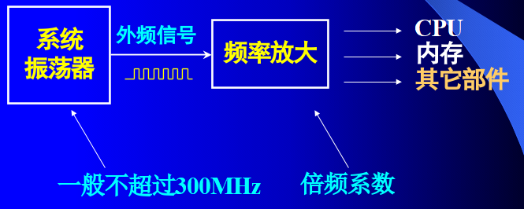

3.常用CPU性能指标

1.  CPU主频=外频×倍频系数

2.  IPS，每秒执行指令数

3.  CPI(Clock-cycle Per Instruction)，每条指令所需clock

4.  FLOPS，每秒执行浮点运算的次数。

5.  CPU的功耗

    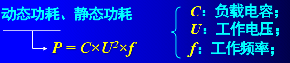

4.数据传输率
$$
带宽=\frac{位宽\times工作频率}{8}(Byte/s)
$$
物理含义：单位时间时间内数据的传输量

注意：计算PCI-E总线的带宽时，一般还要考虑编码方式、单双工模式和通道路数等。

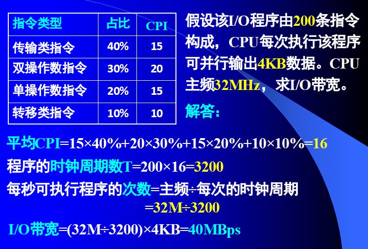

5.存储器的容量

内存（主存）容量

$可编址的存储单元个数\times存储单元位宽$

外存（辅存）容量

指存储器能存储的最大数据量，常表示为：**Byte、KB、MB、GB、TB**

外存容量与总线地址码的位数无关。

# 二、数据的表示、运算与校验

## 2-1数值型数据的表示方法

### 1、进位计数制

#### 十进制转N进制(N=2,8,16)

**整数部分**

对十进制数不断除 N 取余，直至商为0，最后余数逆序输出

**小数部分**

对小数部分不断乘 N 取整（取整数部分），直至积为0或精度达到要求，最后整数正序输出

#### N进制转十进制

**整数部分**

按照位权从N^0^开始，依次叠加

**小数部分**

按照位权从N^-1^开始，依次叠加

#### 二进制转八/十六进制

以小数点为起点，向左和右以3位数为一组划分(十六进制为4位数)，一组代表一个八进制/十六进制数

#### 八/十六进制转二进制

参照 二进制转八/十六进制，进行逆过程

#### 八进制与十六进制通过二进制相互转化

### 2、带符号数的表示

二进制数的码制：原码、饭吗、补码和移码

#### 1.原码

最高位 0 表`+`， 1 表示`-`，绝对值部分用二进制数表示。

字长为8位的原码的表示范围为：-127~127

缺陷：0有+0和-0两种表示

#### 2.反码

正数，反码=原码

负数，符号位保持为1，数值位按位取反

例如X=(-105)~10~=(-1101001)~2~

X~原~=11101001

X~反~=10010110

字长为8位的反码的表示范围为：-127~127

缺陷：0有+0和-0两种表示

#### 3.补码

编码定义：**[X]~补~=X+2^n^ (模2^n^)，n为编码位数**

正数，补码=反码

负数，符号位保持为1，数值位按位取反，末位加 1。相当于反码+1

字长为8位的补码的表示范围为：-128~127

[-128]~补~=10000000

补码比原码和反码多表示1个负值，即-128

数值“0”只有1种补码形式：[+0]~补~=[-0]~补~= 0 0000000

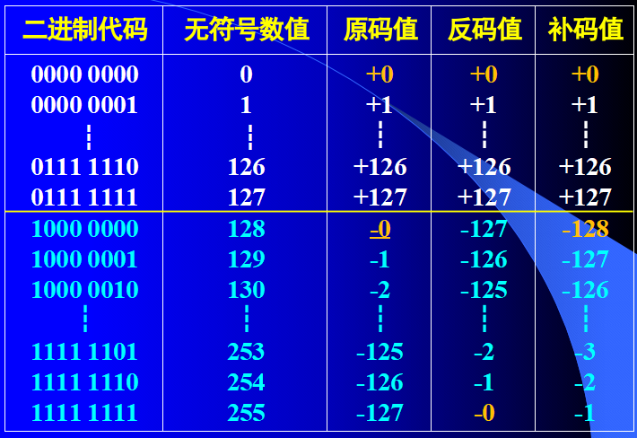

#### 4.原/补码的转换

原→补，看补码定义

补→原，[[X]~补~]~补~=[X]~原~

**求补（变补）**，即已知[X]补，求[-X]补。

法一：[X]~补~的代码连同符号位一起变反，末位再加1，即得到[-X]~补~

法二：

#### 5.移码

**[X]~移~=2^n-1^+X，其中-2^n-1^<x<2^n-1^**

正数，原码符号位取反

负数，**将原码连同符号位一起变反，末位再加1**，即得到移码(**与变补等效**)。

**补码最高位取反就是移码**

### 3、定点数与浮点数

#### 1.定点数

1.  带符号的定点小数

    

2.  带符号的定点整数

    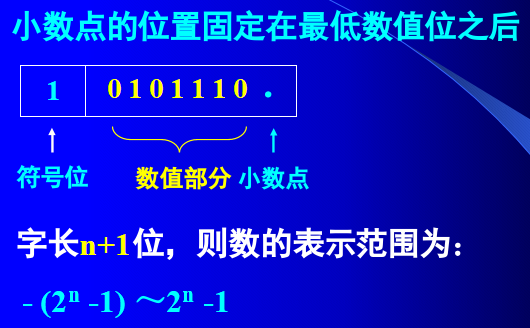

3.  无符号定点整数

    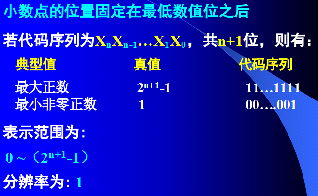

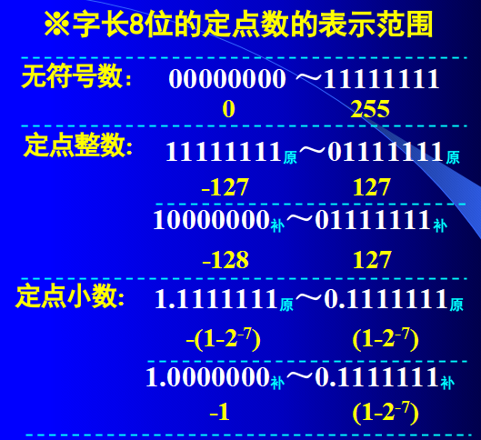

#### 2.浮点数

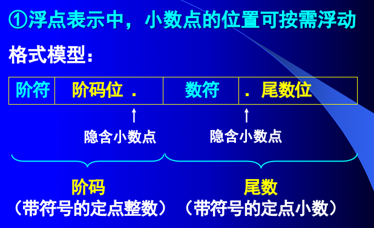

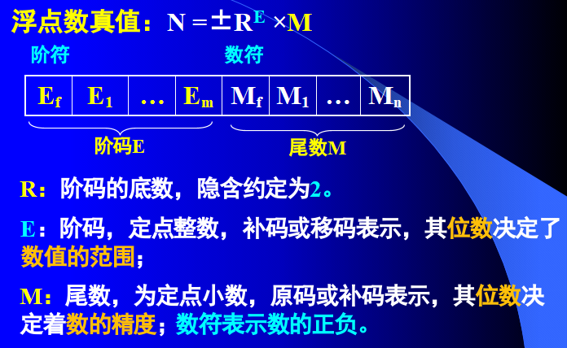

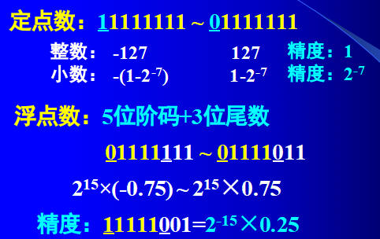

#### 尾数M规格化

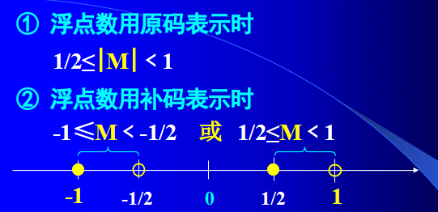

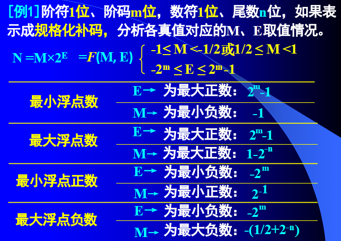

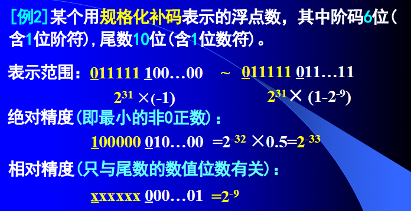

#### IEEE754格式浮点数

分为单精度32位和双精度64位。

从左往右看：

第一位是**符号位S**。0代表正数，1代表负数

接下来8位/11位是**阶码E**。采用非标准移码表示，只偏移2^7/10^-1。

最后23位/52位是**尾数**。由于按照规格化表示2^-1^≤|M|＜1，故保存时省略第一位的1，保存后面的数（因此实际的M真值是1.M）。

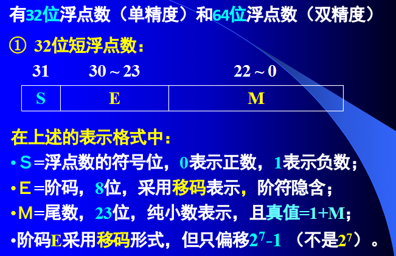

书P44-45|先移位变成1.几，把1去掉，小数点后面就是M。移了多少位，E的真值就是几，但是变成浮点数时还要移位，+2^n^-1。

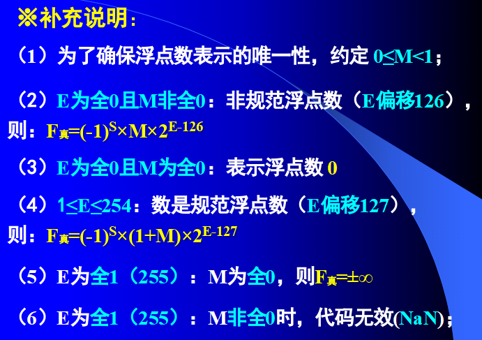

## 2-2字符

## 2-3数据处理与存储

### 1、移位

（1）逻辑移位：循环移动。例如10001111逻辑左移为00011111

（2）算术移位：符号位不变，空位补0（数值发生2^n^倍变化）

#### 正数补码/原码移位

数符不变（单：符号位不变；双：第1符号位不变，第2符号位参与移位）

空位补0（右移时第二符号位移至尾数最高位）

#### 负数补码移位

数符不变（单：符号位不变；双：第1符号位不变，第2符号位参与移位）

左移空位补0

**右移空位补1**（第二符号位移至尾数最高位）

### 2、舍入方法

（1）0舍1入（原码、补码）

（2）末位置1（原码、补码）

### 3、数位扩展与压缩

（1）符号扩展：直接把符号位填充到扩展位

（2）0-扩展：高位全补0（针对无符号数）

（3）位数压缩：弃高位、留低位

### 4、数据存储（按字节编址）

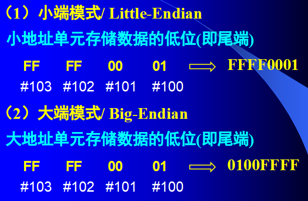

### 5、数据字的对齐

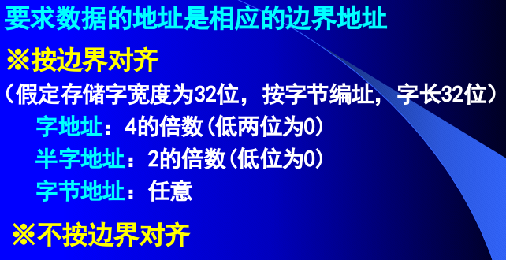

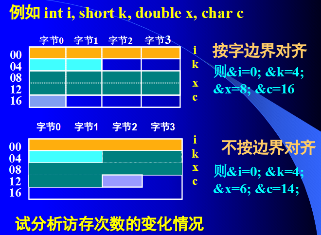

## 2-4基本运算方法

### 定点数加减

#### 1、补码加减

**定点数一般用补码表示，符号位参与运算**。

##### 数学原理

 ( X + Y )~补~ = X~补~ + Y~补~       （1）

 ( X - Y )~补~ = X~补~ + (-Y)~补~     （2）

其中，(-Y)~补~=[Y~补~]~变补~

(-Y)~补~也称为Y~补~的机器负数

##### 逻辑实现

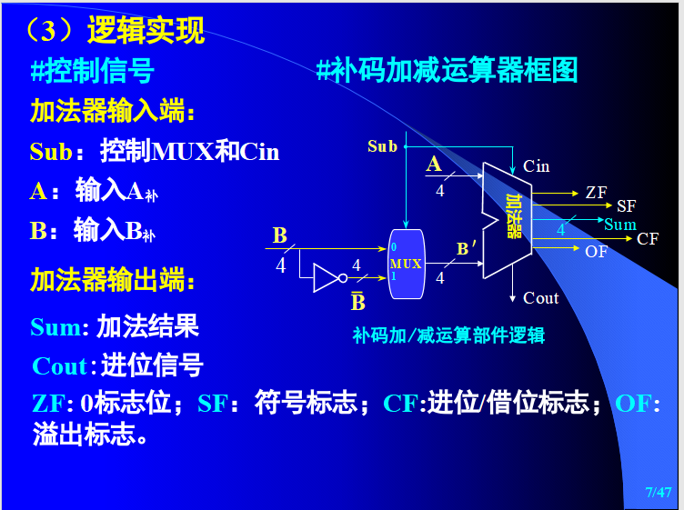

##### 溢出判断

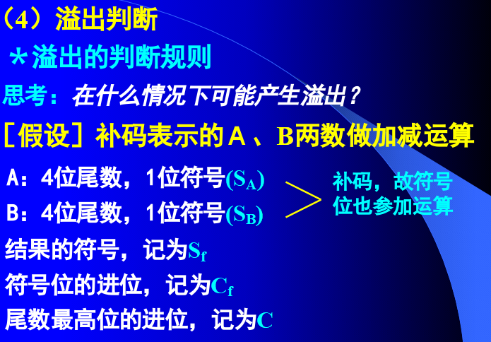

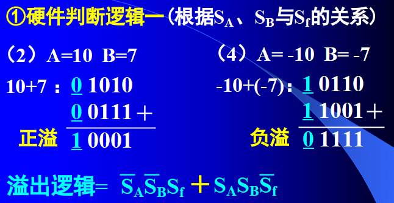

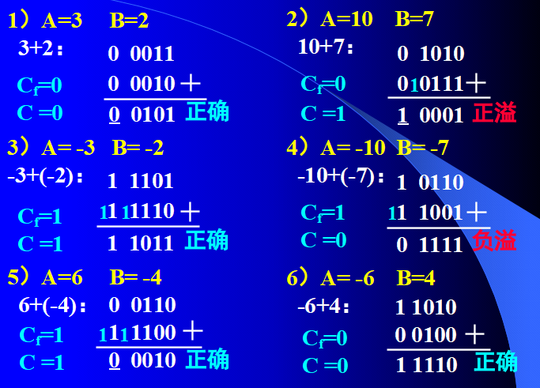

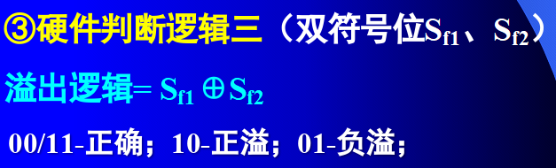

#### 2、原码加减

**符号位单独处理、数值位加减**

先比较两数符号 ：

1.  加法：同号求和，异号求差；
2.  减法：异号求和，同号求差；

以$A±B=S$为例：

※求和时：数值位相加，$S$ 与 $A$ **符号相同**
若最高位产生进位，则结果有溢出。

※求差时：$A$ 与$B$ **求补**后相加。
⊙最高数值位有进位，表明相加结果为正。$S$ 与 $A$ **符号相同**。
⊙最高数值位无进位，表明相加结果为负。需**对相加结果求补**，且 $S$ 与 $A$ **符号相反**。

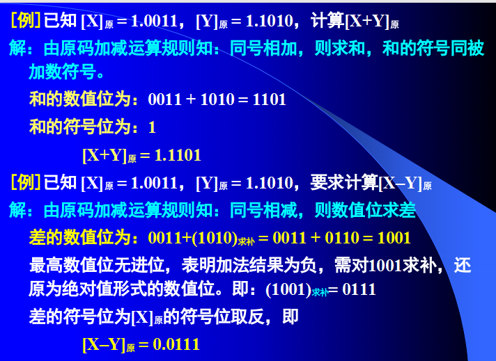

#### 3、标准移码加减

**符号位和数值部分一起处理**

**两数移码的加减等于两数加减后表示成的补码**。
即 X~移~ ± Y~移~ = ( X ± Y )~补~

简单来说就是，相加，再把结果的符号位取反，如果是减法就把减数先求补再加。

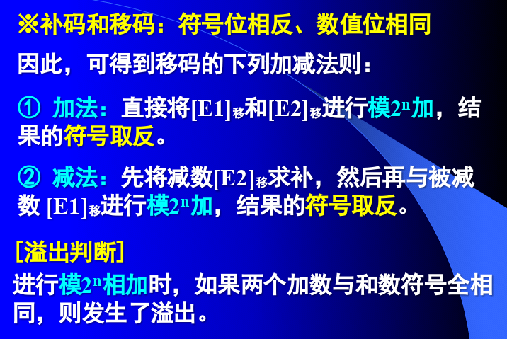

### 定点数乘法

#### 1、原码一位乘

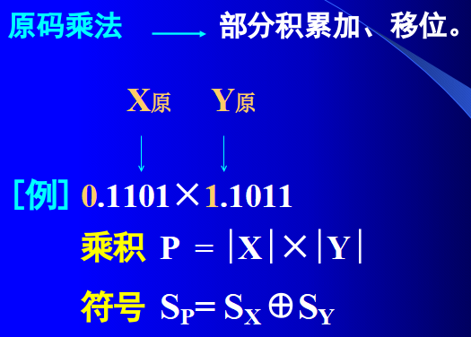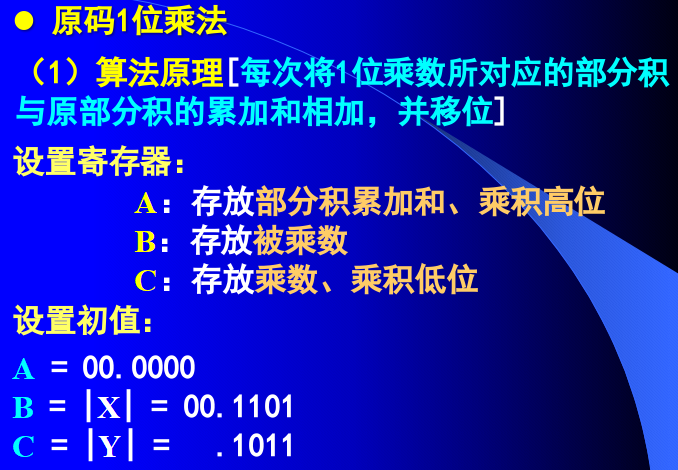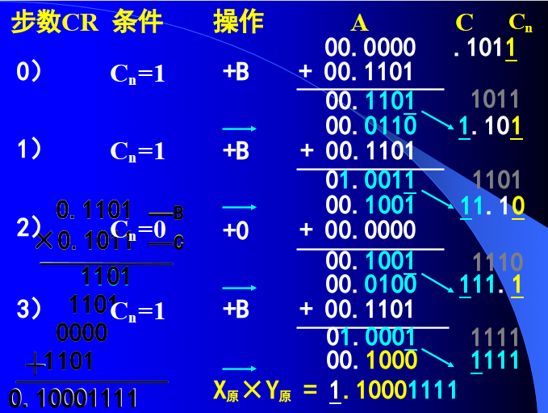

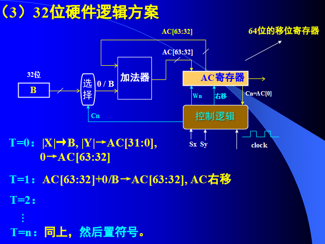

#### 2、补码一位乘法

Booth算法，书P59

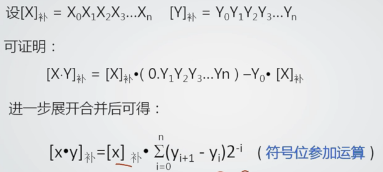

例如[Y]~补~=1010，则Y~0~=1，Y~1~=0，Y~2~=1，Y~3~=0

特殊点

1.  i=n 时，Y~n+1~=0
2.  Y~n+1~是在寄存器最后添加的一位
3.  算数右移对象有

### 定点数除法

#### 补码不恢复余数除法

书P66

|X|<|Y| 。被除数X补、除数Y补、余数ri , i=0、1…

初始化，令r0=X补。如下表：比较r0与Y补符号，同号上商1，异号上商0

| r~i~与Y~补~数符 | 上商 | 对应操作                   |
| --------------- | ---- | -------------------------- |
| 同号            | 1    | r~i+1~=2[r~i~]~补~ - Y~补~ |
| 异号            | 0    | r~i+1~=2[r~i~]~补~ + Y~补~ |

商修正：符号位+1，末尾恒置1

余数修正：左移了n次，则余数=2^-n^·r~n~

## 2-5数据校验

### 奇偶校验

有一位校验码，根据 待校验bit串 和 校验方法 有不同的值

奇校验：使 待校验bit串 和 校验位 共有**奇数**个1

偶校验：使 待校验bit串 和 校验位 共有**偶数**个1

### 海明校验

是一种多重分组奇偶校验。将代码组织为若干分组，每组进行奇偶校验。

不仅能检验是否出错，也能定位错误，但定位代价较大

假设有k位有效码，设置了r位校验码，则k与r关系为
$$
2^r-1≥k+r
$$
公式推导：

​		假设有r个校验位，一个位子有0或1两种情况，r个位子就有2^r^种排列情况，能表示2^r^种状态。其中一个状态用来表示正确（没有错误发生）的这种情况。其余的2^r^-1种状态来表示错误发生在哪一位。总共有k+r位，所以2^r^-1一定要不少于总位子k+r。

海明校验码总是放在2的幂次位上的，即“1,2,4,8,16,32······”

把海明码（有效码和校验码的结合）从左到右，从1开始编号
$$
r_1r_2k_3r_4k_5k_6k_7r_8k_9k_{10}...
$$
有效码下标可由哪几个检验码下标相加得到，就由那些检验码管理。例如3=2+1,k~3~就由r~2~和r~1~管理。

校验码的数值 = 它所管理的有效码的异或。例如r~8~管理k~9~k~10~，所以r~8~=k~9~⊕k~10~

| 标号          | 1=001 | 2=010 | 3=011 | 4=100 | 5=101 | 6=110 | 7=111 | 指误字          |
| ------------- | ----- | ----- | ----- | ----- | ----- | ----- | ----- | --------------- |
| 从1计数第几位 | r1    | r2    | k3    | r4    | k5    | k6    | k7    |                 |
|               |       |       |       | √     | √     | √     | √     | G3标号第一位为1 |
|               |       | √     | √     |       |       | √     | √     | G2标号第二位为1 |
|               | √     |       | √     |       | √     |       | √     | G1标号第三位为1 |
| 正确码        | 1     | 0     | 1     | 1     | 0     | 1     | 0     | G3G2G1=000      |
| 一位错        | 1     | 0     | 1     | 0     | 1     | 1     | 0     | G3G2G1=101      |

### crc校验/循环冗余校验

校验原理：

用待校验数据除以某个约定代码，能除尽则表明数据正确，否则通过循环移位校正出错位。

实际操作：

校验多项式有几位，有效码后面就加几个0。（010这种算2位）

加长后的有效码**短除，也叫模2除**以校验**多项式**，即除法不考虑进位借位的除法。得到的余数就是crc校验码。

将crc校验码直接拼在有效码后面，就是循环校验码/CRC码，也被称为(n，k)码，n=CRC码长度，k=有效码长度

如何纠错：

将循环校验码/CRC码用校验多项式**短除**，余数是几，就说明**从右到左**第几位出错。余数为0，则没有错误。

# 第三章 CPU子系统

CPU是计算机中的核心部件，具有①数据运算功能②系统控制功能。结构最复杂、技术难度最高！

## 3-1 CPU概述

### 1. CPU基本结构

总体结构模型——书P79

主要部件：时序系统、控制部件、缓存部件、寄存器组（堆）、运算部件

#### 运算部件

#### 缓存部件Cache

为提高CPU从主存中读取指令/数据的效率，在CPU内部集成了多级缓存部件。[作用]缓存从主存中读取的部分指令/数据

#### 寄存器组（堆）

用户能访问的：通用寄存器、PC、PSW；不能访问的：MDR、MAR、IR、各种暂存器

[部件选用]一般用小容量的多端口存储器来构成寄存器组，其中1个存储单元作为1个寄存器。

##### 通用寄存器：多个

通用寄存器有全局唯一地址，可通过地址码访问，可在机器指令中直接使用。

[功能]提供操作数、地址码、存放运算结果等

##### 暂存器：多个

比如ALU输入端的暂存器

[特征]多个，内部专用，无需分配地址码，不能在机器指令中使用。

[主要用途]用来暂存产生的临时数据，以备在后续操作过程中使用。

##### 指令寄存器（IR）：一个

[主要用途]只有1个，用于存放指令代码。从存储器(或者指令缓存)中读取到指令以后，就直接存入到指令寄存器中

##### 程序计数器（PC）：一个

[主要用途]仅1个，用来指明指令在存储器中的存放位置，即存储单元的地址码。

##### 程序状态字寄存器（PSW）：一个

[主要用途]仅1个，记录现行程序的运行状态和程序的工作模式

 PSW-特征位
也叫标志位，反映CPU的当前状态。指令执行时，根据情况自动设置这些特征位，作为后续操作的判断依据，通常有5类：进位C、溢出V、零值Z、负值N、奇偶P。。。自动设置(具备该特征，就设置该标志位=1)

PSW-编程设定位

PSW中某些位或字段可通过程序来设定，以决定程序的调试、对中断的响应、程序的运行模式等

##### 地址寄存器（MAR）：一个

[主要用途]只有1个，读写存储器时，先要定位存储单元，因此设置MAR来存放目标单元的地址码。先将有效地址送入MAR，再启动后续的读写操作

##### 数据缓冲寄存器（MDR）：一个

[主要用途]只有1个，过渡性地存放CPU与主存之间交换的数据。无论是从主存读取的数据，还是写入到主存的数据，都要经过MDR

##### 堆栈指针（SP）：一个

[主要用途]仅1个，固定存放堆栈的栈顶单元的地址码。根据这个地址码，去读写堆栈

#### 控制器

根据指令、时钟信号、外部信号等信息，产生各种控制信号(微命令)，以便控制各种功能部件协同工作，完成指令的功能。

根据产生微命令的方式，有两类控制单元：

①组合逻辑控制器：组合逻辑硬件电路→控制信号

②微程序控制器：微程序译码→控制信号

#### 时序部件

[时序信号定义]周期、节拍、脉冲等频率型信号序列。产生时序信号的部件称为时序发生器或时序系统，由1个低频振荡器和倍频逻辑组成。

低频信号振荡器：它是一个低频脉冲源，能输出固定频率的基准脉冲信号(外频)，作为系统时钟信号

系统时钟信号经过倍频放大以后，产生执行指令所需要的各种时序信号：①节拍信号，即CPU时钟周期信号；②工作周期信号，即机器周期信号；③指令周期信号。

指令周期包括若干(≥2)机器周期。

机器周期包括若干(≥1)时钟周期。

### 2. CPU工作原理

#### 主要功能

处理指令-控制指令的执行顺序；执行操作-产生控制信号控制部件工作；控制时间-控制各步操作的时序；数据运算-算术和逻辑运算；

#### 执行指令的流程

**读取指令**-从存储器中读取；**指令译码**-通过控制器进行、产生控制信号；**指令执行**-寻址、取数、运算；**后续工作**-保存结果、响应外部请求等；

#### 部件的控制方式

##### 同步控制

每步操作都向统一的外部时序信号对齐；各步操作之间无交互。

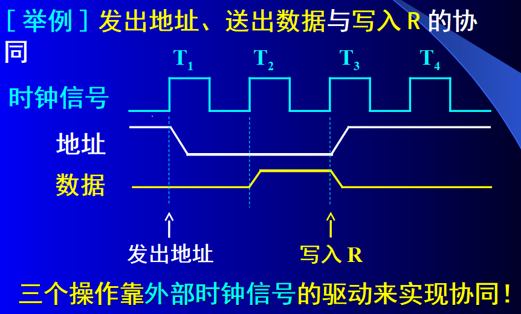

##### 异步控制

每步操作都不需向统一的外部时序信号对齐；各步操作之间通过交互应答来实现协同

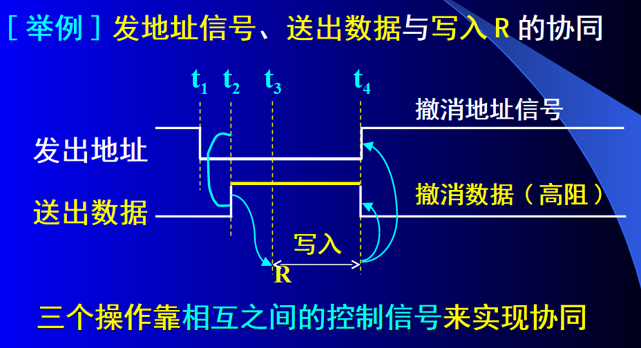

### 3. 外部连接与I/O控制任务

#### 外部连接类型

单处理机系统：通过前端总线与北桥芯片组连接

多处理机系统：高性能CPU中集成了主存、视频和PCI-E接口，CPU之间通过QPI、与芯片组之间通过DMI总线互连。

#### 在I/O控制中的任务

主机与外设之间进行数据输入/输出操作时，在不同的I/O控制模式下，CPU承担的任务各不相同：

程序传送模式：CPU直接执行I/O指令

中断模式：CPU执行中断服务程序

DMA模式：CPU管理DMA控制器、善后处理；

IOP和PPU模式：CPU组织I/O程序，管理IOP与PPU，以及善后处理；

### 4. 发展历程

## 3-2 指令系统

设计CPU的一般过程：指令系统→数据通路→控制器→CPU定型

### 名词解释

指令：instruction，计算机执行某类操作的信息的集合，是CPU工作的主要依据。

指令集：instruction set，处理器能执行的全体指令的集合（CISC、RISC）。其决定了 计算机的硬件功能，是计算机中软硬件的分界面

指令字：用来表示指令的一组二进制代码

指令字长：指令中包含的二进制代码位数

机器字长：计算机能够直接处理的二进制数据的位数= 寄存器的宽度。

### 1. 指令集类型

CISC(Complex Instruction Set Computing)复杂指令集

早期计算机部件昂贵、速度慢，为了扩展硬件功能，不得不将更多更复杂指令加入到指令系统，以提高计算机的处理能力

CISC的特点：

①指令数量多；
②指令长度可以不固定，指令格式和寻址方式多样；
③很多指令会涉及存储器读写操作，指令周期长；
④一般在通用处理器中使用；

RISC(Reduced Instruction Set Computing)精简指令集

随着半导体技术进步，80年代开始逐渐直接通过硬件方式，而不是扩充指令来实现复杂功能，指令规模逐渐缩小、指令进一步简化

RISC的特点：

①指令数量少；
②指令长度固定，指令格式和寻址方式种类也少；
③一般只有少量指令(如取数/存数) 才会读写存储器，其余指令只涉及CPU内部寄存器，指令周期短；
④一般在高端服务器CPU中使用；

### 2. 指令格式

**操作码**+若干个**操作数/地址码**（这里的若干个可以是0、1、2、3、4个）

#### 指令字长

定长指令格式：规整、便于控制

变长指令格式：合理利用存储空间、提高取指令的效率，如超长指令集

#### 操作码结构

(1)定长操作码：各指令θ的位置、位数固定相同

(2)扩展操作码：各指令θ的位置、位数不固定，根据需要变化（设置扩展标志）

(3)复合型操作码：操作码分为几段，每段表示一种二级操作。

#### 地址结构

指令中提供的地址：①地址偏移量/立即数②寄存器编号

指令中提供地址的方式

-   显式地址方式：令中明确指明地址码(直接/间接给出)
-   隐式地址方式：地址码隐含约定，不在指令中出现。使用隐式地址，可以减少指令中的地址数量，从而简化地址结构。

#### 指令可能会涉及到的操作数类型

-   地址码数据：寄存器编号或者存储器地址，无符号整数。
-   数值型数据：定点数、浮点数等，一般用补码表示。
-   字符型数据：通常表示为ASCII码/汉字内码格式。
-   逻辑型数据：常规二进制代码，不具有数值含义。

### 3. 指令中的寻址方式

※指形成操作数地址或寻找操作数的方式；

※1条指令，可能会涉及多种寻址方式；

#### 立即寻址

指令中直接包含了立即数。

#### 直接寻址

指令中直接给出操作数的地址码。

-   存储单元地址(数在主存M中)
-   寄存器编号(数在寄存器R中)

主存直接寻址（绝对寻址）

寄存器直接寻址

#### 间接寻址

指令给出操作数的间接地址。

-   存储单元地址(数在主存M中)
-   寄存器编号(数在主存M中)

一般只在CISC中使用，RISC中一般不用；

主存间接寻址：

 寄存器间接寻址：指针不变(由指令指定)，指针内容可变，使同一指令可指向不同存储单元，以实现程序的循环、共享，并提供转移地址。

 堆栈间接寻址：

#### 变址、基址寻址及其变化

变址寻址：指令给出一个寄存器号和一个地址量，寄存器内容与地址量之和为有效地址。

基址寻址：指令给出一个寄存器号和一个地址量，寄存器内容与地址量之和为有效地址（二维数组的读写）。

※变址与基址的异同：

-   有效地址=寄存器内容(R)+指令中的立即数D
-   变址寻址：指令提供基准量，寄存器提供偏移量；
-   基址寻址：指令提供偏移量，寄存器提供基准量；

基址+变址：指令给出两个寄存器号和一个地址量，寄存器内容与地址量之和为有效地址（处理三维数组）。S =((RX)+(Rb)+ D)

#### PC相对寻址

指令给出偏移量，PC当前值与偏移量相加得到有效地址。S =((PC)+D)。是一种特殊的基址寻址方式，有效地址相对于PC浮动,编程方便。

#### 页面寻址（伪直接寻址）

指令给出位移量，PC的高位部分与位移量拼接，形成有效地址。

用于页式存储系统。寻址速度快，适于组织程序模块，有效利用存储空间。

#### 指令中的寻址方式约定

(1)操作码可隐含说明不同寻址方式（2）指令中可设置寻址方式字段

### 4. 指令的功能和类型

(1)按指令格式
(2)按操作数寻址方式
(3)按指令功能：传送、访存、I/O、算数逻辑运算、程序控制、处理机控制等指令。

## 3-3 算法部件与运算器

### 加法单元

书P119-120

### 串行、并行、分组进位

书P121-122

### 运算器的组织形式

#### 带多路选择器的运算器

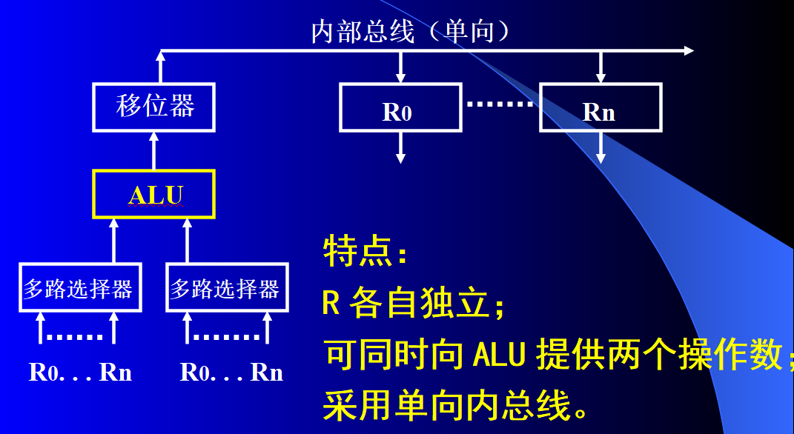

#### 带输入锁存器的运算器

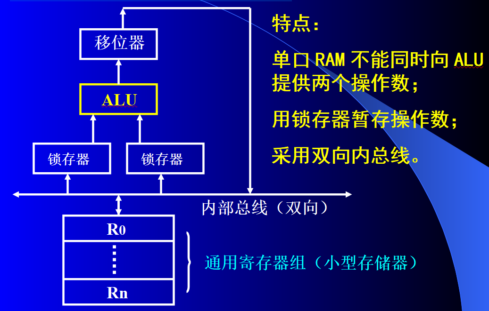

#### 位片式运算器

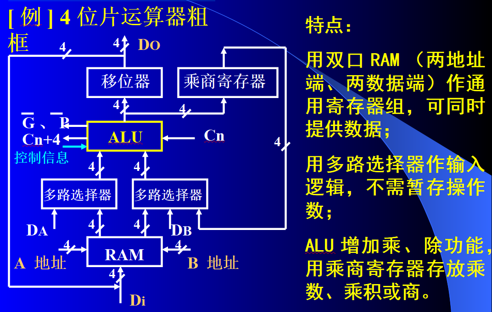

## 3-4 模型机CPU-CISC16

书P129

指令字长16位，采用寄存器型寻址，指令中给出寄存器号。（主存容量为64K×16位）

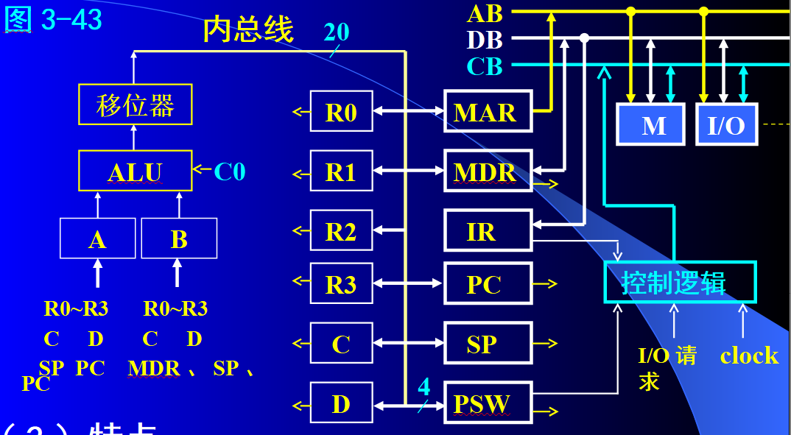

四部分组成：ALU部件；寄存器组；存储器；控制系统；

特点：数据传送控制简单、集中，采用以ALU为内部数据传送通路中心的总线结构。**分立寄存器**内总线采用**单向**数据总线(20位)；

### 各类信息传送途径

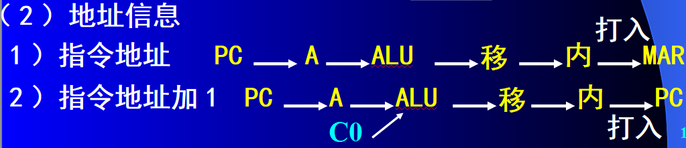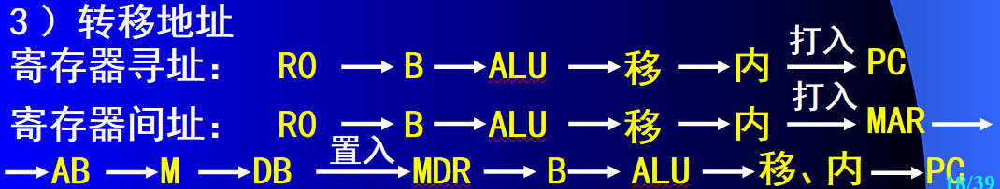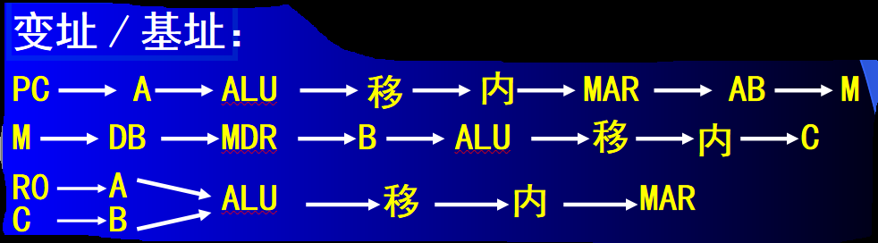

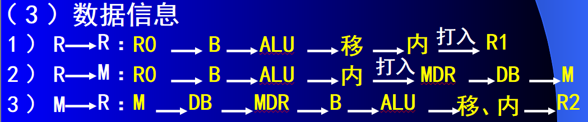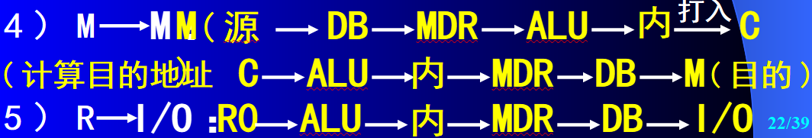

### 指令流程与微命令

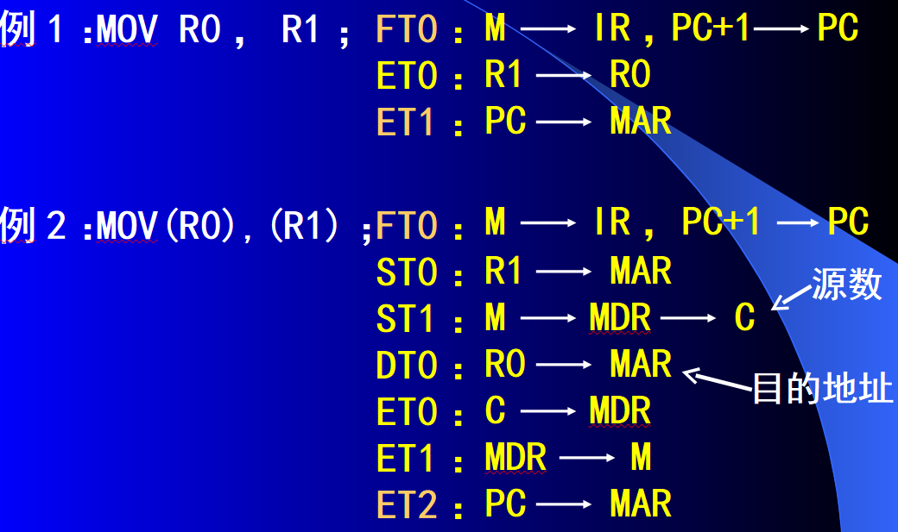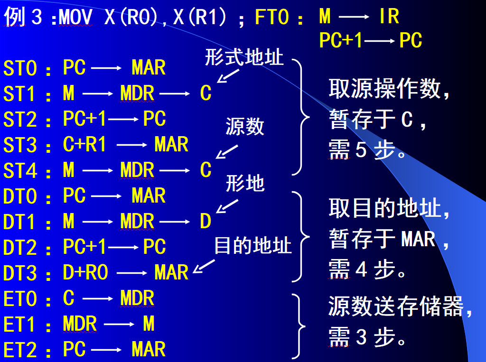

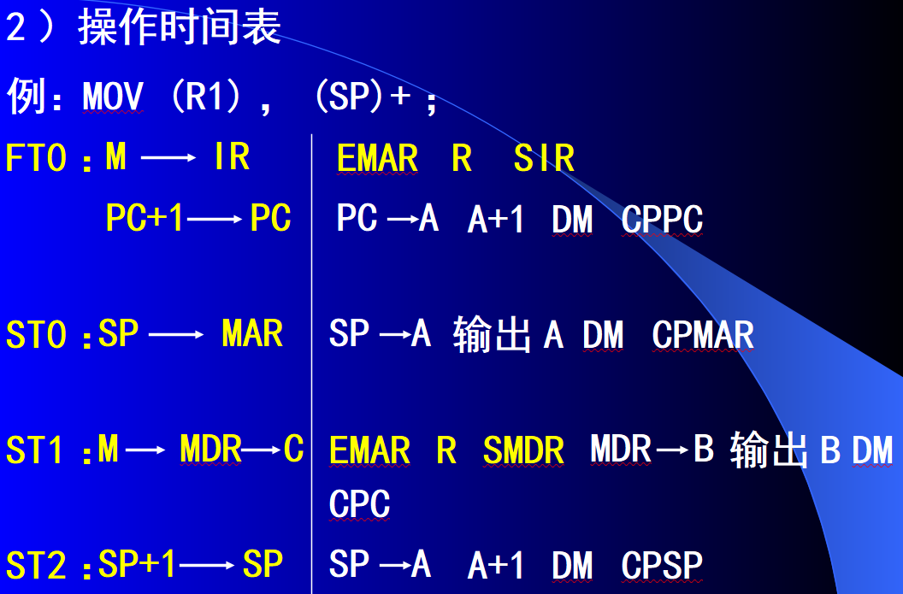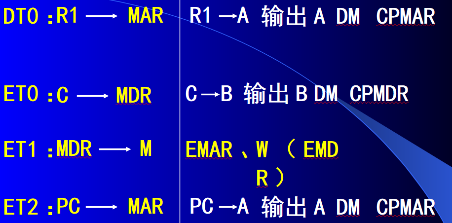

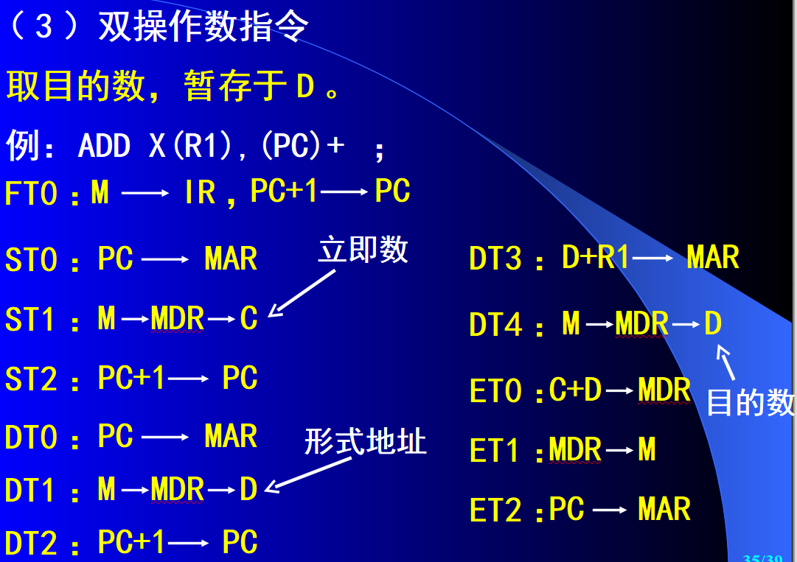

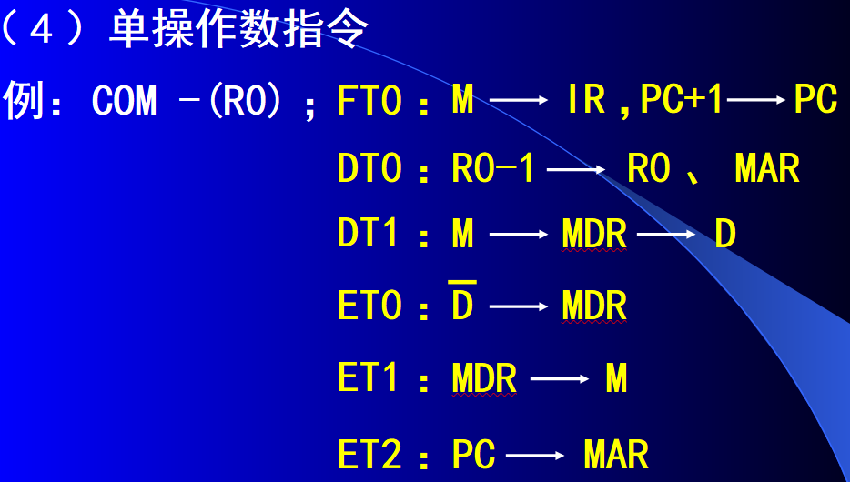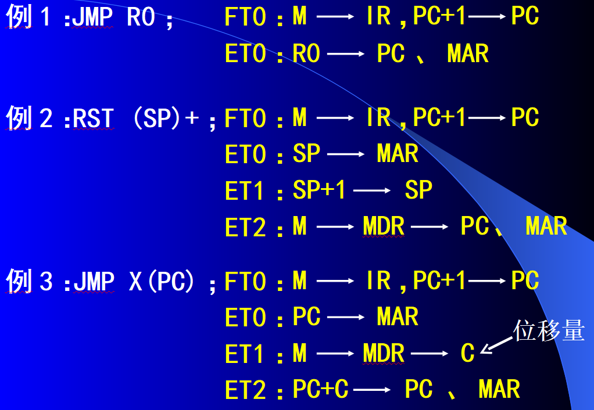

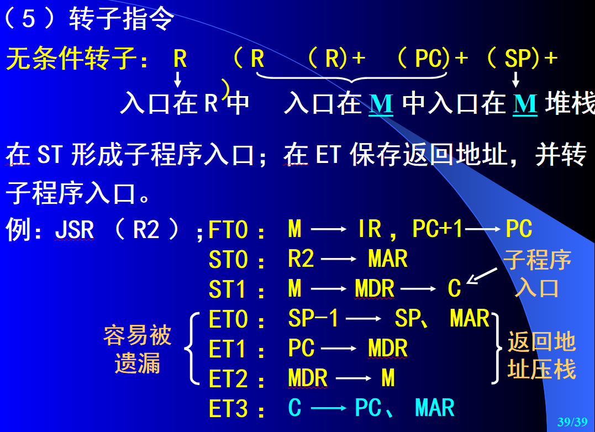

## 3-5 MIPS32

MIPS，一种无内部互锁流水级微处理器

### 总体情况

1.  存储器按字节编址
2.  可用寄存器32个，宽度32位
3.  RISC架构

RISC下只有三种寻址方式：**寄存器寻址、基址寻址、立即数寻址**

### MIPS指令格式与指令集

指令字长固定为32位，寄存器型寻址，指令中给出寄存器号。

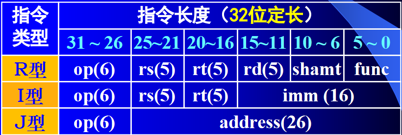

shamt移位位数，5位可最多表示左移31位

func与op共同构成二级操作码

#### R型指令

操作数和保存结果均通过寄存器进行

-   op：操作码，所有R型指令中全为0
-   rs、rt的结果存进rd，三者都是寄存器编号
-   sa：常数，在移位指令中使用

#### I型指令

操作数中涉及立即数，结果保存到寄存器

-   op：直接指明指令的查找功能
-   rs和imm的结果保存到rt

#### J型指令

实现无条件转移

-   op：确定指令的功能；
-   address：转移目标地址的偏移量字段；

### 寻址方式

R型：op和func共同说明

I型和J型：由op说明

#### 立即数寻址

操作数在指令中的立即数字段。

#### 寄存器直接寻址

#### 操作数直接在寄存器中。

#### 基址寻址

操作数由寄存器和立即数字段联合产生。

符号扩展（补码）：正数，在高位补上16个0；负数，在高位补上16个1；

#### PC相对寻址

操作数由寄存器和立即数字段联合产生

#### 伪直接寻址/页面寻址

由PC高4位与指令中的地址段组合产生有效地址。

### 单周期架构书P195


| 控制器输出  | 0            | 1            |
| ----------- | ------------ | ------------ |
| RegDst      | 选rd         | 选rt         |
| RegWrite    | 读模式       | 写模式       |
| AluSrc      | 选B          | 选E          |
| PCSrc       | 看图         |              |
| MemberRead  | 禁用         | 读模式       |
| MemberWrite | 禁用         | 写模式       |
| Mem2Reg     | 选ALU输出    | 选存储器输出 |
| extend      | 执行零扩展   | 执行符号扩展 |
| operation   | 参见控制代码 |              |

### 多周期架构书P204


执行流程书P206

各指令所需信号分析书P206-207

### 单周期CPU特性总结

1.  指令周期与时钟周期等长，且宽度较大;
2.  处理器的CPI≡1;
3.  在指令周期中，各种硬件资源均被相应的功能操作独占，不能共享，硬件利用率低；
4.  所有指令无论其实际执行时间长短，均分配较长的时钟周期，时间浪费严重;

-   对简单的小规模指令集支持较好；
-   难胜任浮点或更复杂指令集

### 多周期CPU特性总结

1.  缩短时钟周期，可以为不同的指令安排多个时钟周期，CPI≥2；
2.  不同类型指令分配的时钟周期数可以不同；
3.  指令周期的长度一般会变长，执行速度降低；
4.  硬件可共享，硬件资源的综合利用率高。

# 第四章 存储子系统

多级存储体系，局部性原理

存储器的级联扩展

## 4-1概述

### 1.层次结构


主存可理解为内存。

由于主存和CPU速度相差太多，故设计缓存Cache。

虚拟内存：是外存的一部分被主存看作是内存的

（1）主存（内存）

主要存放CPU当前使用的指令和数据

MAR内存地址

-   能随机访问
-   工作速度快
-   有足够的存储容量

顺序访问：比如用磁带听歌

随机访问：比如用MP3听歌

（2）辅存（外存）

-   速度快
-   容量大
-   断电保存

（3）高速缓冲存储器（Cache）

存放CPU在当前一小段时间内多次使用的程序和数据（以下简称数据），以缓解CPU和主存的速度差异。

CPU需要输入时，先向Cache控制器询问，控制器将所需数据在Cache中寻找，若找到，CPU直接从Cache拿数据；反之，则多耗费一些时间从主存拿数据。

CPU中可能有多个Cache

### 2.物理存储器与虚拟存储器


### 3.存储器的分类

#### 按存储介质

##### （1）半导体存储器

###### 静态存储器SRAM书P242

利用双稳态触发器的两个稳定状态存储信息

###### 动态存储器DRAM书P246

依靠电容上的电荷暂存信息--主存

（2）磁表面存储器

利用磁层上不同方向的磁化区域表示信息，容量大，非破坏性读出，长期保存信息，速度慢--外存

（3）光盘存储器

利用光斑的有无/晶相等变化表示信息，容量很大，非破坏性读出，长期保存信息，速度慢--外存

#### 按存取方式

1.   随机存取存储器**RAM**、**ROM**

     RAM：可读可写，如SDR/DDR/DDR2-4

     ROM：只读。

     -   固定掩模型ROM：不能写
     -   PROM：可写一次
     -   EPROM：紫外线擦写
     -   EEPROM：电擦除

     闪存接近于EEPROM

2.   顺序存取存储器（SAM）：访问时读/写部件按顺序查找目标地址，访问时间与数据的存储位置有关。
3.   直接存取存储器（DAM）：访问时读/写部件先粗定位一个小区域，再在该区域内顺序查找。

### 4.存储器的技术指标

（1）存取时间T~A~

写入和读出时间。理论上瞬时间完成，但实际上需要考虑时间

（2）存取周期T~M~

存储器做连续访问操作过程中一次完整的存取操作所需的总时间。

包括存取时间和恢复时间。

（3）数据传输率

数据传输率=位宽÷存取周期

>   【例】某**双通道**DDR-4内存传输频率为**3200MHz**，位宽**64比特**，则其有效带宽为：
>
>   R~DDR-4~ =(64b×3200MHz÷8)×2 = 51.2GBps

## 4-3半导体存储器的组织逻辑

### 1. 设计原则

存储器类型：RAM,ROM,RAM+ROM

设计时考虑以下因素

#### （1）接口协议匹配

物理特性、功能规范、电平特性、时序逻辑等等。

#### （2）存储芯片（颗粒）选择

断电保存：SRAM、ROM

断电不保存：DRAM

地址空间、位宽、工作频率、电压

容量由**地址空间**和**位宽**决定。

### 2. 设计

>   用2114（1K×4）SRAM芯片组成容量为4K×8的存储器。地址总线A15～A0（低）,双向数据总线D7～D0（低）,读/写信号线R/W。
>
>   请给出芯片内部地址分配与片选逻辑,并画出M的结构原理框图。

#### （1）计算芯片数量

地址数×位宽=容量

位扩展：把位宽扩大

字扩展：把地址数扩大

字位扩展：把位宽和地址数扩大

##### 位扩展

确定目标存储和颗粒的外特性

确定要多少片颗粒来使得总位数相同

地址线同名引出，作为新地址线

数据线并行引出，重命名后作为新数据线

其余信号线同名相连引出，作为新信号线

##### 字扩展

数据线同名引出，

地址线同名引出，作为新地址线的低位地址线

剩余高位地址，通过译码器，连接到每个芯片的片选端。

除了cs以外的信号线（字扩展本身没有cs线，需要另外构造），同名引出作为新芯片的信号线。

##### 字位扩展

先字扩再位扩，或者先位扩再字扩都行 

#### （2）确定地址分配与片选逻辑

位扩展：每两片2114为一组，两个4位拼成一个8位。字扩展：从1k的编码范围扩到4k，所以一共有4组

地址总线有16位，低10位A~10~\~A~0~用来片内选址，A~11~A~10~用来片选（选组），高4位地址A15~A12全0，可以不使用。

#### （3）线路连接


### 主存与外部的连接

#### 模块式直连


 ※  CPU与存储器直接相连；

※  存储器容量小，SRAM；

※ CPU-存储器，两者集成在一块插卡上，作为一个单独的计算模块来使用；

#### 部件式总线挂接


※ 存储器通过总线与CPU相连；

※ 存储器独立、容量大，DRAM；

※ 会与总线上的其它部件争夺总线控制权；

#### 专用存储总线


※ 存储器与CPU之间增设了专用的高速存储总线；

※ 存储器独立、容量大，DRAM；

※ 存储器独享存储总线的带宽；

### 动态存储器的刷新

[原因]动态存储器依靠电容电荷存储信息，没有电源(VCC)持续供电，电荷会泄漏，故需定期向电容补充电荷，才能维持存储的信息不变。

重写：破坏性读出后的自动操作，以恢复原来信息。

刷新与读写操作无关，定期自动补充电荷以保持信息。

2.最大刷新间隔：例如DDR: 64ms，以封装后的一个存储芯片为单位，64ms内必须对所有片内存储单元刷新一遍。

3.刷新方法：刷新1行所用的时间：刷新周期Tref(小于存取周期)刷新1块芯片所需的刷新周期数由芯片的刷新矩阵的行数和最大刷新间隔决定。

4.刷新周期的安排：

集中刷新、分散刷新、异步刷新

>   [例]某DDR内存容量8GB，其刷新的技术规格标注为：4096 Refresh Cycles/64ms，请计算T~ref~
>
>   T~ref~=64ms/4096行≈15.625微秒/行

## 4-6 三级存储体系

Cache和内存的关联

内存数据给Cache，Cache内数据经CPU处理，再改写内存

以**数据块**为单位整体操作：直接映射、全相联映射、组相联映射

内存和外存的关联

外存中的数据，调入内存；内存中的数据，写回外存

虚拟存储技术：页式、段式、段页式

### 1. Cache与主存映射

前提条件：指令的执行具有局部性特征

#### 映射方式：

（1)直接映射

Cache只分块、不分组。主存分块，分组（每组的块数 = Cache块数）。[映射规则]主存的每一个数据块，只能映射到与其组内序号相同的Cache数据块位置。


Cache里的标记是分组组号

（2）全相联映射

Cache只分块、不分组。主存分块，不分组。[映射规则]主存任意一块都可以映射到Cache


Cache里的标记是主存块号

缺点：1）Cache标记太长，判断时间太长。2）硬件复杂、成本高、实现相对困难。

（3）组相联映射

Cache分块、分组。主存分块，分组（组内块数 = Cache组数）。[映射规则]主存数据块，映射到与自己组内块序号相同的Cache分组，可占据Cache分组中的任意数据块位置。


2路表示Cache内每2块分为一组，标记是组号。

直接映射和全相联映射的折衷→速度快、硬件简单、成本低、易实现

#### 常用的替换算法

FIFO（First In First Out）

先进先出置换算法。这个就是类似于队列，先装入的页面先被置换掉。易于实现但是有可能淘汰频繁使用的页面，效果不好。

LRU（ Least-Recently Used）

将近期内最久末被访问过的Cache块置换出去。

LRU算法是指:会为每一个Cache块设置一个“计数器”，用于记录每个Cache块究竟有多长时间没有被访问了。在替换时直接选取“计数器”最大的替换即可。

-   命中时，所命中的行的计数器清零，比其低的计数器+1，其余不变
-   未命中且还有空闲行时，新装入的行的计数器置为0，其余非空闲行全+1
-   未命中且没有空闲行时，计数器最大的行的信息块被淘汰，新装入行的计数器置为0，其余全+1

LFU（Least-Frequently Used）

将一段时间内被访问次数最少的那块从Cache中置换出去

LFU算法会为每一个Cache块设置一个计数器，用于记录每个Cache块被访问过几次，当Cache块满后会替换计数器最小的

-   新调入的块计数器为0，之后每访问一次计数器就+1。需要替换时，选择计数器最小的一行替换
-   若有多个计数器最小的行，可以按照行号递增或FIFO策略进行选择

随机替换

随机确定将哪块从Cache中替换出去。

>   替换流写法示例
>
>   

#### Cache读/写

写操作

当CPU发出写请求时，如果Cache命中，可以有两种处理方案：

1.  通写：同时修改Cache和内存，使Cache和内存总保持一致。
2.  回写：只修改Cache，并做标记，当Cache中该块被替换时，再写入内存。

读操作

1.  旁路式读 (Look-Aside)

    CPU向Cache和主存**同时发读命令和地址**。Cache命中，则Cache回送数据并中断读主存命令；Cache未命中，则直接访问主存读取数据。 

2.  通过式读(Look-Through)

    CPU首**先向Cache发读命令和地址**。Cache命中，则从Cache中读出数据；Cache未命中，再将读命令和地址传给主存并读主存。

### 2. 内存与外存的映射

在内存和外存之间,由操作系统存储管理模块及相关硬件(存储器管理部件)实现的一种存储映射技术。逻辑上能提供比物理存储器更大的虚拟存储空间，相关地址称为虚拟地址或逻辑地址。


映射的基本方法：增加关联表

（1）内存、虚存都分成页：页表

（2）内存、虚存都分成段：段表

（3）内存、虚存都分段、每段再分页：段页表

书P305

# 第五章 总线与IO子系统

## 总线

简介

总线（bus）：一种用来**连接**各功能部件并承当部件之间**信息传送**任务的信息公共通公路

分时共享

1.  数据总线：双向
2.  地址总线：CPU发出
3.  控制总线：除了数据和地址总线以外的总线统称，方向固定

总线结构

单总线结构


多总线结构


### 总线设计要素

#### 1.总线宽度和频率

宽度：总线各功能组中的信号线数量，32或64；
频率：每秒数据传输的次数，33M、66M、133M等；

带宽：BW=(f×w×d×L×E) ÷8(Bps)

f-总线频率、w-总线位宽、d-工作模式、L-通道数、E-编码方式

>   【例】PCI-E 3.0总线，频率8GHz，位宽为1b，全双工，16通道，128/130编码，求带宽。
>
>   BW =(8G×1×2×16×128/130) ÷8≈32GBps

#### 2.总线周期与操作过程

总线周期：通过总线完成一次完整数据传输的时间；

主设备：申请并掌握总线权限的设备。

从设备：与主设备对应的设备。

※总线操作的基本步骤

①主设备申请总线，仲裁器裁决并批准；

②主设备掌握总线，启动总线周期，初始化；

③从设备响应，主从设备之间数据传输；

④主设备释放总线，结束总线周期。

※总线上的数据传输模式

单周期模式：传输特点：申请1次，只分配1个总线周期，只传送1次数据；

突发模式：传输特点：申请1次，分配多个总线周期，可传输多个数据字。

#### 3.总线的时序和控制

（1）同步总线：由统一的时序信号控制总线上的传送操作。在固定时钟周期内完成传送，由同步脉冲定时打入。

（2）异步总线：无固定的时钟周期划分；总线周期由传送的实际需要决定；以异步应答方式控制总线传送操作；

（3）扩展的同步总线：以时钟周期为时序基础，允许总线周期中时钟数可变。（同步中引入了异步应答思想）

注意几个“周期”概念：

时钟周期：CPU一步操作(1次内部数据通路传送)时间。

总线周期：经过总线的一次数据传送(访存)时间，通常包含若干时钟周期。

工作周期：指令周期中的一个操作阶段。可包含多个总线周期。

### 总线的仲裁

按照总线仲裁电路的位置不同，仲裁方式分为： **集中式仲裁**、 **分布（散）式仲裁**

#### 集中式仲裁

集中式仲裁中每个模块有两条线连到中央仲裁器：
一条是送往仲裁器的总线请求（BR）信号线；
一条是仲裁器送出的总线授权（BG）信号线。

常用三种仲裁方式：**链式查询**、**计数器定时查询**、**独立请求方式**

##### 链式查询


总线授权信号被依次串行地传送到所连接的外围设备上进行比较。 

离总线控制器的逻辑距离决定，**越近优先级越高**。

##### 计数器定时查询


当查询计数器计数值与发出请求的设备编号一致时，中止查询，该设备获总线控制权。

优先级灵活：计数器初值、设备编号可通过程序设定，优先次序可用程序控制。

##### 独立请求方式


各设备均通过专用请求信号线与仲裁器连接，且通过独立的授权信号线接收总线批准信号。

#### 分布（散）式仲

设备需要控制总线时，发请求信号，并监听其它请求信号，各设备能判别自己的优先级、以及能否在下一周期控制总线。
缺点：信号线复杂；优点：防止总线时间浪费


## IO接口

主机和外设的衔接部分，位于总线和外部设备之间

### 基本功能

（1）设备寻址

接受CPU送来的地址码，选择接口中的寄存器供CPU访问。

寄存器具备地址译码功能，能被CPU直接访问，称为端口

（2）数据缓冲

实现主机与外设的速度匹配，缓冲深度与传送的数据量有关。

（3）预处理

串-并格式转换（串口）

数据通路宽度转换（并口）

高-低电平转换

（4）控制逻辑功能

接受主机CPU的控制命令、保持状态信息，协助主机实现对IO传送操作的控制

#### 对接口中寄存器编址

（1）单独编址

为接口中的每个寄存器（IO端口）分配独立的端口地址（可与主存地址重叠）

需设置标志区分访问对象

$M/\overline{IO}$置1，访问主存，置0，访问IO

（2）与主存统一编址

将接口的寄存器（IO端口）当成特殊的主存单元，与其他主存单元统一编址

编址基本原则：

低端地址给主存单元，高端地址给IO端口

可用普通访存指令（隐式IO指令）实现IO操作

### 分类

按数据传送格式划分：（1）并行接口：接口两侧均并行传输数据（2）串行接口：接口与外设一侧串行传送

按时序控制方式划分：（1）同步接口（2）异步接口

按I/O操作的控制方式

（1）PIO接口（Programed I/O，程控方式）

（2）中断接口（可采用查询方式）

（3）DMA接口（可插入中断做DMA善后处理）

（4）IOP/PPU接口（专用处理器/机方式）

各种方式工作模式的核心差异在于：在数据I/O过程中，主CPU承担的任务不同。

### 输入输出与控制

对第一级控制层面的数据IO传输控制方式如下

#### PIO直接程序传送

特征：主CPU执行I/O程序实现主-外的数据I/O；

-   需要专用的I/O程序；
-   主机CPU执行I/O程序：不断查询外设状态，进而控制具体的数据I/O过程（主机←→外设）。
-   数据I/O过程中主CPU无法执行其它计算任务，对其它外设的请求响应慢。
-   主CPU完全束缚于简单的数据I/O控制，利用率低。
